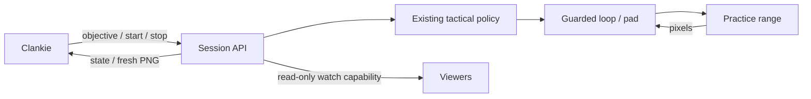

# Clankie's gameplay skill

**The Clankie bridge stays disabled under [VUH-1325](https://linear.app/vuhlp/issue/VUH-1325).**
The independent review accepts these bridge sources with the input path at
`a7f3445`, including the constructor cleanup fix. The lift for reviewed
practice-range paths does not authorize this bridge. Clankie remains disconnected.
Deployment, task re-enabling and sittings require scheduling by the lead; the
`rivals-l4` worker owns the desktop. Before re-enabling, the lead verifies the
launcher's explicit cooldown argument. Every sitting records that regime and the
kit patch. The examples below describe the interface, not run authorization.

The Clankie bridge author (Codex, VUH-1316) owns `agent/server.py`,
`agent/session.py`, this document, `scripts/clankie_bridge.ps1`, and
`tests/test_session_api.py`. These five files are the reviewed bridge's commit
scope; unrelated shared-checkout work belongs to its owning lane.

Clankie uses the Rivals policy and controller as his Spider-Man gameplay skill.
`agent.server` exposes a bounded sitting API around `agent.loop`; it does not
replace the tactical brain with a conversational model or accept raw pad input.



Start from the checkout in the PC's interactive desktop session:

```sh
uv run python -m agent.server --token-file data/clankie-token --init-token
python -m agent.server --token-file data/clankie-token --cooldowns normal
```

`--init-token` creates a private file exclusively and exits. Keep it under
gitignored `data/`; never log or commit its contents. The default bind is
`127.0.0.1:4330`. Forward that port over SSH to Clankie's Mac, or explicitly bind
to a private interface and restrict its firewall. Plain HTTP belongs only on a
trusted network or inside a tunnel. No capture/input starts until a start request.
The PC must already be in the focused practice range and assigned to this driver;
other scripts share the same desktop and must not drive concurrently.

Serving requires `--cooldowns off|normal`, with no default (also for `--dry`).
The value describes the verified Practice Settings: **No Ability Cooldown ON**
means `off`; **OFF** means `normal`. It does not change the game setting. The
Windows launcher likewise requires `-Cooldowns off|normal`. Every start reads
the kit's patch through `agent.loop.kit_patch`; an unreadable patch refuses the
start before a worker or pad opens. Token creation alone needs no cooldown mode.

Control requests use `Authorization: Bearer TOKEN`:

| Request | Input / result |
| --- | --- |
| `GET /v1/status` | Current sitting, policy observation, summary, execution mode |
| `POST /v1/start` | `requestId`, `objective: {mode, note?}`, `maxSeconds` (1–1800, default 300) |
| `POST /v1/objective` | `sessionId`, `objective` |
| `POST /v1/stop` | `sessionId`; returns stopping until pad release completes |
| `GET /v1/frame?sessionId=ID` | Fresh confirmed range frame as PNG, max 1280 px wide |
| `POST /v1/share` | `sessionId`; returns same-origin watch/frame paths with a read-only key |

`autonomous` uses the existing scripted policy. `combat` chooses ordinary
engagement when a target is available, preserving the policy's retreat and hold
rules. `disengage` withdraws. The note is recorded context; `noteApplied: false`
means no prose understanding is claimed. A learned tactical policy still belongs
in Rivals Agent, below this sitting boundary.

Duplicate starts for the current request return the same sitting. Other starts
are refused while the worker is alive. ID checks prevent old commands from
steering/stopping a later sitting. `starting` is not `running`; a guarded loop
tick establishes running. Stop is cooperative between frames and disables the
end-of-run scoreboard, so cancellation cannot press BACK. Every sitting exit
calls `LiveIO.close()` (and thus `Live.close()`) to neutralize the pad, stop its
lease watchdog and permanently refuse further non-neutral writes; camera release
is attempted even if close fails. Only confirmed range frames younger than one second are published.
The watch capability cannot call controls and stops working when the sitting ends.
The watch page polls PNGs; Clankie's existing Go Live publisher consumes the same
PNGs. There is no audio feed.

Sitting metadata is `data/clankie/<id>/session.json`; `game/` contains the normal
RunLog recording. `game/meta.json` records `cooldowns` and `patch`, including
zero-tick exits after log creation; `session.json` carries the same provenance.
`--dry data/l1/tagrun0 --cooldowns off` uses real recorded frames and a fake pad,
with `execution: replay` in every status. Offline integration is not live-game proof.

Checks: `uv run pytest tests/test_session_api.py`; real recorded pixels also need
`--group perception`. Cross-repository acceptance lives on
[VUH-1316](https://linear.app/vuhlp/issue/VUH-1316).

## Installed PC bridge

On `supedupsilly`, the disabled `rivals-clankie-bridge` scheduled task is configured for
`scripts/clankie_bridge.ps1 -Address 100.108.214.60` as the interactive `volpe`
user at logon. It listens on port 4330; its firewall allow rule (also disabled)
is scoped to the Mac's Tailscale address, `100.103.220.58`. The script supplies the existing
live Python dependencies through uv and logs under `data/clankie-bridge.log`.
`data/clankie-token` grants control and has a restricted Windows ACL. The Mac's
matching credential is in Clankie's broker, configured through the CLI.

The installed disabled task predates the required cooldown argument. Before an
authorized restart, deploy the reviewed bridge files and update its action with
the lead-verified `-Cooldowns off|normal`; the current launcher's missing-argument
check fails before launching Python. Bridge deployment and restart await the lead's schedule.

`Get-ScheduledTask -TaskName rivals-clankie-bridge` inspects the task, including
`Settings.Enabled`. Disabling prevents future launches but does not stop an
existing instance. The bridge is stopped: its uv/Python processes are absent and
no address listens on port 4330. `Stop-ScheduledTask` can leave these children
alive; verify both process and listener absence, not only task state. Terminate
only identified bridge children after confirming no sitting is active; forced
termination is not a pad-release mechanism. Replay integration evidence
does not establish that the underlying range guard or input lifetime is safe.
