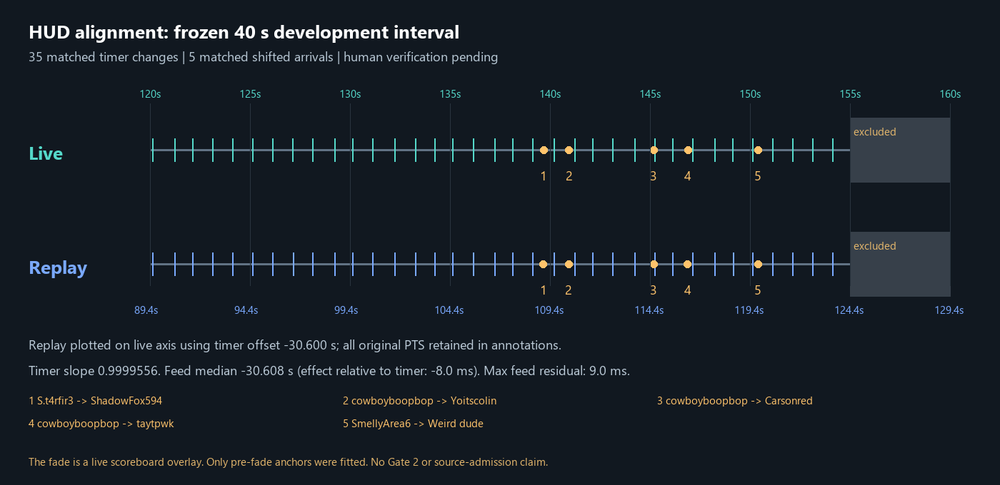

# Development HUD alignment packet — 2026-09-29

**Verdict: PROVISIONAL; not an all-criteria PASS and not human-verified.** Three measured criteria pass numerically. The retained pre-fade span has **35 matched timer anchors**, timer offset **−30.600 s**, and **five matched shifted arrivals with maximum own-median residual 9.0 ms**. Between-segment offset agreement is untested in the single retained segment. No Gate 2 acceptance, source admission, expert-label export, fit or checkpoint promotion follows.

## Selection and existing criteria

[Interval freeze](interval-freeze.md) was written and sent to the lead before new annotation or residuals. Only released live `2026-09-25 20-06-20.mkv` [120,160) s and replay `2026-09-26 11-10-08.mkv` [89.39,129.39) s were decoded: 40 s each, without widening. The predecessor's approximate −30.61 s estimate placed the windows; it supplies neither a match key nor the fitted offset.

[Span selection](span-selection.json) preceded residual calculation: retain live [120,155) / replay [89.39,124.39), exclude the fade and all post-fade anchors conservatively. [Full-frame context](context-annotations.json) subsequently identifies a **live scoreboard overlay**, visible at 155.604/156.004 s and gone by 156.404 s. Replay remains on cowboyboopbop's Spider-Man POV, with matching scenery and 250 HP. No death or follow change is visible in these samples. The pre-result exclusion remains; three readable post-fade pairs were not recovered after scoring. Exact overlay edges and full frame-by-frame continuous target-POV/1× certification remain unestablished.

| Unchanged criterion | Result | Evidence and limit |
|---|---|---|
| At least 30 timer anchors per span | **PASS for retained span** | 35 unique paired changes, 04:36→04:35 through 04:02→04:01. Two live ticks are unknown under the overlay; three post-fade pairs are readable but excluded. The short excluded tail cannot independently meet 30 anchors. |
| Segment median offsets agree within one recorded frame | **UNTESTED** | Only one retained MM:SS segment, with no visible extension/reset/SS.d change. No two segment medians exist to compare. No artificial split or relaxed threshold. |
| Free slope: reject `abs(slope−1)>0.001` | **PASS numerically** | **0.9999556252**; absolute deviation **0.0000443748**. |
| Kill-feed residuals about their own per-span median ≤2 recorded frames | **PASS numerically** | Five pairs, own median **−30.608 s**, maximum absolute residual **9.0 ms**, limit **16.6667 ms** at 120 fps. |

Feed median minus timer median is **−8.0 ms**, a measured HUD-channel effect. This does not establish agreement between timer segments. The timer fit was never moved to make feed events agree. Maximum raw timer residual is **8.5 ms**; all per-tick residuals and bracket intervals remain in [timer-fit.json](timer-fit.json), without display-jitter filtering. One recorded 120-fps frame is 8.3333 ms; the policy's 60-Hz interval is 16.6667 ms. Millisecond encoded PTS is retained separately.

## Annotation and review

[Timer annotations](timer-annotations.json) retain 40 proposed changes per recording, explicit unknowns, native crops, PTS and fit-use flags. Owner visually inspected all **78 readable triples**; two live overlay boundaries remain unknown. Values were read from native crops and entered literally. Six initial maximum-pixel-difference proposals followed background motion and were rejected before fitting. `propose-boundaries.py` is the rejected approach. The replacement compares every frame's seconds-glyph mask to clean before/after references, then requires visual inspection of every proposed triple. No trained reader, camera estimate or policy output supplies labels.

Pairs join unique `(old displayed value,new displayed value)` identities in this one observed countdown, never timestamp indices or the placement prior. Fits use the midpoint of each retained `(last unchanged PTS,first changed PTS]` bracket; interval bounds are preserved instead of claiming physical clock precision.

[Feed annotations](feed-annotations.json) record five incoming/preceding identities, onset brackets and later frames proving the incoming names. Onset means **the preceding row moves**, before incoming fade-in completes. The first empty-feed arrival (Stylestw→Paainter) is excluded because no existing row shifts. Five arrivals avoid the predecessor's nearly vacuous n=2 check, but cover only the later portion of this short span. The proposed three-arrival clarification is not substituted for an existing criterion.

Independent agent review corroborated **30 of 78 timer triples, no disagreement after corrections**: live glyph sheets 1/2 and replay glyph sheet 3 on D:, plus original rejected max-diff sheets 0–3. [Exact review scope](review-scope.json) distinguishes sheets not viewed and the contact copies not initially inspected. Subsequent feed/context review tracked all ten onset boundaries and found event 1's replay bracket one frame late. Owner native reinspection agreed: corrected bracket **(109.071,109.079]**, replacing the predecessor's (109.079,109.088] in this new packet only. Nine other boundaries agreed. The older frozen report remains untouched. Feed residuals and visuals were regenerated before commit.

**Agent inspection and review are not human verification.** No human sign-off is recorded; that requested part remains incomplete. [Human verification request](human-verification-request.md) records the exact outstanding check.

Contacts: [live 0](contacts/live-timer-0.png), [1](contacts/live-timer-1.png), [2](contacts/live-timer-2.png), [3](contacts/live-timer-3.png); [replay 0](contacts/replay-timer-0.png), [1](contacts/replay-timer-1.png), [2](contacts/replay-timer-2.png), [3](contacts/replay-timer-3.png); [paired feed onsets](contacts/paired-feed-boundaries.png); [fade context](contacts/fade-context.png). Timer contact headers preserve the proposal-stage label; annotation JSON records inspection status. All timer/feed crops are native; the context overview is resized, with four decisive native full frames committed and all fourteen retained on D:.

## Execution and reproducibility

Cost **$0**. Only the two named released sources were opened. Current denylist and registry were checked before decode; V-C/V-Q, both sealed Gate 2 pairs, test takes and DayMR/ReqMR remain closed. [Provenance](provenance.json) retains registry media digests and the denylist pin; the original videos were not fully rehashed during this bounded pass. No full03, production reader or model files changed.

Timer crop: native `(1140,0,280,150)`. Live/replay feed bands: `(1990,20,540,180)` / `(1990,280,540,180)`, including LIVE_BOX/SPECTATOR_BOX and adjacent rows. Each band has 4,799 frames. Raw PNGs, FFmpeg logs, full manifests and all fourteen context frames stay at `D:/rivals-agent-evidence/idm-hud-alignment-20260929/`; compact annotations, selected native crops, contacts and scripts are committed. [Verification](verification.json) pins the full retained collection and checks crop bytes/dimensions, monotonic bounded PTS, unique value joins and numerical criteria.

One decoder at a time, BelowNormal, codec thread settings ≤2 and one filter thread, output on D:. Working-set spot checks were ~104–109 MB, below 3 GB; no peak-memory claim. Decode paused on the lead's live-check request, resumed only after explicit release plus fresh game/OBS checks, and finished with no native decoder left running.

Initial `copyts` plus relative duration emitted no timer files; corrected extraction uses seek-relative filter PTS plus the explicit seek origin. Two trailing `showinfo` records beyond emitted PNGs caused a metadata-count check failure and are excluded from the map. No frame-rate resampling. A verification check initially compared binary floats to rounded literal PTS exactly; it now compares recorded millisecond values. All corrections preceded commit.

Reproduction: released `decode.py` → `annotate-timers.py` → inspect sheets → `package-timers.py` → pre-residual span selection → `fit-timers.py`; released `decode-feed.py` → `contact-feed.py` / `inspect-feed.py` / `fine-feed.py` → inspect onsets and identity frames → `package-feed.py` → `timeline.py` → `verify.py`. Packaging scripts encode this owner's manual decisions, not automatic truth or admission. Do not run native decoding without lead release and closed game/OBS.

This is short, prior-exposed development evidence, not independent validation or a complete-match certificate. HUD-channel agreement cannot establish absolute physical timing or pure network lag. The lead owns VUH-1353 publication, human-verification routing and any next decision. No autonomous follow-on extraction or promotion is authorized.
