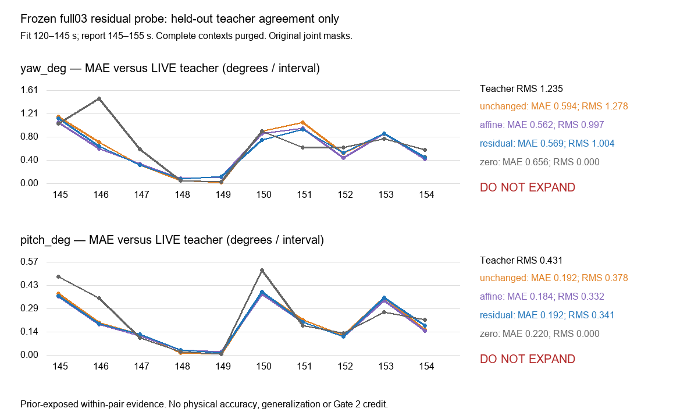

# Frozen-feature replay-to-live residual probe

**Provisional, unadmitted, prior-exposed development evidence. Teacher agreement only.**

The residual passes the preregistered agreement and movement checks for neither axis. Failed axes must not be expanded. This discrepancy does not prove replay is worse: the LIVE prediction is a frozen teacher, not physical truth.

Yaw residual MAE is 0.5685 versus unchanged 0.5937, affine 0.5619 and zero 0.6564; pitch is 0.1922 versus 0.1916, 0.1844 and 0.2202. Residual active-movement magnitude retains only 75.7% of the yaw teacher and 63.7% of the pitch teacher; sign recall is 78.1% and 61.9%. Neither axis beats both comparators or passes the preregistered movement gate. Do not expand either axis.

| Axis / method | MAE | RMSE | Mean absolute | RMS | Centered std | Signed bias | Active sign recall |
|---|---:|---:|---:|---:|---:|---:|---:|
| yaw_deg / teacher | 0.0000 | 0.0000 | 0.6564 | 1.2351 | 1.2227 | 0.0000 | 320/320 (100.0%) |
| yaw_deg / unchanged | 0.5937 | 1.2023 | 0.6695 | 1.2776 | 1.2642 | -0.0097 | 248/320 (77.5%) |
| yaw_deg / affine | 0.5619 | 1.0837 | 0.5563 | 0.9972 | 0.9668 | -0.0697 | 244/320 (76.2%) |
| yaw_deg / residual | 0.5685 | 1.0379 | 0.5828 | 1.0037 | 0.9780 | -0.0511 | 250/320 (78.1%) |
| yaw_deg / zero | 0.6564 | 1.2351 | 0.0000 | 0.0000 | 0.0000 | 0.1745 | 0/320 (0.0%) |
| pitch_deg / teacher | 0.0000 | 0.0000 | 0.2202 | 0.4311 | 0.4098 | 0.0000 | 223/223 (100.0%) |
| pitch_deg / unchanged | 0.1916 | 0.3794 | 0.1971 | 0.3784 | 0.3651 | 0.0343 | 146/223 (65.5%) |
| pitch_deg / affine | 0.1844 | 0.3620 | 0.1757 | 0.3317 | 0.3141 | 0.0275 | 145/223 (65.0%) |
| pitch_deg / residual | 0.1922 | 0.3681 | 0.1834 | 0.3412 | 0.3289 | 0.0434 | 138/223 (61.9%) |
| pitch_deg / zero | 0.2202 | 0.4311 | 0.0000 | 0.0000 | 0.0000 | 0.1340 | 0/223 (0.0%) |

All magnitudes are original head degrees per interval. Active means |teacher| ≥0.1; sign recall also requires predicted magnitude ≥0.1. Zero therefore cannot pass the movement gate. Full active magnitude values and per-axis gate decisions are in [result.json](result.json).

| Block | Complete contexts | Joint known |
|---|---:|---:|
| fit | 1484 | 1449 |
| report | 583 | 574 |
| purged | 16 | 16 |

Both axes and all four methods use the same joint-known held-out rows. Original per-axis LIVE/replay coverage is in result.json. Fit/report native frame ordinal sets are disjoint in both stores; complete 17-frame contexts crossing live 145 s are purged. Nominal -30.600 s mapping is unchanged, with no offset tuning. The reviewed v3 pairing retains its prior ±1-frame completeness requirement, although this probe uses nominal replay only.

The [preregistration](preregistration.json) and [freeze](freeze.json) were written before extraction/fitting. One float64 multi-output ridge residual solve (lambda=1.0, unpenalized intercept) used replay camera-head penultimate 128 features. Normalization and the per-axis affine comparator used fit rows only. Full03 stayed eval/frozen; original `_camera` gains/masks, including pitch fix A, were retained. Corrected methods inherit original masks. No support-a3, training of full03, checkpoint promotion, label export, new decode, cloud spend or sealed access. Cost $0.

Read access reused the unchanged reviewed v3 boundary, review gate, fixed prepared stores, pairing, checkpoint loader and module-origin checks. Source pins/denylist and all four store hashes were checked. The loader authenticates then rereads pinned JSON as documented in v3; this probe does not add a new corpus path. Parameters are scientific non-deployment coefficients, not a promoted checkpoint. No per-row feature or teacher target cache was exported.

Synthetic controls verified the split purge, ridge constant-target intercept and zero/sign failure before the single real-data run. Output start records prevent retries. Runtime module pins, checkpoint, prepared/review hashes, feature digest and completion time are recorded in result.json. CPU BelowNormal, Torch 2 intraop / 1 interop threads.

The report block was already inspected and scored in the previous diagnostic; it is temporally separated, not blind or independent generalization. Prior eligibility inspection covered 140 quarter-second paired samples and selected native neighbours, not all frames visually; computational PTS/context checks covered every row. Reused continuity/identity/1x/focus/UI findings remain as pinned in the earlier review. No logger video timing or session camera-unit calibration was established, so no physical accuracy is claimed. Shared truth error does not automatically cancel. No Gate 2 credit; V-C, V-Q and sealed groups remain closed.

The predecessor alignment sensitivity belongs to [the paired diagnostic](../idm-paired-camera-result-20260929/README.md); it is unchanged evidence, not a timing search in this fit. This single exposed pair cannot establish whether replay rendering is worse or whether a correction generalizes. Stop after this fit/report.
