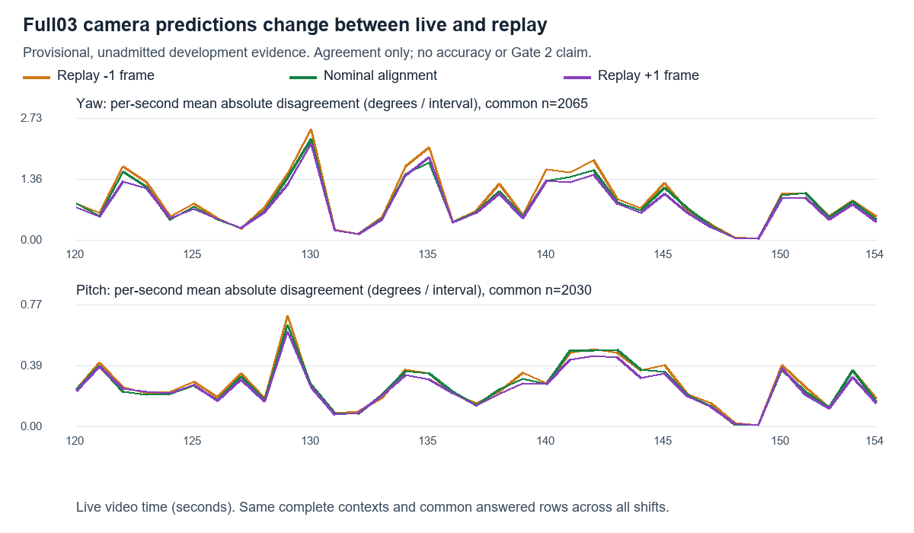

# Full03 paired camera predictions, 2026-09-29

**Provisional, unadmitted development evidence.** [VUH-1353](https://linear.app/vuhlp/issue/VUH-1353).

**Yes: replay rendering materially changes full03's camera predictions on these matched moments.** Nominal mean absolute live/replay difference is **0.822° yaw and 0.255° pitch per interval**, respectively **75.1% and 72.3%** of the live predictions' mean absolute magnitude. Moving replay one native frame either way does not remove the difference. “Material” here describes the size relative to the model's predictions; no formal materiality threshold was prespecified. This is one short, prior-exposed development span, not a general replay-transfer result.

The unchanged full03 checkpoint is `f681da9f3a4b8db6f7d19566172b02db776e4bcfac3381be744786179aa55dde`. Source pins and the logger audit are in the [access packet](../idm-paired-camera-phase2-20260929/access-audit.json). The scorer verified the original policy module origins/hashes and used its original camera abstention masks and pitch-fix A. The repository agent package remains loaded for the current denylist boundary; it does not change camera predictions. No support-a3, fitting, promotion, admission or checkpoint change occurred.

Retained spans remain live **[120,155)** and replay **[89.39,124.39)**, with timer-only mapping **replay = live −30.600 s**. The pinned timer/feed evidence is the [HUD packet](../idm-hud-alignment-20260929/README.md). There are **4,199 native frames per rendering** and **2,083 eligible complete paired contexts**, whose interval-end anchors run from live **120.138 to 154.838 s**. Nominal anchor PTS match exactly to recorded precision (floating residual under 3e−11 ms). Every rendering and sensitivity variant uses the same contexts and exclusions; all 17-frame windows and their ±1 replay neighbours are complete inside the frozen decoded spans. No offset was fitted to predictions.

Agreement on the common answered examples across live and all three replay variants:

| Replay alignment | Yaw MAE | Yaw RMSE | Pitch MAE | Pitch RMSE |
|---|---:|---:|---:|---:|
| −1 native frame | 0.8962° | 1.4988° | 0.2648° | 0.4068° |
| Nominal | **0.8223°** | **1.3794°** | **0.2550°** | **0.3920°** |
| +1 native frame | 0.7760° | 1.3189° | 0.2412° | 0.3695° |

The common sets contain **2,065 yaw** and **2,030 pitch** answers. Native shifts are one ordinal (encoded steps 8/9 ms, nominal 1/120 s), not a selected new fit. The within-replay change from nominal to −1/+1 has yaw MAE **0.1994/0.2042°**, pitch **0.0902/0.0904°**: smaller than live/replay disagreement. The +1 case improves agreement modestly but remains large; it is not adopted or called transfer success.

| Rendering | Yaw answered / eligible | Pitch answered / eligible |
|---|---:|---:|
| Live | 2,077 / 2,083 (99.71%) | 2,066 / 2,083 (99.18%) |
| Replay −1 | 2,079 / 2,083 (99.81%) | 2,062 / 2,083 (98.99%) |
| Replay nominal | 2,075 / 2,083 (99.62%) | 2,062 / 2,083 (98.99%) |
| Replay +1 | 2,078 / 2,083 (99.76%) | 2,064 / 2,083 (99.09%) |

Distance to zero on the same common sets, **not accuracy against a zero baseline**:

| Rendering | Yaw mean absolute prediction | Yaw RMS prediction | Pitch mean absolute prediction | Pitch RMS prediction |
|---|---:|---:|---:|---:|
| Live | 1.0948° | 1.9021° | 0.3527° | 0.5382° |
| Replay nominal | 1.0972° | 1.8743° | 0.2913° | 0.4494° |

The nominal signed replay-minus-live mean is −0.0170° yaw and +0.0121° pitch; small mean bias does not imply moment-by-moment agreement. The [absolute-disagreement plot](absolute-disagreement.svg) uses per-second absolute differences; the frozen scorer's [prediction comparison](comparison.svg) uses per-second means. [Machine-readable agreement](agreement.json), [summary](summary.json) and [comparison CSV](comparison.csv) preserve the counts and values.

Owner eligibility review was **sampled**: all 14 quarter-second sheets, **140 paired samples**, plus native neighbours at eight hotspots/edges and prior native HUD context. It was not a visual review of all 4,199 frames. All-frame PTS continuity and luminance/change summaries were checked computationally. The observed route, Spider-Man/cowboyboopbop identity, actions and scenery remain continuous; no death, follow change, menu or scoreboard was observed inside the retained span. The largest changes are rapid turns/combat effects, and darkest frames are scene shading. 1x is corroborated by the 35 displayed-value ticks (slope 0.9999556) and action progression; speed controls were hidden. Focus and nearby UI log evidence corroborate the exclusion, without establishing absolute truth timing. The live scoreboard fade and all post-155 anchors remain excluded. See the [pinned owner review](review-v2.json), [contact inventory](context-contacts.json) and [fine native neighbours](fine-context.png).

**This cannot establish that replay worsens camera accuracy.** Independent video-to-input timing and session camera-unit truth calibration remain unestablished. Reference gains only reproduce original predictor masks, and head degrees are not validated physical truth for this session. Shared truth error does not automatically cancel. Windows swscale versus the original Mac stores adds a development limitation; no cross-platform bit-identity is claimed. Sampled review cannot certify every hidden sub-quarter-second interruption. No human verification, training, label export, Gate 2 credit or sealed-group access is claimed.

Execution: phase-one audit once; phase-two preparation once; one malformed review caused a gate refusal **before checkpoint loading/inference**. Its [immutable predecessor](review.json) is retained. The corrected nested interval list changed only review serialization, and the [one-line v3 delta](../idm-paired-camera-phase2-20260929-v3/README.md) received [LAND](../idm-paired-camera-phase2-20260929-v3/review-v3-receipt.json). Exactly **one actual scorer/inference run** then completed. All eleven synthetic mapping/gate tests passed. Decoders ran sequentially at BelowNormal, codec threads 2/filter thread 1, closed-game checks; scoring was CPU BelowNormal with two Torch threads. Spot RSS was about 135–143 MB for decoders and up to 624 MB observed for scoring (not peak-memory measurements). $0; completed within the 2.5 h cap. No owned decoder or scorer remains.

Raw RGB/grey stores, all contact sheets and decode logs remain on **D:/rivals-agent-evidence/idm-paired-camera-development-20260929/**. The [collection](collection.json) hashes retained outputs; no raw stores or original ledger/video bytes are committed. Compact evidence and producing scripts live here; [SHA256SUMS.json](SHA256SUMS.json) freezes this record. Lead owns acceptance and VUH-1353 publication/readback. The next decision is whether this provisional prediction-domain difference warrants a separately authorized accuracy experiment with independently established timing/calibration; this run grants no such access.
