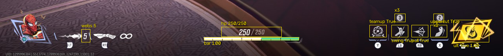
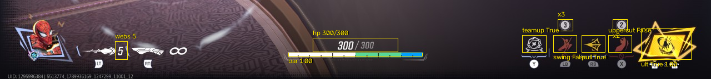
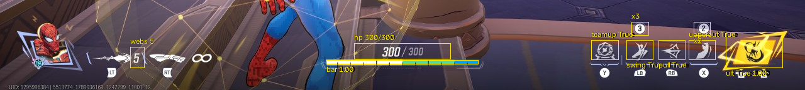
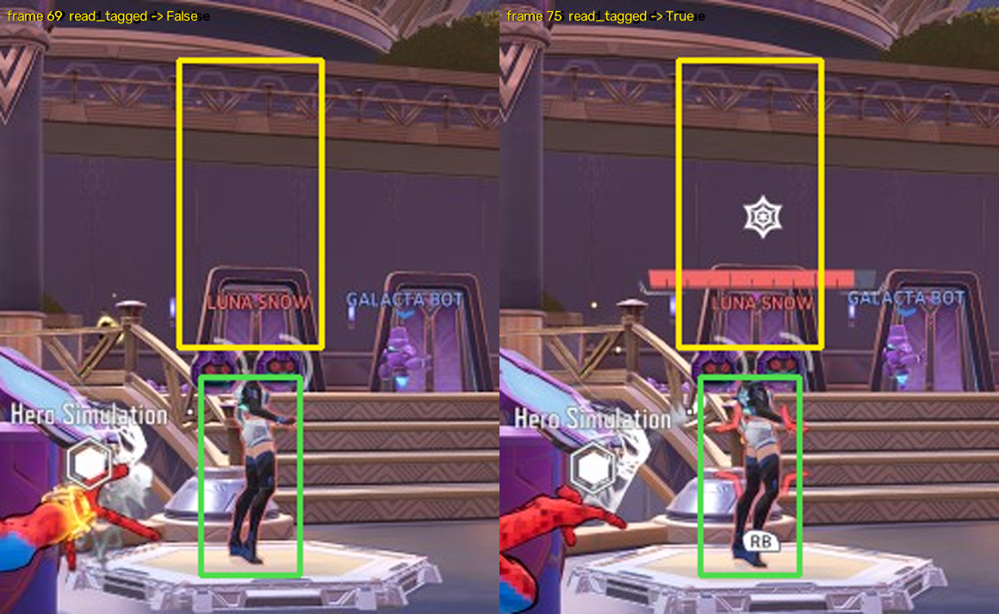

# L2 — HUD readers

`perception/hud.py` reads the practice-range HUD from one frame with fixed
regions and a template-matched digit classifier. No ML. Every reader returns a
value or `None`, where `None` means "could not read this frame" — never zero,
never "not ready".

## Results

`tests/test_hud.py` scores the readers against 145 hand-checked frames from L1
runs `trial1` and `run1` (Spider-Man, practice range, 1280x720):

| field | n | coverage | wrong |
|---|---|---|---|
| hp | 145 | 0.979 | 0 |
| max_hp | 145 | 0.945 | 0 |
| bar_fill | 145 | 1.000 | 0 |
| webs | 145 | 0.986 | 0 |
| teamup `.ready` | 144 | 1.000 | 0 |
| swing `.ready` | 144 | 0.993 | 0 |
| pull / uppercut `.ready` | 144 | 1.000 | 0 |
| swing / uppercut `.charges` | 144 | 0.979 / 0.986 | 0 |
| ult_ready | 141 | 1.000 | 0 |

The labelled hp values span 250 and 252–300: Spider-Man's base pool, and the
team-up buff decaying back down to it.

Two numbers, because they mean different things to the agent. **Coverage** is
the share of frames the reader answered correctly; a miss there is a frame it
declined to read, and at 10 fps the next frame carries the same value.
**Wrong** is the share where it produced a value that disagrees with the truth —
the one that can make the agent act on a fiction. It is zero on every field,
which is what the readers are built for. The check asserts zero wrong reads
and coverage ≥ 0.95, with `max_hp` held to 0.93 for the reason below.

Latency per frame on this Mac with nothing else running: `read` median
**~4.3 ms**, `read_tagged` **~0.6 ms**. Both spread into the tens of ms when
several lanes load the machine at once, which is what the check's generous
12 ms ceiling is for.

The coverage misses are frames where a number sits on bright scenery and loses
a digit into it. Max hp is the worst affected because it is the dimmest text on
the HUD — small, grey, drawn over whatever the camera is pointing at. Its
remaining misses are frames where the digits never surface as glyphs under any
of the nine mask passes, not frames where they were misread: adding templates
past this point changes nothing, which is why `max_hp` carries its own 0.93
floor in the check rather than the general 0.95.

## Regions

Fractions of the frame, so the same numbers hold for the PC's native 2560x1440
and the 1280-wide frames L1 records — verified identical at 960, 1280, 1920 and
2560 wide.

| Region | x0, y0 – x1, y1 | Reads |
|---|---|---|
| `HP_TEXT` | 0.440, 0.896 – 0.560, 0.9315 | `hp`, `max_hp` |
| `HP_BAR` | 0.4055, 0.9335 – 0.5945, 0.9425 | `bar_fill` |
| `WEBS` | 0.1620, 0.905 – 0.1790, 0.950 | `webs` |
| ability icon | slot centre ±0.0165, 0.890 – 0.933 | `ready` |
| charge badge | slot centre ±0.0105, 0.849 – 0.879 | `charges` |
| `ULT` | 0.902, 0.872 – 0.972, 0.950 | `ult_ready`, `ult_charge` |

Spider-Man's four ability slots sit at x = 0.7516 (teamup), 0.7950 (swing),
0.8348 (pull), 0.8723 (uppercut). **The ability row is laid out per hero** —
Human Torch has five slots at different centres — so those four centres are
Spider-Man's alone. Everything above them is hero-independent.

`HP_TEXT` deliberately stops short of `HP_BAR`: the bar is a bright horizontal
strip, and a digit that touches it merges into one component far too wide to be
a glyph. That overlap was the single largest source of unreadable frames.

Cooldowns and the team-up buff, read off frame `000201` — 300 hp, swing and
uppercut red, pull gold:

## How each field is read

- **hp / max_hp** — glyphs are segmented out of a tophat mask, normalised to
  16x24 and matched against per-character template variants by Hamming
  distance. Two things make this survive a moving background:
  - Nine mask passes: three tophat kernels (25, 11, 7) against three contrast
    thresholds (55, 30, 20). The wide kernel is the general background remover;
    the narrow ones pass only marks about as thin as a stroke, which rescues
    white digits on a bright wall, and the low contrasts are for max hp, which
    is drawn grey. The passes are generated lazily and stop as soon as both
    numbers are read, so the common frame costs one.
  - Several template variants per character. The HUD draws current hp large and
    white and max hp small and grey, and the two do not normalise onto one
    bitmap. 16x24 rather than something smaller because an 8 loses its waist at
    12x18 and starts matching a 0.
  Current hp is right-aligned against the "/" and max hp starts just after it,
  both at fixed offsets, so a read is only accepted when it lands there, when
  no second fragment shares its band, and — for current hp — when there is no
  tall ink just to its left that would mean a digit went missing. Without that
  last check a "250" whose first digits merged into a wall reads as a
  well-formed 0. A read where `hp > max_hp` is discarded entirely.
- **bar_fill** — the last filled column of the bar as a fraction of its width,
  filled being the strongest channel above a threshold, so the white base pool,
  the green above it and the blue of a team-up shield all count.
- **webs** — the number anchored at the right of the ammo region. The box is
  cropped tight to the digit because the weapon icon beside it merges with the
  digit on a busy background.
- **ready** — the share of an icon's ink that is red. Brightness does not work:
  a red cooling icon can be brighter than a thin white ready one, and a
  team-up-buffed icon is gold, which has almost no blue. Across the labelled
  set, ready icons reach 0.26 red and cooling ones start at 0.64. The brightness
  floor on what counts as ink matters as much as the thresholds: a reddish-brown
  beam of scenery runs behind the ability row on some frames and, at a lower
  floor, pushed a perfectly ready icon over the line.

- **charges** — the badge above a slot inverts the HUD: a dark digit punched out
  of a light disc. The reader finds the disc and reads the enclosed ink.
- **ult_charge** — the yellow fraction of the ult diamond, normalised so a full
  diamond is 1.0.
- **read_tagged(frame, bbox)** — the Spider-Tracer a hit web-cluster leaves on
  an enemy, matched as a template in a band above the enemy's box. The marker
  is drawn over the world, above the enemy's health bar and name, about a box
  height clear of the box itself, so the band is sized from the box with a pixel
  floor for a distant enemy. Matched at five scales. `None` when the band falls
  outside the frame, which is not the same as "no tracer".

A frame with neither hp digits nor a bar is a menu or a loading screen; the
whole `Hud` comes back empty rather than reporting a row of "not ready".

## Rebuilding the glyph templates

`python -m perception.hud learn <frame>=hp:300/300;webs:5;swing:3 ...` writes
the `GLYPHS` literal from frames whose values a human has already read. Labels
are assigned to glyphs positionally, so a template can only be mislabelled if
the hand-read value was wrong — a far smaller target than labelling a hundred
glyph bitmaps by eye, which is how a scenery blob first got learned as a digit.
`python -m perception.hud sheet <frames...>` renders the contact sheets the
hand-reading is done from.

## Mapping onto `agent/state.py`

`Hud.state_kwargs()` fills `hp`, `max_hp`, `webs` and `abilities` (including
`ult` as an `Ability`); the caller supplies `frame`, since it owns the image.
Three things have no home in `State`, and the brain lane owns that file:

- `ult_charge` (0..1) — `Ability` carries only `ready` and `charges`.
- `bar_fill`.
- the `teamup` slot key, which is Spider-Man's Y ability: pressing it turns the
  other icons gold and raises max hp by 50, which then decays back.

## Known ceilings

- No template exists for the digit **1**: it appears in neither run, where hp
  only ever took the values 250 and 252–300. An hp of, say, 217 will
  read `None`, not a wrong number. Re-run `learn` over a frame containing a 1.
- The ammo box is cropped tight enough that a **two-digit** count would be
  clipped. Spider-Man's Web-Cluster never goes past one digit; another hero's
  might.
- `read_tagged`'s thresholds come from **one** tagging episode (frames 71–86 of
  `trial1`), on one enemy at one distance. The five-scale search is there for
  other distances but is not calibrated against them. `run1`'s web-cluster
  bursts hit scenery rather than bots, so it contains no tagged enemies to widen
  it with. The large web-splat VFX those bursts leave scores 0.45–0.53 against
  the tracer template, under the 0.60 match threshold, so it yields `None` or
  `False` rather than a false `True`.
- **Damage numbers are not read.** They float away from the hit and fade, so
  there is no fixed region to put them in. A hit marker at the crosshair was
  tried and dropped: measured against L1's pad log it fired on 29 of the 66
  frames where no button was pressed at all, because Spider-Man's own web VFX
  fill that region with bright white.
- The bar's span was the same for both heroes measured. Whether it scales with
  max hp on a higher-health hero is untested.
- A "Controller Connected" toast lands on the ult diamond and makes it
  unreadable; the reader reports `None`, correctly, for as long as it shows.
