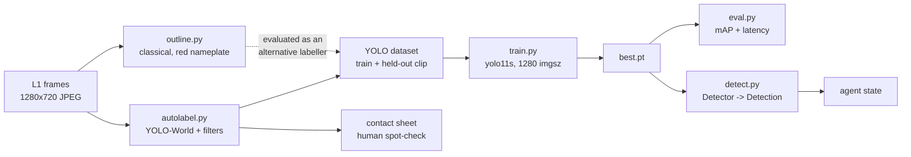

# L3 detector

Auto-label practice-range frames, spot-check the labels by eye, fine-tune a small
YOLO, and hand the agent loop a `Detector` returning `agent.state.Detection`.



## Classes

`ENEMY` only, from `agent.state`. Lead confirmed: `ANCHOR` comes from geometry, not
the detector; `TARGET` is added later only if static dummies appear that `ENEMY`
misses. `Detection.distance` and `.tagged` are left `None` — this detector estimates
neither, and `None` means "not read", never a guess.

Two classes were tried and dropped:

- **enemy health bar** — YOLO-World returns zero boxes for it across seven prompt
  variants (`red health bar`, `health bar`, `red bar`, `progress bar`,
  `red rectangle`, `name tag`, `floating name label`). Not auto-labellable. Lead
  reassigned the concept to L2, anchored to the enemy box.
- **static dummies (`TARGET`)** — no evidence for one. Every hostile seen across
  run1 is a moving bot: purple Galacta bots and a Luna Snow hero-simulation bot.

## What the frames actually are

run1 is 6361 frames at 1280x720, ~10 fps. Sampled every 3rd frame (2121) to the Mac;
neighbouring frames are near-duplicates. Roughly a quarter hold a bot, the rest is
traversal — those empty frames are kept as deliberate background examples.

**The targets are tiny.** Median labelled box is 21x33 px in a 1280x720 frame (p10
10x19, p90 45x96). Three consequences: `imgsz` must stay 1280 (at 640 the median bot
is ~10 px and effectively gone), latency will not drop much below the figures below,
and mAP50-95 stays low because a few pixels of box error is a large IoU error at that
size. **Track mAP50, not mAP50-95.**

## Filters, and why each exists

`autolabel.py` runs three filters over the open-vocabulary output. Each one is there
because of a failure seen in the frames, not as a precaution:

| Filter | Failure it fixes |
|---|---|
| `DEAD_ZONES` | The bottom-left hero portrait reads as `person`. On the L0 frames it was the **only** thing the model detected. |
| `is_own_hero` (size) | The player's own third-person hero is a `person` in every frame. Size separates him: he fills a third of the frame height, a bot across the range under a tenth. A fixed rectangle does not work — it also swallows a bot standing at mid-screen depth. |
| `filter_frame` (containment) | At conf 0.10 the model puts small boxes on the hero's torso and outstretched arm, which pass the size test. **These are the most dangerous labels in the set**: they teach the detector that the player is a target and point the aim controller at himself. Anything more than 60% inside the hero is dropped — 46 of 586 instances on trial1. |

Consumers should still not assume the player can never be boxed.

`pick_val_block` holds out one **contiguous** clip, not a random sample: neighbouring
frames are near-duplicates, so a random split leaks training frames into val and
reports a flattering mAP. The plain tail is not safe either — trial1 ends on traversal
with no bots, which left 2 instances in val and made mAP meaningless. The block is the
densest contiguous window, which makes val the harder split and the reported mAP
conservative.

## Label quality: the real ceiling

Hand-judged 36 random labelled crops (`yoloworld-label-crops.jpg`): **roughly half are
scenery** — pillars, walls, fire, foliage, a floor emblem. That ~50% label precision,
not the model or the schedule, is what caps the fine-tune. A 201-frame run reached
mAP50 0.082; more epochs will not fix labels that are half wrong.

## outline.py — the classical alternative

Finds hostiles by the game's own marker instead of by appearance. Thresholds were
measured, not guessed, from a known nameplate and its two competitors in one frame:

| | hue | sat | val | BGR |
|---|---|---|---|---|
| enemy nameplate | ~174 | 111–151 | ~229 | 105,102,229 (bright red) |
| Spider-Man's suit | ~150 | ~189 | ~200 | 91,75,148 (darker red) |
| pink masonry | ~8 | ~48 | ~178 | the map is full of this |

Brightness separates the bar from the suit; saturation drops the masonry. A first
attempt at `S>120, V>110` boxed half the architecture.

**Measured over all 2121 frames: 766 detections in 547 frames (26%), latency median
8.0 ms, p95 39.5 ms (CPU, single frame).** Hand-judged 36 random detections
(`outline-crops.jpg`): ~7 land on an actual enemy, so **precision ≈ 19%**.

Two findings explain that, and both matter more than the number:

1. **The red bar is not a general enemy marker here.** Only Luna Snow — the engaged,
   damaged bot — carries a red health bar. The Galacta bots carry plain white
   nameplates and no bar at all. So the cue structurally cannot see most hostiles.
2. **Spider-Man's suit has a red belt**, a wide thin bright-red horizontal bar of
   almost exactly nameplate geometry. It is not separable from a nameplate by colour
   or shape, so a red cue and this specific hero are a bad match.

The bar-to-body geometry is the weakest part of the file: bar position gives the
enemy's screen x reliably, but the body offset varies with depth and occlusion.
Ratios were calibrated against 152 matched bars, but the reference labels are
themselves noisy, so the spread is wide (body height p25–p75 0.57–2.33 of bar width).

### Recommendation

**Neither alone. Turn on the game's enemy outline first.**

- YOLO alone: capped at ~50% label precision → mAP50 0.08.
- outline alone: ~19% precision and structurally blind to the white-nameplate bots.
- outline as the labeller for YOLO: not worth it *as it stands* — feeding 19%-precision
  boxes in would be worse than the 50% it has now.

The cheap unlock is the setting lane L4 can change. **Requested value: the enemy
outline/highlight enabled, in the most saturated pure green available.** Evidence: a
hue histogram of vivid pixels (S>100, V>150) across 54 run1 frames —

| hue band | share |
|---|---|
| red 0–14 | 21.3% |
| orange 15–29 | 10.5% |
| yellow 30–44 | 1.6% |
| lime 45–59 | 1.1% |
| **green 60–74** | **0.20%** |
| cyan 90–104 | 10.9% |
| azure 105–119 | 20.6% |
| pink 165–179 | 17.0% |

Green is 5x rarer than lime, 10x rarer than yellow, and 100x rarer than red — and the
map's purple/lavender/tan palette plus Spider-Man's red-and-blue suit occupy every
other band. With a green outline drawn on hostiles, `outline.py` becomes a
colour-keyed segmentation that is both high precision *and* high recall, gives the
body silhouette directly (no bar-to-body guessing), and can then auto-label for YOLO.
The green HUD elements (health bar, kiosk screens) sit inside existing dead zones.

## Results

| Run | Frames | Instances | mAP50 | mAP50-95 | P | R | Latency (1280x720) |
|---|---|---|---|---|---|---|---|
| trial1 | 201 | 128 | 0.082 | 0.029 | 0.176 | 0.170 | median 13.2 ms, p95 15.9, max 18.9 (MPS) |
| run1 | 2121 | 1632 | see below | | | | |

Latency is measured through `detect.Detector` one frame at a time after warm-up, the
way the agent will call it. MPS on an M5 Max; the 4080 figure is unmeasured because
the PC's GPU stays with the game.

## Running it

Mac (MPS), niced — this is where the real run happens; the PC GPU stays with the game:

```sh
uv run --no-project --with ultralytics --with "clip @ git+https://github.com/ultralytics/CLIP.git" \
  python perception/autolabel.py data/l1/run1 data/ds-run1 --conf 0.10 \
  --sheet docs/evidence/l3/autolabel-sheet.jpg
uv run --no-project --with ultralytics python perception/train.py data/ds-run1 --epochs 15 --imgsz 1280 --batch 4 --name run1
uv run --no-project --with ultralytics python perception/eval.py data/runs/run1/weights/best.pt data/ds-run1
uv run --no-project --with opencv-python --with numpy python perception/outline.py <frame.jpg> out.jpg
```

Pulling frames from the PC: stage a zip in `$env:TEMP` and `scp` it — do not `scp` a
glob of thousands of names (the argument list is too long, and zsh will not expand
braces inside quotes).

### Real run on the PC, if the GPU is ever free

`setup_pc.ps1` prepares it and is verified (torch 2.11.0+cu128, CUDA True, RTX 4080
SUPER). PyPI's Windows `torch` wheel is CPU-only, so the CUDA wheel index must be
named outright — neither `--torch-backend` (uv 0.9.26 rejects it on `run`) nor
`UV_TORCH_BACKEND=auto` worked, and a plain install silently trains on the i9.

```sh
zsh ~/.claude/skills/windows-pc/pc.sh -f perception/setup_pc.ps1
PC_TIMEOUT=3600 zsh ~/.claude/skills/windows-pc/pc.sh '
  Set-Location C:\rivals-agent
  $idx = "https://download.pytorch.org/whl/cu128"
  & uv run --no-project --index $idx --with ultralytics python perception\train.py data\ds --epochs 60
'
```

`perception/` is not on the PC yet: `scp -r perception volpe@supedupsilly:C:/rivals-agent/`.
