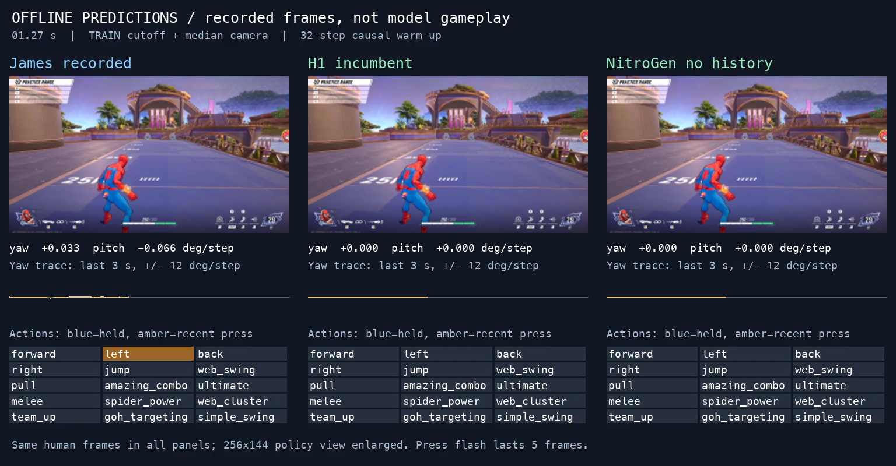

# Thirty-second James / H1 / NitroGen offline replay

[Watch the 30 s MP4](offline-predictions.mp4). **Offline predictions on James?s recorded frames, not autonomous model gameplay.** All panels show the same admitted human recording. Model commands do not change the observations.

The interval was pinned before inference (`991fa31`, receipt SHA `4ddc2064ed515129c3d21b21255a17e23509bd33870d1e6104333427e268292e`): session `20260923T171533-187Z-33696-5`, display rows 185?1084, 900 frames at 30 fps, with causal warm-up rows 153?184. The source is the admitted 256?144 RGB policy view enlarged, not native-resolution footage. Both models use their own executed history where applicable; neither receives James?s action history during the self-fed rollout.

Video overlays use original TRAIN-calibrated press cutoffs and median camera decoding. Amber press flashes last five display frames for readability; all scores use one-frame events. Blue marks held actions. Camera values are requested degrees per step; the yaw chart is clipped visually at ?12 degrees without changing saved predictions.

## This clip only

| Model | Cutoff | Press F1 | Predicted presses | Human presses | Camera MAE |
|---|---|---:|---:|---:|---:|
| H1 incumbent | train_chosen | 0.022222 | 1 | 77 | 1.055095 |
| H1 incumbent | fixed_0.5 | 0.058069 | 10 | 77 | 1.213540 |
| NitroGen no history | train_chosen | 0.370400 | 65 | 77 | 0.968300 |
| NitroGen no history | fixed_0.5 | 0.418092 | 82 | 77 | 0.968300 |

These are descriptive scores on one predetermined 30 s interval. They do not replace the full frozen-dev confirmation or establish live playability. The recording includes ongoing human actions and camera movement; visual feedback and initiation risks remain.

## Reuse and verification

Reusable renderer: [policy/range_bc/offline_replay.py](../../../policy/range_bc/offline_replay.py), source `ec3a44f`. It accepts `--spec` and `--out`; [replay-spec.json](replay-spec.json) selects clip, interval, model and calibration paths/hashes, feature receipt, device and FPS. [replay-usage.md](replay-usage.md) documents changing those parameters for another authorized comparison. Two interval-boundary tests pass on PC and the actual Mac stack.

H1 epoch 26 checkpoint: `2f6aae5d716a095b0d29c3cf32ec5833107e47d0bc6c7b905282e3932ca99767`. NitroGen no-history seed 1 epoch 26: `9f3dfd1a9a2edb1c280f0a2a86a18cb34cfe2a7ce172931823ababca41eebf24`. The seed and interval were not selected from this video?s outcomes.

Mac output `/Users/james/dev/range-bc-data/explore/nitrogen-nohistory-confirm-20260927/offline-replay-parameterized/`. Renderer ran at nice 10 with two CPU threads and MPS inference; ffmpeg used two CPU threads. It exited 0. ffprobe decoded/count-checked 900 frames, 1536?800, duration 30.000000 s. First/middle/last PNGs and a decoded frame containing a known press were visually inspected: panels align, text is legible and the press highlight matches the saved event.

Video SHA-256 `c6df4e4d48b70eb740be932e59e2c1c00470334c4b1ed87cc0c1bd29167ff93a` (15,768,236 bytes). [offline-replay-evidence.zip](offline-replay-evidence.zip) SHA `25ce95d0697679c3687797bf2de07350c5d4fa793be4e73cd6ac3e9cf5231f98` preserves row-pinned predictions, clip scores, sample PNGs, exact spec/interval, launcher and terminal receipts with per-file hashes. [replay-receipt.json](replay-receipt.json) pins every rendered file. All bytes verified after transfer to PC. Cloud cost $0; no datasets were copied and nothing sealed was opened.

The Mac slot continues for the lead?s subsequently requested per-action onset diagnostic; it will be explicitly released when that finishes.
