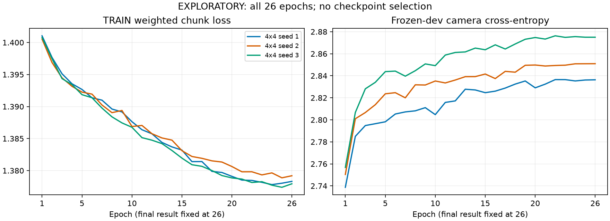

# EXPLORATORY final-fit curves

All epochs are retained; no early-checkpoint selection. Final scientific results remain epoch 26.

| Grid | Seed | TRAIN epoch 1 | TRAIN epoch 26 | Change | Dev camera CE epoch 1 | Dev camera CE epoch 26 | Change |
|---|---|---|---|---|---|---|---|
| 4 | 1 | 1.401044 | 1.378316 | -0.022728 | 2.738732 | 2.836328 | 0.097596 |
| 4 | 2 | 1.400539 | 1.379195 | -0.021344 | 2.750387 | 2.850957 | 0.100570 |
| 4 | 3 | 1.400790 | 1.377940 | -0.022850 | 2.756776 | 2.875006 | 0.118229 |

Every retained arm lowers TRAIN loss while worsening dev camera CE. This pattern is consistent with overfitting; it is not the both-flat pattern that would suggest no fitting or unusable inputs. The curves do not by themselves isolate the cause or prove that a different checkpoint would help.

TRAIN loss is the existing weighted total chunk loss, including frozen action/pitch contributions; it is not yaw-only loss. Dev camera CE includes both camera axes in windowed validation. The scientific yaw MAE uses the pre-stated full-run median decode; context and decoding differ. A dev-CE improvement with worsening full-run MAE would therefore merit a decoding/context diagnostic, not automatic checkpoint selection.

Full numeric curves: [CSV](curves.csv). Shareable figure: [SVG](curves.svg). Raw status files and collection receipts preserve the complete recipe and history. They were supplementary files, not originally declared guard artifacts: their hashes were recorded at collection after terminal/recipe/schedule validation and two stable reads.

Next decision: if 8x8 is also negative and the curves do not explain it, follow the lead-directed bounded intent/target audit in `docs/research/recent-ai-research-20260927.md`; keep oracle labels separate from causal inputs. No additional grid or encoder experiment is authorized.
