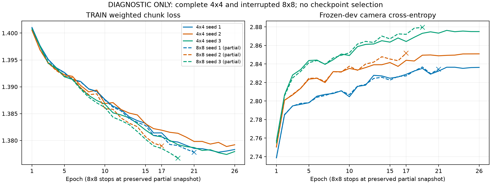

# DIAGNOSTIC: interrupted 8×8 curves versus completed 4×4

**All three 8×8 fits are incomplete. There is no valid 8×8 final result or grid-comparison verdict.** The shared workspace guard stopped them at approximately 03:00:32 UTC, before their 03:45:18 funded deadline. Each returned `Refused('workspace spend stop')` and now has validated terminal/zero-container proof.

The partial curves nevertheless show the same overfitting pattern as 4×4 in every seed: TRAIN loss declines while dev camera CE rises. The rise is already present at epoch 17, the common available epoch. This is strong diagnostic evidence of overfitting under the unchanged recipe and weighs against spending on an unchanged rerun. It does not measure final 8×8 MAE or establish a causal remedy.

Solid lines: completed 4×4 through epoch 26. Dashed lines: interrupted 8×8; crosses mark the last persisted snapshot (epochs 21/17/19). No extrapolation, earlier-checkpoint selection or partial-model scoring.

| Grid | Seed | TRAIN epoch 1 | TRAIN epoch 17 | Change | Dev camera CE epoch 1 | Dev camera CE epoch 17 | Change |
|---|---|---|---|---|---|---|---|
| 4 | 1 | 1.401044 | 1.381412 | -0.019632 | 2.738732 | 2.828831 | 0.090099 |
| 4 | 2 | 1.400539 | 1.381914 | -0.018625 | 2.750387 | 2.844012 | 0.093625 |
| 4 | 3 | 1.400790 | 1.380665 | -0.020125 | 2.756776 | 2.864290 | 0.107514 |
| 8 | 1 | 1.401055 | 1.380881 | -0.020175 | 2.738411 | 2.827174 | 0.088763 |
| 8 | 2 | 1.400550 | 1.378990 | -0.021560 | 2.750410 | 2.851651 | 0.101241 |
| 8 | 3 | 1.400826 | 1.378502 | -0.022325 | 2.754306 | 2.872032 | 0.117726 |

| 8×8 seed | Last preserved epoch | Updates | Last TRAIN loss | Last dev camera CE | Settled bound |
|---|---|---|---|---|---|
| 1 | 21 | 12348 | 1.377801 | 2.834198 | $2.873781 |
| 2 | 17 | 9996 | 1.378990 | 2.851651 | $2.870400 |
| 3 | 19 | 11172 | 1.376709 | 2.879478 | $2.869416 |

TRAIN loss includes the frozen action/pitch contributions. Dev camera CE includes both axes and uses windowed validation; final yaw MAE would use full-run median decoding. Neither flat curves nor improved dev CE are observed here, so these curves do not point first to the fitting/input or decoding/context alternatives. They do not rule out additional issues.

Each output volume contains only `fit/started.json`, `fit/status.json`, `latest.pt` and `epoch-13.pt`. No epoch-26 checkpoint, `fit/completed.json`, `fit/fit.json` or evaluation exists. We retained the raw partial status/started files, file inventories, teardown/result/accounting receipts and ledger snapshot. Partial checkpoints stay on their original volumes and were neither loaded, scored nor resumed. Status hashes are supplementary collection-time pins, not original guard artifact pins.

Fresh 8×8 settled bounds total **$8.613597**; campaign conservative settled total is **$18.666509**, **zero active yaw holds**. Before fencing, the guard combined a **$69.09386987 metered floor** with **$31.078902 retained attempt bounds**, reaching **$100.17277187** against its $100 cap. Those quantities partly overlap; this is not evidence of a $100 provider bill. The lead corrected an earlier $47 meter estimate and tasked modal-port with per-app reconciliation in v1.0.5. No reconciliation, credit, cap change or guard mutation was performed by this lane.

**Relaunch remains ON HOLD.** Prior relaunch pre-approval was explicitly revoked. IDM has priority; any yaw relaunch requires a new lead/James budget decision and the required accepted guard. No partial resume, new grids or new encoders. The conditional next direction remains a bounded intent/target audit, with oracle labels separate from causal inputs; the lead decides its dispatch.

All numeric points: [CSV](curves.csv). [SVG figure](curves.svg). The completed [4×4 result](../grid4-results-02/report.md) remains unchanged.
