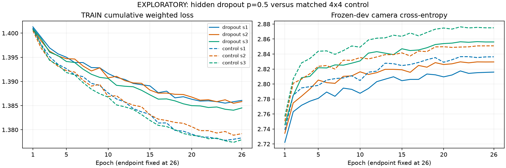

# EXPLORATORY: 4x4 hidden dropout p=0.5

Mean yaw MAE: dropout 1.885650, control 1.908168, frozen base 1.772851, zero motion 1.735184 degrees.

Same 201,187-parameter head, seeds 1/2/3, admitted cohort, frozen dev, CUDA stack, base checkpoints, TRAIN cutoffs, 96-step windows / stride 64, 26 epochs / 15,288 updates. Only hidden dropout changes. The measured direct-Volume 4x4 reader matches the completed control, by explicit lead decision. Median camera decode. Offline recorded pixels; no live-play claim.

| Seed | Arm | Yaw MAE | Zero | Left MAE | Right MAE | False turn, yaw still | False turn, both still |
|---|---|---|---|---|---|---|---|
| 1 | dropout | 1.884339 | 1.735184 | 2.451596 | 2.061315 | 0.289108 | 0.284754 |
| 1 | control | 1.893851 | 1.735184 | 2.457853 | 2.066949 | 0.299842 | 0.294839 |
| 1 | base | 1.774179 | 1.735184 | 2.332130 | 1.988203 | 0.244237 | 0.240854 |
| 2 | dropout | 1.893422 | 1.735184 | 2.435999 | 2.091654 | 0.298082 | 0.290488 |
| 2 | control | 1.919141 | 1.735184 | 2.465684 | 2.113611 | 0.302305 | 0.295234 |
| 2 | base | 1.782225 | 1.735184 | 2.336895 | 1.996026 | 0.250396 | 0.245798 |
| 3 | dropout | 1.879188 | 1.735184 | 2.404754 | 2.087004 | 0.316206 | 0.313822 |
| 3 | control | 1.911511 | 1.735184 | 2.427596 | 2.123952 | 0.333451 | 0.332411 |
| 3 | base | 1.762150 | 1.735184 | 2.291810 | 1.984553 | 0.254795 | 0.252917 |

False turns mean predicted absolute yaw >=0.6 degrees on the stated human-still slice. Support per seed: 24,556 frames, 8,984 left, 9,889 right, 5,683 yaw-still, 5,057 both-axes-still.

| Seed | Dropout minus control yaw | Dropout minus base yaw | Retained press F1 | Press-rate ratio | Retained pitch MAE |
|---|---|---|---|---|---|
| 1 | -0.009512 | 0.110160 | 0.284916 | 0.942229 | 0.595408 |
| 2 | -0.025719 | 0.111197 | 0.313503 | 0.937347 | 0.593668 |
| 3 | -0.032324 | 0.117038 | 0.303645 | 0.923515 | 0.593362 |

All action, movement and pitch predictions are exactly retained; pitch logits and frozen base tensors also pass exact checks. Paired differences for every reported metric and seed means are in report.json.

| Arm | Seed | TRAIN cumulative loss epoch 1 | Epoch 26 | Dev camera CE epoch 1 | Epoch 26 |
|---|---|---|---|---|---|
| dropout | 1 | 1.401308 | 1.386075 | 2.722192 | 2.815921 |
| dropout | 2 | 1.400774 | 1.385836 | 2.734262 | 2.829479 |
| dropout | 3 | 1.400969 | 1.384518 | 2.745619 | 2.856131 |
| control | 1 | 1.401044 | 1.378316 | 2.738732 | 2.836328 |
| control | 2 | 1.400539 | 1.379195 | 2.750387 | 2.850957 |
| control | 3 | 1.400790 | 1.377940 | 2.756776 | 2.875006 |

TRAIN is the cumulative weighted chunk-loss average, including frozen action/pitch contributions, not an independent per-epoch yaw loss. Dev CE includes both camera axes with windowed context. Full-run yaw MAE uses carried recurrent context and median decoding. Every epoch is shown; no checkpoint selection.

Hash-authenticated stage artifacts and supplementary status receipts underpin this report. This exploratory comparison has no confirm verdict; any promoted candidate needs a fresh matched confirmation.
