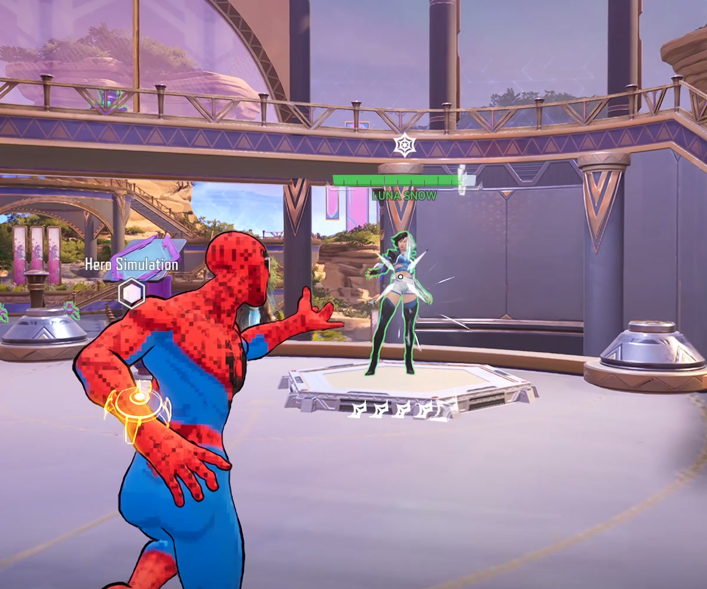

# Native Web-Cluster calibration and offline human-policy replay

The guarded executor produced **two distinct Web-Cluster casts that hit Luna**.
Independent native-video review confirmed the launches, impacts and ammo drops.
Lead accepts this bounded measurement. A third scheduled request was refused for
insufficient press time and produced no observed cast. This was scripted calibration;
the human-trained model has still sent no game input.

In the excerpt, watch the first cast near 3.93 seconds and the second near 5.47.
The aim and approach are scripted. Luna is a Hero Simulation target, not the
designated Galacta benchmark; this run contains no learned kills or benchmark pass.

| Scheduled opportunity | Software result | Original video evidence |
|---|---|---|
| 1, request 13 | Accepted; two LT send calls returned for one owned pulse | Emission (11.916667, 11.933333]; contact by 11.966667; ammo 5→4 |
| 2, request 28 | Accepted; two LT send calls returned for one owned pulse | Emission (13.450000, 13.466667]; additional damage by 13.550000; ammo 4→3 |
| 3, request 43 | `insufficient_press_time`; zero LT sends | No launch observed over 14.550000–15.283333; ammo remains 4 |

Ammo replenishes 3→4 during (13.916667, 13.933333], explaining why the next
request snapshot again shows four. The reader's intervening decision observations
also retain the depletion to three. Four LT calls are not four casts.

## Authority and timing

The native run used the clean, isolated `cb677ef` live checkout and the independently
reviewed three-opportunity caller. Root inspected the fresh No Ability Cooldown
X/off image after re-entry. The same-device camera startup and single-Luna setup
passed. Earlier A/B/C failures remain unchanged and are not counted as successes.

The existing watchdog caps held authorization; neither its checks nor returned
pad calls measure physical button duration. Both owned requests eventually have
`cancelled_after_press` execution outcomes, retained independently of the confirmed
visual response. The bounded phase ended via `RangeLost('probe_complete')`, which
appears as `range_lost` in original metadata with no range gaps or errors. Terminal
neutral release calls returned.

The independent reviewer inspected 164 dense native frames across the three
windows and compared 23 saved JPGs to the original video. Their empirical relation
is video PTS ≈ acquisition time + 4.249945 s, with best-match offsets spanning
4.238110–4.259017 s. Adjacent-frame ambiguity expands the observed envelope to
4.221444–4.275684 s. This supports identifying which pulse caused each separated
cast; it is not a guaranteed clock transform or input-to-photon measurement.
One 33.333 ms gap during second-cast recovery obscures neither launch bracket.

[Structured native audit](audit-results.json) and the
[verbatim independent review](independent-audit.txt) retain the exact observations
and limits. The review's larger crop references remain under the retained local
`data/live-readiness/20260922-cast-probe/audit-d/`; only the two inspected hit images
are copied here. [Execution evidence](execution-diagnosis.json) and
[deployed-code receipt](code-receipt.json) keep software and visual measurements separate.

## Human checkpoint on the recorded observations

One offline replay loaded the original six-label human checkpoint, with its
original source identity, through the actual learned consumer. It processed all
52 recorded decision States at their full original acquisition timestamps.
This used no controller, live loop, perception import or input device.

| Observational result | Count |
|---|---:|
| Actual model inference | 48 |
| Emitted start proposals | 5 |
| Emitted no-new-start proposals | 40 |
| Neutral refusals | 7: one unobserved target, three warmup, three low confidence |
| Cadence resets / invalid histories | 0 / 0 |

The unchanged confidence threshold is 0.7. CPU probability calls took median
0.205 ms, p95 0.463 ms; the whole consumer took median 0.322 ms, p95 0.648 ms.
These offline measurements omit capture, perception, scheduling and input.
They cannot replace D's separately recorded live processing costs.

This establishes that the actual consumer can use the recorded runtime cadence
and observations. The five proposals were never sent. Scripted D is not human
validation, scripted actions are not truth labels, and different actions would
change later scenes. No timing score, counterfactual kill or pulse success is inferred.
The model, threshold and source profile were not changed after this replay.

Root inspected the actual [replay script](shadow-replay.py), verified its source
and [report](shadow-report.json) hashes, all 52 states/48 calls and unchanged code
pins; no repeat inference was needed. The script is an exact copy of the executed
one under `data/diagnostics/range-human-shadow-d-20260922/`. It refuses an existing
`report.json`; restore it there only for a deliberate, separately recorded replay.

## Preserved artifacts and next requirement

Original video: `data/live-readiness/20260922-cast-probe/probe-d-native.mp4`,
2560×1440, 35 seconds, 2077 frames, timebase 1/15360. SHA-256:
`a0ec11c760ac358c5f33e5616d41e416d9c479aefabe1a8a176f0c7da4f828b2`.
The 1280-wide sharing excerpt covers original seconds 8–19; SHA-256:
`7cbe90e453fffe02ef2d04768e7923799543a2e79d7516655541796e8599b41b`.
The original native video remains authoritative.

Human checkpoint SHA-256:
`da29a97f0542210e6c69bc7dfa488afec97c33668a27deea98e3177919834987`.
D log SHA-256:
`7ec2d278e57878220ef0615db7a2f4bdb5d0fbf7e9d1ec4209d15a798b04c690`.
[Artifact source map](artifact-sources.json) pins every copied report and image;
[native source hashes](native-source-hashes.json) pin the original audit inputs.

The next required evidence remains natural-play independent validation under
[VUH-1347](https://linear.app/vuhlp/issue/VUH-1347), plus the truthful current runtime
settings/perception/selector review and deployment binding. D's metadata retains
its unverified patch field. This partial calibration does not manufacture that
binding or change source provenance. No stationary-idle, DPI or replacement
recording is requested for this result.
