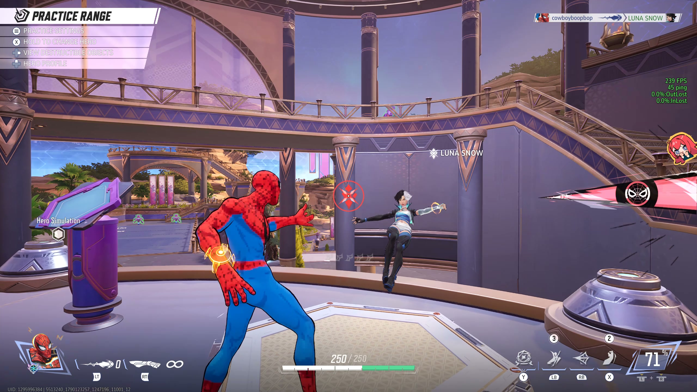
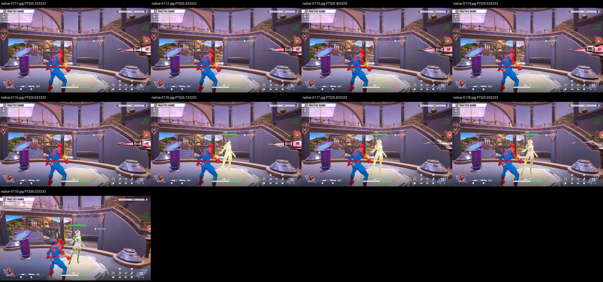

# First learned-request Luna KO

**The unchanged human-trained request model killed Luna Snow in one completed 20-second practice-range trial, then hit her once after respawn.** Independent native-video review confirms eleven separate Web-Cluster emissions and impacts: ten through the lethal hit and one on the second life. Luna's near-full health at the end belongs to the respawned target.

[Watch the continuous 27-second excerpt, original seconds 8–35](https://uploads.linear.app/75f1d1f0-542b-4095-9967-fd7b27093472/1050b2c0-a444-4bfc-bc56-7ca0cd94ce74/432aff95-bc5f-408c-935a-0bf9a5e586b1). The lethal emission is around 14.63 seconds into the excerpt, the clear KO/feed at 15 seconds, respawn at 17.63–17.73 seconds, and the second-life hit around 18.9 seconds. The export keeps approach, attacks, death, respawn and shutdown from this single attempt; it is scaled to 1080p with no audio. The original remains intact.

## What ran

On September 22, 2026, Windows ran the exact human request checkpoint `6ee38807`, confidence 0.7 and unchanged 24/24 Torch thread settings on independently accepted software `676f99a`. This was the fifth retained exploratory measurement and the first 20-second one. The preceding [ten-second run](../range-request-owned-pulse-runtime-20260922/README.md) produced eight hits without a KO. Only the phase duration changed here; there was no retraining, threshold tuning or production-code change.

Fresh practice-range entry, normal resources, effective PAD layout and Luna setup are recorded in `setup/` and `preflight/`. The new binding was consumed once. The existing caller allowed up to 14 seconds of camera-only startup followed by the 20-second learned phase within a single 34-second authorization. Target selection, aim, guarded approach and pulse delivery remain scripted. The model supplies fresh web requests; it does not yet supply combos, traversal or target value.

The accepted `request-start-owned-pulse-v1` boundary preserves each request's original acquisition/resource clocks. A fresh start must enter inside its original 100 ms authorization and ammo freshness limit. Controller acceptance fixes the nominal 33 ms owned pulse end; only that owner can continue to that fixed end, with cancellation on loss/refusal and phase/session limits. [The software review](../range-owned-pulse-software-20260922/README.md) remains applicable. Recorded API return times do not establish physical pulse duration.

## Observed result

| Evidence | Result |
|---|---|
| Native video | One Luna KO and respawn; eleven visible web emissions/impacts; second life alive at end |
| Complete decisions | 196: 84 start, 57 no-new, 55 other (30 target unobserved, 19 warmup, five low confidence, one scripted low-HP gate) |
| Controller and actuator | 13 accepted owners; 25 returned LT calls; one failed continuation; both explicit neutral releases returned |
| Saved rows | 835 ordinary returned rows, one failed-send origin and two release rows; 838 JSONL rows total |
| Scheduling | 196 of 200 phase slots offered; four late slots retired; no invalid-history refusals |
| Stop | Normal `max_time`, exit 0; terminal neutral returned at phase age 20.0011053 seconds |

Owners 54 and 62 have no separate emission in their inspected native windows. Their returned calls are retained, and the cause remains unknown. Owner 62's initial LT returned; its continuation expired at the actuator's fixed pulse end, cancellation returned, and fresh requests continued. No retry or second acceptance of owner 62 is credited. The metadata mirror refers to the same failure.

Original PTS 22.633 contains the lethal emission; 23.000 shows `cowboyboopbop`, the web-projectile icon and `LUNA SNOW` in the kill feed, the KO reticle and death animation. The platform is empty at 25.633 and Luna visibly respawns with full health by 25.733. This affirmative pixel evidence establishes the KO; track disappearance alone would not.

The isolated decision 173 reports HP 50/250 and triggers a scripted camera turn. A later saved frame and inspected native context show 250/250, but the exact original decision image is not established. Its reported value remains unchanged. This is neither verified injury nor learned escape, and does not justify a new reader-failure claim from later pixels.

## Acceptance and next measurement

Root accepts the independent audit's bounded outcome: **one demonstrated learned-request-controlled Luna kill**. The model was fitted on one received request and four non-start examples from one evening. This result does not establish useful timing accuracy, repeatability, pro-level mechanics or generalization. Local moving-frame correspondence places the KO approximately 13.4–13.6 seconds into the learned phase, with capture/render uncertainty; no exact reaction or game-input latency is claimed.

The next milestone remains repeated bot kills with a matched scripted comparison, retained scheduled failures and James's independent reference. The designated-Galacta near/mid ten-trial contract is unchanged; this exploratory Luna attempt does not count toward its eight-of-ten gate. Current startup and generic selection still need to join that scenario and its audited readiness/reset/outcome evidence. No additional human recording is needed to accept this result.

## Evidence and reproduction

| Retained path | What it establishes |
|---|---|
| [Native audit](native-audit/independent-audit.md) | Verbatim independent outcome, native event locators, limits and all twenty deployed-file comparisons |
| [Count report](counts/README.md) | Finalized JSON accounting, consumed requests, cancellation and original clocks |
| [Artifact receipt](artifact-receipt.json) | Byte-identical original-to-archive copies and explicit lead acceptance |
| `run/` | Original `meta.json` and `frames.jsonl`, including the unique failed-send origin |
| `preflight/` and `setup/` | Actual source/runtime/deployment identities, one-use launch evidence and fresh setup |
| `native-audit/selected/` | Twenty-two curated native images/contact sheets, including kill, respawn and terminal evidence |

Independent report SHA-256: `d532231de68e02b6ad41af0fcaa739bb0393f39b597c4fb8f56309fd8ff61dfc`. Root inspected the decisive KO and respawn images before accepting the archive. Existing software proof was reused; this archive adds no runtime change or new test campaign.

The original 60-second, 3567-frame video stays at `data/runtime/range-request-20s-preflight-20260922/learned-native.mp4`, SHA-256 `d7e9bf361a1f75167b3df6577324fe5611ae88e42e6cc4231555d7e62e78c35e`. It is not copied into Git. The excerpt's separate hash/upload receipt is in `preflight/linear-video-upload.json`.

The stdlib count analysis can be reproduced in a clean copy at its original repository-relative path with its seven pinned finalized JSON inputs; it refuses to overwrite reports. Archived launchers are historical evidence and the binding is consumed. Do not rerun this native launch. A future experiment uses its own fresh effective setup and scoped binding, preserving these originals and every earlier attempt.
