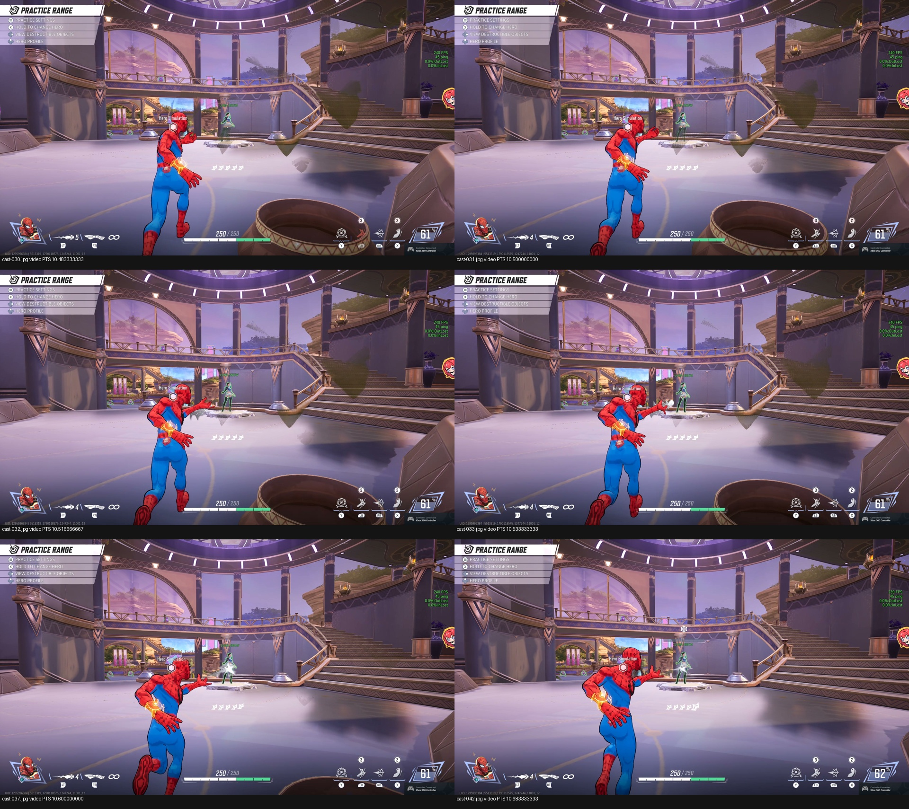

# Completed request-model diagnostic, September 22

**One independently confirmed web cast hit Luna during a completed 10-second learned phase.** Two later requests expired at the actuator, were released and remained consumed; fresh decisions continued until `max_time`. Luna survived. This is execution and recovery evidence, not a KO, independent-session policy-quality result or designated-Galacta benchmark.

[Watch the retained excerpt, original seconds 8–25](https://uploads.linear.app/75f1d1f0-542b-4095-9967-fd7b27093472/938ca87b-2888-4cd1-b374-9ca25c0bd41c/7a515cf4-412b-4bbc-b16e-90fefa15709d). The cast and impact appear around 2.5–2.7 seconds into the excerpt. Later footage retains continued observation and shutdown; it is not a montage of successful attempts.

The unchanged human request checkpoint `6ee38807` and confidence threshold 0.7 ran once on accepted code `23af8c5`. Target selection, aim, approach and nominal 33 ms pulse execution remain scripted. The learned head chooses fresh web requests. Fresh normal-resource/PAD/Luna setup and the exact one-run source/runtime/deployment binding are retained under `preflight/`; that binding is consumed.

## Observed result

- 90 complete unique decisions: 35 start, 18 no-new-start, 37 refusals (35 warmup, two target unobserved), zero invalid-history refusals.
- 100 scheduled slots: 90 offered and ten skipped for late acquisition. No missing observation was retimed or filled.
- Three Controller acceptances: requests 10, 54 and 66. Both returned LT calls belong to the single pulse owned by request 10.
- Requests 54 and 66 each expired during actuator proof. Neither returned LT or retried its consumed ID. All three explicit neutral releases returned, including the terminal release.
- 402 processed ticks = 400 normal returned rows plus two failed-send origins. The JSONL has 405 rows including three release records. All decision, resource, probability and stage records survived.

After cancellation of request 54, 36 later decisions were retained; after 66, another 24. The successful pulse occurred **before** those cancellations. Continued observation is demonstrated, but no later successful pulse is claimed.

The actual phase ended at the acquisition check after 10.0100203 seconds; final neutral release returned at phase age 10.0155466 seconds. This is normal `max_time` completion, not exactly 10.000 seconds of physical actuation. It remained within the absolute startup-plus-phase authorization.

The [verbatim independent audit](native-audit/independent-audit.md) checks the original logs, receipt joins and all 20 deployed manifest files against accepted code. Native frames show ammo 5→4, outbound web, impact and health loss; Luna remains standing. Inspection was dense around the cast and sampled elsewhere. Exact render-clock mapping, physical pulse duration and broad absence of other events are not claimed.

## What changed, and the remaining bottleneck

The independently reviewed [HUD mask reuse](../range-hud-performance-20260922/README.md), `eaaeb9a`, preserves decoded values. The [request-expiry recovery](../range-request-expiry-20260922/README.md), `23af8c5`, continues only after confirmed and recorded neutral cancellation. Focus/range loss, failed release and failed required logging still stop execution. The model, threshold, 100 ms authorization and 25 ms history tolerance stayed unchanged.

[Measured stage comparison](stages/README.md): HUD/coasting median decreased from 27.908 to 22.941 ms, while acquisition-to-consumption decreased only from 72.696 to 71.261 ms; its p95 increased from 84.809 to 88.403 ms. Detection/tag cost also rose. Different frames and scenes prevent attributing these changes solely to the HUD optimization. The whole consumer on model-event decisions took 1.025 ms median; Torch thread settings stayed 24/24.

Perception and pre-offer processing remain the measured latency priorities. Nineteen of 35 start proposals lacked sufficient time for the full pulse; nine were unstable-target refusals, four shot-spacing refusals and three acceptances. No deadline relaxation or model tuning follows from this run.

## Retained artifacts

Original metadata and JSONL are byte-identical copies in `run/`. [The receipt](artifact-receipt.json) pins copied setup, deployment, stage and native-audit evidence. The independent report SHA-256 is `2e16f9fd8b51ed72ea9040ddce35a8f69dbde8dae1bf2aba420c70797637258f`.

The complete 60-second, 3582-frame native video remains at `data/runtime/range-request-efficiency-preflight-20260922/learned-native.mp4`, SHA-256 `4b46be83069ee79f586c95ff3304dd19f9298733324eee3c9fdb3cb990bab8ff`. Its 17-second sharing excerpt is separately pinned; neither video is copied into Git. The original first-hit run and second failed diagnostic remain unchanged in their earlier archives.

Root accepts the bounded native outcome and stage accounting. Repeated bot kills, the matched scripted comparison and James's independent validation remain open. No new human footage is required for the current latency work.
