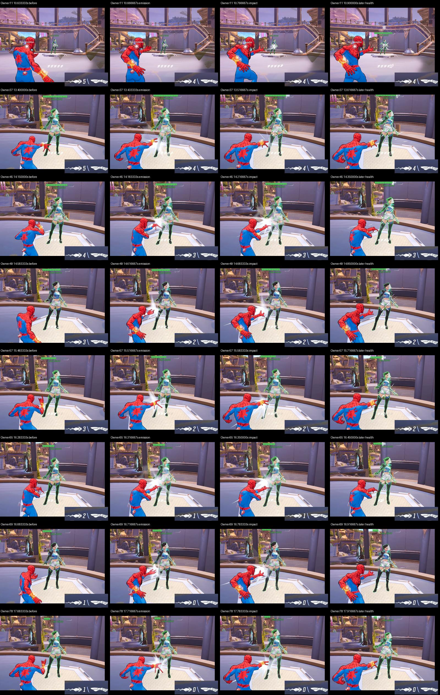

# Eight learned web hits in a completed range diagnostic

**Eight distinct Web-Cluster casts hit Luna during the completed ten-second learned phase. Luna survived with a small health-bar remainder.** Ten Controller requests were accepted and twenty LT calls returned, but two owners produced no separate visible emission or ammo decrement. The visible count is eight, and the cause of those two missing casts remains unknown.

[Watch the 17-second excerpt, original seconds 8–25](https://uploads.linear.app/75f1d1f0-542b-4095-9967-fd7b27093472/913b2efd-3578-4cf5-86de-d2298275380c/befaea65-04bc-4b8a-adbb-7ce7aa38833a). The first cast is around 2.65 seconds into the excerpt; the remaining casts are between 5.4 and 9.72 seconds. The clip retains approach, the sequence and shutdown from one attempt.

## What ran

The unchanged human request checkpoint `6ee38807`, confidence 0.7 and 24/24 Torch threads ran once on independently reviewed code `676f99a`. Fresh normal-resource/PAD/Luna setup and a distinct, consumed binding are retained in `preflight/`. Target selection, aim, approach and pulse mechanics remain scripted; the model decides fresh web requests. One source request and four negative examples do not establish policy quality or generalization.

The new `request-start-owned-pulse-v1` interpretation separates the original start deadline D from the owned pulse end E. Controller acceptance A fixes E=A+33 ms, capped by phase/session. The first input call must commit before D, E and the original ammo freshness limit. Only the same owner can continue until E, with loss/refusal cancellation unchanged. Delays never renew A or E. This explicitly changes held-input authority; it is not a claim that the historical 100 ms hold-completion rule stayed unchanged. [Software acceptance](../range-owned-pulse-software-20260922/README.md) retains the reviewed boundary and synthetic joins.

## Measured outcome

- 95 complete decisions: 48 start, 24 no-new-start and 23 refusals (20 warmup, two low confidence, one target unobserved). Zero invalid-history refusals.
- 100 phase slots: 95 offered, five retired for late acquisition. No catch-up or retimed observation.
- Ten unique Controller acceptances; twenty returned LT calls, two per owner. No failed sends or unexpected logged offensive buttons.
- Eight independently inspected emissions and impacts. Owners 41 and 61 have returned calls but no distinct visible cast in their corresponding windows. Ammo recharges during the run, so initial/final ammo subtraction cannot count casts.
- Normal `max_time` at observed phase age 10.0035277 seconds. The last normal send returned before the phase cap; the terminal neutral API call returned about 21.97 ms after that cap. Physical release and pulse duration are not established by these return times.

Owners 57 and 78 actually continued after D under the same immutable E. Every first LT call returned before its start limit, and every continuation returned before its fixed end. This exercises the adopted interpretation; it does not attribute the difference from earlier runs solely to that change.

[The verbatim independent report](native-audit/independent-audit.md) retains original-video brackets, health/ammo observations, receipt joins and all twenty deployed file checks. Native review used dense event windows and sampled surrounding context. No KO or additional offense was observed in that bounded phase context. The selector remains generic, not a code-enforced Luna-name lock. Approximate moving-frame alignment retains capture/render uncertainty.

## Timing and remaining work

[The recorded stage comparison](stages/README.md) gives acquisition-to-consumption median/p95 69.475/84.287 ms, previously 71.261/88.403 ms. HUD/coasting median is 20.012 ms; pre-offer processing remains 22.527 ms. Different scenes, the HUD filter change, proposal mix and execution interpretation prevent a causal performance claim. The model and thread settings stayed unchanged.

All 24 no-new proposals had positive fresh ammo, alongside starts at the same ammo counts. That is actual observed dispatch support, not independently labelled timing accuracy. Fresh starts were also refused for shot spacing, empty ammo and unstable target.

Root accepts this exploratory result and its source accounting. The next experiment is one fresh 20-second phase with the same model and reviewed code, using a new setup and binding, to test a complete kill. The existing twenty-second caller cap supports that duration. This run does not count toward the designated-Galacta eight-of-ten benchmark; matched scripted trials and James's independent validation remain open.

## Retained evidence

[artifact-receipt.json](artifact-receipt.json) pins byte-identical copies of original logs, setup/deployment receipts, the stage report and selected independent audit artifacts. Independent report SHA-256: `8e45aa401ee458988cb2e1e76e14d77c76888452aa8228724ac7b1b29c01819c`.

The original 60-second, 3579-frame video stays at `data/runtime/range-request-owned-pulse-preflight-20260922/learned-native.mp4`, SHA-256 `9c8bf6f71063612511d2ede3d5e034e2a3e5a9b59f7ff9491a7c9f6639360820`. The export has its own upload/hash receipt. Neither video is copied into Git. Earlier attempts and consumed bindings remain unchanged.

Archived launchers are historical evidence and refuse repeat use of the consumed run. A new native experiment needs its own fresh setup and genuine scoped binding; do not rerun an archived launcher. The stdlib stage analyzer can be reproduced in a clean copy at its original repository-relative path with the pinned finalized inputs.
