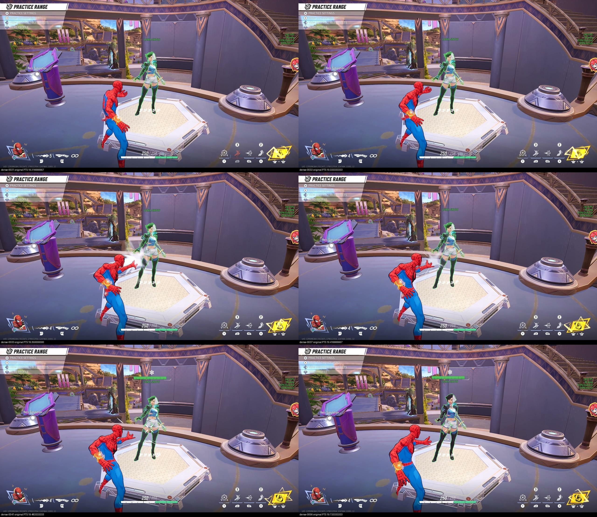

# First human-trained request policy in the range

September 22, 2026. **The model requested one delivered Web-Cluster pulse that
visibly hit Luna Snow.** Ammo decreased from 5 to 4, followed by a hit reaction,
web marker and depleted health segment. Luna stayed alive. The learned phase
lasted 8.615 seconds and stopped when a later request expired during the input
guard's proof check. Both terminal release calls returned.

This is one exploratory learned request-to-hit demonstration. Target selection,
aim, approach and pulse execution remained scripted. It establishes no KO,
independent-session quality, professional-level play or passing trial benchmark.
The ten scheduled designated-Galacta trials and matched scripted comparison remain
open. No parameter tuning or second attempt was used to select this result.

## What actually ran

Reviewed code `a43911acc96546f2bb7a2f28aac60072ceff73a5` ran from the clean
Windows live worktree. The original request checkpoint
`6ee388070599e3df042ea73876e391340bf228a9e626cc212c60875d8191aeef`, trained on
the [five admitted labels](../range-request-human-fit-20260922/README.md), loaded
with its original source identity, a separately reviewed runtime identity and
the genuine one-run deployment binding. Confidence remained 0.7.

Fresh practice settings showed No Ability Cooldown off; native PAD layout showed
LT web ammo and RT melee. The setup used Luna Hero Simulation, with a generic
continuous selector rather than named-target recognition. The caller required
the actual game foreground PID and range proof, at most 14 seconds of camera
startup and 10 seconds of learned play within one 24-second authorization budget.
That budget is the software proof/deadline boundary, not a guarantee of exact
physical device timing. There was no scoreboard or keepalive during learned play.

The [independent audit](native-audit/independent-audit.md) verified the actual
source/runtime/deployment objects against their originals and actual deployed
code against accepted manifests, including documented CRLF normalization.
[Launch](preflight/launch.ps1), [binding](preflight/deployment-binding.json),
[consumption record](preflight/binding-consumed.json) and [actual metadata](run/meta.json)
preserve the one-run scope. This consumed binding does not authorize another run.

## Counts, including the failure

| Evidence | Count |
| --- | ---: |
| Metadata decisions | 84 |
| Fully persisted decision traces | 83 |
| Persisted start / no-new-start proposals | 15 / 29 |
| Persisted refusals | 39 |
| Controller-owned requests, including terminal ownership | 2: IDs 75 and 84 |
| Returned LT-down calls | 2, both for the same ID 75 pulse |
| Failed guarded sends | 1: ID 84 |
| Independently observed casts / hits / KOs | 1 / 1 / 0 |

ID 84's normal decision and first Controller step were not persisted: send
failure precedes the normal row write. Its terminal pulse ownership proves an
additional accepted request, but its absent probability/State/resource object
must not be reconstructed as recorded evidence. The two cleanup rows reference
the same failed send. This is a concrete logging defect, retained in the original
[frames.jsonl](run/frames.jsonl), with a separate repair underway.

ID 75's first LT call entered with 1.2061 ms remaining for full-press admission;
the API returned only 0.0144 ms before that deadline. ID 84 entered with 0.812 ms
remaining, and its proof crossed the deadline by 0.5261 ms before failed return.
Its error is `guarded input deadline expired after proof; input released`.
The final release returned at loop time 15.1388397, before the overall deadline
23.4764374. Metadata says `range_lost`; the actual recorded cause was request-send
expiry, not demonstrated focus loss or range-HUD disappearance.

## Timing and next work

The [read-only timing diagnosis](timing/README.md) reconstructs all 83 persisted
history outcomes using real State, selector and window code without model
inference. Six invalid histories arose from cumulative sample-time drift; a
separate adjacent gap explains another reset. These account for all 31 warmups.
Ten fully logged starts lacked enough remaining authority for the 33 ms pulse.

The next changes address failed-send trace retention and decision scheduling /
measured stage costs. The 25 ms observation tolerance, 100 ms authorization,
33 ms pulse and confidence threshold remain unchanged. A naive phase timer still
fails four measured clock windows, so it is not claimed as a complete repair.
No more footage or staged Idle examples are needed for these software fixes.

## Video and artifact preservation

Original: `data/runtime/range-request-preflight-20260922/learned-native.mp4`,
2560×1440, 60 seconds, 3573 encoded frames. SHA-256:
`05545fd867cf8947b427dfafed8ab5455a020e37a6a7091b13649c30fc9ce960`.
The shareable 13-second excerpt takes original PTS 10 through 23, retaining
approach, cast and shutdown without retiming; the full original stays local.

[Watch the excerpt](https://uploads.linear.app/75f1d1f0-542b-4095-9967-fd7b27093472/6fe977e9-60f2-445b-9efb-823046bf56de/02ebccd6-50fe-4fb0-b2ae-24b7254c4c29) (also embedded on VUH-1346).

The audit inspected 142 native frames at PTS 18.8–21.183333 plus bounded coarse
samples. Emission is bracketed by original PTS (19.333333, 19.350000]; the hit and
health change are clear by 19.483333. Eleven saved-frame matches give empirical
video-minus-observation offsets of 4.961786–4.985566 seconds, with adjacent-frame
ambiguity. This is not an exact render clock or physical latency calibration.

[artifact-receipt.json](artifact-receipt.json) records 47 byte-identical source
copies and the retained model/video originals. [Log accounting](preflight/log-accounting.json)
checks actual receipt equality and distinct counts; [its script](summarize_run.py)
reads only finalized JSON and checkpoint bytes for hashing, without inference.
Selected native sheets, correspondence and the independent report are preserved
verbatim. The archive contains no admitted human training rows or model weights.
