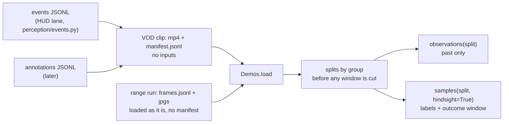

# Demonstrations: dataset format and loader (VUH-1308)

**Built and tested offline.** `agent/demos.py` is one on-disk format and one loader for three kinds of source:
expert VOD clips (no inputs), the agent's own range recordings (pad state as the input modality), and later human
annotations. It reads the design in [learning-plan.md](../learning-plan.md) and the "Direction" section of
[plan.md](../plan.md); it adds no competing schema. Stdlib only: 62 tests in `tests/test_demos.py`, plus two that read the
real `data/l1/tagrun0` and the Req sample manifest when they are on the machine. Nothing is committed.

```sh
uv run python -m agent.demos data/demos/samples data/l1/tagrun0     # one summary line per clip
uv run pytest tests/test_demos.py
```

```python
from agent.demos import Demos
demos = Demos.load("data/demos/samples", "data/l1/tagrun0")
for obs in demos.observations("train"):                 # what a policy may see: nothing after obs.t
    ...
for s in demos.samples("val", hindsight=True):          # + labels, and the outcome window after t
    ...
```

Media is never copied or re-encoded, and there is no database: a clip is one JSONL manifest beside the media where it
already lives (`data/demos/samples/<clip>.manifest.jsonl`), and the loader hands back frame references, not pixels.

## Shape of the data



One decision, on the clip's own clock (every `t` is seconds from the start of the media):

```
clip time   0 ---- 7.8 | gap | 16.7 | 18.1 ------------------------------ 43.2 | gap | 43.8 ---- 60.0
segments    [ seg 0    ]      [seg 1] [ seg 2                                  ]      [ seg 3       ]
                                      started_by=hero_returned        ended_by=scoreboard
decision                                            t=30.0
observation                               [25.0 .......... 30.0]   frames, events with t_to <= 30.0, inputs
hindsight                                                (30.0 .......... 35.0]   outcome window, still inside seg 2
```

Nothing crosses a boundary: history is clipped to the segment's start, the outcome window to its end, and a window cut by
the segment says why (`ended_by`, `truncated`). A decision needs a frame proven inside a segment that is at least
`MIN_SEGMENT_S` long (seg 1 above is not).

## The manifest

A manifest is JSONL: one `{"type": "clip", ...}` header, then zero or more `{"type": "segment", ...}` lines. Every header
key below except the last group must be present; a value that does not apply is `null`, never omitted, so absence is never
silent. Unknown extra keys are kept and ignored.

| Key | Meaning |
|---|---|
| `id` | unique clip id (`reqmr-2873352801-1920`; runs are `run:<dir name>`) |
| `kind` | `vod` \| `run` \| `human` |
| `source_url`, `vod_id`, `creator`, `retrieved` | where a VOD came from and when it was fetched (`null` for a run) |
| `run` | the recorder's run name (`null` for a VOD) |
| `source_start_s`, `source_end_s` | the clip's start and end on the source's own clock (a VOD's seconds); `source_time(t) = source_start_s + t` |
| `resolution` | `[width, height]` of the media (`null` if unknown) |
| `fps` | nominal frame rate (a video clip needs it: frame times snap to its grid) |
| `hero` | who is played |
| `overlays` | what covers the screen (list of strings; `[]` for none) |
| `split` | `train` \| `val` \| `test` \| `inspection_only` \| `null` (assign by group) |
| `media` | `{"kind": "video", "path": ...}` or `{"kind": "frames", "dir": ..., "index": "frames.jsonl"}`; paths are relative to the manifest |
| `inputs` | `"pad"` or `null`: the input modality this clip has |
| `events`, `annotations` | relative path of the companion JSONL, or `null` |
| `segments_from` | who drew the segments: `segmenter` \| `annotator` \| `assumed_whole_run` |
| `cooldowns` | the resource regime: `off` \| `normal` \| `unknown` (see "Resource regimes") |
| optional | `group` (split unit, default the VOD id or run name), `duration_s`, `alignment`, `licence`, `notes`, `decisions` (clip times to sample instead of a grid) |

**Segments** are the stretches proven usable: `start_t` (first frame proven inside), `end_t` (last frame proven inside),
`started_by`, `ended_by`. What lies between two segments is unproven, and its width is the boundary's uncertainty: an
unreadable interval is a gap, never bridged. The reasons are the HUD segmenter's (docs/lanes/l2-hud.md, "Event stream
format"), plus refinements an annotator may use:

| Ended by | Meaning |
|---|---|
| `run_end` | end of the clip or recording |
| `death` | hp reached zero |
| `killcam` | the kill cam is playing |
| `spectating` | spectating another player |
| `scoreboard` | the scoreboard overlay is open |
| `not_our_hero` | the hero played is known not to be ours (refines to `hero_swap`) |
| `no_hud` | the HUD is gone (refines to `menu`, `brb`, `unreadable_hud`) |

Started by: `run_start`, `respawn`, `killcam_over`, `spectating_over`, `scoreboard_closed`, `hero_returned`, `hud_returned`.
Any other value is refused when the manifest loads, as are overlapping or out-of-order segments and a segment that
outlives the clip.

**Slivers.** A segment shorter than `MIN_SEGMENT_S` (1.0 s) is kept in the manifest, because it is what the segmenter proved,
and events inside it still validate, but no window is ever cut from it: a few frames of play between two scoreboard openings
hold no decision worth learning from. Every decision that would have fallen in one (grid or explicit) is reported in
`demos.skipped` as `segment_too_short` (as is each short segment, at its start), `Demos.usable(clip)` lists the segments windows
may come from, and `summary` prints `(short: n)`. `Demos.load(..., min_segment_s=...)` changes the minimum. On the sample clips
the slivers run 0.0-0.8 s and the shortest real stretch is 3.3 s, so 1.0 s separates them.

## Resource regimes: `cooldowns` off | normal | unknown

The practice range's Practice Settings has **No Ability Cooldown**. ON gives infinite web ammo, an ultimate relit within seconds and
no cooldown numbers; it is a different game from normal play, and a learner or an evaluation that mixes the two learns
neither. Every clip says which it is in its `cooldowns` field (required, one of):

| Value | Meaning | Who gets it |
|---|---|---|
| `off` | No Ability Cooldown is ON: infinite ammo, ult relit in seconds, no cooldown numbers | own runs recorded before the baseline |
| `normal` | ammo depletes, cooldown numbers run, the ult charges | own runs after L4 turned the setting off; footage where cooldown numbers and ammo were seen on screen (both sample VODs: `ability_cast` with a cooldown of 8, `web_cluster_fired` 4 to 3; `cooldowns_basis` says so) |
| `unknown` | nobody saw the HUD's resources | third-party guides and any run whose recorder did not say |

A run directory has no manifest, so its regime is its `meta.json`'s `cooldowns` (the live loop writes it: `--cooldowns`, required with
`--live`), else **`unknown`**: it is never assumed from the recording's date. Runs recorded before the baseline (`data/l1/tagrun*`,
`run1`, ...) belong to other lanes and carry no such field; they load as `unknown` until their `meta.json` (`{"cooldowns": "off"}`) or a
`manifest.jsonl` in the directory says otherwise.

`observations(...)` and `samples(...)` take `cooldowns` (one regime, or several) to keep only clips of that regime, and **raise
`RegimeError` when the clips they would cut from hold more than one regime** unless `mix_regimes=True`; a split of one regime never
raises, and regimes in different splits never conflict. `Demos.regimes(split)` lists what a split holds, `summary` prints each clip's
`cooldowns=`. Pinned by `test_a_split_that_mixes_regimes_is_refused_unless_asked`, `test_a_regime_can_be_picked_and_two_of_three_is_still_a_mix`,
`test_a_run_directory_takes_its_regime_from_its_meta_json_and_is_unknown_without_one`.

## Events: consumed as the HUD lane writes them

`perception/events.py` writes one file per clip, `data/demos/events/<clip-stem>.jsonl`, with three line kinds told apart by
`type` (docs/lanes/l2-hud.md, "Event stream format"): a `meta` line, `segment` lines (`start_i`, `start_t`, `end_i`, `end_t`,
`started_by`, `ended_by`), then events, which carry no `type`: `kind`, `i_from`, `t_from`, `i_to`, `t_to`, `slot`, `amount`,
`before`, `after`, `segment`. The loader reads the events and ignores the other two kinds; `events_file_segments(path)` turns the
segment lines into manifest segments, so a clip's manifest is `write_manifest(path, header, events_file_segments(events_file))`
with `events` set to the file's path relative to the manifest (`../events/<stem>.jsonl`).

**The loader reads format 2 only** (`"format": 2` in the meta line). Format 1 (no `format`; `ability_used` / `ability_ready`, slot
`pull`, hp as a net figure) claimed casts that never happened and missed the ones that did, so a format 1 file, a file with no meta
line, or a format the loader does not know is refused with a `FormatError` naming what to regenerate; so is format 1 vocabulary
(`ability_used`, `ability_ready`, slot `pull`) inside a format 2 file. Format 2's kinds: `ability_cast` (the only kind that claims a
cast, proved by a cooldown number or a charge drop; `amount` is the cooldown it started at), `slot_unavailable` / `slot_available` (an
icon dimmed or restored: a wall climb does that, it is not a cast), `charges_spent`, `charges_regained`, `web_cluster_fired`,
`web_cluster_reloaded`, `hp_lost`, `hp_gained` (raw steps, never a net), `shield_*`, `max_hp_changed`, `ult_*`, `ko_feed`, `death`,
`respawn`; slots are `teamup`, `swing`, `get_over_here`, `uppercut`, `ult`. The loader does not check kinds against that list (the HUD lane
adds kinds without changing the format); it only refuses the removed names. Events are proposals, not ability-use truth, until the HUD
lane's hand-check says otherwise. Two things matter to the loader:

- **An event is an interval, never an instant.** `t_from` is the last frame showing the old value, `t_to` the first showing
  the new one. There is no press time, and an unreadable stretch simply widens the interval. At decision time `t` an event
  is *known* only if `t_to <= t`; one with `t_from <= t < t_to` is still pending and belongs to hindsight.
- **An event lies inside one segment.** The loader assigns it to a segment by time (the file's own `segment` index is only
  a hint, so editing segments cannot silently mis-assign events) and refuses the file if an event crosses a boundary or
  sits in a gap.

All `t_*` are clip time, seconds from the first frame of the media on an exact 10 Hz grid; `i_*` index that sampling (`t = i / 10`;
the sample clips are 60 fps sources).

## Annotations (the pilot's fields, one line each)

```json
{"type": "annotation", "t": 30.0, "by": "annotator-1", "assisted": false, "situation": "closing on a bot",
 "actions": ["engage"], "target": {"bbox": [900, 400, 940, 470], "frame_t": 30.0}, "evidence": [29.6, 30.0],
 "uncertainty": "low", "unusable": null, "outcome_review": "the attack landed"}
```

`actions` are candidate actions (several are allowed; `["none"]` is a no-engage decision), `target` is a box in the original
pixels of a stated frame, the string `"unknown"`, or `null` (not stated), and `unusable` carries the reason a window cannot
be labelled. Several annotators give several labels for one decision; `assisted` marks a model's proposal, which is not
human ground truth. `outcome_review` is a separate field: it is returned only inside hindsight and never becomes part of a
label. Two optional fields say what context the annotator judged: `context_start` (a clip time) and `masked_context` (true or
false); the loader refuses a row whose window it would not reproduce (see "Overlay gaps" below). Other keys a row carries
(`primitives`, `target_status`, `context_mask`, ...) are kept on disk and not read. Codex's annotation specification owns the
vocabulary; this is the representation it lands in.

## Range recordings load unchanged

A recorder's run directory needs no manifest: `Demos.load("data/l1/tagrun0")` synthesizes one in memory and writes nothing
(a test snapshots every byte and mtime before and after). Both recorders' `frames.jsonl` shapes load:

| Recorder | Rows | Inputs |
|---|---|---|
| L4's trials (`tagrun*`) | a row per control tick (about 30 Hz), `file` and `i` on every third | every row with a `pad`; `note` is the intent it logged |
| L1's `record.py` (`data/run1`) | a row per saved frame | the pad on each frame row; `step` becomes the note; `pad_age`, `idle_warning` are kept in `extra` |

The synthesized clip is one segment start to end (`assumed_whole_run`: the recorders refuse to send input off the range HUD),
hero `spider-man` by convention, resolution read from the first JPEG's header, fps from the median frame gap. A
`manifest.jsonl` inside a run directory replaces the synthesized one, which is how a run gets real segments or an events
file. Directories that hold only jpgs (`data/l1/run1`, `full`, `trial1`) have no index and are refused.

## Overlay gaps: soft and hard boundaries, masked frames

A gap between two segments is **soft** when a known overlay made it: `ended_by = scoreboard` followed by
`started_by = scoreboard_closed`. The player is alive and the game goes on; the HUD is hidden and the scene only some of the
time. Every other gap is **hard** (death, killcam, spectating, a hero change, a lost HUD, a reset, and any mismatched pair such
as `no_hud` then `scoreboard_closed`): nothing ever crosses it. `SOFT_GAPS` in `agent/demos.py` is the table.

`observations(...)` and `samples(...)` take `across_overlays`:

| | `False` (default) | `True` |
|---|---|---|
| history | stops at every boundary, soft included, and says so (`truncated_context`) | spans soft gaps; stops at a hard one |
| outcome | ends at every boundary | ends at the next hard boundary (`ended_by` is that boundary's) |
| frames in a soft gap | none: the window ends before it | come back **masked** |
| events | of the decision's own segment | of every segment the window reaches, still only those confirmed by `t` |

A masked frame is a `FrameRef` with `masked = Mask(reason="scoreboard", hidden=("hud",), uncertain=("scene",))`: the segmenter
proved the HUD absent, and an overlay hides the scene only sometimes. `masked=None` claims no more than that the segmenter saw
the HUD there; the scene, the player and single HUD fields can still be hidden (an annotation's own per-frame mask says
which). `Observation.masked_context` says whether any frame in the window is masked. A trainer must drop or zero the masked
modalities; the default keeps the old, stricter windows so a caller who never asks never sees an overlay frame.

**An annotation is refused, loudly, when its window is not the annotator's.** A row that declares `context_start` and/or
`masked_context` (the co-lead's rerun rows do) is checked when its sample is built, and `samples()` raises `AlignmentError`
if the loader's window starts later than the judged context (a boundary or a shorter `history_s` cut it: the annotator used
history the policy would not receive), or if `masked_context` disagrees with whether the window holds masked frames. The
message names the cause and, for a scoreboard, the fix (`across_overlays=True`). Rows that declare neither load as before.

The Codex rerun rows (`data/demos/annotations/codex-rerun/`, learning-plan "Aligned two-window rerun") on the Req clip, at
10 Hz and `history_s=5`: +30 (context 25-30, inside one segment) loads either way; +45 (context 40-45, scoreboard 43.2-43.8)
raises on the default and loads with `across_overlays=True`: 51 frames from 40.0, five masked (43.3-43.7), events from both
sides of the gap, not truncated. Not aligned yet, on purpose: the loader derives masks from the segments only. The rows'
own per-frame visibility files (`context_mask`) are not read, so the annotator's extra masks (chat over the abilities, camera
inside geometry) do not reach the window. The one frame where they differ is 43.2: the row's mask marks the scoreboard from 43.2
(six frames, 43.2-43.7), the loader's starts at 43.3 because 43.2 is the segment's last proven frame. The scoreboard is up through
frame i437 (43.7) and gone at i438, so the segment starts at 43.8; on the old `-vf fps=10` grid the boundary read 43.7, a source frame off.

## Samples, and why the future cannot leak

| Guarantee | Enforced by | Pinned by |
|---|---|---|
| An `Observation` holds nothing later than `t` | every source is cut off at `t` before it is read, and `Observation` refuses to be constructed with a later frame, event or input (`LeakageError`) | `test_an_observation_refuses_to_hold_anything_later_than_t`, `test_no_future_datum_is_reachable_from_an_observation` (rows and events carry their own time, and the whole object graph is walked) |
| No route from an observation to labels or the outcome | `Observation` has no such field and no reference to the clip; `observations()` never builds hindsight | `test_the_policy_facing_types_have_no_route_to_labels_or_outcomes` |
| Hindsight is opt-in | `samples(..., hindsight=True)`; the default returns `hindsight=None`, and asking for it changes nothing else | same test, `test_the_outcome_is_strictly_after_t` |
| An event still pending at `t` is not known at `t` | events filter on `t_to <= t` | `test_events_are_intervals_and_a_pending_one_is_hindsight` |
| Nothing crosses a hard boundary; a soft one (a scoreboard) only on request | history starts at the boundary before the segment, the outcome ends at the one after it, a decision needs a frame inside a usable segment | `test_nothing_crosses_a_segment_boundary`, `test_a_decision_never_snaps_to_a_frame_outside_its_segment`, `test_no_hard_boundary_is_ever_spanned_even_when_asked_to_span_overlays`, `test_spanning_a_soft_gap_never_lets_the_future_into_a_window` |
| An annotation is never attached to a window it was not made over | `_aligned` raises `AlignmentError` | `test_an_annotation_over_a_scoreboard_is_refused_until_the_window_matches_what_was_judged`, `test_an_annotation_is_refused_when_the_masked_claim_or_the_history_disagrees` |
| A label is a target, not an input | recorded-input labels take pad states strictly after `t`; annotation labels are separate objects | `test_a_run_has_pad_inputs_...`, `test_annotations_carry_an_explicit_unknown...` |
| The split is named and whole recordings stay together | `samples(split)` requires the split; assignment is by group | the split tests below |

What this does not stop: code that asks for hindsight and then feeds `sample.hindsight` to a policy. The type is named for
what it is and the policy-facing path (`observations()`) has no way to reach it.

**Missing modalities are explicit, never filled.** `inputs` is `None` for a VOD (and for a run whose manifest says `null`
even though its rows carry pad states); `events` is `None` when there is no event stream, and `()` only when a stream exists
and nothing happened in the window; `labels` is `()` when a decision is unlabelled. Frames are always present.

**Splits.** `split` is assigned per *group*, never per window: a group is the VOD id by default, so cuts of one VOD stay
together; mirrors and re-uploads are given the same `group`. An explicit `split` wins and the rest of its group inherits it;
an unassigned group is hashed (`sha256(seed:group)`), so the assignment depends only on the group and the seed and does not
move when other clips are added. `SplitError` refuses a group with two explicit sides or one VOD in two groups, and
`check_splits` proves no group is on two sides. Windows are cut only after that, from the requested side.

## Trimming keeps source timestamps

`trim(rows, start_t, end_t, new_id, media_path)` returns the manifest rows for a sub-clip: times are re-based,
`source_start_s` moves forward by `start_t` so `source_time` still names the same moment of the VOD, and a segment cut at the
new edge starts as `run_start` or ends as `run_end`. Events and annotations are not rewritten here; whoever cuts the media
re-cuts them, and the loader refuses events that no longer fit the segments.

## Worked example: the Req sample clip

`data/demos/samples/reqmr-2873352801-1920.manifest.jsonl` (segments from the HUD lane's events file; header abridged):

```json
{"type": "clip", "id": "reqmr-2873352801-1920", "kind": "vod", "source_url": "https://www.twitch.tv/videos/2873352801",
 "vod_id": "2873352801", "creator": "reqmr", "retrieved": "2026-09-20", "run": null, "source_start_s": 1920, "source_end_s": 1980,
 "resolution": [1920, 1080], "fps": 60, "hero": "spider-man", "overlays": ["chat intermittently covers the rightmost abilities and the ult"],
 "split": "inspection_only", "media": {"kind": "video", "path": "reqmr-2873352801-1920.mp4"}, "inputs": null,
 "events": "../events/reqmr-2873352801-1920.jsonl", "annotations": null, "segments_from": "segmenter", "alignment": "requested",
 "licence": "unverified", "duration_s": 60.083, "decisions": [5, 15, 30, 45], "cooldowns": "normal", "cooldowns_basis": "...", "notes": "..."}
{"type": "segment", "start_t": 0.0, "end_t": 7.8, "started_by": "run_start", "ended_by": "death"}
{"type": "segment", "start_t": 16.7, "end_t": 16.7, "started_by": "spectating_over", "ended_by": "scoreboard"}
{"type": "segment", "start_t": 18.1, "end_t": 43.2, "started_by": "hero_returned", "ended_by": "scoreboard"}
{"type": "segment", "start_t": 43.8, "end_t": 60.0, "started_by": "scoreboard_closed", "ended_by": "run_end"}
```

The event lines beside it (`data/demos/events/reqmr-2873352801-1920.jsonl`, format 2, 121 events) that the decision below meets:

```json
{"kind": "ability_cast", "i_from": 299, "t_from": 29.9, "i_to": 300, "t_to": 30.0, "slot": "get_over_here", "amount": 8, "before": "off", "after": 8, "segment": 2}
{"kind": "hp_lost", "i_from": 299, "t_from": 29.9, "i_to": 306, "t_to": 30.6, "slot": null, "amount": 45, "before": 250, "after": 205, "segment": 2}
```

What the loader returns for the decision at clip time 30.0 (`samples("inspection_only", hindsight=True)`):

```
observation  clip reqmr-2873352801-1920, segment 2, t 30.0, context_start 25.0, truncated_context False
             26 frames: video refs (path + clip time, no pixels) every 0.2 s from t=25.0 to t=30.0, the last at 30.0
             events web_cluster_fired [25.0, 25.2], web_cluster_reloaded [25.4, 25.6], web_cluster_reloaded [27.4, 27.6],
                    web_cluster_fired [28.8, 29.1], ability_cast get_over_here 8 [29.9, 30.0], web_cluster_fired [29.8, 30.0]
                    (the hp_lost [29.9, 30.6] is pending at 30.0: its confirming frame is after the decision)
             inputs None (a VOD)
labels       ()          (nothing annotated)
outcome      t_end 35.0, 25 frames, 11 events: hp_lost [29.9, 30.6] 250 to 205, ability_cast swing 1 [30.8, 30.9], charges_spent swing
             [30.7, 31.0], web_cluster_reloaded [30.8, 31.0], web_cluster_fired [31.1, 32.1], web_cluster_reloaded [32.8, 33.1],
             slot_unavailable swing [34.0, 34.1], web_cluster_fired [33.8, 34.1], slot_available swing [34.1, 34.4],
             charges_regained swing [31.2, 35.0], web_cluster_reloaded [34.8, 35.0]
             ended_by None, truncated False
source_time(30.0) = 1950.0
```

The pilot's decisions are `[5, 15, 30, 45]`. `samples("inspection_only", decisions="manifest")` yields 5, 30 and 45 and skips
15: it lies in the gap (7.8, 16.7), where the portrait check says the hero is not ours. That is the deliberate spectator
negative. The skip is reported in `demos.skipped` as `(clip, 15.0, "outside_segments")`, and an annotation saying why
(`unusable: "spectating another hero"`) is kept on the clip. The 0.0 s segment at 16.7 s is reported as
`(clip, 16.7, "segment_too_short")` and yields nothing.

## What the real data showed

- **Req.** Four segments, 49.1 s usable in three of them, 248 decision times at 5 Hz, 121 events. One segment is a 0.0 s sliver
  (16.7 s, between the spectator stretch and the return). +15 s is outside every segment; +5, +30 and +45 s are inside.
- **Day** (`daymr-2879354299-21600-60s`). Nine segments, 87 events. Four are shorter than 1.0 s (0.5, 0.7, 0.8 and 0.1 s: two of
  them a few frames of play between consecutive scoreboard openings) and are dropped from windows, leaving 45.3 s usable in five
  segments and 229 decision times. The breaks are named: `scoreboard` ends six segments, `death`, `killcam` and `run_end` one each.
- **Both VODs are `cooldowns: normal`:** cooldown numbers (`ability_cast` with an amount of 8) and ammo depletion (`web_cluster_fired`
  4 to 3, reloads) are in the events, so neither is a No Ability Cooldown recording.
- **The clips are variable frame rate.** Req has 4082 frames counted in 60.08 s while ffprobe reports 60/1; sampling at 10 fps
  aligns to the source only to about one source frame (16-50 ms). Manifests carry `alignment: "requested"`: the requested
  start is not frame-verified, and a video frame reference is a time on the nominal grid, to be decoded by timestamp.
- **`tagrun0`.** 2070 rows, 609 with frames, 70.0 s, native 2560x1440, 9.21 fps, pad at about 30 Hz, notes Search / stand /
  Engage / Combo. It loads as one segment and yields 349 decision times at 5 Hz. All five real clips (three runs, two VODs)
  load in 0.05 s and iterate 1,320 samples with hindsight in 0.09 s.
- **Two recorders, two row shapes** (above), and three run directories that are jpgs only.

## Decisions and what was not built

- **Segments are the proven-usable intervals, not a partition.** The HUD segmenter records the last frame proven inside
  and the first frame proven inside the next; the frames between are unproven. Keeping that gap, rather than inventing a
  boundary time, is what "never bridge an unreadable interval" means in a file format.
- **A sliver is kept and never sampled.** Dropping short segments from the manifest would lose what was proven and make an
  event inside one look like an event in a gap; flagging them and skipping their windows keeps both true. The minimum is a
  named constant with a parameter, not a number buried in a loop.
- **Events belong to segments by time.** The alternative (trusting the file's segment index) breaks silently the first time
  a person edits a segment.
- **No decoder, no pixels.** A frame is a reference (a jpg path, or a time in a video). Decoding, resizing, masking
  overlays and the class balance the plan asks for belong to the training side; this keeps the loader standard-library only.
- **Run manifests are not written to disk.** The recordings belong to other lanes and are still being appended to; a
  manifest inside a run directory is opt-in.
- **`hero: spider-man` for runs is a convention, not a measurement.** The range recorders switch to Spider-Man first and
  refuse to act off the range HUD.
- **The spectator negative is a skipped decision, not a sample.** If annotators need the preceding context of a negative
  presented, an `unusable_context()` view can be added; today its annotation is kept and reported.
- **Not built:** reading the annotators' per-frame visibility files into a window's masks, video decoding, an annotation tool,
  event and annotation re-cutting on `trim`, verification of `alignment`,
  any training or sampling-weight code.

Mutation checks: 49 hand-made breakages of `agent/demos.py` (a guard removed, a pending event counted as known, history or
outcome crossing a boundary, a filled-in missing modality, a split per clip instead of per group, a lost source clock, an
outcome review folded into a label, ...) (and, for slivers, the minimum ignored on the grid, ignored for explicit decisions, off by one at the boundary, and unreported;
for overlays, every gap soft, no gap soft, frames unmasked, a window stopping short of its stretch, the outcome's `ended_by` taken from
the wrong segment, and each alignment check removed; for regimes, the gate removed, inverted or bypassed for samples, the filter ignored
or inverted, the value unvalidated or not required, a run directory assuming `off`)
each fail at least one test; two escaped at first and now have tests.
