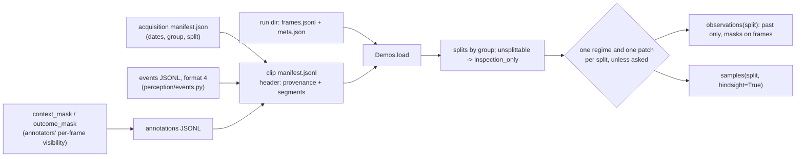

# Demonstrations: dataset format and loader (VUH-1308, VUH-1326, VUH-1324)

`agent/demos.py` is one on-disk format and one loader for three kinds of source: expert VOD clips (no inputs), the agent's
own range recordings (pad state as the input modality), and human annotations. It reads the HUD lane's **format 4** event
files, joins play across short scoreboard taps with the hidden frames masked, carries annotators' per-frame masks into the
window, and holds each source's provenance (cooldown regime, patch, splittable, edited upload, group) with one authority.
What it cannot trust it refuses, loudly. Stdlib only. Nothing under `data/` is committed.

```sh
uv run python -m agent.demos data/demos/vods data/demos/youtube/reqmr     # one line per clip, then usable minutes per patch
uv run --group perception pytest tests/test_demos.py
```

```python
from agent.demos import Demos
demos = Demos.load("data/demos", "data/l1/<run>")
for obs in demos.observations("train", patch="Season 10, Version 20260911"):   # what a policy may see: nothing after obs.t
    ...
for s in demos.samples("val", hindsight=True):                                  # + labels, and the outcome window after t
    ...
split = Demos.load_split("s10-normal-v0")                                       # data/demos/splits/<name>.json
```

Media is never copied or re-encoded, and there is no database: a clip is one JSONL manifest beside its media
(`<clip>.manifest.jsonl`), and the loader hands back frame references, not pixels.

## Shape of the data



One decision, on the clip's own clock (every `t` is seconds from the first decoded frame of the media):

```
clip time   0 ------- 5.5 |tap| 6.1 --------------------------- 37.6 | death ... | 45.2 ------
segments    [ seg 0       ]      [ seg 1                          ]              [ seg 2
                   ended_by=scoreboard, 0.6 s wide: under MAX_BRIDGE_S, so bridged
decision                              t=8.1
observation        [3.1 ....... masked 5.7, 5.9 ....... 8.1]      frames; events with t_to <= 8.1 from seg 0 and seg 1
hindsight                                   (8.1 ........ 13.1]   outcome window, up to the next HARD boundary
```

## The manifest

A manifest is JSONL: one `{"type": "clip", ...}` header, then `{"type": "segment", ...}` lines. Every header key below except
the optional group must be present; a value that does not apply is `null`, never omitted. Unknown extra keys are kept and
ignored (`cooldowns_basis`, `patch_basis`, `pts_origin_s`, `notes` carry the human-readable evidence).

| Key | Meaning |
|---|---|
| `id` | unique clip id (`reqmr-2871472478-5400-900s`, `Cf_2goe1snQ`; runs are `run:<dir name>`) |
| `kind` | `vod` \| `run` \| `human` |
| `source_url`, `vod_id`, `creator`, `retrieved` | where a VOD came from and when it was fetched (`null` for a run) |
| `run` | the recorder's run name (`null` for a VOD) |
| `source_start_s`, `source_end_s` | the clip's start and end on the source's own clock; `source_time(t) = source_start_s + t` |
| `resolution`, `fps` | `[width, height]` of the media; nominal frame rate (a video clip needs it: frame times snap to its grid) |
| `hero`, `overlays` | who is played; what covers the screen (list of strings) |
| `split` | `train` \| `val` \| `test` \| `inspection_only` \| `null` (assign by group) |
| `media` | `{"kind": "video", "path": ...}` or `{"kind": "frames", "dir": ..., "index": "frames.jsonl"}`, relative to the manifest |
| `inputs` | `"pad"` or `null` |
| `events`, `annotations` | relative path of the companion JSONL, or `null` |
| `segments_from` | `segmenter` \| `annotator` \| `assumed_whole_run` |
| **`cooldowns`**, **`cooldowns_from`** | the resource regime (`off` \| `normal` \| `unknown`) and how it was determined |
| **`patch`**, **`patch_from`** | the game patch (`"Season 10, Version 20260911"`, or `"unknown"`) and how it was determined |
| **`splittable`** | `false` until the source is shown independent of every other (a cross-source duplicate check): never trained or scored on |
| **`edited_upload`** | an edited upload: editorial cuts, black openings, outros |
| optional | `group` (split unit, default the VOD id or run name), `duration_s`, `alignment`, `licence`, `notes`, `decisions` |

**Segments** are the stretches proven usable: `start_t` (first frame proven inside), `end_t` (last frame proven inside),
`started_by`, `ended_by`, in the HUD segmenter's vocabulary (docs/lanes/l2-hud.md, "Event stream format") plus refinements
an annotator may use:

| Ended by | Meaning | Started by |
|---|---|---|
| `run_end` | end of the clip or recording | `run_start` |
| `death`, `killcam`, `spectating` | hp reached zero, the kill cam, spectating another player | `respawn`, `killcam_over`, `spectating_over` |
| `scoreboard` | the scoreboard overlay is open | `scoreboard_closed` |
| `not_our_hero` (refines to `hero_swap`) | the hero played is known not to be ours | `hero_returned` |
| `no_hud` (refines to `menu`, `brb`, `unreadable_hud`) | the HUD is gone | `hud_returned` |
| `hard_cut` | an editorial cut in an edited upload | `after_cut` |

Any other value is refused when the manifest loads, as are overlapping or out-of-order segments and a segment that outlives
the clip. The refinements are an annotator's only change to the segmenter's segments. They are allowed only in a manifest with
`segments_from: annotator`, only as the refinement of the reason the events file gives, and with times and `started_by` left as
the segmenter's (`REFINES` in `agent/demos.py`). A segment shorter than `MIN_SEGMENT_S` (1.0 s) is kept (it is what the segmenter proved; its events still validate)
but no decision is cut from it; the skip is reported in `demos.skipped` as `segment_too_short`, and `summary` prints `(short: n)`.

## Provenance: one authority, fail loud

The clip's own manifest, or a run directory's own `meta.json`, is the **single authority** for its regime and patch.

| Field | Values | `*_from`: how it was determined |
|---|---|---|
| `cooldowns` | `off` \| `normal` \| `unknown` | `run_metadata` \| `observed_cooldowns` \| `broadcast_date` \| `upload_date` \| `none` |
| `patch` | a season/version string \| `unknown` | the same list |

- A known value needs a basis and `unknown` has none (`ProvenanceError` otherwise).
- `cooldowns_from: observed_cooldowns` is checked against the events file: its meta line's `observed` must show running
  countdowns, and they prove `normal` only. A claim of `off` from countdowns, or of anything with no countdowns seen, is refused.
- **A run directory** takes `cooldowns` and `patch` from its `meta.json` (`run_metadata`), else `unknown` / `none`: never from a
  table keyed by the run's name, never from its date. A `manifest.jsonl` inside the run directory that disagrees with its
  `meta.json` on either is a `ProvenanceError`, not a preference. The live loop writes its gap manifest from
  `clip_from_run(...).header`, so the two agree by construction.
- **Splits never mix.** `observations()` / `samples()` raise `RegimeError` when the clips they would cut from hold more than one
  regime or more than one patch. Pick with `cooldowns=` / `patch=` (one value or several), or pass `mix_regimes=True` /
  `mix_patches=True` to mix on purpose. `Demos.regimes(split)` and `Demos.patches(split)` list what a split holds.
- **Unsplittable means never trained or scored on.** A clip with `splittable: false` may only be `inspection_only` (an explicit
  `train`/`val`/`test` is refused), and a group holding one goes to `inspection_only` whole, so a training iterator
  (`train`, `val`, `test`) can never yield it. Neither can it yield an `inspection_only` clip: a clip is on exactly one side.

Patch by date follows `docs/spiderman-kit.md`, the one place the current patch is stated ("Patch reflected: Season 10, Version
20260911 ... live 2026-09-11"): a source broadcast on or after the live date is that patch, an earlier one is `unknown` (the kit
enumerates no older patch). A Twitch VOD's broadcast date is its recording date. **An upload date only bounds the recording
from above**, so `upload_date` is a weaker basis; the observed fingerprint agrees on every 900 s source here: uppercut's
countdown mode is 1 s on the Season 10 sources (the four broadcasts, 2026-09-11 to 09-20, and the 9/11 and 9/12 uploads) and 2 s
on all four April-May uploads (Season 10 cut Amazing Combo 2 -> 1 s).

### What rivals-policy's corpus code must read

`policy/corpus.py` decides regime from the `RUNS` name-keyed table and assumes `normal` for every VOD (VUH-1326 finding 6). It
must read these instead, and nothing else:

| Need | Read | Never |
|---|---|---|
| regime | `clip.cooldowns` (with `clip.header["cooldowns_from"]`) | `corpus.RUNS`, a VOD's kind |
| patch | `clip.patch` (with `clip.header["patch_from"]`) | a date recomputed outside the manifest |
| may enter train/val/test | `demos.splits[clip.id] in ("train", "val", "test")` (implies `clip.splittable`) | `windows()` over every split |
| edited upload | `clip.edited_upload` | the source's directory |
| split unit | `clip.group` | the upload or VOD id alone |
| windows | `demos.observations(split, cooldowns=..., patch=...)` | its own boundary or mask logic |

where `demos = Demos.load(...)` and `clip = demos.clips[id]`. Leaving `mix_regimes` / `mix_patches` at `False` is what keeps a
training set to one regime and one patch.

## Events: format 4, as the HUD lane writes it

`perception/events.py` writes one file per clip (`data/demos/events/<stem>.jsonl`, `sections/`, `youtube/`): a `meta` line,
`segment` lines, then events without a `type` (`kind`, `i_from`, `t_from`, `i_to`, `t_to`, `slot`, `slot_pos`, `amount`,
`before`, `after`, `segment`). `events_file_segments(path)` turns the segment lines into manifest segments.

**The loader reads format 4 only, and only from the current writer.** Any other `format` (a file with no meta line is format 1)
is a `FormatError` that names the file and both versions. A format 4 file must also pass **the producer's own staleness verdict**
(`perception.events.check`):

- a non-empty `recipe`;
- every key of the producer's `REQUIRED_META`;
- a `writer` equal to the fingerprint of the producer's `WRITER_FILES` (SHA-256 over `perception/events.py`, `hud.py`,
  `scoreboard.py`).

A stale file is refused by name with the producer's reason and `regenerate it with python -m perception.events regen`.
`producer_rule()` reads those constants from `perception/events.py` with `ast.literal_eval`, without importing it (it imports
numpy), so there is no second list to drift. `test_the_loaders_stale_rule_is_the_producers` (perception group) checks that the
two verdicts agree on every real file. Editing any writer file makes every events file stale until it is regenerated. That is
the producer's contract, and the loader holds to it.

The loader's own keys are `fps`, `layout`, `t_origin`, `slot_mapping` and `slot_mapping_from`. `slot_mapping` may be `null`,
meaning no mapping was attempted, which differs from `{}`: icons read and none identified. The loader keeps the meta line as
`clip.events_meta` (`slot_mapping`, `observed` cooldowns and charge counts, `cuts`, `cut_times`, `pts_origin_s`, `fps`, `layout`,
`t_origin`, `recipe`, `writer`). Format 1 vocabulary (`ability_used`, `ability_ready`, slot `pull`) inside a file is refused.

- **An ability is named only from its icon.** `slot` must equal `slot_mapping[slot_pos]`; a position the mapping does not
  identify, or a file with no mapping, has `slot: null`, and a named slot there is refused as a guess (VUH-1326 finding 7).
  The ult's position is fixed by the layout and is always `ult`. `Event.slot` stays `None` all the way into a window;
  `Event.slot_pos` names the position, never the ability.
- **An event is an interval, never an instant.** At decision time `t` an event is known only if `t_to <= t`; one still
  pending is hindsight.
- **An event lies inside one segment.** The loader assigns it by time (the file's `segment` index is only a hint) and refuses
  one that crosses a boundary or sits in a gap.
- **A manifest's segments are its events file's.** A manifest's segment lines must be identical to its events file's, or
  loading raises `ProvenanceError` naming the first difference. The one exception is an annotator's refinement of an
  `ended_by` (above). A manifest written before its events file was regenerated can hold a superset of today's segments. The
  every-event-inside-a-segment check never notices that; this comparison does. There is no carve-out: the producer writes one
  segment line per segment, so an events file with none says the clip has none, and a manifest with segments over it is
  refused. The fix is always `write_manifest(path, header, events_file_segments(events))`.
- **No HUD feature is read off a masked frame.** An event whose `t_from` or `t_to` frame an annotator masked for the HUD or
  for the event's own field (`hp`, `ammo`, the slot) does not enter the window.

## Annotations and their per-frame masks

```json
{"type": "annotation", "t": 30.0, "by": "annotator-1", "assisted": false, "situation": "closing on a bot",
 "actions": ["engage"], "target": {"bbox": [900, 400, 940, 470], "frame_t": 30.0}, "evidence": [29.6, 30.0],
 "uncertainty": "low", "unusable": null, "outcome_review": "the attack landed",
 "context_start": 25.0, "masked_context": false, "context_mask": "30-context-visibility.json"}
```

`actions` are candidate actions (`["none"]` is a no-engage decision), `target` a box in the original pixels of a stated frame,
`"unknown"`, or `null`; `unusable` is the reason a window cannot be labelled; `assisted` marks a model's proposal. `outcome_review`
is returned only inside hindsight and never becomes part of a label. Other keys (`primitives`, `target_status`, ...) are kept on
disk and not read.

**`context_mask` and `outcome_mask`** name an annotator's per-frame visibility file, relative to the annotations file:
`[{"t": 40.6, "scene": "partial", "player": "unavailable", "hp": "visible", ..., "reasons": ["camera_clips_geometry"]}, ...]`.
A field that is `visible` or `partial` is not hidden; any other value (`unavailable`, `partial_chat_overlay`, anything
unrecognised) hides that modality, whichever window the frame lands in. Two annotators' masks of one frame are unioned.

**A row lands on the nearest frame, or it is an error.** Mask rows sit on the annotator's grid (10 Hz), and window frames on
whatever grid the window is built at. So a row applies to the window frame nearest it, within half the window's frame step
(`Clip.masks_near`). At `frame_hz=3` a row at 9.6 lands on the 9.667 frame instead of vanishing. A frame collecting several rows
takes their union. Some rows cannot land anywhere:

- A row inside a window's span that lands on no frame (sparse jpgs, a hole in the grid) raises `AlignmentError`.
- A row outside the clip is a `FormatError` at load.

Events are checked the same way, with half the events file's own step: no event is read off a frame whose nearest mask row hides
its field. `context_start` and `masked_context` are checked when a sample is built: `samples()` raises `AlignmentError` if the
window starts later than the judged context or disagrees about holding masked frames, so an annotator never judged history the
policy does not receive.

## Range recordings load unchanged

A recorder's run directory needs no manifest: `Demos.load("data/l1/tagrun0")` synthesizes one in memory and writes nothing
(a test snapshots every byte and mtime before and after). Both recorders' `frames.jsonl` shapes load:

| Recorder | Rows | Inputs |
|---|---|---|
| L4's trials (`tagrun*`) | a row per control tick (about 30 Hz), `file` and `i` on every third | every row with a `pad`; `note` is the intent it logged |
| L1's `record.py` (`data/run1`) | a row per saved frame | the pad on each frame row; `step` becomes the note; `pad_age`, `idle_warning` are kept in `extra` |

The synthesized clip is one segment start to end (`assumed_whole_run`: the recorders refuse to send input off the range HUD),
hero `spider-man` by convention, resolution read from the first JPEG's header, fps from the median frame gap. A
`manifest.jsonl` inside a run directory replaces the synthesized one, which is how a run gets real segments or an events
file. Directories that hold only jpgs (`data/l1/run1`, `full`, `trial1`) have no index and are refused.

## Bridging scoreboard taps: masked frames, hard boundaries

Experts tap the scoreboard mid-fight, so play comes in short segments. A gap is **soft** only when a scoreboard made it
(`ended_by = scoreboard` then `started_by = scoreboard_closed`) **and** it is no wider than `MAX_BRIDGE_S` (1.0 s;
`Demos(max_bridge_s=...)` is the knob). A window spans soft gaps by default (`across_overlays=True`): history and outcome run
to the next hard boundary, events come from every segment the window reaches, and the gap's frames stay in the window,
`masked`. **Every other gap is hard** and nothing crosses it: death, killcam, spectating, `not_our_hero`, `no_hud`,
`hard_cut`/`after_cut`, a mismatched pair, and a scoreboard tap wider than the maximum. `across_overlays=False` stops a
window at every boundary instead (and says so with `truncated_context`).

A masked frame is a `FrameRef` with `masked = Mask(reasons, hidden)`. A bridged gap gives `Mask(("scoreboard",), ("hud",
"scene"))`; an annotator's mask adds its own hidden fields and reasons (`("uppercut", "ult")` for `partial_chat_overlay`,
`("player",)` for `camera_clips_geometry`). `hidden` names what must not be learned from: `hud` (all of it), `scene`,
`player`, or one HUD field. A trainer drops or zeroes every hidden modality. `Observation.masked_context` says whether any frame
is masked; `masked=None` claims only that nothing on record hides anything there.

On the real format 4 sources, at `MAX_BRIDGE_S = 1.0`:

| Source | Scoreboard taps | Bridged | Too wide (hard) | Median segment | Median bridged stretch |
|---|---|---|---|---|---|
| reqmr-2873352801-1920 (sample, 60 s) | 1 | 1 | 0 | 16.2 s | 41.9 s |
| daymr-2879354299-21600-60s (sample, 60 s) | 6 | 6 | 0 | 11.4 s | 45.6 s |
| daymr-2877719252-1800-900s | 37 | 34 | 3 | 7.6 s | 23.5 s |
| daymr-2879354299-21660-900s | 20 | 16 | 4 | 12.6 s | 15.7 s |
| reqmr-2871472478-5400-900s | 23 | 17 | 6 | 8.6 s | 19.9 s |
| reqmr-2873352801-1980-900s | 17 | 12 | 5 | 20.8 s | 27.6 s |
| d0C8RMBnFfA (upload, 9/11) | 20 | 15 | 5 | 13.4 s | 29.7 s |
| yjc51uOjKEQ (upload, 9/12) | 18 | 16 | 2 | 18.5 s | 30.2 s |

Bridged taps are 0.4-1.0 s wide. The four April-May uploads have no scoreboard taps at all (edited out); their breaks are
cuts, deaths and spectating.

## Samples, and why the future cannot leak

| Guarantee | Enforced by | Pinned by |
|---|---|---|
| An `Observation` holds nothing later than `t` | every source is cut off at `t` before it is read, and `Observation` refuses a later frame, event or input (`LeakageError`) | `test_an_observation_refuses_to_hold_anything_later_than_t`, `test_no_future_datum_is_reachable_from_an_observation` |
| No route from an observation to labels or the outcome | `Observation` has no such field and no reference to the clip | `test_the_policy_facing_types_have_no_route_to_labels_or_outcomes` |
| Hindsight is opt-in | `samples(..., hindsight=True)` | `test_the_outcome_is_strictly_after_t` |
| An event pending at `t` is not known at `t` | events filter on `t_to <= t` | `test_events_are_intervals_and_a_pending_one_is_hindsight` |
| Nothing crosses a hard boundary, a cut included; a tap is bridged only under the maximum | `Clip.soft_gap`, `Clip.stretch` | `test_no_hard_boundary_is_ever_spanned_even_when_asked_to_span_overlays`, `test_a_window_never_crosses_a_hard_cut`, `test_a_scoreboard_tap_wider_than_the_named_maximum_is_a_hard_boundary` |
| A bridged window keeps the gap's frames masked and reads no HUD feature off a masked frame | `Demos._masked`, `Demos._readable` | `test_a_bridged_window_carries_masked_frames_and_no_hud_feature_from_them` |
| A null-slot cast stays null | `_slot_guessed` at load; `Event.slot` is never filled | `test_a_cast_at_an_unidentified_position_stays_null_through_every_window`, `test_a_guessed_ability_name_is_refused` |
| No split mixes regimes or patches unasked | `Demos._clips` | `test_a_split_that_mixes_regimes_is_refused_unless_asked`, `test_a_split_that_mixes_patches_is_refused_unless_asked` |
| Nothing unsplittable or inspection-only reaches train/val/test | `assign_splits`, `Clip._check_provenance` | `test_a_source_not_shown_independent_is_never_trained_or_scored_on` |
| A sealed side is read only on purpose | `Demos.clips_in` raises `SealedError` without `unseal=True` | `test_a_sealed_side_is_read_only_on_purpose` |
| An annotation is never attached to a window it was not made over | `_aligned` raises `AlignmentError` | `test_an_annotation_is_refused_when_the_masked_claim_or_the_history_disagrees` |
| Splits are by whole recording | assignment is by group, hashed on `sha256(seed:group)` | `test_a_recording_is_never_on_both_sides`, `test_no_clip_and_no_group_appears_on_two_sides_over_many_random_fleets` |

What this does not stop: code that asks for hindsight and feeds `sample.hindsight` to a policy, or a trainer that ignores
`FrameRef.masked`.

**Missing modalities are explicit, never filled.** `inputs` is `None` for a VOD; `events` is `None` when there is no event
stream and `()` when one exists and nothing happened in the window; `labels` is `()` when a decision is unlabelled.

## Trimming keeps source timestamps

`trim(rows, start_t, end_t, new_id, media_path)` returns the manifest rows for a sub-clip: times are re-based,
`source_start_s` moves forward by `start_t` so `source_time` still names the same moment of the VOD, and a segment cut at the
new edge starts as `run_start` or ends as `run_end`. Events and annotations are not rewritten here; whoever cuts the media
re-cuts them, and the loader refuses events that no longer fit the segments.

## Worked example: a bridged window on a retained section

`data/demos/vods/reqmr-2871472478-5400-900s.manifest.jsonl` (header abridged; segments from the format 4 events file):

```json
{"type": "clip", "id": "reqmr-2871472478-5400-900s", "kind": "vod", "vod_id": "2871472478", "creator": "reqmr",
 "source_start_s": 5400, "fps": 60.0, "split": "inspection_only", "group": "twitch:2871472478",
 "events": "../events/sections/reqmr-2871472478-5400-900s.jsonl", "cooldowns": "normal", "cooldowns_from": "observed_cooldowns",
 "patch": "Season 10, Version 20260911", "patch_from": "broadcast_date", "splittable": true, "edited_upload": false}
{"type": "segment", "start_t": 0.0, "end_t": 5.5, "started_by": "run_start", "ended_by": "scoreboard"}
{"type": "segment", "start_t": 6.1, "end_t": 37.6, "started_by": "scoreboard_closed", "ended_by": "scoreboard"}
```

What the loader returns at clip time 8.1 (`samples("inspection_only", hindsight=True, hz=10)`, 5 Hz frames, 5 s history):

```
observation  segment 1, t 8.1, context_start 3.1, truncated_context False, masked_context True
             26 frames 3.1 .. 8.1; 5.7 and 5.9 masked (reasons ("scoreboard",), hidden ("hud", "scene")): the 0.6 s tap, bridged
             events from segment 0, before the tap: slot_unavailable swing [4.8, 4.9], uppercut [4.8, 4.9], get_over_here [4.8, 5.0]
             inputs None (a VOD)
outcome      t_end 13.1, 25 frames, no events, ended_by None, truncated False
source_time(8.1) = 5408.1
```

With `across_overlays=False` the same decision's history starts at 6.1 and is truncated.

## What the real data showed

Every events file is from the frozen writer `1336262e179c` (`python -m perception.events check`: all format 4, all
regenerable), and every loader manifest's segments are identical to its events file's.
`uv run python -m agent.demos data/demos/samples data/demos/vods data/demos/youtube/reqmr`: twelve format 4 sources load in
0.08 s and yield 37,358 observations at 5 Hz in 5.1 s.

| Source | Kind | Patch (basis) | Segments (short) | Usable | Null-slot events |
|---|---|---|---|---|---|
| reqmr-2873352801-1920 | Twitch sample, 60 s | Season 10 (broadcast 2026-09-13) | 4 (1) | 49.1 s | 0 |
| daymr-2879354299-21600-60s | Twitch sample, 60 s | Season 10 (broadcast 2026-09-20) | 9 (4) | 44.3 s | 0 |
| daymr-2877719252-1800-900s | Twitch section, cuts 7 | Season 10 (broadcast 2026-09-18) | 69 (20) | 566.3 s | 0 |
| daymr-2879354299-21660-900s | Twitch section, cuts 17 | Season 10 (broadcast 2026-09-20) | 43 (12) | 488.4 s | 0 |
| reqmr-2871472478-5400-900s | Twitch section, cuts 4 | Season 10 (broadcast 2026-09-11) | 55 (9) | 691.9 s | 0 |
| reqmr-2873352801-1980-900s | Twitch section, cuts 15 | Season 10 (broadcast 2026-09-13) | 31 (7) | 545.4 s | 0 |
| d0C8RMBnFfA | edited upload, unsplittable | Season 10 (upload 2026-09-11) | 42 (9) | 629.4 s | 0 |
| yjc51uOjKEQ | edited upload, unsplittable | Season 10 (upload 2026-09-12) | 48 (9) | 777.7 s | 0 |
| ftnk5SVycXY | edited upload, unsplittable | unknown (upload 2026-05-10) | 75 (27) | 1215.6 s | 99 |
| Cf_2goe1snQ | edited upload, unsplittable | unknown (upload 2026-05-09) | 58 (13) | 1006.6 s | 118 |
| V6iaq9dP8FQ | edited upload, unsplittable | unknown (upload 2026-04-27) | 74 (15) | 764.8 s | 57 |
| G7HmV8zyEh8 | edited upload, unsplittable | unknown (upload 2026-04-25) | 44 (12) | 650.0 s | 51 |

**Usable minutes the loader reports, per patch** (all `cooldowns=normal`, all `inspection_only`): Season 10, Version 20260911:
**63.2** (six Twitch sources 39.8, two uploads 23.5); unknown: **60.6** (four April-May uploads). None is in train/val/test yet: every source's acquisition split is `inspection_only`, and the
uploads stay unsplittable until the cross-source duplicate check runs.

- The null-slot events are the April-May uploads' team-up position, whose icon the mapping did not identify: they stay
  `slot: null`. Cf_2goe1snQ's one null-slot *cast* sits in a 0.5 s sliver between `spectating_over` and `not_our_hero` with a
  cooldown of 8 (Get Over Here's, not the team-up's 15): kept, named nothing, and no window is cut from it.
- **A sample clip and its broadcast's sections are one split group** (`twitch:<vod id>`), as the acquisition manifest says;
  given two groups for one VOD the loader refuses to split at all (`SplitError: one VOD in two groups`).
- **The Req sample's scoreboard tap, two views.** The segmenter proves 43.2 as the last frame before the tap (segment ends 43.2,
  next starts 43.8); the codex rerun row's own mask marks 43.2 as scoreboard. In the bridged +45 window 43.2 carries the
  annotator's mask (scene and every HUD field hidden), 43.3-43.7 the tap's, and no event read off 43.2 enters the window.
- The guides (`events/guides/`) are format 4 but have no loader manifest: their regime is per-segment (range demonstrations
  mixed with match clips) and nobody has stated it.
- A 60 s clip is a thin fingerprint: the Req sample's uppercut countdown mode is 3, from a handful of casts.
- Loader manifests for the sections and uploads are written beside their media from the acquisition `manifest.json`
  (dates, group, split) and the events file (segments, `observed`), through `write_manifest`, which validates them by loading.

## The first dataset split: `s10-normal-v0` (proposed)

`data/demos/splits/s10-normal-v0.json`, loaded with `Demos.load_split("s10-normal-v0")`, is at `status: proposed`. A proposed
split changes no source: each source's split is its own manifest's, and the split file's sides are in `demos.proposed`. **The
train side is promoted in its sources' own manifests** (`split: train`). The lead did that on 2026-09-20 after the VUH-1326
final re-check closed with promotion YES; the pre-promotion manifests are in `data/demos/backups/vods-pre-promotion-20260920`.
So `observations("train")` yields the two train sessions. The reserved test broadcasts stay `inspection_only` and sealed, and
validation is pending. A split file names a patch, a regime, its sources and the whole session groups on each side. The loader refuses:

- a source of another patch or regime;
- a group on two sides or on none, and a side group with no source;
- a side left empty without a declaration: an empty side must be listed under `pending`, with the reason;
- an `unassigned` group (held out of every side, with the reason) that appears on a side or among the sources.

Asking a pending side for anything (`observations`, `samples`, `clips_in`, `regimes`) raises `PendingError` with the
reason, so a consumer can never read an empty validation set as a complete one. `status: accepted` sets the sides, and only
for sources whose own manifest allows it (`splittable: true`, `split` null or that side). Promotion is an edit to each source's
manifest, never to the split file.

**A sealed side is read only on purpose.** `sealed` in the split file (here `["test"]`) makes `clips_in`, `observations`,
`samples` and `regimes` raise `SealedError` for that side. They also raise it for any split still holding a source the file puts
on a sealed side: the reserved broadcasts are `inspection_only` today, so `observations("inspection_only")` raises too. The only
way in is an explicit `unseal=True`, for the final evaluation. Accepting the split later therefore cannot make the test set
iterable by default. That still needs every consumer to go through these calls: `policy/train.py`'s `TRAINABLE` lists `test`.

Scope: Season 10, Version 20260911, `cooldowns: normal`. Excluded: the four April-May uploads (patch unknown), the guides (no
loader manifest), and the two 60 s samples (not requested; each belongs to a train-side group).

| Side | Session groups | Creator | Usable minutes | Windows (5 Hz) | Windows with bridged masked frames |
|---|---|---|---|---|---|
| train | `twitch:2879354299` (Day, broadcast 09-20), `twitch:2873352801` (Req, 09-13) | Day 8.1, Req 9.1 | **17.2** | 5,199 | 488 (9%) |
| val | **pending**: four new current-patch 15-minute sections from four additional distinct broadcasts, two per player, one per player preassigned to train and one to val (the co-lead is acquiring them) | | 0 | 0 | |
| test, sealed | `twitch:2877719252` (Day, 09-18), `twitch:2871472478` (Req, 09-11) | Day 9.4, Req 11.5 | **21.0** | 6,339 | 937 (15%) |
| unassigned | `youtube:d0C8RMBnFfA` (uploaded 09-11), `youtube:yjc51uOjKEQ` (09-12) | Req | (23.5) | | |

Test is the two broadcasts `data/demos/vods/manifest.json` reserves as evaluation (`reserved_evaluation_candidate_new_session`),
one per player. Train is the two pilot-session broadcasts.

**Why the September uploads are on no side, and validation is empty.** Validation selects checkpoints and hyperparameters, so
anything it shares with the sealed test leaks into every model chosen on it. The two uploads may share a match with the sealed
ReqMR broadcast (`twitch:2871472478`, 09-11). rivals-hud's pixel check shows they do not reuse the retained 15-minute sections,
but the full broadcast is not held, so the same match from another part of it cannot be ruled out. Until their source broadcast
is identified they are held out of every side, validation included (the learning-plan owner's ruling). Validation stays empty
and declared pending until the new broadcasts arrive, rather than being filled with sources that could compromise the test.

Events per type in usable segments:

| Kind | train | test |
|---|---|---|
| `ability_cast` | 246 | 302 |
| `charges_spent` / `charges_regained` | 73 / 54 | 82 / 49 |
| `slot_unavailable` / `slot_available` | 199 / 202 | 291 / 287 |
| `hp_lost` / `hp_gained` | 316 / 366 | 525 / 469 |
| `shield_gained` / `shield_decayed` / `max_hp_changed` | 2 / 3 / 6 | 10 / 4 / 16 |
| `web_cluster_fired` / `web_cluster_reloaded` | 211 / 176 | 284 / 220 |
| `ult_ready` / `ult_spent` | 8 / 8 | 15 / 17 |
| `ko_feed` | 10 | 13 |

Casts per slot: train get_over_here 80, uppercut 75, swing 49, teamup 42; test 86, 96, 62, 58. No cast in the split has a null
slot.

**What makes it lopsided:**

- **Train is smaller than the sealed test**: 17.2 against 21.0 minutes, and there is no validation yet.
- **One session carries most of a side's casts**: on test, `twitch:2871472478` has 185 of 302 (61%); on train,
  `twitch:2879354299` has 139 of 246 (57%).
- **Test has more bridged windows** (15% against 9%): its sessions tap the scoreboard more (37 and 23 taps against 20 and 17).
- **Maps are not recorded** anywhere (acquisition manifests, events, loader), so balance by map cannot be checked.
- **Ults are rare**: 8 and 17 `ult_spent`, too few for an ult-use metric.

`status: accepted` waits on:

- validation, filled from the four new broadcasts;
- the test side's promotion, which comes only for the final evaluation, after every consumer honours the seal;
- identifying the September uploads' source broadcast, before they can go on any side.

Event signatures cannot identify a shared match: a quick check matched a May upload against a September broadcast.

## What format 4 does not give the loader

- **A patch.** `observed` is a fingerprint, not a patch: mapping it to one needs a dated per-patch cooldown table, and the kit
  states only the current patch. Its countdown histograms also carry misreads (uppercut `120`-`188` on one DayMR section).
- **The clock offset in the window.** `pts_origin_s` is on the meta line (`clip.events_meta`), but clip time starts at the
  first decoded frame; mapping to a cache of absolute timestamps is the consumer's job (VUH-1326 finding 1).

## Decisions

- **Bridging is the default.** Play segments are short because of scoreboard taps; a window that stops at every tap loses
  most of an expert's context. The width limit and the mask keep it honest: nothing is hidden that is not marked hidden.
- **Hidden means hidden.** A bridged gap hides the HUD and the scene; an annotator's non-visible field hides that field.
  `partial` is not hidden: every gameplay frame is partially occluded by the world and the hero.
- **The manifest is the authority and says how it knows.** `*_from` makes every regime and patch claim auditable, and a
  second record that disagrees is an error. Runs keep `meta.json` as their authority because the recorder writes it.
- **Unsplittable is a split rule, not a trainer's filter.** Putting it in `assign_splits` means no iterator can yield it.
- **Segments are proven intervals, not a partition; slivers are kept and never sampled; events belong to segments by time;
  no decoder, no pixels; run manifests are opt-in.** Unchanged from the first version of this loader.
- **Not built:** video decoding, an annotation tool, event and annotation re-cutting on `trim`, verification of `alignment`,
  mapping `observed` to a patch, and sampling-weight code.

Mutation checks: 46 hand-made breakages of the format 4, bridging, mask and provenance code (a guessed slot accepted, the
fixed ult unrecognised, format 3 accepted, meta keys unchecked, the tap width ignored, a cut made soft, bridging off by
default, a gap hiding the HUD only, `partial` hiding, annotator masks dropped, events read off masked frames, the regime or
patch gate off, a basis unchecked, observed countdowns unchecked, an unsplittable clip hashed into a split or allowed an
explicit one, a run's manifest/meta.json clash ignored; for splits, a proposal that promotes, the accepted gate off, the patch
unchecked, a group on two sides, on none or with no source, the status unchecked, a pending side that answers, an empty side
not declared pending, a pending side with groups, an unassigned group on a side or among the sources; for staleness and masks,
the writer, the producer's keys or the recipe unchecked, masks looked up by exact millisecond, an unmatched or out-of-clip mask
row passed silently, events checked against masks with no tolerance; a manifest's segments not compared with its events file's; for sealing and refinements, a sealed side that answers, a sealed
source answering from another split, `unseal` ignored, sealed names unchecked, the carve-out reopened, a segmenter manifest
allowed to refine, any reason accepted as a refinement, a refinement allowed to move times) each fail at least one test.
