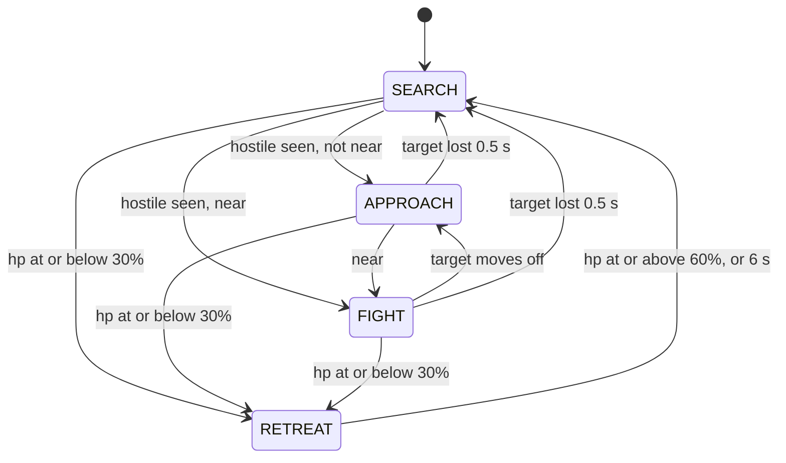

# L5 brain: decision layer (2026-09-20)

Linear: project Rivals Agent, issue VUH-1303 (non-blocking Jev).

**Built and tested offline; not yet running against the live game.** The scripted
brain, the replay tool and both Jev variants (blocking and non-blocking) exist and pass
83 tests with no network. The non-blocking variant, `decide_jev`, was measured from the
PC at 10 Hz. The brain has never seen real perception output: it needs L2's HUD reads,
L3's detections and L4's controller. The screen-read eval harness (damage, time to kill,
uptime) is not built. Numbers below are from synthetic States.

The offline half of L5 lives in `agent/`: a scripted brain that runs on recorded
`State`s, no game needed. Test with `uv run pytest`; replay a run with
`uv run python -m agent.replay run.jsonl [--hz 10] [--json]`
(`--synth` first writes a synthetic run to the given path).

| File | Holds |
|------|-------|
| `agent/state.py` | `State`, `Detection`, `Ability`; one `State` per JSONL line via `to_dict` / `from_dict`, which rejects a line without `frame` |
| `agent/intents.py` | `Idle`, `Search`, `Engage`, `SwingTo`, `Pull`, `WebStrike`, `Combo`, `Disengage` (frozen dataclasses); each names the kit primitives it plays |
| `agent/brain.py` | `decide(state, memory) -> Intent` plus `Memory`, in two halves: `gate` (retreat, playing holds, a flickering target: no choice needed) and `policy` (the scripted choice). All timing reads `state.t`, so replays are deterministic |
| `agent/jev.py` | `decide_jev(state, memory)` (`AsyncJev`, never waits) and the blocking `Jev`: `gate`, then Jev makes the choice `policy` would make, with `policy` as the fallback. Also the benchmark: `uv run python -m agent.jev [--async --hz 10]` |
| `agent/replay.py` | Decimates to the brain rate, prints the intent timeline and metrics (time per intent, switches, retreats, time to first attack, unknown-field share, max gap) |

What perception fills in (`None` means "could not read this frame", never zero or
"not ready"). `State.frame` is required, has no default, and is the (width, height) of
the frame actually processed; the builder of each `State` sets it:

- L2 HUD: `hp`, `max_hp`, `abilities[name] = Ability(ready, charges)` for `swing`
  (Web-Swing, LB), `pull` (Get Over Here!, RB: it gates both `Pull` and `WebStrike`),
  `uppercut` (Amazing Combo, X), `ult` (a missing key is unknown too), `webs`
  (Web Cluster ammo, LT), and `on_target` (crosshair over a hostile).
- L3 detector: `detections` of class `enemy`, `target` (static dummy) or `anchor`,
  bbox in pixels of `State.frame`, confidence, optional `distance` in metres.
  `detections=None` means the detector did not run; `[]` means it ran and saw
  nothing. There is no track id.
- Per enemy, `Detection.tagged`: the Spider-Tracer icon is over it. `None` means
  not read, and an icon missing from the frame is not evidence of `False`. The
  icon floats over the enemy's head, so it cannot come from a fixed HUD region.



Intent choice, nearest hostile to the crosshair (sticky while it stays visible).
Range is `Detection.distance` when present (near <= 4 m, far > 20 m; the kit's
uppercut/kick reach and pull/burst reach), else bbox height over frame height
(near >= 35%, far <= 8%).

Get Over Here! is one button whose meaning follows the Spider-Tracer: on an
**untagged** enemy it is `pull` (they come to you, aimed, 25 dmg); on a **tagged**
one it is `web_strike` (you zip to them, auto-lock, 55 dmg, tag kept). So `Pull`
and `WebStrike` are separate intents, and the brain never presses RB blind:

| Situation | Intent |
|-----------|--------|
| Retreat (preempts everything) | `Disengage` |
| Nothing in view | `Search`; `SwingTo` the nearest anchor after 3 s if swing is ready; `Idle` when the detector is down |
| Far | `SwingTo` the anchor nearest the target if swing is ready, else `Engage` |
| Near | `Engage` (melee and uppercut also consume a tag) |
| Mid, RB ready, target tagged | `WebStrike` (no aim check: it auto-locks) |
| Mid, RB ready, aimed, webs and uppercut ready | `Combo("burst")`: tags first, so the tag state does not matter |
| Mid, RB ready, aimed, target untagged, no burst | `Pull` |
| Mid, anything else (tag unknown, RB cooling or unread, unaimed) | `Engage`; its Web Cluster shots tag the enemy for the next tick |

Rules the reflex controller (L4) can rely on:

- Intents map onto the typed primitives of `docs/spiderman-kit.md`: `Pull` is
  `pull`, `WebStrike` is `web_strike`, `SwingTo` is `swing_start(anchor)` or
  `web_zip(point)`, `Engage` may play `web_cluster`, `melee_combo` and `uppercut`,
  and `Combo.name` is always one of `intents.MACROS`, today only `burst`
  (`web_cluster` -> `web_strike` -> `uppercut` -> `melee_combo` -> `web_cluster`).
- An intent carries the `Detection` seen at decision time. The controller runs
  faster than the brain and re-associates it with the nearest current detection.
- After `Combo("burst")` (3.0 s), `Pull` or `WebStrike` (0.8 s) or `SwingTo` (1.2 s)
  the brain repeats that intent instead of re-deciding, so the controller can play
  it out; only `Disengage` interrupts. A target lost for under 0.5 s keeps the
  current intent.
- Unknown fields are never read as values: unknown hp never retreats, an unknown
  ability or ammo count is never spent, an unknown tag never presses RB,
  `on_target=None` falls back to whether the crosshair is inside the bbox, and a
  retreat in progress outlasts unreadable hp until its 6 s cap. Retreat does not
  re-fire until hp has read >= 60% once, so a timed-out retreat at low hp does not
  flap straight back in.
- The 4 m and 20 m ranges and the 3 s burst window come from the kit (the window is
  a guide's claim, unmeasured). Every other threshold at the top of `brain.py` is a
  labelled guess to tune by replaying L1 footage.

## Jev

`typesafe/jev-1.13` through OpenRouter. `decide_jev(state, memory)` has `decide`'s
signature. The scripted `gate` runs first on every tick, so retreat, holds and a
flickering target never wait on the network; Jev only ever makes the choice `policy`
would make. `agent/jev.py` has two askers: `AsyncJev` (behind `decide_jev`, never waits)
and `Jev` (blocking, up to a hard deadline). Both count every failure and log per tick
which source decided.

**Request shape.** Jev is a "decisions" model. `POST /api/v1/chat/completions`
answers HTTP 400 (`typesafe/jev-1.13 is a decisions model and cannot be used with the
chat/completions endpoint. Use the /api/alpha/decisions endpoint instead.`), so
`tool_choice` and `response_format` never apply. What works is
`POST https://openrouter.ai/api/alpha/decisions` with `Authorization: Bearer <key>` and
TypeSafe's native body (their own endpoint is `POST https://api.typesafe.ai/v1/systemone`;
docs at `docs.typesafe.ai`, index at `/llms.txt`). `state` is a string or a JSON object;
each question is a `choice` over up to 255 named options:

```json
{"model": "typesafe/jev-1.13",
 "state": {"hp": "high", "web_ammo": 3, "ready": {"swing": true, "pull": true, "uppercut": true},
           "crosshair_on_hostile": true,
           "targets": [{"i": 0, "cls": "enemy", "range": "mid", "tagged": false, "under_crosshair": true}],
           "anchors": 0},
 "questions": {
  "intent": {"type": "choice", "instructions": "Which single intent should the Spider-Man fighter play next?",
             "criteria": {"engage": "Aim at the target, close in ...", "pull": "Get Over Here! on an UNTAGGED target ...",
                          "search": "...", "idle": "...", "disengage": "..."}},
  "target": {"type": "choice", "instructions": "Which target should that intent act on?",
             "criteria": {"0": "enemy, mid range, tag False"}}}}
```

Response (from a probe, id trimmed). Every option gets a probability, `choice` is the
most probable, `confidence` is higher the more peaked the distribution:

```json
{"model": "typesafe/jev-1.13-20260917",
 "answers": {
  "intent": {"type": "choice", "choice": "pull",
             "probabilities": {"engage": 0.12, "web_strike": 0, "disengage": 0, "pull": 0.82, "search": 0.04, "idle": 0, "burst": 0.01},
             "confidence": 0.78},
  "target": {"type": "choice", "choice": "0", "probabilities": {"0": 0.86, "1": 0.14}, "confidence": 0.71}},
 "usage": {"input_tokens": 555, "output_tokens": 99, "cost": 2.331e-05},
 "provider": "TypeSafe"}
```

Also true of the route: several questions share one request and one round trip;
errors are HTTP 400 with `error.message` (missing `state`, unknown model, a choice with
no criteria, an unknown question type); input is billed at $0.042 per million tokens
and output is free. `~typesafe/jev-latest` is not used: the model is pinned. TypeSafe's
jev-1.13 notes say it reads criteria literally and is weak at arithmetic, so the code
sends categories (range, hp bucket, tag) instead of raw numbers.

**How the choice is made.** The `intent` question offers only intents some visible
target can execute now (`jev.legal`: the kit preconditions `policy` also enforces; an
unknown ability or tag offers nothing). The target is the option Jev gave the most
probability among the targets that intent allows, so a pull is never aimed at a tagged
enemy however likely Jev thinks it. `intent`, `target` and `anchor` go in one request.
A timeout, HTTP error, unparseable answer or out-of-vocabulary answer runs `policy`
for that tick and is counted per reason (`timeout`, `http`, `parse`, `vocab`) in
`stats.fallbacks`.

**Non-blocking loop (`AsyncJev`).** Every tick:

1. `gate` runs. If it decides (retreat, a playing hold, a flickering target), that is
   the intent (source `gate`), and an answer that landed meanwhile is dropped as `gated`.
2. Otherwise a landed answer is adopted if it is still valid (source `jev`); if not it
   is dropped and counted, and `policy` decides (source `scripted`). `policy` also
   decides every tick while the request is in the air.
3. If nothing is in flight, the gate let a choice through and this tick started no
   hold, one new request goes out about the current State. Exactly one is in flight.
   (A request sent on a hold-starting tick would land inside the hold and be gated, so
   it is not sent.)

A landed answer is valid when it is not older than `MAX_AGE_S` (0.6 s of `state.t`, a
guess that covers the p95 round trip), the situation (search / approach / fight) is the
one it was asked in, its target re-associates to a current detection of the same class
within `MATCH_FRAC` (0.15 of the frame height, a guess), and its intent is still `legal`
for the State it lands in. It is adopted with the target as it is now, not as it was.
Drop reasons: `gated`, `stale`, `situation`, `target_gone`, `illegal`, `detector_down`.
`Stats` also holds `sources` and `trace` (`(state.t, source)` per tick, for the eval),
`chosen` (which intents Jev's adopted answers were), `age_ms` and `latency_ms`. A hung
request holds the slot until the socket cap (5 s); `policy` answers meanwhile.

**Transport.** Standard library only. One kept-alive connection; `submit(body)` runs
the request on a worker thread and returns a Future. The blocking `Jev` waits on it up
to a hard deadline (`TIMEOUT_S`, 0.2 s). A timed-out or still-running request is left to
finish: a late answer leaves a warm connection, whereas dropping the session would make
every next call pay a cold TLS handshake (about 500 ms). A new request never queues
behind one in flight, and a failed one drops the session before the next. The key is read
from `OPENROUTER_API_KEY` or the gitignored `.env` and never appears in a repr, error or
log. Host, path and scheme are hard-coded to OpenRouter.

**Measured, blocking `Jev`, 2026-09-20** (synthetic States, `uv run python -m agent.jev
-n 60 --timeout T --hz H`; round trip is answered calls only, so short budgets truncate it):

| From, budget, pacing | Fallbacks | Round trip p50 / p95 / max | `decide_jev` wall, max |
|----------------------|-----------|----------------------------|------------------------|
| Mac, 2 s, back to back, run 1 | 0 / 60 | 250 / 393 / 712 ms | 713 ms |
| Mac, 2 s, back to back, run 2 | 0 / 60 | 237 / 322 / 968 ms | 968 ms |
| **PC**, 2 s, back to back | 0 / 60 | **228 / 355 / 413 ms** | 997 ms (cold first call) |
| Mac, 400 ms, 5 Hz | 5 / 60 (8%) | 218 / 318 / 336 ms | 414 ms |
| Mac, 200 ms, 5 Hz | 46 / 60 (77%) | 174 / 200 / 200 ms | 219 ms |

- **Jev cannot meet 100-200 ms from either machine.** The fastest call was 154 ms (Mac)
  and 156 ms (PC). From the PC the share of calls answered within 150 / 200 / 250 / 300 /
  500 ms is 0% / 22% / 63% / 87% / 98%. The first call on a connection (TLS included)
  took 190-996 ms. A budget near 400 ms answers about 92%. The deadline itself holds:
  the blocking call returned within 19 ms of it in every budgeted run.
- **Agreement with the scripted brain** (blocking, fresh Memory per State): 62-65% of
  answered ticks by intent kind. On the PC run the differences were scripted `engage`
  -> Jev `burst` (13; the burst was legal, and the scripted policy always engages in melee
  range) and scripted `swing_to` -> Jev `engage` (8). The scripted brain is a heuristic, not ground truth.

**Measured, non-blocking `AsyncJev` at 10 Hz, 2026-09-20** (546 ticks, two passes of
the synthetic story in real time, one Memory throughout; `uv run python -m agent.jev
--async -n 546 --hz 10`):

| | PC | Mac |
|---|---|---|
| Ticks decided by gate / scripted / **Jev** | 431 / 89 / **26** | 431 / 88 / **27** |
| **Jev's share of all ticks** | **4.8%** | 4.9% |
| Jev's share of ticks the gate let through | 22.6% | 23.5% |
| Requests sent / answered / fallbacks | 31 / 30 / 0 | 32 / 31 / 0 |
| Answers dropped | 4 (`gated`) | 4 (2 `situation`, 2 `gated`) |
| Round trip p50 / p95 / max | 226 / 403 / 758 ms | 227 / 349 / 437 ms |
| Age of the State an adopted answer was about, p50 / p95 / max | 300 / 400 / 500 ms | 300 / 400 / 500 ms |
| `decide_jev` per-tick wall time p50 / p95 / max | 0 / 0 / 3 ms | 0 / 0 / 1 ms |
| Intents Jev chose | search 21, burst 4, engage 1 | search 21, burst 4, engage 2 |
| Ticks where Jev chose differently from the scripted policy | 4 (`engage` -> `burst`) | 5 (4 `engage` -> `burst`, 1 `web_strike` -> `engage`) |
| Cost of the run (answered calls) | $0.00057 | $0.00059 |

- **It never stalls the loop.** The worst tick took 3 ms on the PC, and no request
  failed or timed out. `policy` answered every tick Jev did not.
- **Jev's share is small and bounded.** An answer lands about 2-3 ticks after it is asked
  (median round trip 226 ms, and answers are adopted at the next tick boundary, median
  age 300 ms), so at 10 Hz Jev can decide at most about one open-gate tick in three. The
  synthetic story is hold-heavy, so the gate decides 79% of all ticks. Together: 4.8% of
  ticks.
- **Jev changed a decision on about 1% of ticks.** 21 of its 26 decisions were `search`,
  which the scripted policy also chose; the only differences were 4 ticks where it chose
  `burst` and the scripted policy `engage`. Only `pull`, `web_strike`,
  `burst` and `swing_to` carry a hold, so only those outlast their tick; an adopted
  `search`, `engage` or `idle` is overridden by the next scripted tick. If Jev is meant to
  steer, an adopted non-hold intent would have to persist beyond its tick. Not built.
- **Requests sent on hold-starting ticks are not sent.** Before that rule 20 of 44 landed
  answers on the Mac were `gated`, wasted; after it, 3 of 30.
- **Caveat:** synthetic States, not perception output, and no measure of whether a Jev
  `burst` is better than the scripted `engage`.
- **Cost:** about $0.000023 per answered call (558 input tokens). A request that is not
  answered in time still finishes and is presumably billed (not verified). All probes
  and every run so far (about 580 requests) cost roughly $0.014.

## Running things

- **Tests:** `uv run pytest` (83, no network, about 1 s). `pyproject.toml` collects only
  `test_brain*.py` and `test_jev*.py`. The perception harnesses (`tests/test_hud.py`,
  `test_replay_states.py`, `test_evalread.py`, ...) need opencv, numpy and recorded data and run
  as scripts (`uv run --no-project --with opencv-python-headless --with numpy python -m
  tests.test_hud`); a per-file exclusion list broke every time a lane added one. A stdlib-only
  pytest test from another lane has to match those patterns or be added to `python_files`.
- **Replay:** `uv run python -m agent.replay data/synthetic.jsonl --synth` writes and replays
  the synthetic story (`data/` is gitignored). `agent.jev.story_loop` repeats it end to end.
- **Every rule has a test that fails when the rule is broken.** That was checked by hand:
  copy `agent/` and `tests/` to a scratch directory, break one line, run pytest. It is not
  automated, so a rule added later needs the same check.
- **From the PC, no desktop.** The repo is not cloned there; `C:\rivals-agent\agent\` holds
  copies of `__init__`, `state`, `intents`, `brain`, `replay` and `jev` (plus L4's
  `controller.py`), and `C:\rivals-agent\.env` holds the key. Compare hashes with
  `Get-FileHash` before trusting them. Copy one file with
  `scp agent/jev.py volpe@supedupsilly:C:/rivals-agent/agent/jev.py`; run with
  `zsh ~/.claude/skills/windows-pc/pc.sh 'Set-Location C:\rivals-agent; & uv run --no-project python -m agent.jev --async -n 546 --hz 10'`.
  `uv` 0.9.26 is on the PC and finds its Python 3.11 and 3.13; the code is standard library
  only, so nothing is installed. Copy only the files you own: a whole-folder copy from the Mac
  can overwrite L4's `controller.py` on the PC. The PC runs were over SSH while other agents used
  the machine; CPU contention from a running game was not measured (the network path is the
  same either way).
- **The key** is read inside Python from `OPENROUTER_API_KEY` or `.env`; no command line,
  log, repr or error text carries it (a test pins the repr and error text, and a scan of the
  repo and scratch outputs found no copy). `.env` is gitignored.

## Facts other lanes depend on

- **Get Over Here! (RB) is one button with two meanings**, set by the Spider-Tracer on the
  target: untagged it pulls the enemy to you, tagged it zips you to them (kit, 2026-09-20,
  from the web, unverified in the live game). The brain therefore has separate `Pull` and
  `WebStrike` intents and never presses RB when the tag is unknown.
- **The controller must know** that `Engage` may play `web_cluster`, `melee_combo` and
  `uppercut` (near range is always `Engage`); that `WebStrike` needs no aim and `Pull`
  does; and the hold times in the intent list above.
- **Swing anchors reach the brain only as `Detection(cls="anchor", ...)`** in
  `State.detections`. If the controller lane's geometry does not emit them in that shape,
  the brain never issues `SwingTo`.
- **`Detection.tagged` has no producer yet.** Until an L2 `read_tagged` (or an L3 class)
  fills it, every tag is `None` and the brain only ever engages or bursts at mid range.
- **`State.frame` is required.** Every bbox is in the pixels of the frame the builder
  processed (1280x720 for L1 recordings and perception). L2's HUD row also reads a
  `tracer` slot; the brain ignores it because the kit does not say what it shows.

## Dead ends, and why they were dropped

- **`tool_choice` and `response_format` on chat/completions.** The route refuses the model
  with HTTP 400 and names `/api/alpha/decisions`. Nothing to tune there.
- **`typesafe/jev-latest`.** 404s on OpenRouter's models API, so the model is pinned to
  `typesafe/jev-1.13`. Third parties report `~typesafe/jev-latest` on the decisions route;
  not tried. TypeSafe's own `api.typesafe.ai/v1/systemone` takes the same body but needs
  their own key, which nobody has.
- **A 200 ms blocking budget.** 77% of ticks fell back at 5 Hz, because the median round trip
  is about 230 ms. A 400 ms budget answers about 92% but stalls the loop for up to 400 ms.
  Hence `AsyncJev`.
- **Dropping the connection after a timeout.** The next call then pays a cold TLS handshake
  (about 500 ms) and misses its own deadline too: 60 of 60 calls timed out until the session
  was kept and the late answer left to finish.
- **A socket timeout as the deadline.** It does not bound DNS, connect or a trickling reply,
  so calls run on a worker thread and the caller stops waiting at the deadline.
- **Sending a request on a tick that starts a hold.** 20 of 44 landed answers were dropped
  as `gated`; skipping those requests cut that to 3 of 30 and the requests by a third.
- **`tag_pull_uppercut` and `uppercut_melee` combos.** Invented before the kit doc existed:
  after a tag, RB zips instead of pulling, and the kit has one macro, `burst`. Near range
  is plain `Engage`.
- **An hp-staleness window.** Every hp-driven transition fires on the tick that carries the
  reading, so the window never changed a decision. Deleted.
- **A default frame size.** `State.frame` once defaulted to 2560x1440; a State built from a
  1280x720 frame put every box 2x off without an error.
- **A shared `docs/plan.md`.** Five agents rewriting one file lost two sections to a stale
  whole-file write. Lane status now lives in per-lane files; never write a shared file whole.
- **Not built, on purpose:** a confidence threshold (Jev returns `confidence`, p50 about
  0.89; nothing yet says where to cut), ult and team-up fields in `State`, and any provider
  interface beyond `decide_jev`.

## Open

- The screen-read eval harness (damage, time to kill, uptime). `stats.trace` and
  `stats.sources` are the per-tick source log it should read.
- A run against real perception output: everything above is on synthetic States.
- Jev decides about 5% of ticks and changed a decision on about 1%. Making it steer needs an
  adopted non-hold intent to persist beyond its tick, or shorter scripted holds. Not built.
- Host, path and scheme are hard-coded to OpenRouter; `docs/lanes/local-jev.md` lists what
  a local server would need (R5), and it is a small change (`HOST`, `PATH`, the HTTPS connection and `load_key`) once someone picks one.
- Tuning, all labelled `guess:` in code: `MAX_AGE_S`, `MATCH_FRAC`, `TIMEOUT_S`, the hold
  times, `MIN_CONF`, the range and hp thresholds. The 4 m and 20 m ranges and the 3 s burst
  window come from the kit; the window is a guide's claim.
