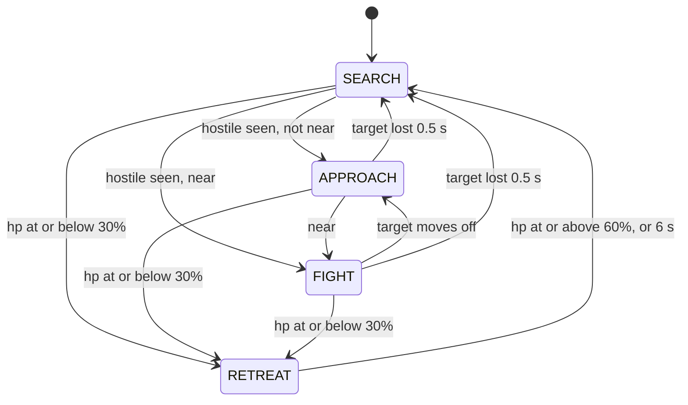

# L5 brain: decision layer (2026-09-20)

**Built and tested offline; not yet running against the live game.** The scripted
brain, the replay tool and the Jev swap exist and pass 54 tests with no network. The
brain has never seen real perception output: it needs L2's HUD reads, L3's detections
and L4's controller. The screen-read eval harness (damage, time to kill, uptime) is not
built. Numbers below are from synthetic States.

The offline half of L5 lives in `agent/`: a scripted brain that runs on recorded
`State`s, no game needed. Test with `uv run pytest`; replay a run with
`uv run python -m agent.replay run.jsonl [--hz 10] [--json]`
(`--synth` first writes a synthetic run to the given path).

| File | Holds |
|------|-------|
| `agent/state.py` | `State`, `Detection`, `Ability`; one `State` per JSONL line via `to_dict` / `from_dict`, which rejects a line without `frame` |
| `agent/intents.py` | `Idle`, `Search`, `Engage`, `SwingTo`, `Pull`, `WebStrike`, `Combo`, `Disengage` (frozen dataclasses); each names the kit primitives it plays |
| `agent/brain.py` | `decide(state, memory) -> Intent` plus `Memory`, in two halves: `gate` (retreat, playing holds, a flickering target: no choice needed) and `policy` (the scripted choice). All timing reads `state.t`, so replays are deterministic |
| `agent/jev.py` | `decide_jev(state, memory)`: `gate`, then Jev makes the choice `policy` would make, with `policy` as the per-tick fallback. Also the latency benchmark: `uv run python -m agent.jev` |
| `agent/replay.py` | Decimates to the brain rate, prints the intent timeline and metrics (time per intent, switches, retreats, time to first attack, unknown-field share, max gap) |

What perception fills in (`None` means "could not read this frame", never zero or
"not ready"). `State.frame` is required, has no default, and is the (width, height) of
the frame actually processed; the builder of each `State` sets it:

- L2 HUD: `hp`, `max_hp`, `abilities[name] = Ability(ready, charges)` for `swing`
  (Web-Swing, LB), `pull` (Get Over Here!, RB: it gates both `Pull` and `WebStrike`),
  `uppercut` (Amazing Combo, X), `ult` (a missing key is unknown too), `webs`
  (Web Cluster ammo, LT), and `on_target` (crosshair over a hostile).
- L3 detector: `detections` of class `enemy`, `target` (static dummy) or `anchor`,
  bbox in pixels of `State.frame`, confidence, optional `distance` in metres.
  `detections=None` means the detector did not run; `[]` means it ran and saw
  nothing. There is no track id.
- Per enemy, `Detection.tagged`: the Spider-Tracer icon is over it. `None` means
  not read, and an icon missing from the frame is not evidence of `False`. The
  icon floats over the enemy's head, so it cannot come from a fixed HUD region.



Intent choice, nearest hostile to the crosshair (sticky while it stays visible).
Range is `Detection.distance` when present (near <= 4 m, far > 20 m; the kit's
uppercut/kick reach and pull/burst reach), else bbox height over frame height
(near >= 35%, far <= 8%).

Get Over Here! is one button whose meaning follows the Spider-Tracer: on an
**untagged** enemy it is `pull` (they come to you, aimed, 25 dmg); on a **tagged**
one it is `web_strike` (you zip to them, auto-lock, 55 dmg, tag kept). So `Pull`
and `WebStrike` are separate intents, and the brain never presses RB blind:

| Situation | Intent |
|-----------|--------|
| Retreat (preempts everything) | `Disengage` |
| Nothing in view | `Search`; `SwingTo` the nearest anchor after 3 s if swing is ready; `Idle` when the detector is down |
| Far | `SwingTo` the anchor nearest the target if swing is ready, else `Engage` |
| Near | `Engage` (melee and uppercut also consume a tag) |
| Mid, RB ready, target tagged | `WebStrike` (no aim check: it auto-locks) |
| Mid, RB ready, aimed, webs and uppercut ready | `Combo("burst")`: tags first, so the tag state does not matter |
| Mid, RB ready, aimed, target untagged, no burst | `Pull` |
| Mid, anything else (tag unknown, RB cooling or unread, unaimed) | `Engage`; its Web Cluster shots tag the enemy for the next tick |

Rules the reflex controller (L4) can rely on:

- Intents map onto the typed primitives of `docs/spiderman-kit.md`: `Pull` is
  `pull`, `WebStrike` is `web_strike`, `SwingTo` is `swing_start(anchor)` or
  `web_zip(point)`, `Engage` may play `web_cluster`, `melee_combo` and `uppercut`,
  and `Combo.name` is always one of `intents.MACROS`, today only `burst`
  (`web_cluster` -> `web_strike` -> `uppercut` -> `melee_combo` -> `web_cluster`).
- An intent carries the `Detection` seen at decision time. The controller runs
  faster than the brain and re-associates it with the nearest current detection.
- After `Combo("burst")` (3.0 s), `Pull` or `WebStrike` (0.8 s) or `SwingTo` (1.2 s)
  the brain repeats that intent instead of re-deciding, so the controller can play
  it out; only `Disengage` interrupts. A target lost for under 0.5 s keeps the
  current intent.
- Unknown fields are never read as values: unknown hp never retreats, an unknown
  ability or ammo count is never spent, an unknown tag never presses RB,
  `on_target=None` falls back to whether the crosshair is inside the bbox, and a
  retreat in progress outlasts unreadable hp until its 6 s cap. Retreat does not
  re-fire until hp has read >= 60% once, so a timed-out retreat at low hp does not
  flap straight back in.
- The 4 m and 20 m ranges and the 3 s burst window come from the kit (the window is
  a guide's claim, unmeasured). Every other threshold at the top of `brain.py` is a
  labelled guess to tune by replaying L1 footage.

## Jev

`typesafe/jev-1.13` through OpenRouter. `decide_jev(state, memory)` has `decide`'s
signature. The scripted `gate` runs first, so retreat, holds and a flickering target
never wait on the network. Jev then makes the choice `policy` would make. A timeout,
HTTP error, unparseable answer or out-of-vocabulary answer runs `policy` for that
tick and is counted per reason (`timeout`, `http`, `parse`, `vocab`) in
`Jev.stats.fallbacks`.

**Request shape.** Jev is a "decisions" model. `POST /api/v1/chat/completions`
answers HTTP 400 (`typesafe/jev-1.13 is a decisions model and cannot be used with the
chat/completions endpoint. Use the /api/alpha/decisions endpoint instead.`), so
`tool_choice` and `response_format` never apply. What works is
`POST https://openrouter.ai/api/alpha/decisions` with `Authorization: Bearer <key>` and
TypeSafe's native body (their own endpoint is `POST https://api.typesafe.ai/v1/systemone`;
docs at `docs.typesafe.ai`, index at `/llms.txt`). `state` is a string or a JSON object;
each question is a `choice` over up to 255 named options:

```json
{"model": "typesafe/jev-1.13",
 "state": {"hp": "high", "web_ammo": 3, "ready": {"swing": true, "pull": true, "uppercut": true},
           "crosshair_on_hostile": true,
           "targets": [{"i": 0, "cls": "enemy", "range": "mid", "tagged": false, "under_crosshair": true}],
           "anchors": 0},
 "questions": {
  "intent": {"type": "choice", "instructions": "Which single intent should the Spider-Man fighter play next?",
             "criteria": {"engage": "Aim at the target, close in ...", "pull": "Get Over Here! on an UNTAGGED target ...",
                          "search": "...", "idle": "...", "disengage": "..."}},
  "target": {"type": "choice", "instructions": "Which target should that intent act on?",
             "criteria": {"0": "enemy, mid range, tag False"}}}}
```

Response (from a probe, id trimmed). Every option gets a probability, `choice` is the
most probable, `confidence` is higher the more peaked the distribution:

```json
{"model": "typesafe/jev-1.13-20260917",
 "answers": {
  "intent": {"type": "choice", "choice": "pull",
             "probabilities": {"engage": 0.12, "web_strike": 0, "disengage": 0, "pull": 0.82, "search": 0.04, "idle": 0, "burst": 0.01},
             "confidence": 0.78},
  "target": {"type": "choice", "choice": "0", "probabilities": {"0": 0.86, "1": 0.14}, "confidence": 0.71}},
 "usage": {"input_tokens": 555, "output_tokens": 99, "cost": 2.331e-05},
 "provider": "TypeSafe"}
```

Also true of the route: several questions share one request and one round trip;
errors are HTTP 400 with `error.message` (missing `state`, unknown model, a choice with
no criteria, an unknown question type); input is billed at $0.042 per million tokens
and output is free. `~typesafe/jev-latest` is not used: the model is pinned. TypeSafe's
jev-1.13 notes say it reads criteria literally and is weak at arithmetic, so the code
sends categories (range, hp bucket, tag) instead of raw numbers.

**How the choice is made.** The `intent` question offers only intents some visible
target can execute now (`jev.legal`: the kit preconditions `policy` also enforces; an
unknown ability or tag offers nothing). The target is the option Jev gave the most
probability among the targets that intent allows, so a pull is never aimed at a tagged
enemy however likely Jev thinks it. `intent`, `target` and `anchor` go in one request.

**Transport.** Standard library only. One kept-alive connection, and each call runs on
a worker thread so the caller stops waiting at the per-call deadline (`TIMEOUT_S`, 0.2 s)
even if DNS or a reply hangs. A timed-out call finishes in the background, so the next
call finds a warm connection; while it is still in flight a new call fails at once
instead of queueing. The key is read from `OPENROUTER_API_KEY` or the gitignored `.env`
and never appears in a repr, error or log.

**Measured from the dev Mac, 2026-09-20** (synthetic States, `uv run python -m agent.jev
-n 60 --timeout T --hz H`; round trip is answered calls only, so short budgets truncate it):

| Budget, pacing | Fallbacks | Round trip p50 / p95 / max | `decide_jev` wall, max |
|----------------|-----------|----------------------------|------------------------|
| 2 s, back to back, run 1 | 0 / 60 | 250 / 393 / 712 ms | 713 ms |
| 2 s, back to back, run 2 | 0 / 60 | 237 / 322 / 968 ms | 968 ms |
| 400 ms, 5 Hz | 5 / 60 (8%) | 218 / 318 / 336 ms | 414 ms |
| 200 ms, 5 Hz | 46 / 60 (77%) | 174 / 200 / 200 ms | 219 ms |

- **Jev cannot meet 100-200 ms from here.** The fastest call was 154 ms. Share of
  unbudgeted calls that answered within 150 / 200 / 250 / 300 / 500 ms: 0% /
  3-17% / 47-62% / 75-88% / 97-98%. The first call on a connection (TLS included) took
  190-536 ms across the four runs. A budget near 400 ms answers about 92%. The deadline itself holds:
  `decide_jev` returned within 19 ms of it in every budgeted run. The loop runs on the
  PC, which was not measured; the same command reproduces it there.
- **Cost:** about $0.000023 per answered call (558 input tokens). A timed-out request
  still finishes in the background and is presumably billed (not verified; the
  benchmark's `cost_usd_billed_est` assumes so). All probes and the four 60-call runs
  (about 290 requests) cost roughly $0.007.
- **Agreement with the scripted brain:** 62-65% of answered ticks by intent kind. In
  run 2 the differences were scripted `engage` -> Jev `burst` (13, at near range,
  where the burst is legal) and scripted `swing_to` -> Jev `engage` (8). The scripted
  brain is a heuristic, not ground truth: nothing here measures which is better.
- **Shape of a fit:** a blocking call suits a budget of about 400 ms, two to four ticks.
  Holds last 0.8-3 s and the gate stays scripted, so a non-blocking variant (request in
  the background, adopt the answer when it lands and is fresh) suits the loop better.
  It is not built.

