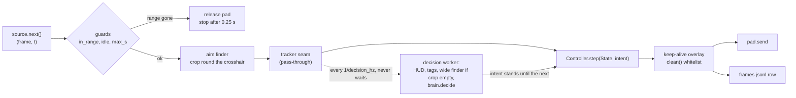

# The live loop (VUH-1300, offline half)

**Built and tested offline; never run live.** `agent/loop.py` joins capture, the green finder, the HUD readers, the brain,
L4's controller and the pad into one loop, with the frame source and the pad injected so the same code runs on recorded
frames with a fake pad and, on the PC, on dxcam and L4's `Live`. Stdlib only at import (opencv is imported inside
`default_perception()` and `RunSource`). Nothing here edits L2's, L3's or L4's files.

```sh
uv run --group perception python -m agent.loop --dry data/l1/tagrun0 [--threaded] [--out DIR] [--limit N]   # offline, fake pad
python -m agent.loop --live --run NAME [--brain jev] [--max-s 300]     # the PC, desktop session, game in the range (untested)
uv run pytest tests/test_loop.py                                       # 44 stdlib tests
uv run --group perception pytest tests/test_loop_frames.py             # 8 tests on real frames (tagrun0 needs data/)
```

`--live` is launched the way `scripts/l4_trial.py` is: the PC's own Python (dxcam, vgamepad, opencv, numpy), repo root as the
working directory. It records to `data/l1/<run>/`, opens ONE pad, and stops on any guard below. `--brain jev` reads `JEV_*`
from the machine's `.env`; the key is never printed or logged.

## Two rates on one clock



- **Reflex**, every frame up to `reflex_hz` (60): guards, the aim finder (a 960 px native crop round the crosshair, the
  4.4 ms sensor), `Controller.step`, the pad, one log row. 60 because L4 tuned the controller at 50-60 Hz and its
  `ARM_FRAMES` counts steps; frames arriving faster are skipped (0.9 of a period, as capture jitters).
- **Decision**, every `decision_hz` (10): the full `State` (HUD read, `read_tagged` per enemy, a whole-frame search only
  when the crop found nothing) and `brain.decide(state, memory)`. The result stands as the intent until the next.
  Threaded (live, `--threaded`), `offer()` hands the newest frame to a worker and returns at once; a frame offered while
  the worker is busy is dropped and counted. A decision older than `stale_s` (1.0 s) turns the intent to `Idle`; a worker
  that dies stops the run. Unthreaded it runs inline, so a replay is deterministic (tested).
- Both clocks are the frame's time `t` (recorded `t` offline, `perf_counter` since the run started live). The controller,
  the brain, the keep-alive and `max_s` all read it. Wall time is only used to measure.

### Measured

`data/l1/tagrun0`, 609 native 2560x1440 frames, this Mac (M5 Max), full loop, real perception, fake pad. The PC column is
L3's and L2's own figures, not a run of this loop.

| Stage | Mac p50 / p95 | PC |
|---|---|---|
| `in_range` + `idle_warning` | 0.05 + 0.10 ms | not measured |
| aim finder, 960 px crop | 1.4 / 1.9 ms | 4.4 / 5.4 ms (L3) |
| HUD read | 1.0 / 2.8 ms | ~4.3 ms |
| `read_tagged`, per enemy | 2.2 ms, max 25.8 | not measured |
| whole-frame finder | 4.5 / 4.9 ms | 14.6 / 15.7 ms (L3) |

| Loop, 609 frames | reflex tick p50 / p95 / max | over the 16.7 ms budget | decision p50 / p95 / max |
|---|---|---|---|
| inline (one thread) | 8.0 / 24.3 / 35.2 ms | 68 ticks | 6.2 / 22.6 / 33.6 ms |
| **threaded** | **1.8 / 2.4 / 3.1 ms** | **0** | 6.2 / 17.3 / 33.1 ms, lag 6.2 / 27.8 / 61.3 |

Inline, every decision tick blows the 60 Hz budget; on a worker the reflex tick does not move while the HUD glyph code (pure
Python) runs beside it, which is why the decision is on a thread. The replay feeds frames as fast as the disk delivers
them, so its 59 dropped offers are a replay artifact: at 10 Hz the gap is 100 ms against a 33 ms worst decision.

**What the PC numbers support** (an estimate: the Mac stage costs with L3's PC crop and HUD figures swapped in):

- **Reflex ~5-6 ms p50, ~7 ms p95** (guards + 4.4 ms crop + the controller and row), so 60 Hz holds with about 10 ms to
  spare and compute alone would allow ~150 Hz. The cap is the controller's tuning, not the machine. `pad.send`
  (vgamepad) is the one cost nobody has measured.
- **Decision 10-40 ms**: 4.3 ms HUD, plus `read_tagged` per enemy (about 7 ms each on the PC if the ratio holds), plus 14.6 ms
  for the whole-frame search when the crop is empty. 10 Hz has 60 ms of slack on its own thread; 20 Hz fits the usual case
  but not several enemies plus a search. Inline on the PC a decision tick would cost about 3x the Mac's 6-35 ms, over budget every time.
- **Unmeasured:** GIL contention on the PC while the worker runs, and dxcam's real frame delivery into `Live.fresh()`. The
  first live run's `tick_ms` / `over_budget` in `meta.json` settle both.
- `read_tagged` dominates the decision and has a 25.8 ms outlier on one frame; several enemies multiply it (rivals-hud's).

Dry run over all of `tagrun0`: 609 ticks, no guard tripped (609/609 frames are in range, none shows the idle banner), no
errors; scripted brain: 287 `search`, 212 `engage:enemy`, 110 `combo:burst` ticks; one keep-alive (the warm-up).

## Safety

Every rule is enforced at one choke point (`_tick` and `clean`), and each has a test that fails without it (25 hand-made
breakages of `agent/loop.py` were each caught by `tests/test_loop.py`).

| Rule | Where | Test |
|---|---|---|
| Range HUD confirmed on the first frame before ANY input; a lobby first frame sends nothing | `_loop` | `test_nothing_is_sent_before_the_range_hud_is_confirmed`, real lobby frame in `test_loop_frames.py` |
| The pad is released on the first frame without the HUD; the run stops if that lasts 0.25 s (`LOST_GRACE_S`, record.py's own) | `_tick` | `test_hud_loss_releases_at_once_and_stops_after_the_grace` |
| One false frame (camera straight up) releases but does not end the run | `_tick` | `test_a_one_frame_dropout_releases_but_the_run_resumes` |
| Idle banner: release and stop (no escape routine) | `_tick` | `test_idle_warning_stops_the_run_with_the_pad_released`, painted banner on a real frame |
| `max_s` (default 300) | `_tick` | `test_max_run_time_stops_the_run` |
| Every exit path, an exception or Ctrl-C included, ends released; a failing release is retried and never hides the reason | `run` / `_finish` | the exception, interrupt and `Flaky` release tests |
| Only `A X LB RB` leave `clean`; anything else (START, BACK, d-pad, stick clicks, B, Y) raises `ForbiddenInput` and stops the run | `clean` | `test_a_forbidden_button_never_reaches_the_pad` |
| Live refusing a send (`RangeLost`) or a stalled capture (no new frame for 0.25 s) ends the run released | `run`, `LiveIO.next` | `test_live_refusing_a_send...`, `test_a_stalled_capture...` |
| A decision that stops arriving stands the controller down; a dead worker stops the run | `_tick` | `test_a_decision_that_stops_arriving...`, `test_a_worker_that_dies...` |
| BACK is pressed only by `pad.scoreboard`, and only after a completed run | `_finish` | `test_a_completed_run_holds_back_once_and_keeps_a_slot_for_the_reading`, `test_live_scoreboard_presses_nothing_when_the_range_is_not_confirmed` |

Two guards check every send: the loop's own on the tick's frame, and `Live.send`'s on the frame it holds.

**Keep-alive.** Only a move or an attack resets the range's ~10 minute inactivity timer. The loop tracks the last tick whose
pad moved the left stick, pulled a trigger or pressed X/RB/LB (`active`); after `keepalive_s` (180) without one it lays
Live's own sequence (walk 0.3 s, back 0.3 s, one RT) over the controller's pad, keeping the guards running through it.
It never blocks and never touches the right stick, so the controller's camera model stays true. The first input after a
pad connects is swallowed by the device switch, so the run opens with that sequence (`warmup`).

**Scoreboard.** At the end of a run that finished (`max_time`, `source_end`; never after a lost range, the idle banner, an
error or Ctrl-C) the loop calls `pad.scoreboard()`: confirm the range, press BACK, wait 1.0 s, take the frame, release.
`record.in_range` is **false on the scoreboard** (checked on `docs/evidence/l4/scoreboard-back-native.jpg`), so the range is
confirmed before the press and never during the hold, and the next tick must see the HUD again. The frame is the native
2560 wide capture, saved lossless (`scoreboard-end.png`), because `perception.scoreboard` refuses frames under 1920 wide.
`meta.json` holds `{"t", "file", "size", "parsed"}`: `parsed` is `read_scoreboard`'s dict (a `None` value means unread,
never zero; digits 2, 6, 7, 9 are not learned yet) or `null` with no reader, or `{"error": ...}` if the reader raised. A
reader failure never breaks the exit. `--scoreboard-every N` repeats the hold every N s (idles the controller for about a
second each time; unused live).

## The recording

Every run writes `data/l1/<run>/` in the shape `agent.demos` loads with no manifest, so each run is a labelled
demonstration: `frames.jsonl` (a row per reflex tick), native `NNNNNN.jpg` at `--save-fps` (10) on a writer thread,
`scoreboard-*.png`, `meta.json`, and `manifest.jsonl` only when the run had HUD gaps.

```jsonc
{"t": 12.3456, "pad": {"lx": 0.0, "ly": 1.0, "rx": 0.2, "ry": 0.0, "lt": 0.0, "rt": 0.0, "buttons": []},   // the pad actually sent
 "note": "engage:enemy", "source": "scripted",     // the intent in force; who decided it: gate | scripted | jev | standing | stale | waiting | guard
 "dets": [[1180, 570, 1380, 870]], "ms": 1.9,      // the aim finder's boxes this tick; the tick's compute time
 "d": 41, "state": {...}, "ms_decide": 6.1,        // the decision in force; its State (State.to_dict) on the first row it stood on
 "file": "000123.jpg", "i": 123}                   // only on the ticks whose frame was saved
```

A tick the guard stopped has `pad` neutral, `note` `range_lost` / `idle_warning` and `source` `guard`. HUD gaps become manifest
segments (`no_hud` ends, `hud_returned` starts), so no training window crosses one. The `state` dicts round-trip through
`State.from_dict` (one per line, extracted, they are `agent.replay`'s input). Tests: `test_the_log_loads_through_agent_demos_as_an_own_recording`,
`test_a_hud_gap_becomes_a_segment_boundary_the_loader_respects`, and the same on real `tagrun0` frames.

## Seams

- **The brain** is any callable `decide(state, memory) -> Intent`; the loop reads nothing else of it. `--brain scripted` is
  `brain.decide` (default), `--brain jev` an `AsyncJev` (its `stats.trace` names the source of each tick; other callables may
  set `.source`). A learned policy plugs in the same way.
- **The tracker** (VUH-1314). Detections have no identity yet. `Loop(tracker=...)` takes any object with
  `update(dets, t) -> dets`; the default passes them through. It is called on every detection list that becomes a `State` (the
  aim finder's, each reflex tick, for the controller; the whole-frame search's, each decision, for the brain), on one
  instance under one lock, so both can be given the same ids. `test_every_detection_list_that_becomes_a_state...` pins it.
- **Option status** (VUH-1315) has no code yet. The room for it: the decision is the only place `State` is assembled
  (`Decider._decide`) and the reflex thread is the only one that knows what the controller is playing (`Controller.seq`,
  `attack_t`), so a status published by the reflex thread and read there reaches the brain without a new thread.

## Interfaces that did not fit (for the lead to route)

- **L4's `Live` has no BACK.** `Live._apply`'s button table stops at A B X Y LB RB LS RS, so `send(buttons=("BACK",))` raises
  `KeyError`. `LiveIO.scoreboard` therefore presses BACK on `live.pad` through `live.vg`, after a guarded `live.send(**NEUTRAL)`. That
  is the one place the loop reaches into `Live`. One entry in `Live._apply` (and a guarded path for it) removes it.
- `Live.fresh()` returns the last frame again after its timeout. The loop skips a repeated `t` and `LiveIO.next` stops the run
  when the newest frame is over 0.25 s old.
- `Live.keepalive()` blocks for 1.25 s, so it is not used; the loop overlays the same sequence instead.
- `tests/test_scoreboard.py::test_extra_range_frames_when_l4_delivers_them` fails on `docs/evidence/l4/scoreboard/` frames
  (rivals-hud's, in flight); it is not affected by this lane.

## Decisions and what was not built

- **A worker thread, not a cooperative single thread.** A single thread is simpler and replays exactly, and it is what
  `--dry` does by default; but measured, every decision tick costs 22-35 ms against a 16.7 ms frame. The worker's cost is one
  lock (the tracker) and a dropped offer when it is busy.
- **The aim finder runs every reflex tick, not at 10 Hz.** The controller arms only after `ARM_FRAMES` consecutive re-measured
  steps and its tracker predicts between measurements; stale boxes at 10 Hz would delay the first press by 0.5 s and corrupt its
  camera model. Perception at the decision rate is the HUD, the tags and the whole-frame search.
- **Resume after a brief HUD loss, stop after 0.25 s.** Stopping on the first bad frame would end a run on the one false alarm
  L4 saw (camera straight up); input is off for every bad frame regardless.
- **The scoreboard is PNG.** 6 px digits do not survive a lossy copy, and it is taken once.
- **Not built:** the tracker itself and option status (above), anchors (`SwingTo` never fires: no producer), a scoreboard retry when
  the overlay was not up yet (`parsed["open"]` says so), any live run, the scoreboard reader's missing digits.
- **Assumed, not verified:** dxcam with `output_color="BGR"` returns a fresh array each grab (the worker and the writer hold
  it; saved frames are copied anyway).

Nothing is committed.
