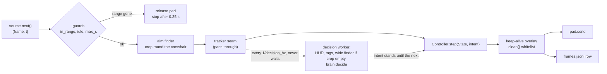

# The live loop (VUH-1300, offline half)

**Built and tested offline; never run live.** `agent/loop.py` joins capture, the green finder, the HUD readers, the brain,
L4's controller and the pad into one loop, with the frame source and the pad injected so the same code runs on recorded
frames with a fake pad and, on the PC, on dxcam and L4's `Live`. Stdlib only at import (opencv is imported inside
`default_perception()` and `RunSource`). Nothing here edits L2's, L3's or L4's files.

```sh
uv run --group perception python -m agent.loop --dry data/l1/tagrun0 [--threaded] [--out DIR] [--limit N]   # offline, fake pad
python -m agent.loop --live --cooldowns off|normal --run NAME [--brain jev] [--max-s 300]   # the PC, desktop session, game in the range (untested)
uv run pytest tests/test_loop.py                                       # 62 stdlib tests
uv run --group perception pytest tests/test_loop_frames.py             # 8 tests on real frames (tagrun0 needs data/)
```

`--live` is launched the way `scripts/l4_trial.py` is: the PC's own Python (dxcam, vgamepad, opencv, numpy), repo root as the
working directory. It records to `data/l1/<run>/`, opens ONE pad, and stops on any guard below. `--cooldowns off|normal` is required with
`--live`, with no default and no `unknown`: the range's Practice Settings "No Ability Cooldown" ON is `off` (infinite ammo, ult relit in seconds, no cooldown
numbers), OFF is `normal`. It is a different regime, so it is written into `meta.json` and the manifest, and `agent.demos` refuses to
mix the two in one split (docs/lanes/demos.md, "Resource regimes"). `--brain jev` reads `JEV_*`
from the machine's `.env`; the key is never printed or logged.

## Two rates on one clock



- **Reflex**, every frame up to `reflex_hz` (60): guards, the aim finder (a 960 px native crop round the crosshair, the
  4.4 ms sensor), `Controller.step`, the pad, one log row. 60 because L4 tuned the controller at 50-60 Hz and its
  `ARM_FRAMES` counts steps; frames arriving faster are skipped (0.9 of a period, as capture jitters).
- **Decision**, every `decision_hz` (10): the full `State` (HUD read, `read_tagged` per enemy, a whole-frame search only
  when the crop found nothing) and `brain.decide(state, memory)`. The result stands as the intent until the next.
  Threaded (live, `--threaded`), `offer()` hands the newest frame to a worker and returns at once; a frame offered while
  the worker is busy is dropped and counted. A decision older than `stale_s` (1.0 s) turns the intent to `Idle`; a worker
  that dies stops the run. Unthreaded it runs inline, so a replay is deterministic (tested).
- Both clocks are the frame's time `t` (recorded `t` offline, `perf_counter` since the run started live). The controller,
  the brain, the keep-alive and `max_s` all read it. Wall time is only used to measure.

### Measured

`data/l1/tagrun0`, 609 native 2560x1440 frames, this Mac (M5 Max), full loop, real perception, fake pad. The PC column is
L3's and L2's own figures, not a run of this loop.

| Stage | Mac p50 / p95 | PC |
|---|---|---|
| `in_range` + `idle_warning` | 0.05 + 0.10 ms | not measured |
| aim finder, 960 px crop | 1.4 / 1.9 ms | 4.4 / 5.4 ms (L3) |
| HUD read | 1.0 / 2.8 ms | ~4.3 ms |
| `read_tagged`, per enemy | 2.2 ms, max 25.8 | not measured |
| whole-frame finder | 4.5 / 4.9 ms | 14.6 / 15.7 ms (L3) |

| Loop, 609 frames | reflex tick p50 / p95 / max | over the 16.7 ms budget | decision p50 / p95 / max |
|---|---|---|---|
| inline (one thread) | 8.0 / 24.3 / 35.2 ms | 68 ticks | 6.2 / 22.6 / 33.6 ms |
| **threaded** | **1.8 / 2.4 / 3.1 ms** | **0** | 6.2 / 17.3 / 33.1 ms, lag 6.2 / 27.8 / 61.3 |

Inline, every decision tick blows the 60 Hz budget; on a worker the reflex tick does not move while the HUD glyph code (pure
Python) runs beside it, which is why the decision is on a thread. The replay feeds frames as fast as the disk delivers
them, so its 59 dropped offers are a replay artifact: at 10 Hz the gap is 100 ms against a 33 ms worst decision.

**What the PC numbers support** (an estimate: the Mac stage costs with L3's PC crop and HUD figures swapped in):

- **Reflex ~5-6 ms p50, ~7 ms p95** (guards + 4.4 ms crop + the controller and row), so 60 Hz holds with about 10 ms to
  spare and compute alone would allow ~150 Hz. The cap is the controller's tuning, not the machine. `pad.send`
  (vgamepad) is the one cost nobody has measured.
- **Decision 10-40 ms**: 4.3 ms HUD, plus `read_tagged` per enemy (about 7 ms each on the PC if the ratio holds), plus 14.6 ms
  for the whole-frame search when the crop is empty. 10 Hz has 60 ms of slack on its own thread; 20 Hz fits the usual case
  but not several enemies plus a search. Inline on the PC a decision tick would cost about 3x the Mac's 6-35 ms, over budget every time.
- **Unmeasured:** GIL contention on the PC while the worker runs, and dxcam's real frame delivery into `Live.fresh()`. The
  first live run's `tick_ms` / `over_budget` in `meta.json` settle both.
- `read_tagged` dominates the decision and has a 25.8 ms outlier on one frame; several enemies multiply it (rivals-hud's).

Dry run over all of `tagrun0`: 609 ticks, no guard tripped (609/609 frames are in range, none shows the idle banner), no
errors; scripted brain: 287 `search`, 212 `engage:enemy`, 110 `combo:burst` ticks; one keep-alive (the warm-up).

## The start pose, in the loop's own pad session (VUH-1314)

A freshly attached virtual pad turns the camera LEFT at about 25 deg/s from within ~70 ms of attaching, through any number of neutral
reports, until the first non-neutral report or the disconnect (measured, `docs/lanes/l4-controller.md`; the cause, the game, Steam Input
or the attach, is not established). The pose re-entry confirmed is therefore not the pose a new pad session starts from, and the loop's
old 3 s blind wait after attaching was about 75 degrees of it. On a live run (`--live`) `main` now:

1. builds perception and loads `plaza_view` (scripts/reenter.py) BEFORE the pad opens, so nothing slow sits between the attach and
   the first input;
2. opens the pad with `LiveIO()`, which constructs `Live(settle_s=0)`: the range HUD is proven before the pad opens, and there is no
   wait after it attaches;
3. runs `agent/startup.py` `start_pose` before any decision offer, controller step, brain, log or `Loop`: a fresh frame acquired after
   the attach is proven (range HUD, no idle banner); ONE priming pulse, right stick rx +0.45 with every other axis, trigger and button
   neutral, 0.3 s, at the earliest guarded send (`camera_pulse`: before EVERY write a fresh frame shows the range HUD and no idle banner, and each write goes through
   `Live.send`, proven, whitelisted and leased; neutral on every exit; `Live.hold` re-proves the range only), sent even if the view
   already passes. M1 (`docs/lanes/l4-controller.md`): the prime ends the attach drift at every schedule tried (0.04-0.7 deg in the 2.8 s
   after it, against about 70 unprimed; 0.0 deg of drift before it at the earliest send), and itself turns the view about 52-58 deg
   right, which leaves the bot about 50 deg to the LEFT. Then neutral, 5 s of frames only (`START_SETTLE_S`); then two DISTINCT fresh
   acquisitions with `plaza_view` true; otherwise a search pulse to the LEFT (`SEARCH_TURN_RX` -0.45, 0.3 s), 0.15 s of frames only
   (`TURN_SETTLE_S`), and again. The search is bounded and goes the way the prime displaced the view; it is not a claim that one left
   pulse cancels the prime, nor that the bot found is the one the arrival faced. The two waits are DELAYS
   with the guards checked on every frame, not tests: nothing checks that the device switch cleared or that the view is still (a
   confirmation on a moving view has been seen in an arrival). 5 s after the prime is a modest margin over M1's "Switching Devices"
   banner, which ended 4.2-4.3 s after the prime went neutral; 0.15 s after a search pulse is not yet measured. M2 checks clearance and
   stillness by eye: a banner still up or a moving view is a failed acceptance, whatever `plaza_view` and the exit code say. At most 7 pulses in all, the priming pulse included, and 14 s overall, checked after each capture and
   its guards, before every write (each pulse ends at the deadline if that comes first) and before acceptance: a caller-side scheduling
   check, not a guarantee about when Live.send's write reaches the device; the range HUD gone, the
   idle banner, a capture with no new frame, a refused write or any exception closes Live and refuses: "plaza start view not confirmed".
   The budget: the prime (0.3 s plus its proof capture), the 5 s delay, then up to six search turns of about 0.5-0.6 s each (a proof
   capture, 0.3 s of writes each after a fresh capture, 0.15 s of frames, two looks) come to about 8.5-9.5 s at the 65-75 frames/s
   dxcam delivers on the plaza, inside 14 s. It refuses on the seventh pulse without two passing frames, or earlier on the deadline
   if captures slow the phase past 14 s.
   Each step (pulse, delay, look, acceptance or refusal) is recorded after it, in memory, never between a proof and a write, with the
   latest frame actually acquired (a refusal carries the frame that failed; a pulse cut short is recorded as INTERRUPTED, after it is
   neutral, never as completed; past 24 kept frames the row says the frame is missing, never an older one). These are the latest
   frames the PHASE acquired, not necessarily the exact frame Live.send proved a write on, if it refreshed its own. `main` writes them
   afterwards as `start-steps.jsonl` and `start-step-NN.png` in the run's folder, for a refused start, an unexpected failure (then the
   exception as it was) and an accepted start alike; the evidence is written before the STOP message, and neither the record nor any of
   this output can change the phase, the close or the exit (an interrupt still propagates). `main` then returns 1 with nothing else built (no brain,
   no log, no `Loop`, so no end-of-run scoreboard), and the process, and the device with it, ends;
4. on success builds the brain and the log, saves both confirming frames (`start-confirm-1.png`, `start-confirm-2.png`; the second is
   the accepted start pose), writes the phase into `meta.json` (`start`: turns, the confirming frames' stamps after `LiveIO()` returned, the
   phase's timings, among them `liveio_return_to_first_send_return`: from `LiveIO()`'s return to the first pulse send's return, which
   leaves out Live's own work after the device attached and includes the send's overhead; the attach itself is M1's to time), and runs the `Loop` with the forced start walk / back / RT off
   (`warmup=False`), so the episode clock and the controller's and tracker's camera history begin after the pose. The long-idle
   keep-alive is unchanged, and a replay (`--dry`) keeps the warm-up.

**Pose only (`--live --pose-only`, for M2).** The same path up to the end of the start phase, then stop: the same perception and
`plaza_view` loaded first, the same `LiveIO()` (range HUD proven before the pad opens, `Live(settle_s=0)`), the same `opened` origin
for the step stamps, `start_pose` unchanged. On a confirmed pose it saves both confirming native frames (`start-confirm-1.png`,
`start-confirm-2.png`), every step row and frame (`start-steps.jsonl`, `start-step-NN.png`) and `start.json` in `data/l1/<run>`, closes
the pad and exits 0; a refusal takes the same branch as a live run (steps written, exit 1). It returns before any brain, `RunLog`,
`Loop`, `Loop.run` or scoreboard exists, and needs no `--cooldowns` (it records no gameplay). Tests: the pose-only ones in
`tests/test_startup.py` fail if any of those is built.

`plaza_view` certifies an enemy box in the open in the middle of the view: not a bot's identity, not navigable ground; seven turns is
a command budget, not a claim of full coverage. The pulse's effect on the drift is not yet measured: `scripts/padprime_m1.py` is that
measurement (one session per invocation, the same `camera_pulse` at the earliest guarded send, +0.1 s or +0.3 s after the attach, then
3 s of frames only; it reports the constructor return, when the first and last non-neutral `pad.update()` returned inside Live's lock,
with the observer's overhead and not the device's receipt, or "unavailable" if the observation failed, and the release; the yaw comes
from the recording). Its observer (`watch_pad`) is best-effort: the real update's result and exceptions pass through, a failure of its
own bookkeeping never stops the write, the lease renewal or a neutral.
Tests: `tests/test_startup.py`, `tests/test_padprime_m1.py`.

## Safety

Every rule is enforced at one choke point (`_tick` and `clean`), and each has a test that fails without it (25 hand-made
breakages of `agent/loop.py` were each caught by `tests/test_loop.py`).

| Rule | Where | Test |
|---|---|---|
| Range HUD confirmed on the first frame before ANY input; a lobby first frame sends nothing | `_loop` | `test_nothing_is_sent_before_the_range_hud_is_confirmed`, real lobby frame in `test_loop_frames.py` |
| The pad is released on the first frame without the HUD; the run stops if that lasts 0.25 s (`LOST_GRACE_S`, record.py's own) | `_tick` | `test_hud_loss_releases_at_once_and_stops_after_the_grace` |
| One false frame (camera straight up) releases but does not end the run | `_tick` | `test_a_one_frame_dropout_releases_but_the_run_resumes` |
| Idle banner: release and stop (no escape routine) | `_tick` | `test_idle_warning_stops_the_run_with_the_pad_released`, painted banner on a real frame |
| `max_s` (default 300) | `_tick` | `test_max_run_time_stops_the_run` |
| Every exit path, an exception or Ctrl-C included, ends released; a failing release is retried and never hides the reason | `run` / `_finish` | the exception, interrupt and `Flaky` release tests |
| Only `A X LB RB` leave `clean`; anything else (START, BACK, d-pad, stick clicks, B, Y) raises `ForbiddenInput` and stops the run | `clean` | `test_a_forbidden_button_never_reaches_the_pad` |
| Live refusing a send (`RangeLost`) or a stalled capture (no new frame for 0.25 s) ends the run released | `run`, `LiveIO.next` | `test_live_refusing_a_send...`, `test_a_stalled_capture...` |
| A decision that stops arriving stands the controller down; a dead worker stops the run | `_tick` | `test_a_decision_that_stops_arriving...`, `test_a_worker_that_dies...` |
| BACK is pressed only by `Live.scoreboard`, and only after a completed run | `_finish`, `Live` | `test_a_completed_run_holds_back_once_and_keeps_a_slot_for_the_reading`, the scoreboard rows below |

Two guards check every send: the loop's own on the tick's frame, and `Live.send`'s at the write.

**Input safety at the pad (VUH-1325).** L4's `Live` is the lowest layer over the pad and the only door to it, so every pad rule is
enforced there and none is copied into the loop: the whitelist, freshness checked at commit (after every proof, on a frame stamped when its
grab started), a neutral-deadline **lease** (Live's own watchdog on the real clock, `LEASE_S` 0.25 s, renewed by every proven send, which the
loop makes every reflex tick), and the scoreboard's recognised transitions. `LiveIO` is a thin adapter that reaches only `fresh`, `send`,
`release`, `scoreboard` and `close`; it has no thread of its own. `main` calls `Live.close()` on every way out once the pad is open (a
brain or log that fails to build included), which ends the watchdog; a closed `Live` refuses input, and nothing on the exit path depends on
a send succeeding. The tests drive the real `controller.Live` with a fake pad and capture:

| Defect | Now | Test |
|---|---|---|
| `fresh()`'s timeout was only checked after a blocking grab returned, so a blocked grab left X held past `max_s` | Live's lease returns the pad to neutral while the loop is still stuck in the grab; the late frame is then stale (stamped at grab start) and stops the run | `test_a_blocked_grab_cannot_leave_x_held_lives_lease_releases_the_pad_while_the_loop_is_stuck`, `test_the_loop_has_no_lease_thread_of_its_own_to_depend_on`, `test_every_reflex_tick_renews_the_lease_so_a_running_loop_is_not_cut_off` |
| a press could land on a 2 s old proof | Live re-proves at the write on a new frame; the lobby there refuses and releases | `test_a_press_on_a_two_second_old_proof_is_refused_at_the_write` |
| the loop reached `live.pad` / `live.vg` for the scoreboard, and BACK stayed down the full second on lobby frames, which came back as "the board" | `Live.scoreboard(hold_s)`: BACK only on a proven range frame, kept down only while each new frame is the board, released at once on anything else (RangeLost), the range required back after. The loop stores a frame only if its own recognizer also calls it a board, and asks for none without one | `test_a_completed_live_run_takes_the_board_only_through_recognised_transitions`, `test_a_lobby_or_black_frame_under_back_releases_it_at_once_and_is_never_the_board`, `test_the_loop_stores_a_board_only_if_its_own_recognizer_agrees`, `test_the_loop_never_reaches_past_lives_door` |
| cleanup only released, leaving Live's watchdog and pad alive | `LiveIO.close()` is `Live.close()`; `main` closes in a `finally` that covers building the loop | `test_closing_ends_lives_watchdog_and_a_send_after_it_is_harmless_to_the_exit`, `test_main_closes_live_even_when_the_brain_cannot_be_built` |

The brain's optional `see(frame, t)` hook (rivals-policy: a learned brain that reads pixels) is called in `Decider._decide`, on the decision worker,
before `decide`, with a **read-only view** of the frame; the loop keeps no reference to the frame past the tick, and `see` must copy what it needs.
A slow or blocked `see` delays decisions only (offers are dropped and counted, the intent goes stale to `Idle`); it never holds a reflex step; an
exception in it stops the run with the pad released. Inline (offline replay) it runs in the tick, which is why replays are single-purpose. Tests:
`test_see_is_called_once_per_decision_with_the_frame_and_its_time_on_the_worker_thread`, `test_a_slow_or_blocked_see_never_holds_a_reflex_step`,
`test_an_exception_in_see_stops_the_run_with_the_pad_released`, `test_the_loop_keeps_no_reference_to_the_frame_past_the_tick`.

**Keep-alive.** Only a move or an attack resets the range's ~10 minute inactivity timer. The loop tracks the last tick whose
pad moved the left stick, pulled a trigger or pressed X/RB/LB (`active`); after `keepalive_s` (180) without one it lays
Live's own sequence (walk 0.3 s, back 0.3 s, one RT) over the controller's pad, keeping the guards running through it.
It never blocks and never touches the right stick, so the controller's camera model stays true. The first input after a
pad connects is swallowed by the device switch, so the run opens with that sequence (`warmup`).

**Scoreboard.** At the end of a run that finished (`max_time`, `source_end`; never after a lost range, the idle banner, an
error or Ctrl-C) the loop calls `Live.scoreboard(1.0)` through `LiveIO`: range proven, BACK down, every new frame must be the board
(`perception.scoreboard.is_scoreboard`) or, while it fades in, still carry the range banner, then release and the range must come back.
`record.in_range` is **false on the scoreboard** (checked on `docs/evidence/l4/scoreboard-back-native.jpg`). The frame is the native
2560 wide capture, saved lossless (`scoreboard-end.png`), because `perception.scoreboard` refuses frames under 1920 wide. A refused hold is
recorded as `{"skipped": "range_lost" | "not_a_scoreboard" | "no_board_check" | "scoreboard_refused: ..."}` with no file.
`meta.json` holds `{"t", "file", "size", "parsed"}`: `parsed` is `read_scoreboard`'s dict (a `None` value means unread,
never zero; digits 2, 6, 7, 9 are not learned yet) or `null` with no reader, or `{"error": ...}` if the reader raised. A
reader failure never breaks the exit. `--scoreboard-every N` repeats the hold every N s (idles the controller for about a
second each time; unused live).

## The recording

Every run writes `data/l1/<run>/` in the shape `agent.demos` loads with no manifest, so each run is a labelled
demonstration: `frames.jsonl` (a row per reflex tick), native `NNNNNN.jpg` at `--save-fps` (10) on a writer thread,
`scoreboard-*.png`, `meta.json` (with `cooldowns`, and `patch`: the kit's current patch read from `docs/spiderman-kit.md`; either key is
omitted when unknown, never written as a guess), and `manifest.jsonl` only when the run had HUD gaps.

```jsonc
{"t": 12.3456, "pad": {"lx": 0.0, "ly": 1.0, "rx": 0.2, "ry": 0.0, "lt": 0.0, "rt": 0.0, "buttons": []},   // the pad actually sent
 "note": "engage:enemy", "source": "scripted",     // the intent in force; who decided it: gate | scripted | jev | standing | stale | waiting | guard
 "dets": [[1180, 570, 1380, 870]], "ms": 1.9,      // the aim finder's boxes this tick; the tick's compute time
 "d": 41, "state": {...}, "ms_decide": 6.1,        // the decision in force; its State (State.to_dict) on the first row it stood on
 "file": "000123.jpg", "i": 123}                   // only on the ticks whose frame was saved
```

A tick the guard stopped has `pad` neutral, `note` `range_lost` / `idle_warning` and `source` `guard`. HUD gaps become manifest
segments (`no_hud` ends, `hud_returned` starts), so no training window crosses one. The `state` dicts round-trip through
`State.from_dict` (one per line, extracted, they are `agent.replay`'s input). Tests: `test_the_log_loads_through_agent_demos_as_an_own_recording`,
`test_a_hud_gap_becomes_a_segment_boundary_the_loader_respects`, and the same on real `tagrun0` frames.

## Seams

- **The brain** is any callable `decide(state, memory) -> Intent`; the loop reads nothing else of it. `--brain scripted` is
  `brain.decide` (default), `--brain jev` an `AsyncJev` (its `stats.trace` names the source of each tick; other callables may
  set `.source`). A learned policy plugs in the same way.
- **The tracker** (VUH-1314). Detections have no identity yet. `Loop(tracker=...)` takes any object with
  `update(dets, t) -> dets`; the default passes them through. It is called on every detection list that becomes a `State` (the
  aim finder's, each reflex tick, for the controller; the whole-frame search's, each decision, for the brain), on one
  instance under one lock, so both can be given the same ids. `test_every_detection_list_that_becomes_a_state...` pins it.
- **Option status** (VUH-1315) has no code yet. The room for it: the decision is the only place `State` is assembled
  (`Decider._decide`) and the reflex thread is the only one that knows what the controller is playing (`Controller.seq`,
  `attack_t`), so a status published by the reflex thread and read there reaches the brain without a new thread.

## Interfaces that did not fit (for the lead to route)

- `Live.keepalive()` blocks for 1.25 s, so it is not used; the loop overlays the same sequence instead.
- `tests/test_scoreboard.py::test_extra_range_frames_when_l4_delivers_them` fails on `docs/evidence/l4/scoreboard/` frames
  (rivals-hud's, in flight); it is not affected by this lane.

## Decisions and what was not built

- **A worker thread, not a cooperative single thread.** A single thread is simpler and replays exactly, and it is what
  `--dry` does by default; but measured, every decision tick costs 22-35 ms against a 16.7 ms frame. The worker's cost is one
  lock (the tracker) and a dropped offer when it is busy.
- **The aim finder runs every reflex tick, not at 10 Hz.** The controller arms only after `ARM_FRAMES` consecutive re-measured
  steps and its tracker predicts between measurements; stale boxes at 10 Hz would delay the first press by 0.5 s and corrupt its
  camera model. Perception at the decision rate is the HUD, the tags and the whole-frame search.
- **Resume after a brief HUD loss, stop after 0.25 s.** Stopping on the first bad frame would end a run on the one false alarm
  L4 saw (camera straight up); input is off for every bad frame regardless.
- **The scoreboard is PNG.** 6 px digits do not survive a lossy copy, and it is taken once.
- **Not built:** the tracker itself and option status (above), anchors (`SwingTo` never fires: no producer), a scoreboard retry when
  the overlay was not up yet (`parsed["open"]` says so), any live run, the scoreboard reader's missing digits.
- **Assumed, not verified:** dxcam with `output_color="BGR"` returns a fresh array each grab (the worker and the writer hold
  it; saved frames are copied anyway).

Nothing is committed.
