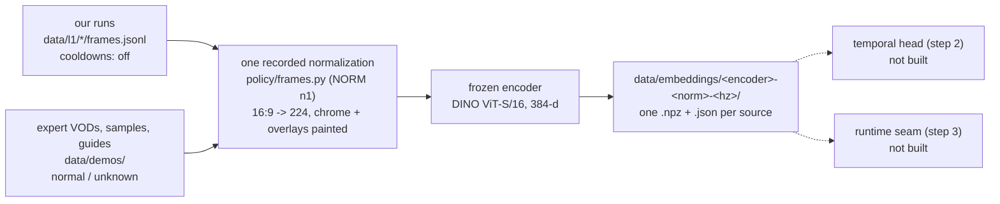

# Policy: the learned chooser (step 1, the embedding cache)

**Built and measured offline. Nothing here aims, presses a button, or runs live.** This lane
replaces *what* the agent decides — today `agent/brain.py`'s hand-written rules — with a model
that reads the last few seconds and names an intent from the existing vocabulary. The
engineered controller still executes it. v0 uses a fixed live target heuristic and makes no
learned-target claim: target identity is not observable in expert footage
([learning-plan.md](../learning-plan.md), "VOD perception and normalization").

Expert labels are not ready (the HUD event stream is being fixed for match footage, and
tactical-purpose annotation has been piloted on six windows). Step 1 is the part that does not
need them: every frame of every source, through one frozen encoder, once.

```sh
uv run --group policy python -m policy.corpus            # what exists, with its regime
uv run --group policy python -m policy.encode --bench    # decode and encoder throughput
uv run --group policy python -m policy.encode --probe    # what the encoders separate (and do not)
uv run --group policy python -m policy.encode --all      # fill the cache; niced, resumable
uv run --group policy pytest tests/test_policy.py        # 18 tests (stdlib-only ones also run bare)
```



## Regime is part of a source's identity

Every practice-range recording made before the 2026-09-20 baseline ran with Practice Settings
**No Ability Cooldown ON**: infinite ammo, the ult relit in seconds, no cooldown numbers. That
is a different game from normal-resource play, and the two are never mixed in one training or
evaluation set (the co-lead's reward contract). Every source carries `cooldowns`:

| Value | Sources | What it rests on |
|---|---|---|
| `off` | `tagrun`, `tagrun0`, `tagrun1` | recorded before the baseline; `policy/corpus.py: RUNS` |
| `normal` | the four 15-minute VODs and the two 60 s samples, 62 min | matchmade footage whose HUD shows cooldowns running and ammo reloading. An inference from the footage, not a settings menu read |
| `unknown` | all nine guides, 106 min | one guide mixes range demonstrations (often cooldown-free) and match clips; nobody has read the regime off the screen |

A run that states `cooldowns` in its `meta.json` is believed over the table, which is how runs
recorded after L4 disables the setting arrive as `normal`. A run in neither place is `unknown`,
never assumed. The field is in every cache sidecar, so the trainer filters on it without
having to remember which recording was which.

**Distilling the scripted brain on `off` runs is pipeline proof only.** It is not tactical
learning from the experts and cannot be evidence of improving on its teacher.

## The recorded normalization (`policy/frames.py`, `NORM = "n1"`)

Both domains take one path: decode at the source's own frame rate, scale the whole 16:9 frame
to 224x224, paint the HUD and the known permanent overlays with the encoder's mean colour
(a masked region normalizes to ~0, the least-activating input). The version stamp is in every
cache entry, so an embedding cannot be read as having come through a different normalization
than it did.

| Masked | Bounds (fractions) | Why |
|---|---|---|
| objective banner / PRACTICE RANGE panel | `0.00,0.00 - 0.32,0.16` | game chrome, both domains |
| score and round timer | `0.31,0.00 - 0.69,0.11` | game chrome |
| kill feed | `0.76,0.00 - 1.00,0.10` | game chrome |
| bottom HUD band | `0.00,0.855 - 1.00,1.00` | hp, ammo, ability slots, portrait, UID line. The HUD lane reads these at native resolution; nothing may re-read hp off a 224 px thumbnail |
| FPS/ping counter | `0.91,0.13 - 1.00,0.30` | the same green block on both creators and our own PC |
| DayMR only: music widget, sponsor panel, avatar | `0.00,0.59 - 0.13,0.83`, `0.79,0.69 - 1.00,0.82`, `0.57,0.65 - 0.77,0.87` | painted on every frame of his video and nothing else's. The avatar is person-like, which the learning plan requires masked |

Bounds were read off inspected frames from both creators and one of our runs, then confirmed
by a temporal-std map over 120 frames spread across each 15-minute VOD: a permanent graphic is
a pixel that never changes while the scene does. Every rect grows by 2 px at 224 to absorb the
scale's bleed. What survives: 71% of the frame for us and Req, 63% for DayMR
(`visible_fraction`, in each sidecar).

**Chat is not masked.** The std map shows it scrolling, so it is not a permanent graphic, and
its panel sits over live play (the learning plan's warning that blanket-masking the chat column
costs recall). The accepted risk instead: a model may key on "chat text is present" as a creator
cue, which held-out-session metrics are what would expose. Changing the mask costs one
re-encode of the corpus, about fifteen minutes.

**Times are decoded PTS, never a nominal grid.** Frames are picked by source frame index
(`select='not(mod(n,K))'`, the sampling the learning plan verified on these 60 fps sources) and
their real timestamp is read back from ffmpeg's `showinfo`; the sample clips are variable frame
rate (the demos lane measured Req at 4082 frames in 60.08 s against a reported 60/1). A run's
times come from its `frames.jsonl`, thinned to the cache rate. A source whose frame and
timestamp counts disagree is refused rather than given times that are not its own.

## What was measured, and what it does not show

This Mac (M5 Max), niced, MLX, the game not running. Decode is ffmpeg to raw RGB at 224.

| | batch 1 | batch 64 | dim |
|---|---|---|---|
| `mobilenet_v3_small` | 3.2 ms, 316/s | 4972/s | 576 |
| `resnet18` | 3.1 ms, 323/s | 2048/s | 512 |
| `vit_base_patch32_224` | 3.4 ms, 292/s | 2845/s | 768 |
| **`vit_small_patch16_224.dino`** | **3.6 ms, 280/s** | **1758/s** | **384** |

Decode + mask alone runs at 453 frames/s on a 1080p60 H.264 VOD at 10 Hz — 45x realtime — so the
**decoder, not the encoder, is the cache's limit**, and which codec a source arrived in matters
more than which encoder reads it. End to end, the Twitch matches (H.264) cache at 200-400
frames/s and the YouTube guides (**AV1**) at about 103 frames/s with ffmpeg saturating four to
six cores; AV1 has no usable hardware path here (`-hwaccel videotoolbox` measured *slower* than
software, 560 against 1300 sampled frames/s). A full rebuild of the corpus is therefore about
four minutes of match footage and ten of guides, niced. **Throughput does not
discriminate the four candidates**: the slowest encodes the entire corpus in under a minute,
and at batch 1 they are within 0.5 ms of each other, so runtime placement (step 3) is not
constrained by the choice either. All four are small enough to be unremarkable beside a game
on a 4080 (1.8-4.6 GFLOPs); that is an argument from size, not a measurement on that machine,
and the PC's GPU belongs to the game anyway.

**The tie-break that was attempted, and failed honestly.** A ridge probe on one frame's
embedding, predicting the intent our own runs logged:

| Encoder | held-out session | last 30% of each session |
|---|---|---|
| `mobilenet_v3_small` | 0.07 / 0.61 / 0.44 | 0.40 / 1.00 / 0.84 |
| `resnet18` | 0.11 / 0.61 / 0.46 | 0.34 / 1.00 / 0.83 |
| `vit_base_patch32_224` | 0.11 / 0.67 / 0.41 | 0.32 / 1.00 / 0.82 |
| `vit_small_patch16_224.dino` | 0.04 / 0.59 / 0.26 | 0.35 / 1.00 / 0.78 |
| *majority baseline* | *0.45 / 0.61 / 0.66* | *0.48 / 1.00 / 0.84* |

(`tagrun` / `tagrun0` / `tagrun1`.) **No candidate beats the majority baseline on any split**,
and on `tagrun` every one is far below it. Two reasons, and neither is the encoders': these three
recordings are `scripts/l4_trial.py` logs with a four-symbol vocabulary of its own
(`Engage`, `Combo`, `stand`, `Search`, and `tagrun` contains no `Search` at all), heavily
imbalanced, and the last 30% of `tagrun0` is a single class; and a single 224 px frame cannot see
what the scripted brain actually reads — tag state, ability readiness, measured range. This says
nothing about whether a temporal head over 5 s of embeddings plus event and `State` features can
reproduce the scripted brain. It does say the existing three recordings are a thin label source,
and that **the loop's own runs are what step 2 trains on**.

**So the encoder choice does not rest on a measurement that separates them, and this says so.**
`vit_small_patch16_224.dino` is taken for the smallest embedding (384, the least to overfit when
labels are scarce) and self-supervised features that carry no ImageNet class prior. The cache is
keyed by encoder, so revisiting the choice costs one re-run; the measurement that
would actually settle it is step 2's held-out agreement, on real labels, with the temporal head
that consumes these vectors.

**Known ceiling, not yet paid for:** at 224 px across a 16:9 frame an enemy 20-40 px wide at 1080p
becomes 2-5 px. v0 chooses coarse intents from context and a fixed heuristic picks the target, so
this may be enough; if step 2 is blind to engagements, the upgrade is a larger working resolution
or a second centre-crop stream, both a cache rebuild and no other change.

## The cache

`data/embeddings/<encoder>-<norm>-<hz>hz/<source>.npz` holds `emb` (float16 `[n, dim]`) and `t`
(decoded seconds, float64 `[n]`); the `.json` beside it holds the source's id, kind, creator,
split **group**, `cooldowns` and its evidence, the media path, the encoder, `NORM`, the rate, the
mask rectangles the pixels went through, and the visible fraction. About 100k frames at 384 dims is
under 100 MB.

Resume is per source: a source with both files present is skipped, and each is written to a
temporary name and renamed, so an interrupted run leaves a `.tmp`, never a half file that looks
complete. Re-encoding one source means deleting its two files.
*ponytail: per-source resume, not per-batch — the longest source is 37 minutes and re-encodes in
about 80 s.*

Embeddings are derived from third-party media, so `data/embeddings/` stays under `data/`
(gitignored): never in git, never in `docs/evidence/`, never on Linear. The temporal-std maps
that fixed the mask bounds show the footage's layout and are derived data too; they stayed in a
scratch directory and the numbers came here instead of the images.

## Decisions and what was not built

- **The cache is per media file, not per training window.** `agent/demos.py` already owns
  segments, splits, leakage and windows; a cache keyed by source and decoded timestamp is what
  the loader's frame references resolve against. No second schema.
- **ffmpeg does the decoding and the scaling, for both domains.** One path for jpgs and video,
  and this lane imports no opencv.
- **The whole 16:9 frame is squashed, not centre-cropped.** A crop would drop the sides where
  enemies appear; the distortion is identical in both domains.
- **`showinfo` sits after the scale, not before it.** It checksums every plane it is handed, so
  reading the real PTS off full 1080p frames cost about 20% of the whole pass (and had one AV1
  guide's ffmpeg at 610% CPU). `scale` does not touch PTS, so a 224 px checksum buys the same
  timestamps. `metadata=print` looked like the cheaper way to read PTS and emits nothing here.
- **`mlx-image`'s dependencies are fixed at the root, in `pyproject.toml`.** It pins
  `numpy==1.26.2` and `mlx==0.24.2` exactly, and it depends on **`opencv-python`** — which
  installs a second `cv2` beside the perception group's `opencv-python-headless` and breaks
  `import cv2` for every perception lane (`numpy.core.multiarray failed to import`). Three
  `[tool.uv] override-dependencies` entries hold it: numpy 2, current mlx, and
  `opencv-python; sys_platform == 'never'`, a marker that is false everywhere and so drops the
  dependency. mlx-image needs `cv2` only in its image-IO and `ImageFolder` helpers; this lane
  decodes with ffmpeg and imports neither. `test_only_one_opencv_distribution_is_ever_installed`
  runs in every environment and fails the moment two `cv2` providers are installed together.
  Green in all three: `uv sync` leaves the stdlib-only env, `--group perception` has
  `cv2 5.0.0` with `numpy 2.5.3` and only the headless distribution, and `--group policy` runs.
- **Not built:** the temporal head and its training loop (step 2), `--brain learned` and its
  latency measurement (step 3), the tactical-purpose head (step 4), any live run. Nothing is
  committed.
