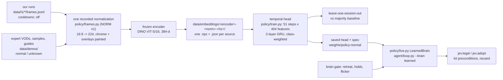

# Policy: the learned chooser (steps 1-3)

## B0 masked occurrence experiment

`policy/b0_multilabel.py` implements the reference task in
[learning-plan.md](../learning-plan.md#b0-auxiliary-pretraining-by-predicting-observed-ability-events):
five independent event-occurrence outputs and five class-conditional timing outputs.
Unknown labels are masked independently; timing has a separate mask. The original
global-next-event build under `data/experiments/b0/` is retained: **22 Day and 96 Req
windows, all negative, zero eligible positive events, no fit or checkpoint**.
`policy/b0_support.py` records the support diagnostic that establishes the revised task.

Both real local development folds are complete. The fixed configuration is two
128-wide GRUs, 51 causal steps at 10 Hz, five-second history, one-second horizon,
5 Hz decisions, Adam 0.001, batch 64, 40 epochs, seed 0, threshold 0.5, final epoch
only. Inputs are frozen DINO `n1` embeddings and masks, shared layout columns 0–385;
`step_row` receives `state=None, events=None`. Classification is balanced masked
binary cross-entropy. Conditional timing loss is distance outside the verified interval.
Normalization is fixed; class weights, priors, resource buckets and median interval
midpoint delays are fitted only on the fitting session.

### Results and support

Metrics describe the observed subset, not all gameplay. Positive-class macro F1:

| Predictor | Day → Req, all five | Day → Req, supported four | Req → Day, all five supported |
|---|---:|---:|---:|
| Frames-only GRU | 0.477 | 0.512 | 0.554 |
| Always negative | 0.000 | 0.000 | 0.000 |
| Fitting prior / majority | 0.232 | 0.290 | 0.000 |
| Recent-use persistence | 0.181 | 0.226 | 0.110 |
| Raw-HUD resource buckets | 0.535 | 0.597 | 0.390 |

The resource baseline uses causal raw cooldown, charges/ammo and time since an
observed ready transition, with unknown buckets, Laplace(1,1) smoothing and a
fitting-prior fallback for unseen buckets. It has structured HUD information absent
from the neural input. Persistence means an accepted same-channel event confirmed
in `(t−1,t]`; extractor prefix causality is unproven, so it is an offline reference.
All comparisons use identical observed masks. Brier error, log loss, precision,
recall, F1 and confusion for every channel are in each fold's report.

Timing error on identical timing-supported rows is **0.178 s model / 0.132 s median**
for Day → Req and **0.193 s / 0.148 s** for Req → Day. Per-channel interval widths,
timing coverage and errors are retained. The model does not beat the timing baseline
on any channel. **No channel passes the combined classification-and-timing improvement
gate.** Req team-up is additionally inconclusive under the predeclared support floor.
This is a completed negative/inconclusive probe, with no gameplay competence claim.

The support floor is 20 distinct positive events and 20 non-overlapping one-second
negative horizons in the held session. Counts are unique events / non-overlapping
negative horizons, not overlapping-window counts:

| Channel | Day | Req |
|---|---:|---:|
| Get Over Here | 42 / 24 | 35 / 81 |
| Swing | 32 / 30 | 35 / 127 |
| Uppercut | 54 / 38 | 23 / 94 |
| Web Cluster | 80 / 165 | 93 / 197 |
| Team-up | 20 / 153 | 17 / 239 |

The dataset has 1,937 Day and 2,305 Req structurally eligible windows; 403 contain
loader-masked past scene steps. Training uses 1,414 Day and 1,836 Req windows with
at least one supported observed label. Reports include positive/negative/unknown
counts per channel/session and split by whether an accepted ability/ammo event was
confirmed in the preceding five seconds. That context-event proxy is a sampling
diagnostic, not a tactical label or neural input. Masks are not missing at random:
calm scenes more often provide clean negatives. The two sessions confound creator
and session; 10 Hz sampling cannot establish intersample visibility; Day's small
icon-overlay contamination prevalence is unknown, not zero. Dim icons without
countdowns remain unknown; the HUD lockout probe supplies no new negative labels.

### Artifacts, reproducibility and checks

`data/experiments/b0-multilabel-v1/` holds the immutable `run-spec.json`,
`dataset-report.json`, `dataset.npz`, `windows.json`, `report.json`, `fit.log` and
`verification.json`. Each `day-to-req/` and `req-to-day/` directory contains:
`model.safetensors`, `report.json`, `predictions.npz`, `windows.json`, and
`resource-tables.json`. The declaration is distinct from actual execution commands
and code fingerprints in completed reports. Raw reads remain referenced in
`data/experiments/b0/visibility/`; they are neither copied nor re-extracted.

```sh
nice -n 10 uv run --no-sync --group policy --group perception python -m policy.b0_multilabel --fit
uv run --no-sync --group policy --group perception pytest tests/test_b0.py tests/test_policy.py -q -k 'b0 or every_cached_source_resolves or source_whose_origin or time_past_the_clip'
```

The command refuses before rebuilding any dataset artifact when a final checkpoint exists. Retain completed artifacts
before intentionally repeating the experiment. Training took 15.41 s Day → Req and
18.66 s Req → Day. Both actual saved checkpoints reproduce logits exactly (maximum
absolute error 0); all saved classification, baseline and common-support timing
metrics reproduce with evaluation batches of 128 (including the natural final short
batch). The co-lead independently reproduces complete folds with maximum logit and
delay error 0.0. Regrouping 17 spread samples into a different batch gives up to
0.00713 logit difference for the final Day → Req row, which originally ran in a
one-row final batch. Preserve the recorded batch grouping for exact replay; this
batch-size numerical sensitivity is not a checkpoint mismatch. **17 focused checks pass**: 14 B0 and three synthetic legacy
clock checks. An independent co-lead review finds no blocking core issue and
independently reproduces the 13 B0 checks and all ten negative support counts.

`Demos.load_split("s10-normal-v0")` and `clips_in("train")` are the entry point.
Before payloads, B0 requires exactly the promoted Day/Req IDs and groups. The split
remains proposed; no test/inspection-only side is requested or unsealed by B0.
`Cache` requires explicit keyword `ids`; the range trainer passes its selected run
IDs, B0 passes its two train IDs, and legacy clock tests use synthetic payloads.
The co-lead reports that an earlier legacy-test run may have opened sealed embedding
arrays before this hardening; none entered B0 fitting, metrics or model selection.
Do not describe the entire multi-agent session as having opened no sealed payload.

`policy/b0_reads.py` persists unchanged frozen-reader raw fields and fingerprints.
Day's native origin 1.616 s and cached origin 0.027 s differ by the container start
1.589 s; their relative clocks agree. `Cache.index_at` uses its own recorded origin.
Native cuts are projected through `_cut_flags` onto sampled-frame timestamps before
comparison with the accepted event metadata. The post-fit `policy/train.py` header
cleanup only describes the current format-4 loader and frames-only B0 distinction;
completed report fingerprints preserve the source present during the fits.

The preexisting machinery handoff below is retained verbatim; the current B0 task,
split status and results are documented above.

## B0 handoff

For the worker taking B0 (next-event prediction, auxiliary pretraining only) and the current-only
reference fit. The task itself is specified in [learning-plan.md](../learning-plan.md), "B0:
auxiliary pretraining by predicting observed ability events". This section covers the lane's
machinery and its rules. The lead releases the handoff; until then `policy/` has one owner.

### 1. Paths and commands

| Path | What it is |
|---|---|
| `policy/corpus.py` | Every source: media path, creator, split `group`, `cooldowns` and `patch` with the evidence for each. Reads manifests; no pixels |
| `policy/frames.py` | The recorded normalization (`NORM = "n1"`): ffmpeg decode at source rate, scale the whole 16:9 frame to 224x224, paint HUD and overlay rects with the ImageNet mean. Also the frame decoders |
| `policy/encode.py` | The embedding cache: frozen `vit_small_patch16_224.dino` (384-d), per-source `.npz` plus sidecar `.json` |
| `policy/train.py` | `layout()` (the only copy of the feature offsets), `step_row()` (one timestep), `Cache` (at-or-before lookup), `windows()`, the GRU head, folds and baselines |
| `policy/live.py` | `LearnedBrain`, the runtime chooser behind `agent/loop.py --brain learned`. Not live; not part of B0 |
| `data/embeddings/vit_small_patch16_224-dino-n1-10hz/` | The cache. `<source>.npz` holds `emb` (float16, n x 384) and `t` (decoded seconds); `<source>.json` holds provenance, `clock`, `t_origin`, `sidecar_version` (3) |
| `data/demos/splits/s10-normal-v0.json` | The split. `proposed`; train `twitch:2879354299` (DayMR) and `twitch:2873352801` (ReqMR); test (sealed) `twitch:2877719252`, `twitch:2871472478`; val pending; two YouTube uploads unassigned |
| `data/demos/vods/*.manifest.jsonl`, `data/demos/events/**` | The four sources the split names, and their event streams: 14 files, format 4, writer `1336262e179c` |
| `tests/test_policy.py` | 42 tests |

```sh
uv run --group policy python -m policy.encode --all --kinds vod   # build or extend the cache; niced; skips cached sources
uv run --group policy python -m policy.encode --refresh           # rewrite sidecars from current provenance, decodes nothing
uv run --group policy python -m policy.encode --list              # what is cached
uv run --group policy python -m policy.train --regime normal --out report.json   # a fit on OUR OWN runs (see below)
uv run --group policy pytest tests/test_policy.py                 # full suite
uv sync && uv run pytest tests/test_policy.py                     # stdlib-only: 10 pass, 32 skip
```

The `policy` uv group resolves in the same universe as `perception` only because of three
`[tool.uv] override-dependencies` in `pyproject.toml` (numpy 2, current mlx, and dropping
mlx-image's `opencv-python`). Do not remove them.

**No B0 fit command exists yet.** `policy.train` fits the scripted brain's intents on our own
range runs, loaded through `Demos.load(*paths)`. B0 needs a new window builder that enters through
`Demos.load_split("s10-normal-v0")`, takes next-event targets, and reuses `step_row`, `Cache`,
`layout` and the head. All four split sources are already cached, and their loader clip ids equal
the cache keys.

### 2. The feature layout

One timestep is a vector of **405** values at embedding dimension 384; a window is **51 steps**
(5 s at 10 Hz, including the decision frame), oldest first. When history is short the missing
steps are left-padded with zeros and every bit clear. The offsets are written in one place,
`policy/train.layout(emb_dim)`, and `policy/live.py` reads it.

| Cols | Field | Shape, units | Bits | Kind |
|---|---|---|---|---|
| 0-383 | embedding | 384 float32, frozen DINO CLS of the `n1` frame; unitless | | frames-only |
| 384 | `emb_present` | {0,1} | a cache row at or before the step, no staler than `MATCH_S` = 0.12 s | frames-only |
| 385 | `scene_masked` | {0,1} | the loader's `Mask.hidden` contains `scene` | frames-only (the mask comes from the HUD segmenter's segments) |
| 386-387 | hp | fraction of max, [0,1] | value, known | state |
| 388-389 | ammo | web charges / 5 | value, known | state |
| 390-395 | swing, get_over_here, uppercut | ready {0,1} each | value, known each | state |
| 396 | detections | min(count, 5) / 5 | no known bit | state, scene-derived |
| 397-398 | on_target | {0,1} | value, known | state, scene-derived |
| 399 | `state_present` | {0,1} | a `State` dict was recorded for the step | state |
| 400-403 | events | counts in (t - 1 s, t] of `hp_lost`, `web_cluster_fired`, `slot_unavailable`, `slot_available` | | **event input** |
| 404 | `events_present` | {0,1} | the clip has an event stream | event input |

An unknown value is a zero with its known-bit clear, never a guess. A field named in
`Mask.hidden` is zeroed together with its known-bit. `hidden` values are `scene` (embedding and
scene-derived state), `hud` (every HUD field), or one field (`hp`, `ammo`, a slot). `player`
drops nothing, because no feature is player-specific.

**The state channel is empty on expert footage.** It comes from our own loop's `State` rows, so
on every expert window its bits are clear. There is no layout version constant in code. The
layout is pinned by `NORM`, the encoder name, `layout()`, the width and the saved head's spec
(`width`, `emb_dim`, `state_f`, `event_f`, `event_kinds`). Whoever next changes the layout adds
the constant first.

**Deliberately absent:** target identity and track ids; remaining episode time and option status
(RL only); ult, team-up, `ability_cast`, charges and the kill feed as inputs; chat (unmasked
pixels, not a feature); audio.

**The causal event-input gate.** Event columns may feed a model only once it is shown that
perturbing footage after t leaves every event feature at t unchanged. That covers the extractor's
temporal cleanup and per-source slot mapping, not just `t_to <= t`. **Status: not demonstrated;
no such test exists.** The `(t - 1 s, t]` bound proves timestamp causality only. **So the
reference fit is frames-only:** columns 0-385, with events used solely as targets. `step_row`
fills columns 400-404 whenever it is handed events, so a frames-only builder passes `events=None`.

### 3. Folds and baselines

- **Development folds** use only the accepted train side of `s10-normal-v0`: two leave-one-session-
  out folds, DayMR to ReqMR and ReqMR to DayMR. Report each direction separately, because creator
  and session are confounded. Every fitted quantity (class weights, training majority, timing
  medians) comes from the fitting session alone. The pipeline has no fitted normalization
  statistics: embeddings are raw, and state uses fixed scalings.
- **Never touched:**
  - the sealed test broadcasts, for development, learning curves or model selection;
  - the val side (pending: asking for it raises `PendingError`);
  - a fold's held-out session, by any stage fitted for that fold, **pretraining included**;
  - the unassigned uploads, ever.
- **`policy/train.py` does not satisfy this as written.** `TRAINABLE = ("train", "val", "test")`
  and its leave-one-session-out runs over every session it loads. A B0 builder takes the `train`
  side only and folds within it.
- **Baselines**, each scored on the same held-out windows:
  - *training majority*: `bincount(y_train).argmax()`.
  - *persistence*: in code today, the previous decision's label in the same session. For B0 the
    plan's form is the most recent observed event class (the latest event with `t_to <= t`), plus
    *always `no_verified_event`*.
  - *timing*: the training-only median delay per class.
  - *events-only*: required only if events become an input.
  - Already reported by `policy.train`: majority, held-out majority, sticky, accuracy and
    per-class recall on the change windows (where persistence scores zero), macro F1, confusion.
  - A B0 builder has to add: always-no-event, most-recent-event and the timing median.

### 4. Who may promote a source

**Only the lead, on the independent reviewer's acceptance, never the training worker.** A source
leaves `inspection_only` when the lead sets the split file's `status` to `accepted`. Even then,
only sources whose own manifest allows it (`splittable`, split null or that side) take a side. The
split file never overrides provenance. While the split is `proposed`, every source reads
`inspection_only` and the train side yields **0** samples (checked).

**`Demos.load_split(name)` is the only door.** It refuses with:
- `PendingError`: asking a pending side for anything;
- `ProvenanceError`: two provenance records disagree, or a claim has no basis;
- `RegimeError`: a split mixing patches or cooldown regimes;
- `SplitError`: a group on two sides or on none, an unassigned group listed, or a silently empty side;
- `FormatError`: an event file that is not format 4, or is stale (meta lacks required keys, or its
  `writer` is not the current producer's fingerprint);
- `AlignmentError`: an annotation over a context the loader would not give;
- `LeakageError`: an observation holding anything later than t.

`Demos.load(*paths)` exists, and our own runs use it, but no split rule applies there.

### 5. Traps

- **A scripted edit that misses its target does nothing and reports nothing.** A `str.replace`
  whose old text is one line off leaves the file unchanged. Assert that the match happened, grep
  for every name you added, and check that the test count rose by the expected amount before
  claiming a test exists.
- **`Cache.at` is at-or-before, on one clock.** A video's rows are absolute decoded PTS; `Cache`
  subtracts the sidecar's `t_origin` (the first decoded PTS, 0.027 s on
  `daymr-2879354299-21660-900s`). It then takes the latest row at or before t, never the nearest:
  the nearest can be after t. Check lookups by time with `Cache.index_at`. Event times arrive on
  the loader's clip clock, which the cache is verified against. No cast has been checked against
  its pixels in the cache.
- **`CacheMiss` versus a mask.** A source absent from the cache, or an empty cache, raises
  `CacheMiss`, and so does a window in which every step is a miss. A hidden scene is a fact with
  its own bit. The two must never look alike: a zero block is not "masked".
- **`Mask.hidden` is per field.** One hidden HUD slot must not drop a visible scene. `step_row`
  drops exactly what `hidden` names.
- **Clip time, sampling and short segments.** Expert play segments have medians of 4-12 s. B0
  requires the full five-second context for its first run, so report the eligible duration. A
  bridged scoreboard gap is usable only with its mask and a proven absence of a hard cut.
- **Decoding cost.** H.264 caches at 200-400 frames/s. AV1 runs at about 100 frames/s, and
  VideoToolbox is slower than software for it. `showinfo` goes after the scale.
- `policy/train.py`'s module docstring still says events are format 2/3. They are format 4; the
  code was left unchanged for this handoff.

**Built and measured offline. Nothing here aims, presses a button, or runs live.** This lane
replaces *what* the agent decides — today `agent/brain.py`'s hand-written rules — with a model
that reads the last few seconds and names an intent from the existing vocabulary. The
engineered controller still executes it. v0 uses a fixed live target heuristic and makes no
learned-target claim: target identity is not observable in expert footage
([learning-plan.md](../learning-plan.md), "VOD perception and normalization").

Expert labels are not ready (the HUD event stream is being fixed for match footage, and
tactical-purpose annotation has been piloted on six windows). Step 1 is the part that does not
need them: every frame of every source, through one frozen encoder, once.

```sh
uv run --group policy python -m policy.corpus            # what exists, with its regime
uv run --group policy python -m policy.encode --bench    # decode and encoder throughput
uv run --group policy python -m policy.encode --probe    # what the encoders separate (and do not)
uv run --group policy python -m policy.encode --all      # fill the cache; niced, resumable
uv run --group policy python -m policy.train             # leave-one-session-out, regime off
uv run --group policy python -m policy.train --split tail  # the control (see below)
uv run --group policy python -m policy.live --bench       # step 3 latency on this Mac
uv run --group policy pytest tests/test_policy.py        # 42 tests (stdlib-only ones also run bare)
```



## Regime is part of a source's identity

Every practice-range recording made before the 2026-09-20 baseline ran with Practice Settings
**No Ability Cooldown ON**: infinite ammo, the ult relit in seconds, no cooldown numbers. That
is a different game from normal-resource play, and the two are never mixed in one training or
evaluation set (the co-lead's reward contract). Every source carries `cooldowns`:

| Value | Sources | What it rests on |
|---|---|---|
| `off` | `tagrun`, `tagrun0`, `tagrun1` | recorded before the baseline; `policy/corpus.py: RUNS` |
| `normal` | the four 15-minute VODs and the two 60 s samples, 62 min | matchmade footage whose HUD shows cooldowns running and ammo reloading. An inference from the footage, not a settings menu read |
| `unknown` | all nine guides, 106 min | one guide mixes range demonstrations (often cooldown-free) and match clips; nobody has read the regime off the screen |

A run that states `cooldowns` in its `meta.json` is believed over the table, which is how runs
recorded after L4 disables the setting arrive as `normal`. A run in neither place is `unknown`,
never assumed. The field is in every cache sidecar, so the trainer filters on it without
having to remember which recording was which.

**Distilling the scripted brain on `off` runs is pipeline proof only.** It is not tactical
learning from the experts and cannot be evidence of improving on its teacher.

## The recorded normalization (`policy/frames.py`, `NORM = "n1"`)

Both domains take one path: decode at the source's own frame rate, scale the whole 16:9 frame
to 224x224, paint the HUD and the known permanent overlays with the encoder's mean colour
(a masked region normalizes to ~0, the least-activating input). The version stamp is in every
cache entry, so an embedding cannot be read as having come through a different normalization
than it did.

| Masked | Bounds (fractions) | Why |
|---|---|---|
| objective banner / PRACTICE RANGE panel | `0.00,0.00 - 0.32,0.16` | game chrome, both domains |
| score and round timer | `0.31,0.00 - 0.69,0.11` | game chrome |
| kill feed | `0.76,0.00 - 1.00,0.10` | game chrome |
| bottom HUD band | `0.00,0.855 - 1.00,1.00` | hp, ammo, ability slots, portrait, UID line. The HUD lane reads these at native resolution; nothing may re-read hp off a 224 px thumbnail |
| FPS/ping counter | `0.91,0.13 - 1.00,0.30` | the same green block on both creators and our own PC |
| DayMR only: music widget, sponsor panel, avatar | `0.00,0.59 - 0.13,0.83`, `0.79,0.69 - 1.00,0.82`, `0.57,0.65 - 0.77,0.87` | painted on every frame of his video and nothing else's. The avatar is person-like, which the learning plan requires masked |

Bounds were read off inspected frames from both creators and one of our runs, then confirmed
by a temporal-std map over 120 frames spread across each 15-minute VOD: a permanent graphic is
a pixel that never changes while the scene does. Every rect grows by 2 px at 224 to absorb the
scale's bleed. What survives: 71% of the frame for us and Req, 63% for DayMR
(`visible_fraction`, in each sidecar).

**Chat is not masked.** The std map shows it scrolling, so it is not a permanent graphic, and
its panel sits over live play (the learning plan's warning that blanket-masking the chat column
costs recall). The accepted risk instead: a model may key on "chat text is present" as a creator
cue, which held-out-session metrics are what would expose. Changing the mask costs one
re-encode of the corpus, about fifteen minutes.

**Times are decoded PTS, never a nominal grid.** Frames are picked by source frame index
(`select='not(mod(n,K))'`, the sampling the learning plan verified on these 60 fps sources) and
their real timestamp is read back from ffmpeg's `showinfo`; the sample clips are variable frame
rate (the demos lane measured Req at 4082 frames in 60.08 s against a reported 60/1). A run's
times come from its `frames.jsonl`, thinned to the cache rate. A source whose frame and
timestamp counts disagree is refused rather than given times that are not its own.

## What was measured, and what it does not show

This Mac (M5 Max), niced, MLX, the game not running. Decode is ffmpeg to raw RGB at 224.

| | batch 1 | batch 64 | dim |
|---|---|---|---|
| `mobilenet_v3_small` | 3.2 ms, 316/s | 4972/s | 576 |
| `resnet18` | 3.1 ms, 323/s | 2048/s | 512 |
| `vit_base_patch32_224` | 3.4 ms, 292/s | 2845/s | 768 |
| **`vit_small_patch16_224.dino`** | **3.6 ms, 280/s** | **1758/s** | **384** |

Decode + mask alone runs at 453 frames/s on a 1080p60 H.264 VOD at 10 Hz — 45x realtime — so the
**decoder, not the encoder, is the cache's limit**, and which codec a source arrived in matters
more than which encoder reads it. End to end, the Twitch matches (H.264) cache at 200-400
frames/s and the YouTube guides (**AV1**) at about 103 frames/s with ffmpeg saturating four to
six cores; AV1 has no usable hardware path here (`-hwaccel videotoolbox` measured *slower* than
software, 560 against 1300 sampled frames/s). A full rebuild of the corpus is therefore about
four minutes of match footage and ten of guides, niced. **Throughput does not
discriminate the four candidates**: the slowest encodes the entire corpus in under a minute,
and at batch 1 they are within 0.5 ms of each other, so runtime placement (step 3) is not
constrained by the choice either. All four are small enough to be unremarkable beside a game
on a 4080 (1.8-4.6 GFLOPs); that is an argument from size, not a measurement on that machine,
and the PC's GPU belongs to the game anyway.

**The tie-break that was attempted, and failed honestly.** A ridge probe on one frame's
embedding, predicting the intent our own runs logged:

| Encoder | held-out session | last 30% of each session |
|---|---|---|
| `mobilenet_v3_small` | 0.07 / 0.61 / 0.44 | 0.40 / 1.00 / 0.84 |
| `resnet18` | 0.11 / 0.61 / 0.46 | 0.34 / 1.00 / 0.83 |
| `vit_base_patch32_224` | 0.11 / 0.67 / 0.41 | 0.32 / 1.00 / 0.82 |
| `vit_small_patch16_224.dino` | 0.04 / 0.59 / 0.26 | 0.35 / 1.00 / 0.78 |
| *majority baseline* | *0.45 / 0.61 / 0.66* | *0.48 / 1.00 / 0.84* |

(`tagrun` / `tagrun0` / `tagrun1`.) **No candidate beats the majority baseline on any split**,
and on `tagrun` every one is far below it. Two reasons, and neither is the encoders': these three
recordings are `scripts/l4_trial.py` logs with a four-symbol vocabulary of its own
(`Engage`, `Combo`, `stand`, `Search`, and `tagrun` contains no `Search` at all), heavily
imbalanced, and the last 30% of `tagrun0` is a single class; and a single 224 px frame cannot see
what the scripted brain actually reads — tag state, ability readiness, measured range. This says
nothing about whether a temporal head over 5 s of embeddings plus event and `State` features can
reproduce the scripted brain. It does say the existing three recordings are a thin label source,
and that **the loop's own runs are what step 2 trains on**.

**So the encoder choice does not rest on a measurement that separates them, and this says so.**
`vit_small_patch16_224.dino` is taken for the smallest embedding (384, the least to overfit when
labels are scarce) and self-supervised features that carry no ImageNet class prior. The cache is
keyed by encoder, so revisiting the choice costs one re-run; the measurement that
would actually settle it is step 2's held-out agreement, on real labels, with the temporal head
that consumes these vectors.

**Known ceiling, not yet paid for:** at 224 px across a 16:9 frame an enemy 20-40 px wide at 1080p
becomes 2-5 px. v0 chooses coarse intents from context and a fixed heuristic picks the target, so
this may be enough; if step 2 is blind to engagements, the upgrade is a larger working resolution
or a second centre-crop stream, both a cache rebuild and no other change.

## Step 2: the temporal head, and the first held-out number

`policy/train.py` reads about 5 s of history at 10 Hz and names the intent the recorder logged
next. Windows come from `agent/demos.py` — it owns segments, whole-recording splits and the
leakage guards, and an `Observation` refuses to hold anything later than its own `t` — and each
`FrameRef` is resolved against the cache by (clip, decoded time). No second schema.

Three channels per timestep, each with its own present bit, **missing never filled**: the 384-d
embedding; the loop's `State` where a row carried one (hp, ammo, ability readiness, detections,
crosshair — every unknown is a zero with its known-bit *clear*, never a value); and HUD events
where a run has a stream. No run has one today, so that channel is absent on every window and is
wired for the day one exists. 404 features, 51 steps. The head is a 2-layer GRU over a 128-d
projection, class-weighted so the rare intents are not swamped.

**The numbers, regime `normal`, patch Season 10 / 20260911, the loop's own runs only** (four
300 s baselines, 6,000 windows; L4's trial logs are a different recorder and are excluded).
Leave-one-session-out, against two baselines — the majority class, and **sticky**, which repeats
the previous decision's intent:

| Held out | Windows | Accuracy | Train majority | Sticky | Intent changes | Accuracy on those | Fits own training set |
|---|---|---|---|---|---|---|---|
| `baseline1` | 1500 | 0.547 | 0.464 | **0.908** | 138 | 0.435 | 0.978 |
| `baseline2` | 1500 | 0.980 | 0.000 | **0.999** | 1 | – | 0.261 |
| `baseline3` | 1500 | 0.792 | 0.411 | **0.961** | 59 | 0.525 | 0.922 |
| `baseline4` | 1500 | 0.997 | 0.002 | **0.997** | 5 | – | 0.954 |

**The head now beats the majority baseline** on the two sessions that contain more than one intent
(0.547 against 0.464, 0.792 against 0.411) — it did not before. **It beats sticky nowhere.** That
is the number that counts: intents are sticky, so repeating the last decision is right 91-100% of
the time, and a temporal model has to be better than doing nothing.

The only place a model can beat sticky is the moment the intent **changes**, where sticky scores
zero by construction. There the head gets 0.435 (138 windows) and 0.525 (59 windows) on the two
usable sessions. Those counts are the real limit: **two of the four baselines are single-intent
runs** — `baseline2` is 1,500 windows of `engage`, `baseline4` is 1,496 of `search` — so across
20 minutes of recording there are 203 decision changes in total. Transitions, not minutes, are
what this lane is short of.

*The sticky baseline had to be fixed before it meant anything: measured against the intent one
control tick (~33 ms) earlier it read 0.99+ with 0-12 changes per fold, because consecutive rows of
`frames.jsonl` agree by construction. It now compares against the previous decision in the same
session.*

**Two recorders, two vocabularies.** L4's trials log `Engage`, `Combo`, `stand`, `Search`; the
loop logs `engage:enemy`, `search`, `combo:burst`, `webstrike:enemy`, `pull:enemy`, `idle`.
`vocab_of` lowercases and cuts at the colon, but **`stand` and `idle` are deliberately kept
apart**: one is a scripted pause, the other is the loop standing the controller down. The trial
logs are excluded from training entirely (`recorder="loop"`), so the two never pool.

**Per-class recall on the change windows** (the only windows where beating sticky is possible):

| Held out | combo | engage | pull | search | webstrike |
|---|---|---|---|---|---|
| `baseline1` (138 changes) | 0.37 (38) | 0.72 (61) | 0.00 (4) | 0.05 (21) | 0.07 (14) |
| `baseline3` (59 changes) | 0.95 (20) | 0.41 (29) | – | 0.00 (8) | 0.00 (2) |

The head finds transitions into `engage` and `combo` and almost never into `search`, `pull` or
`webstrike` — the classes with 2-21 change examples each.

**Transition weighting does not help; it hurts.** The cheapest thing aimed at transitions:
multiply the training weight of windows whose label changes within the next 3 decisions by 8
(542 of 6,000, 9%), evaluated identically:

| Held out | Accuracy | On changes | Fits own training set |
|---|---|---|---|
| `baseline1` | 0.547 → 0.529 | 0.435 → **0.355** | 0.978 → 0.896 |
| `baseline3` | 0.792 → **0.300** | 0.525 → **0.373** | 0.922 → 0.489 |

Worse on the change windows in both usable sessions, and `baseline3` falls below its majority
baseline. Up-weighting a few hundred near-duplicate windows makes fitting unstable (training fit
drops to 0.489) without adding a single new transition to learn from. The two single-intent runs
move only on 1 and 5 change windows, which is noise. **More weight on the same 203 transitions is
not a substitute for more transitions**; short verified-start episodes are. (A first attempt at
this run silently trained unweighted — the flag never reached the trainer and the result matched
the baseline digit for digit. A test now pins that the flag arrives.)

## Step 3: the learned chooser behind the loop's seam

`policy/live.py` gives `LearnedBrain`, which has `brain.decide`'s signature, so
`agent/loop.py --brain learned` reads nothing special of it. **The scripted gate runs first**,
exactly as the Jev path does — retreat, a playing hold and a flickering target never wait on a
model — and the head only replaces `brain.policy`. Every answer then goes through `jev.legal`,
the same kit preconditions `brain.policy` enforces, and is adopted with `jev.adopt`, the same hold
and mode bookkeeping. Neither is rewritten here; both are imported, and a test pins that.

An answer is dropped and the tick falls to `brain.policy` when the head names something no target
can execute, when the pixels are stale, or when the vocabulary does not map. Each reason is
counted, so a run can say how often the head actually chose.

**One change in `agent/loop.py` besides the flag.** The head reads pixels and the
`decide(state, memory)` seam does not carry them, so `LearnedBrain` also exposes `see(frame, t)`,
which the decision worker calls with the frame the `State` was built from. It is duck-typed like
the loop's other seams (`.source`, the tracker) and a brain without `see` is called exactly as
before. Flagged for the lead as the one line outside this lane's own files.

**Latency, this Mac, batch 1, niced:**

| Stage | p50 | p95 | max |
|---|---|---|---|
| `see` (resize 1440p, mask, encode) | 25.2 ms | 29.4 ms | 31.3 ms |
| `decide` (window, head, gate, legality) | 4.9 ms | 7.3 ms | 8.0 ms |
| **total per decision tick** | **30.2 ms** | **35.6 ms** | **38.6 ms** |

That fits a 10 Hz decision tick (100 ms) with room, but it lands on the decision thread beside the
HUD read and the tag reads, which the loop lane measures at 10-40 ms on the PC. The resize
dominates `see`, and it keeps `INTER_AREA` deliberately: it is what ffmpeg's `area` scaler did when
the cache was built, and a cheaper filter would feed the head vectors unlike its training set. A
test checks that live and cached embeddings of the same frame agree (cosine > 0.99).

**What still needs measuring, and where.** Nothing here has run live. On the PC the GPU belongs to
the game, so the encoder would run CPU-side there, unmeasured; the alternative is hosting it on
this Mac over the LAN, where the loop lane measured 63-90 ms per small call on the current Wi-Fi,
and frame transport on top of that is unmeasured. Neither number exists yet and neither is assumed.

## Sources that may not be split on yet

The six full ReqMR YouTube uploads (104 minutes, `data/demos/youtube/reqmr/`) are embedded —
cheap, and the cache is per media file — but every one carries `splittable: false` in its
sidecar, along with its `upload_date` and `edited_upload: true`. An upload id is not an
independent session: they are edited across maps with black openings, outros, scoreboards and
spectated heroes; the two September uploads may overlap the retained ReqMR Twitch sections; and
the four April-May ones predate several balance patches. `policy.train.windows` refuses a source
that is not `splittable`, and a test pins it.

**Proposed, not built — a dedup signal.** Cosine similarity between cached embeddings across
sources, restricted to pairs whose HUD state matches, would find re-uploaded stretches cheaply:
the embeddings already exist, so it is a matrix product over ~100k vectors. Caveats before anyone
trusts it: an edited upload is re-encoded, so a duplicate is near but not identical; two distinct
moments on the same map with the same HUD can be near neighbours; and the threshold needs
hand-checked pairs before it draws a boundary. **Awaiting your go-ahead.**

## What an independent review found, and what changed (VUH-1326)

A reviewer outside every lane reproduced these by running the code. Each fix has a test built
from that reproduction, and each original defect, reintroduced by hand, makes at least one of
them fail (nearest-instead-of-at-or-before, the unrebased origin, any mask dropping the scene, no
staleness bound).

| # | Defect | Fix |
|---|---|---|
| 1 | `Cache.at` took the **nearest** row within 60 ms, so a decision could resolve to a frame *after* it (every PTS on one section is grid + 27 ms). Two clocks were never reconciled: the cache records absolute decoded PTS, `agent/demos.py` speaks clip time from the first frame, so a source with an offset origin missed on *every* frame | The sidecar records `clock` and `t_origin`; `Cache` converts once, then `searchsorted` takes the latest row **at or before** the step, never the nearest |
| 2 | A cache miss left the block zero, indistinguishable from blank video. **baseline3 contributed a full 1,500-window held-out fold with embedding-present 0.000** | A source not in the cache, or an empty cache, raises `CacheMiss` naming it; a window whose every step is a miss raises. A step whose scene a mask proves hidden is accounted for by its own bit, so "hidden scene" and "missing file" are different facts |
| 3 | `windows()` iterated every split the loader assigned, so an `inspection_only` source could yield training rows | `TRAINABLE = ("train", "val", "test")`, an allow-list |
| 5 | `_event_features` had no upper bound: an early step counted events confirmed seconds later | Counted over `(t - 1 s, t]` at each step, and the docstring says so |
| 6 | `mix_regimes=True` was passed unconditionally, switching off the loader's guard, while `corpus.py` and the loader disagreed about who owns a run's regime | The run's own metadata is the authority; `corpus.RUNS` is a documented legacy fallback that **cannot qualify a run for training**; disagreement raises `RegimeConflict`; the loader's guard stays on (`cooldowns=regime`) |
| 8 | `encode.py` skipped a source when both files existed, freezing sidecars (21 of 27 had `splittable: null`) | A cached source now has its sidecar rewritten from current provenance on every run, decoding nothing. `sidecar_version` marks the shape |
| 9 | The test named "only from frames at or before its decision" compared no timestamps — finding 1 lived in that gap | `Cache.index_at` exposes the resolved row, and the tests check it by time on every real cached source, video and run, on and between the grid: at or before `t`, within one step, the nonzero-origin section resolving to +0 ms, and a time past the clip missing. The window test walks the same loader-to-cache chain `windows()` uses |
| C | Any mask set `scene_masked` and dropped the whole embedding, ignoring `Mask.hidden`: a mask hiding one HUD slot (`hidden=("swing",)`, chat over the icon) discarded a fully visible scene | `step_row` masks exactly what `hidden` says: `scene` drops the embedding and the scene-derived state (detections, crosshair); `hud` drops every HUD field; one field drops only its own value and known-bit |
| E | Nothing tested `Cache.at` | See 9: `index_at` is tested by time on real sources |
| — | *(found while fixing 2)* the runtime derived the feature layout a second time and, once a bit was added, fed the head a vector one column out of step | `layout()` in `policy/train.py` is the only place the offsets are written; `policy/live.py` reads it |
| 10 | The headline numbers here were stale against the code | Regenerated below |

What the reviewer tried and could **not** break, which is worth as much: no leakage past `t` inside
the loader, no per-clip normalization statistics, class weights not reaching reported accuracy,
split integrity by group, and the `splittable` gate.


## The cache

`data/embeddings/<encoder>-<norm>-<hz>hz/<source>.npz` holds `emb` (float16 `[n, dim]`) and `t`
(decoded seconds, float64 `[n]`); the `.json` beside it holds the source's id, kind, creator,
split **group**, `cooldowns` and its evidence, the media path, the encoder, `NORM`, the rate, the
mask rectangles the pixels went through, and the visible fraction. About 100k frames at 384 dims is
under 100 MB.

Resume is per source: a source with both files present is skipped, and each is written to a
temporary name and renamed, so an interrupted run leaves a `.tmp`, never a half file that looks
complete. Re-encoding one source means deleting its two files.
*ponytail: per-source resume, not per-batch — the longest source is 37 minutes and re-encodes in
about 80 s.*

Embeddings are derived from third-party media, so `data/embeddings/` stays under `data/`
(gitignored): never in git, never in `docs/evidence/`, never on Linear. The temporal-std maps
that fixed the mask bounds show the footage's layout and are derived data too; they stayed in a
scratch directory and the numbers came here instead of the images.

## Decisions and what was not built

- **The cache is per media file, not per training window.** `agent/demos.py` already owns
  segments, splits, leakage and windows; a cache keyed by source and decoded timestamp is what
  the loader's frame references resolve against. No second schema.
- **ffmpeg does the decoding and the scaling, for both domains.** One path for jpgs and video,
  and this lane imports no opencv.
- **The whole 16:9 frame is squashed, not centre-cropped.** A crop would drop the sides where
  enemies appear; the distortion is identical in both domains.
- **`showinfo` sits after the scale, not before it.** It checksums every plane it is handed, so
  reading the real PTS off full 1080p frames cost about 20% of the whole pass (and had one AV1
  guide's ffmpeg at 610% CPU). `scale` does not touch PTS, so a 224 px checksum buys the same
  timestamps. `metadata=print` looked like the cheaper way to read PTS and emits nothing here.
- **`mlx-image`'s dependencies are fixed at the root, in `pyproject.toml`.** It pins
  `numpy==1.26.2` and `mlx==0.24.2` exactly, and it depends on **`opencv-python`** — which
  installs a second `cv2` beside the perception group's `opencv-python-headless` and breaks
  `import cv2` for every perception lane (`numpy.core.multiarray failed to import`). Three
  `[tool.uv] override-dependencies` entries hold it: numpy 2, current mlx, and
  `opencv-python; sys_platform == 'never'`, a marker that is false everywhere and so drops the
  dependency. mlx-image needs `cv2` only in its image-IO and `ImageFolder` helpers; this lane
  decodes with ffmpeg and imports neither. `test_only_one_opencv_distribution_is_ever_installed`
  runs in every environment and fails the moment two `cv2` providers are installed together.
  Green in all three: `uv sync` leaves the stdlib-only env, `--group perception` has
  `cv2 5.0.0` with `numpy 2.5.3` and only the headless distribution, and `--group policy` runs.
- **Not built:** the tactical-purpose head (step 4), cross-source deduplication (approved as a
  proposal tool, not yet written), consumption of the HUD lane's bridged runs and their masked
  scoreboard frames (waiting on the loader), any live run.
- **Window length is provisional.** 5 s at 10 Hz suits our own 300 s runs, but the HUD lane
  measures expert segments at medians of 4-12 s, so most expert windows will be short. A short
  window already degrades safely (absent steps keep their present bit clear), and the scene-mask
  bit added for review finding 2 is what a bridged run's scoreboard frames will use.
