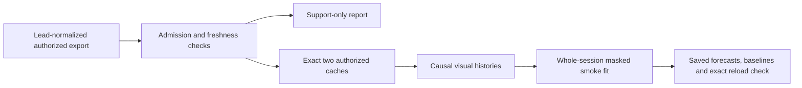
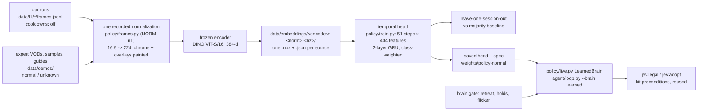

# Policy: the learned range policy

**Status (2026-09-30): CURRENT.** Owner: policy ([VUH-1346](https://linear.app/vuhlp/issue/VUH-1346); status lives there).
This section is the live-policy lane (2026-09-30 onward). Everything from "Policy: the learned chooser" down is HISTORY:
the MLX chooser and the VUH-1311 offline consumer. The earlier `policy/range_bc/` work is in
[end-to-end fit](end-to-end-fit.md) and [explore-policy](explore-policy.md).

## Live inference API (`policy/live_policy.py`)

`LivePolicy(bundle_dir, device="cuda")`, `reset()` per episode, `step(native BGR frame) -> Step`, `close()`.
`Step` carries semantic `held/press/release` dicts (only live-mask actions set), `yaw_deg`/`pitch_deg` per 1/30 s
step (yaw +right, pitch +down) and the same as deg/s, raw probabilities and latency. A bundle directory's
`bundle.json` names its files with sha256, the TRAIN-calibrated thresholds and the live mask; `kind` is
`encoder_h1` (the confirmed NitroGen no-history head) or `bc2` (below, optionally hybrid with the encoder_h1
action head on the same tower features). The live runner is live-loop's `agent/learned_runner.py`.

The cache views (global 144x256, crop 128x128) are computed on the GPU: 2560x1440 area scaling is exact average
pooling. Against the FFmpeg cache graph on real held-out frames: views within 1 grey level, 100% identical decoded
actions, 93% identical camera bins (near-boundary medians). The capture is full-range BGR, so the graph's YUV
conversion is skipped (`compact_bgr`). Frames of another size are resized to 2560x1440 on the GPU first.

Latency, RTX 4080 SUPER, game closed, 2 CPU threads: encoder_h1 p50 25.5 ms / p95 31.4 ms (the FFmpeg CPU path
was 42/50 idle and 75/144 under CPU load); 1920x1080 input p50 32 / p95 38 ms under concurrent FFmpeg load.
live-loop measured p50 31 / p95 43 ms inside its runner.

## Step 1 result: encoder_h1 through the live API (2026-09-30)

Bundle `D:/rivals-policy/bundles/ng-nohist-s1` (confirm seed 1). `policy/live_replay.py` on frozen-dev 171533,
60 s (1800 steps), James vs model: held F1 web_swing 0.83, amazing_combo 0.68, move_right 0.65, jump 0.55,
web_cluster 0.53, W/A/S about 0.3, spider_power 0.06 (3 presses vs 12). Yaw MAE 1.66 vs zero 1.42, moving-yaw
sign agreement 47%; pitch 0.41 vs zero 0.51. This reproduces the confirmation's "yaw worse than zero".
Overlay: `D:/rivals-policy/replay/ng-nohist-s1-171533/overlay-h264.mp4`, `overlay-10s.gif`.

## Step 2: observed ego-motion (`policy/bc2/`)

No earlier policy had an explicit motion input; the only "motion" any had was its own previous action, which
collapses when self-fed. bc2 adds motion observed between the previous and current frame: a small CNN over
grayscale frame pairs (global 72x128, crop 64x64) and phase-correlation shifts (global top band, crop). This is
James's camera offline and the pad's camera live, so offline and live see the same quantity. Frozen NitroGen
features stay; no previous-action input; LSTM 512; heads unchanged (3x15 action BCE, 2x31 camera classes, median
decode).

Timing check: a step's frame is the last one at or before the anchor, and its inputs fall in (anchor, anchor+33 ms],
so motion between frames t-1 and t cannot contain step t's input. Measured correlation of the global
phase-correlation x shift with James's yaw: r = -0.74 at step t-1, -0.70 at t (yaw autocorrelation), -0.63 at t+1
(session 025230; 171533 and 205528 agree).

Data: the ten cohort sessions' existing u8 caches on Modal volume `rivals-explore-chunks-20260927` (read-only);
features, runs and assets in `rivals-policy-bc2-20260930`. Extraction is about 1 GPU-minute per session (L40S).
Training holds the cohort on one H100; an epoch is about 7 s. The val session 212646 (registry split `val`) was
cached on the PC and is never used for selection; the frozen-dev pair selects the epoch by loss.

First sweep (seed 0, 12 epochs, dev 171533+205528 pooled, 24,556 steps):

| Arm | Press macro F1 | Yaw MAE (zero 1.735, persistence 0.597) | Moving-yaw sign | False turn when still | Pitch MAE (zero 0.714) |
|---|---:|---:|---:|---:|---:|
| full (features + motion) | 0.131 | 0.924 | 84.8% | 8.6% | 0.485 |
| motion only | 0.099 | 0.917 | 85.1% | 7.8% | 0.519 |
| features only | 0.137 | 1.690 | 52.5% | 13.3% | 0.595 |
| incumbent (ng-nohist-s1) | 0.288 | 1.773 | 58.1% | 24.8% | 0.597 |

The motion input accounts for the entire yaw gain. The buttons regressed because the fit was short: about 1.8k
updates against the incumbent's 15k.

### Clean val and onset (2026-09-30)

Val 212646 (28,048 steps) is never used for selection; the epoch with the lowest dev loss is taken, which lands at
5-10 in every run. Longer fits only overfit: 60 and 120 epochs also select about epoch 10. Batch 8 gives the most
updates per epoch and the best buttons. Numbers are for the selected epoch on val:

| Run | Press F1 | Yaw MAE (zero 1.831, persistence 0.645) | Moving sign | Still false turn | Onset sign / turned | Pitch MAE (zero 0.752) |
|---|---:|---:|---:|---:|---:|---:|
| bs8 seed 0 (`b-full-e30-bs8-s0`, bundle `bc2-bs8`) | 0.258 | 0.825 | 89.3% | 8.3% | 53.5% / 26.6% | 0.433 |
| bs8 seed 1 | 0.251 | 0.825 | 89.1% | 7.8% | 51.7% / 24.3% | 0.433 |
| bs8 seed 2 | 0.222 | 0.834 | 89.0% | 7.4% | 48.9% / 25.3% | 0.432 |
| bs32 seeds 0-2, 60 epochs | 0.18-0.20 | 0.86-0.89 | 88-89% | 7-9% | 47-49% / 16-20% | 0.46 |
| bs8 + green bearing, seeds 0-2 | 0.23-0.24 | 0.82-0.83 | 89-90% | 7% | 48-52% / 21-26% | 0.43 |
| incumbent `ng-nohist-s1` | 0.325 | 1.800 | 58.6% | 23.5% | 46.6% / 32.0% | 0.584 |

Onset means a step that turns (|yaw| >= 0.5 deg/step) after 3 still steps in the same run: 1,166 on val. Sign
agreement counts a zero prediction as a miss. By that measure onset stays near chance: the model continues and
tracks turns but rarely starts one. On the live-path replay (3 min of val, below) it nudges (|pred| >= 0.05) on 119
of 228 onsets, and on those its direction is right 74%.

The enemy-bearing input (`green_profile`: the enemy-green HSV band on the global view, with the finder's dead
zones, as column and row histograms plus bearings) finds nameplate bars cleanly at 256x144. It adds nothing at onset
over 3 seeds, so it is off by default.

Live-path replay (`policy/live_replay.py --targets`, bundle `bc2-a-full-s0`, val 212646, 5,400 steps from 30 s into
the longest run): yaw 0.92 vs zero 1.69, moving sign 83.6%. When an enemy is off-centre and James turns, he turns
toward it 69% of the time (594 of 866). On those toward-target turns the model agrees 82% overall, but only 32% at
onset (n=57, mostly zero predictions). Overlay: `D:/rivals-policy/replay/bc2-a-val212646/overlay-h264.mp4`,
`overlay-10s.gif`.

Bundles: `D:/rivals-policy/bundles/bc2-bs8`, and `bc2-bs8-hybrid` (bc2 camera with the incumbent's action head
and thresholds). Both run p50 40 ms / p95 46 ms on the 4080.

Live caveat: the motion input assumes about 33 ms between consecutive frames. A slower live cadence shows more
motion per step, which a closed loop could amplify. Callers reset() after gaps. The next fit trains with
frame-interval jitter and an interval input.

### Onset is a decode problem; frame-interval input (2026-09-30)

At turn onsets the camera distribution leans the right way, but its median sits on zero. The expectation (mean)
decode commits to the likelier side. On clean val, same checkpoints and 1,166 onsets:

| Decode | Onset sign | Yaw MAE | Moving sign | Still false turn |
|---|---:|---:|---:|---:|
| median (bs8 control `d-bs8-s0`) | 53.5% | 0.825 | 89.3% | 8.3% |
| mean (same checkpoint) | 77.1% | 0.818 | 93.5% | 11.2% |
| mean, frame-interval models, seeds 0-2 | 75.2-76.5% | 0.828-0.836 | 93.5-93.7% | 8.9-10.0% |
| mean, incumbent | 63.2% | 1.883 | 69.1% | 39.6% |

On dev the mean decode gives 70% onset sign. The incumbent's 63% shows this decode's chance line is above 50%;
bc2 is 14 points over it with a quarter of the false turns. Under the median, the steps where the model nudges at
all (|pred| >= 0.05, about 60% of onsets) have the right sign 81-85% of the time.

Frame-interval input (`Config.use_dt`): a training window samples every k-th step (k = 1, 2, 3 with probability
.6/.25/.15, i.e. 30/15/10 Hz) and k is an input next to the phase-correlation shifts. `LivePolicy.step(frame, t)`
passes the measured interval, clamped to 1-3 steps; after 0.5 s it passes no motion. Val cost: yaw 0.845 vs 0.825,
press F1 0.25-0.27. Bundles `bc2-dt-s1` and `bc2-dt-s1-hybrid` (checkpoint `d-dt-bs8-s1`) set
`camera_decode: mean` in bundle.json. They run p50 34-35 ms / p95 38-41 ms.

Training-side onset changes, seed 0, frame-interval base, on val (mean decode onset sign / still false turn):
base 76.5% / 8.9%; onset-weighted camera loss x3 77.0% / 11.9%, x6 75.5% / 13.8%; 15-step future-camera
auxiliary head 76.9% / 11.8%; both 75.6% / 11.0%. The lopsided decode (commit to one side's median when its mass
passes a threshold chosen so TRAIN's turn rate matches James's) scores no better than the median. None is kept.

Live path check: `live_replay` of `bc2-dt-s1-hybrid` on 2 min of val gives yaw 0.955 vs zero 1.761, moving sign
91.7%, onset sign 75.5% (n=155), pitch 0.463 vs zero 0.764
(`D:/rivals-policy/replay/bc2-dt-s1-hybrid-val-t/`). Without capture times the interval input saw replay
wall-clock gaps and yaw degraded to 1.29, so a caller must pass each frame's own capture time to `step`.

### Capacity (2026-09-30)

Frame-interval base, batch 8, clean val, mean decode:

| Core | Seeds | Press F1 | Yaw MAE | Moving sign | Onset sign | Pitch MAE |
|---|---|---:|---:|---:|---:|---:|
| LSTM 512 x1 | 0-2 | 0.25-0.27 | 0.828-0.836 | 93.5-93.7% | 75-77% | 0.435-0.439 |
| LSTM 1024 x1 | 0-2 | 0.29-0.31 | 0.805-0.816 | 93.8-94.4% | 76-78% | 0.417-0.429 |
| LSTM 1024 x2 | 0-2 | 0.28 | 0.776-0.813 | 93.4-94.1% | 78-79% | 0.401-0.406 |
| LSTM 1536 x2 (`h-l2-h1536-s0`) | 0 | 0.295 | 0.779 | 94.3% | 79.0% | 0.406 |

3 layers did not train: dev loss stayed near 3.8 for 25 epochs. Full-resolution global motion frames
(`Config.hires`) are worse on 3 seeds (yaw 0.87-0.90) and select epoch 3-4, so they are off.
Bundles `bc2-l2h1536` (p50 39 / p95 46 ms) and `bc2-l2h1536-hybrid` (44 / 52 ms).

## Step 3: IDM-labelled expert footage (`policy/bc2/expert.py`)

The idm lane labels footage's expert spans with full03 as REPLAY step tables (format agreed 2026-09-30): 30 Hz
anchors on 60 fps Twitch video, yaw/pitch degrees per step (null on abstention), press onsets for jump,
amazing_combo and web_cluster only, holds null. Their anchors step by frame pts (33.0 ms), so `load_labels` skips
steps.check_sequence's exact-stride check and runs the header and row checks.

Views come from a direct area downscale on the CPU: global = the whole frame at 144x256, crop = the centre square
of width x 256/2560 at 128x128, the same field of view as live. Against the live GPU path on the same 1080p
frames the mean difference is 0.06-0.08 grey levels (global) and 0.15-0.6 (crop). About 66 rows/s per process;
the features stage (tower, gray, green, targets) needs a quiet PC GPU window. Views compress only 1.3-1.8x, so
features (about 77 KB/step), not views, go to Modal. `train.fit(expert_dirs=..., expert_epochs=...,
expert_share=...)` mixes expert windows in, or pretrains on them then fine-tunes on James's data only. Selection,
thresholds and pos_weight stay on James's data; the gain is measured on James's dev and val against the
human-only runs above.

Pipeline on the shared PC (2026-09-30). Two stops by Claude Code's host-memory guard led to this split:
- The PC runs one views worker under `expert pipeline --views-only`, a supervisor that stops its whole process
  tree below 6 GB free RAM or while the game runs.
- Finished shards are packed as 4:4:4 q98 JPEG (3.4x smaller, mean error 0.7-1.0 grey levels) and shipped.
- The Mac unpacks them (Pillow decodes these byte-identically to OpenCV), runs the tower on MPS (31.5k rows in
  7.5 min) and uploads features to `rivals-policy-bc2-20260930:/expert-features/<shard>`.

Each idm video is split by run into ~30k-row shards; the source video is recorded in the header.

First result (labels v1 = IDM v2-a; one Req shard, 31,551 steps; seed 0; 2-layer 1536 base; the own-data rerun
reproduces the earlier run exactly):

| Arm | Val yaw | Val onset | Still false turn | Val press F1 | Val pitch | Dev yaw | Dev press F1 |
|---|---:|---:|---:|---:|---:|---:|---:|
| own data | 0.779 | 79.0% | 10.6% | 0.295 | 0.406 | 0.812 | 0.274 |
| expert mixed in | 0.754 | 81.0% | 9.6% | 0.300 | 0.397 | 0.783 | 0.298 |
| expert camera labels only | 0.775 | 80.9% | 8.1% | 0.317 | 0.401 | 0.789 | 0.271 |
| pretrain on expert + own, then own only | 0.780 | 79.5% | 8.4% | 0.306 | 0.399 | 0.793 | 0.284 |

Three seeds, Req s0-s2 as expert data (92,793 steps, +31%), means over seeds 0-2:

| | Val yaw | Val onset | Val still false turn | Val press F1 | Dev yaw | Dev onset | Dev still false turn | Dev press F1 |
|---|---:|---:|---:|---:|---:|---:|---:|---:|
| own | 0.786 | 79.1% | 10.2% | 0.314 | 0.809 | 76.6% | 11.2% | 0.290 |
| mix | 0.776 | 79.7% | 8.8% | 0.333 | 0.797 | 75.1% | 9.5% | 0.304 |

With 399,231 expert steps (Req 8 shards, Day 2871149954 4, Necros 1: three creators, 1.3x James's data):

| 3-seed mean | Val yaw | Val onset | Val moving sign | Val still false turn | Val press F1 | Dev yaw | Dev still false turn | Dev press F1 |
|---|---:|---:|---:|---:|---:|---:|---:|---:|
| own | 0.786 | 79.1% | 94.3% | 10.2% | 0.314 | 0.809 | 11.2% | 0.290 |
| + 93k (1 creator) | 0.776 | 79.7% | 94.3% | 8.8% | 0.333 | 0.797 | 9.5% | 0.304 |
| + 399k (3 creators) | 0.746 | 82.6% | 95.2% | 7.9% | 0.363 | 0.762 | 8.8% | 0.322 |
| + 399k, expert at most half the windows (2 seeds) | 0.761 | 81.8% | 95.1% | 8.3% | 0.369 | 0.786 | 10.1% | 0.336 |

At 399k, every mix seed beats every own seed on yaw, on val (0.736-0.755 vs 0.779-0.795) and on dev (0.755-0.769
vs 0.804-0.812). The gain grows with expert data and creators. Bundle `bc2-mix399-s0` (dev-selected by yaw): val
yaw 0.736, onset 82.0%, still false turn 7.6%, press F1 0.346.

At 93k the gain is modest; the one-shard seed-0 preview overstated it.

Grid i4 (the explicit 16-shard 468,699-step v2-a cohort below; 3 seeds): val yaw 0.755 (seeds 0.749-0.760), onset
80.5%, still false turn 8.7%, press F1 0.381, pitch 0.395; dev yaw 0.769, press F1 0.323. Compared with i3's 399k,
the camera plateaus and only the buttons still improve. The extra 70k is mostly more Necros plus a little
LuckyZeal, with no new Day or Req. More of the same v2-a labels no longer improves aim; label quality and new
creators are the next levers.

Label quality, grid j (the same 5 Day shards and original features; v2-a targets vs aligned v2-cd overlays via
`cloud.fit(expert_targets=...)`; 3 seeds each): val yaw v2-a 0.776 vs v2-cd 0.797 (own 0.786), onset 79.7% vs
79.0%, still false turn 9.1% vs 8.7%, press F1 0.354 vs 0.353; dev yaw 0.788 vs 0.813, press F1 0.327 vs 0.319.
The v2-cd IDM's better held-out label scores do not carry through to the policy at this scale: no gain, and
yaw is slightly worse. The comparison is one creator; a v2-cd seed-0 outlier (val yaw 0.819) widens the gap.

Cost: about 20 H100-minutes per run (about 637 s of training plus staging and eval), about $1.3. Grid j
cost about $9 including four runs that failed at startup (warm-container scratch reuse, fixed in `287eb2b`);
grid i4 cost about $4. On Mac MPS the same step takes 0.45 s, about 10 min per epoch at 700k steps.

With i4 flat on camera and j flat on labels, BC on this corpus has reached diminishing returns.

### Own vs expert-mix on James's held-out matches (2026-09-30)

James's Quick Matches `20260927T061107-953Z-150600-11` and `...061900-143Z-150600-12` (5.1 and 6.8 eligible
minutes) were never in any training: their step tables carry the `idm_train` split, which the range loader refuses,
and `local_eval.load_any_split` keeps the row and sealed checks. `policy/bc2/local_eval.py` builds their features
locally from the original videos, then evaluates the unchanged i3 checkpoints (inference only, $0). Mean
[min-max over 3 seeds]:

| | own (i1/i2) | mix399 (i3) |
|---|---|---|
| Yaw MAE (zero 1.922) | 1.586 [1.573-1.610] | 1.286 [1.264-1.305] |
| Moving sign | 74.5% [73.7-75.7] | 88.5% [88.0-89.3] |
| Onset sign | 61.1% [59.0-62.2] | 69.3% [68.1-71.0] |
| Still false turn | 13.9% [11.0-16.2] | 12.5% [10.4-14.2] |
| Press F1 | 0.152 [0.135-0.161] | 0.154 [0.121-0.175] |
| Pitch MAE | 0.572 | 0.519 |

On matches the expert labels cut yaw error by 19%, against 5% on the range, and the seed ranges do not overlap on
yaw, moving sign, onset or pitch. Buttons are unchanged and far below range levels on both arms.

idm's expert-footage label audit (docs/lanes/inverse-dynamics.md) has two findings for later expert runs:
- DayMR's camera degrees may read about 25% low.
- amazing_combo, get_over_here and web_cluster presses are unreliable for creators whose ability-row order differs
  from James's (DayMR, LuckyZeal, Rekriot, Simii).

`train.fit(expert_mask=)` makes those channels unknown per creator, keyed by the shard's `expert_context.player`.

### learned-01 A live idle: a copycat on observed motion (2026-09-30)

In the first live run with `bc2-mix399-s0` (`data/calibration/compat-check-20260929/learned-01-a/`, 126 decisions),
the median yaw was 0.0 and there were no presses. `policy/live_diagnose.py` replays the 81 retained frames through
LivePolicy and reproduces the idle: max hold probability 0.011 and turn probability 0.001, against 0.52 and 0.59 on
James's frames at the same 10 Hz. The following are ruled out:
- the capture clock (forcing a 30 Hz clock gives 0.048);
- JPEG;
- the controller HUD, whose swap in either direction changes nothing;
- capture colour, whose statistics match;
- the scene: James frames nearest in feature space (cosine 0.92) give 0.52.

An input-swap ablation isolates the cause: live frames with James's motion input give 0.275 and 0.383, while James
frames with the live motion input give 0.011. Swapping in James's image features or green profile changes nothing,
and James's own first frame repeated (zero motion) gives 0.020. The model predicts stillness whenever nothing moves,
and stillness produces no motion. James is never fully still for long: 10.9% of val steps are still, and the
longest still stretch is 42 steps (1.4 s).

Motion-input dropout (`train.batch(motion_dropout=)`: blank the motion over a random 25-100% span of a window;
grid k, i3 cohort, seed 0, about $2.6) does not meet its pre-stated keep criterion: hold >= 0.3 and turn >= 0.2 on
the retained live frames. At p = 0.3 hold is 0.041, turn 0.045 and max press 0.314; at p = 0.5 they are 0.038,
0.045 and 0.266. Both runs are discarded. As a side result, p = 0.3 keeps val yaw at 0.742 and raises val press
F1 to 0.405 (mix399 0.346). The likely limit is that the scene around a blanked span still shows James in
action, whereas live the whole scene is idle standing, a state absent from the data.

Static-input augmentation (`train.batch(static_aug=)`: over a random span, freeze the whole input to the span's
first frame, with zero motion, while the targets stay James's real actions; grid l, i3 cohort, seed 0, DayMR camera
and swapped-slot presses masked, about $1.3) also fails its keep criterion, on one of four conditions. On the
retained live frames hold rises to 0.178 (needs 0.3) and turn to 0.465 (needs 0.2, passes). Val yaw is 0.754 and
press F1 0.369 (both pass); dev yaw 0.772, F1 0.342. The run is discarded. Freezing the whole input moves the camera
side from a static start; hold probabilities stay below the per-action thresholds. James's start-from-still
recordings (recipe with the lead) target the missing state directly.

#### Known limitation: far bots are invisible at 256x144 (2026-09-30)

Every visual input (the tower's global view and `green_profile`) is the 256x144 area view, and area averaging
dissolves thin enemy outlines. Sampling every 5 s over five James sessions (1,585 frames; val 212646 and train
203745, 035932, 021320, 052001) gave the following results.
- The outline finder (`perception.outline` at 1280x720) sees an enemy in 991 frames.
- In 31% of those frames the green mass at 256x144 is zero. At 512x288 it is 5%, and at 1280x720 1%.
- By tallest outline height at 720p, the zero rate at 256x144 is 71% under 20 px, 55% at 20-39 px, 25-27% at
  40-79 px and 12% at 80 px or more.
- Raw green at 1280x720 is also nonzero in 71% of the frames without a finder enemy, so at full resolution the
  finder, not the raw band, is the clean bearing.

That limitation does not explain the idle, which the input swap above pins on the motion input. At James's yaw
onsets (600 sampled on val, `train.evaluate`'s rule, median 0.76 deg/step), the enemy bearing barely predicts his
turn direction, even at full resolution:
- the finder's nearest enemy at 720p agrees on sign 57% of the time (present 80%);
- green at 1280x720 agrees 53%, or 60% off-centre by more than 0.1;
- green at 256x144 agrees 49-55%;
- turns of at least 1 deg with the finder bearing off-centre by more than 0.3 agree 68% (n=47).

A 512x288 green input (a re-decode of James's steps) was therefore not funded as an idle fix. A future policy
architecture needs a view that resolves far bots, whether a higher-resolution view or the finder bearing as an
input. rl already uses the 720p finder bearing live. The measurement
used one-off CPU scripts (not kept), built on `views_from_bgr`, `green_profile` and `outline.find_enemies`.

Latency (`LivePolicy` CUDA graph, `74ebd74`): the whole bc2 step replays as one graph, with outputs identical to
eager. Under idm's ~60% GPU load, p50/p95 fall from 54.7/63.2 ms to 21.6/33.9 ms; with a saturating matmul
load as well, from 75.9/89.1 to 41.0/45.2 ms.
`bc2-mix399-s0` remains the camera pick (budget note to the lead, 2026-09-30). False turns and buttons improve on both sets, yaw
improves slightly, and onset is flat on val and 1.5 points lower on dev. Views for later videos are built on the
Mac from idm's per-span clips, which keep the original timestamps; rows match clip frames within 1 ms. Bundle
`bc2-mix-s1` (dev's pick by press F1): val press F1 0.364, above the incumbent head's 0.325, so it needs no
hybrid. It runs p50 38 / p95 46 ms.

### Full-scale A/B: 3.7 h vs ~51 h of expert footage (2026-10-01, exploratory, 1 seed)

The two arms differ only in their expert pool:
- **A:** grid-l's 13 shards, 388,796 r1 steps.
- **B:** 185 shards, 5,374,887 steps. That is 33 old v2-a shards with idm's aligned r1 tables plus 152 new shards
  extracted from v2-cd rows (`policy/bc2/fullscale.py`), streamed from container disk.

Both draw 6,350 expert windows per epoch from their own generators (`fit(expert_windows=)`), with identical human
windows, so both take 48,780 steps. The shared recipe is r1 labels, static_aug 0.3, the kill-window camera weight
x5 (`kill-rows-onset5.json`), press_p soft targets, LMB press unknown and the still-start take at 15%. The
overnight chain was `fullscale_driver.py`.

Mean decode throughout:

| Arm | Dev yaw | Dev onset | Val yaw | Val onset | Held-out -11/-12 yaw | Held-out onset |
|---|---:|---:|---:|---:|---:|---:|
| bc2-mix399 (3 seeds) | 0.755-0.769 | 77.2-77.8% | 0.736-0.755 | 82.0-83.4% | 1.286 | 69.3% |
| fs-A | 0.901 | 72.6% | 0.857 | 79.2% | 1.501 | 61.1% |
| fs-B | 0.803 | 75.1% | 0.800 | 81.0% | 1.390 | 65.0% |
| fs-A, no kill weight | 0.801 | 74.8% | 0.796 | 77.7% | 1.423 | 64.6% |
| fs-A, v2-a labels | 0.816 | 76.3% | 0.814 | 81.4% | 1.450 | 60.8% |

- **Scale:** B beats A on yaw everywhere. The val onset gain is +1.8 points, short of the pre-stated +3, so the
  result is not kept.
- **Recipe:** the shared recipe regresses camera against mix399. Removing either the kill weight or r1 labels
  recovers about half of the dev gap; their combination is untested.
- **Costs and verdicts:** `docs/runs-ledger.md` rows 30-31.
- **Result files:** `D:/rivals-policy/replay/heldout-matches-fullscale-{AB,ablations}.json`.

Pipeline facts found on the way:
- **NVDEC:** NVDEC frames shift the frozen tower's features by about 12% (about 0.1 grey level), so expert shards
  use software decode.
- **MPEG-TS seeks:** a seek can land 1.8 s late; `decode_rows` re-seeks earlier.
- **Time holes:** in-run anchor holes over 1.5 steps start a new sequence (`data.session_arrays`).
- **Overlap videos:** in 10 videos the v2-cd anchors interleave the old shards' frames. Those videos keep only their
  old shards; the excluded shard is listed in `D:/rivals-policy/fullscale/excluded/`.

### Explicit next scaling cohort and v2-cd alignment (2026-09-30)

The five grid-i3 reports were already collected when temporary policy ownership began; all five name the same
13 shards / 399,231 expert steps. Their Modal app `ap-yHoZU5QlkSlroa0lxrYqUz` stopped at 11:34:59 CDT with zero
tasks. No additional fit was run during the relief window.

The ready next comparison is [`grid-i4-mix469.json`](../../policy/bc2/grid-i4-mix469.json): seeds 0-2, 30 epochs,
batch 8, LSTM 1536 x2, frame-interval input, full expert mix, with the same human TRAIN, frozen-dev selection and
val reporting as grid-i3. At 12:14 CDT, all six files of each of its 16 explicitly named feature shards were
listed on `rivals-policy-bc2-20260930:/expert-features`; the Mac's completed-upload markers agree. This is 468,699
v2-a expert steps: Day 116,847, Req 248,268, Necros 94,230, LuckyZeal 9,354. More arriving shards do not enter this
comparison. The spec also requires the existing `idm v2-a (v2-a.pt)` label source; it cannot silently become a
v2-cd run. Compare against the existing three `i3-mix-s*` reports; no own-data refit is needed. The cached array
volume grows about 9% over grid-i3 (same model and batch); runtime and peak device memory remain estimates until
run. This spec is prepared, not launched; a paid launch remains the lead's next decision.

`cloud.fit` now accepts `expert_sessions` and `expert_label_source`. It rejects missing shard files, duplicate
names, mismatched session metadata and mixed/incorrect label sources, then stages only those shards locally.
The old automatic enumeration remains available for callers that omit the explicit list.

The original v2-cd exports could not reuse the two Day videos as a useful training cohort. A read-only join of
the full local v2-a and v2-cd step tables found **zero `(run, anchor_ns)` matches** in either video: the wider IDM
window changes the nominal export grid's origin. Exact `(run, frame_index, pts, timebase)` matching gives:

| Video | Existing feature rows | Exact frame matches | Unmatched old rows | Longest retained run | Runs of at least 32 steps |
|---|---:|---:|---:|---:|---:|
| 2871149954 | 116,847 | 76,570 | 40,277 | 2 | 0 |
| 2872282230 | 80,154 | 52,580 | 27,574 | 2 | 0 |

Runs reset across gaps in either the old or new row sequence. The input tables and target-only audit outputs are
under `D:/rivals-agent-local/idm-labels/{v2-a,v2-cd}/` and `D:/rivals-policy/relief-20260930/alignment.json`
respectively; the latter records both input hashes and target hashes. Original features and labels were not
changed. The needed IDM export uses the original v2-a anchor/frame grid with v2-cd interval answers, retaining
nulls and trimming unsupported ends. Rebuilding features or joining by nearest timestamp is unnecessary at this
point. The IDM owner supplied that exporter in `1fe92d9`; creator-FOV scaling remains off.

`expert.relabel` now checks the source video and original shard hash, joins exact physical frames, records the
full ensemble checkpoint, and writes `feature_row` indices. `train.Session` uses those indices for every cached
input array, refuses ambiguous target/feature length mismatches, and preserves the new run boundaries. A fit
refuses an expert shard with no run of at least 32 steps, rather than counting it as expert data while training
on no expert windows. Focused synthetic regressions cover a shifted clock, missing edge/interior rows, all four
input arrays, wrong-source/duplicate/no-match refusals, an arriving shard, mixed labels and empty training
support. The existing tiny CPU fit also passes. No game input, decoding, feature rebuild or paid function ran.

The aligned exports under `D:/rivals-agent-local/idm-labels-aligned-20260930/v2-cd/` pass the real target-cache
consumer check: 2871149954 keeps 115,187 rows in 332 trainable runs (max 1,771); 2872282230 keeps 79,084 rows in
214 runs (max 1,606). Only 1,660 / 1,070 old boundary rows are omitted. Both original full-video frame-key sets
match the corresponding seven Mac shard sets. The four uploaded shards of the first video plus `2872282230-s0`
have separate `targets.npz`/`meta.json` copies under `D:/rivals-policy/relief-20260930/targets-v2cd-aligned/`, also
staged at `/Users/james/dev/policy-bc2/relief-20260930/targets-v2cd-aligned/`: **144,415 rows, 415 trainable runs**.
Every copy's original shard byte hash matches the cached feature metadata. Those files overlay targets only;
the original `/expert-features` volume is unchanged. The second video's s1/s2 feature uploads were not verified
complete at this check, so no target copy was produced for them. Full-video and per-shard counts/hashes are in
the sibling `alignment-aligned-*.json` and `aligned-shards-*.json` files. This resolves the alignment prerequisite,
not the remaining multi-creator v2-cd exports or a v2-cd fit. Such a fit must stage the separate target copies
with their original features; the prepared grid-i4 comparison still uses v2-a exclusively.

# Policy: the learned chooser (steps 1-3)

**Status (2026-09-29): HISTORY.** The MLX chooser and the VUH-1311 offline consumer (`policy/behaviour.py`); this part stays their record.

## Expert future-behaviour offline consumer (VUH-1311)

`policy/behaviour.py` implements the offline consumer independently accepted at
`d97de93`; the same reviewer also accepts the actual video-header correction and
faithful normalization. The same reviewer accepts the separate writer/cache clocks
and exact inspected-frame lookup. Metadata/support admission passes for the 15 accepted rows (8 Day, 7 Req),
and the timestamp-only integration probe selects all 765 inspected context indices
exactly. `data/experiments/next-behaviour-v1/NORMALIZATION.md` retains both initial
preflight failures and current evidence. The explicitly authorized `smoke-01` run
completes once on landed `f16f4b2`, using only the two admitted embedding arrays.
Both temporal checkpoints reload to exactly equal saved predictions. This is an
offline pipeline result with `performance_claim: false`; no media or PC access,
live adapter, restart or tuning accompanies it.
The consumer forecasts four compatible channels from causal `[t-5,t]` history for
`(t,t+2]`; raw comparison artifacts remain training-unauthorized. The earlier lane
sections below remain unchanged.

The runner reuses the frozen DINO cache format, `train.step_row`'s visual prefix
and `train.Head` (projection + two GRUs). Exact cache paths replace the existing
directory-wide cache scan at the admission boundary. Inputs have 386 columns:
384 embeddings, embedding-present and scene-masked. There are no event, State,
label-mask, onset, outcome, source-time or annotation columns in the neural input.
Scene-mask evidence is available at each historical step. The packet/event writer
uses copyts origins Day **1.616 s** / Req **0 s**; the encoder/cache is rebased to
Day **0.027 s** / Req **0 s**. Decimal metadata arithmetic requires
`cache_origin = writer_origin - container_start` (Day container start **1.589 s**),
and sidecar `t_first == t_origin == cache_origin`; cache timestamp validation also
requires the actual first array timestamp to equal that origin. Unknown or mismatched
container/origin metadata is refused. The legacy `media_pts` tag alone does not
identify which extraction clock is used.

`grid_time(t, i, offset)` forms `Decimal(str(t))-5+Decimal(i)/10+Decimal(str(offset))`
and converts to float once. Consumer evidence validation and normalization use
zero offset; lookup uses the separately validated cache offset. Reservation endpoints
use the same conversion. Cache arrays remain unchanged. Search is strict native
at-or-before with the .12 s age and reservation guards; the chosen timestamp must
also equal the declared inspected grid point. An earlier frame is not substituted
for the observation mask's frame. No epsilon, nearest-frame selection or array
rounding is used. An unmasked missing exact frame fails.


```mermaid
flowchart LR
  A[Lead-normalized authorized export] --> V[Admission and freshness checks]
  V --> S[Support-only report]
  V --> C[Exact two authorized caches]
  C --> H[Causal visual histories]
  H --> F[Whole-session masked smoke fit]
  F --> R[Saved forecasts, baselines and exact reload check]
```

### Normalized export v1

The lead owns normalization/admission, not this runner. Supply one JSON object;
private annotator formats and the raw canary comparison are not adapters. Unknown
fields are rejected. All timestamps are finite source seconds, booleans are actual
JSON booleans, and every source/row is checked before cache payload access.

- Header: `task: "expert-next-behaviour-v1"`, `training_authorized: true`,
  `clock: "source_seconds"`, `history_s: 5`, `horizon_s: 2`, `frame_hz: 10`,
  `code_sha256`, `sources`, `rows`. `code_sha256` is exactly the fixed path-to-SHA256
  mapping returned by `policy.behaviour.code_versions()` after review.
- `sources` keys are exactly `daymr-2879354299-21660-900s` and
  `reqmr-2873352801-1980-900s`. Each value has `group` (respectively
  `twitch:2879354299` / `twitch:2873352801`), `pts_offset` (1.616 / 0),
  `manifest` and `events` (each `{path, sha256}`), `cache_sidecar_sha256`,
  `cache_sha256`. Export paths are exact **repository-root-relative** strings:
  `data/demos/vods/<id>.manifest.jsonl` and
  `data/demos/events/sections/<id>.jsonl`. Media identity is fixed to
  `data/demos/vods/<id>.mp4`; media is never opened. `--cache` must name
  `data/embeddings/vit_small_patch16_224-dino-n1-10hz` under the repository,
  with exact `<id>.json` and `<id>.npz` files. All bindings, including symlink
  checks on files and ancestors, pass before any artifact is read or hashed;
  the complete check runs again before cache payload reads. Manifest event/media
  links and sidecar media identity must match those fixed bindings. Manifest `media`
  has the loader’s `{kind: "video", path: "<id>.mp4"}` shape; `path` is a string
  resolved against the manifest directory. Other kinds and redirects are refused.
  Sidecar `media` remains a repository-relative string. No caller
  override or directory scan exists. Hashes then establish freshness; manifest
  promotion/patch, frozen event writer, cache encoder/masks and clocks are checked.
  This enforces source scope, not cryptographic approval or protection against
  hostile concurrent replacement. Tests substitute only an in-memory repository
  root containing synthetic artifacts.
- Each row: unique `id`, `source`, `t`, boolean `eligible`,
  `training_authorized: true`, `evidence_from`, `evidence_to`, `label_known_at`,
  `context`, `channels`, `recent_attack`. Eligibility includes accepted suitability
  for this imitation task. The reservation includes at least `[t-5,t+5]`, stays
  inside the retained 900 seconds and includes **every** consumed evidence point,
  span start and availability time, including any earlier selected cache frame.
  `label_known_at` is only an upper bound on future-label availability, never a
  substitute for an assertion's own coverage.
- Every concrete assertion's evidence is exactly `{from, to, known_at}` in source
  seconds. `from/to` retain the entire inspected span (a point uses equal bounds);
  `known_at` retains when the assertion becomes available. Require
  `evidence_from <= from <= to <= known_at <= evidence_to`. A negative's span
  certifies complete inspected coverage, not merely two endpoint observations;
  normalization must not bridge gaps, crop early evidence or invent timestamps.
  Unknown assertions have null evidence, and stay unknown if these bounds cannot
  be retained. Evidence bounds establish the declared contract, not annotation truth.
- `context` is exactly 51 records ordered at `s = grid_time(t,i)` (declared decimal 10 Hz):
  `{scene_masked: bool, evidence: {from, to, known_at}}`. Evidence covers s and is
  available by s (`from <= to == known_at == s`). These are observation masks,
  **not** aggregate annotation/loss masks. A wholly hidden history is refused.
- `channels` has exactly `approaching_visible_enemy`, `attacking`, `moving_away`,
  `traversing_without_visible_enemy`. Each has `accepted_state`, `imitation_mask`,
  `onset`, `onset_bounds`, `continuation`, `context_state`, plus `accepted_evidence`,
  `onset_evidence`, `continuation_evidence`, `context_evidence`. State fields use
  `present/absent/unknown`; each evidence field is the bound object above or null
  for its unknown state. `imitation_mask` equals eligible AND accepted-state-known;
  ineligible descriptive judgments remain loss-masked but retain valid evidence.
  Concrete context evidence covers t and is available by t. Each future assertion
  has its own evidence available by `label_known_at`. Presence requires a span
  intersecting `(t,t+2]`; **every absence** requires its own full `[t,t+2]` coverage.
  Onset is known only with absent context; continuation only with present context.
  Known conditional states must agree with occurrence. In this bounded consumer,
  future presence with an unresolved transition (including a possible restart)
  keeps that conditional state unknown, rather than supplying an absence target.
  A positive onset has `onset_bounds: [lo,hi]` denoting `(lo,hi]`, with
  `t <= lo < hi <= t+2`, fully contained in its own evidence span. Otherwise bounds
  are null. Positive continuation evidence crosses t into the future.
- `recent_attack` is two `{present: bool-or-null, evidence: object-or-null}` records,
  respectively confirmed offensive-event rules over `(t-1,t]` and `(t-5,t]`.
  A concrete baseline retains evidence covering the entire corresponding lookback
  and available by t (`from <= t-lookback`, `to == known_at == t`). This conservative
  contract applies to positive and negative controls. Missing/partial coverage
  remains null and uses fit-majority fallback, not a negative. Baseline evidence
  is never a neural input.

Full evidence footprints form connected overlap clusters including endpoint contact.
Support reports raw positive/negative cells, eligible unknowns, ineligible rows,
onset/continuation states and independent homogeneous clusters. A mixed positive/
negative cluster earns neither independent class count. Whole-session folds keep
each broadcast intact; the split helper retains the full-footprint + 5 s purge
rule for shared groups. There is no within-session calibration split in this runner.

### Fixed smoke recipe and checks

The single completed, explicitly authorized invocation is recorded below;
`smoke-01` contains the original artifacts and is not a fresh rerun destination:

```sh
PYTHONDONTWRITEBYTECODE=1 nice -n 10 /tmp/rivals-policy-format5-venv/bin/python -m policy.behaviour \
  --export data/experiments/next-behaviour-v1/accepted-export.json \
  --cache data/embeddings/vit_small_patch16_224-dino-n1-10hz \
  --out data/experiments/next-behaviour-v1/smoke-01 --smoke-fit
```

Without `--smoke-fit`, admission and support reporting read only metadata/evidence
and cache sidecars, not embedding arrays. The output directory must be new.
Unsupported folds are explicitly skipped before payload reads if no fold is usable.
For usable smoke folds, payload validation precedes output creation, so admission
and payload refusals preserve existing outputs and create no partial run directory.
The only fitting mode is `pipeline_smoke_only`; it cannot emit a performance pass.

The [smoke result](../../data/experiments/next-behaviour-v1/smoke-01/README.md)
retains pre-run pins, execution, both fold reports, checkpoint paths and artifact
hashes. Code/export/source/cache fingerprints match before and after. Fit Req →
held Day supports only attacking (held4P/4N); fit Day → held Req supports approach,
attacking and traversal (held3P/0N,5P/1N/1U,0P/7N respectively). Away lacks fitting
negatives in both folds. Unknown masks and both whole-source folds remain unchanged.

Attack occurrence balanced accuracy is **0.625 held Day / 0.900 held Req**, versus
strongest listed baseline **0.625 / 0.700**; onset BA is **0.667 / 0.833**.
Continuation has only1 positive and no negatives per fold. All attack-event baseline
evidence is null, so those controls use fit-majority fallback. No channel reaches
the20P/20N support gate; Day also misses the recall/BA and baseline-improvement
gates, and no positive paired-cluster confidence bound is claimed. These results
establish the first expert future-behaviour smoke pipeline, not performance
acceptance or learned gameplay. The lead owns acceptance and any next experiment.

The H2 recipe is fixed: seed 0, 40 epochs, batch 64, Adam .001, hidden width 128,
balanced masked BCE and final-epoch checkpoint. Unknown channels and ineligible rows
contribute no loss; channels missing either fitting class are unsupported. Embedding
mean/scale are fitted only on observed frames in useful fitting rows, saved, and
applied unchanged to held data; observation bits remain unchanged. No encoder fit,
hyperparameter search, restarts or held-data normalization occurs.

Comparisons use identical supported held rows: constant positive/negative,
fit-majority, privileged locked-context persistence, decision-frame-only head,
fit-only source-time/mask-fraction ridge nuisance control, and 1 s / 5 s attack-event
rules (other channels use majority for those rules). Occurrence, onset and
continuation reports stay separate: onset is conditional on known-absent context,
continuation on known-present context. They apply occurrence forecasts to their
own supported targets, not a separately trained onset head. Smoke results
do not satisfy the predeclared 20/20 support, per-fold recall/balanced-accuracy,
baseline-improvement and cluster-interval performance gates. Two sessions cannot
establish creator-independent skill. No forecast is converted into pad input.

Artifacts retain the admitted export and fingerprints, recipe, support, per-fold
checkpoint/normalization, baseline predictions, label masks and metrics. Reload uses
the recorded 128-row evaluation grouping and must match saved probabilities exactly.
Synthetic-only verification uses the accepted writer fingerprint in an isolated fixture, including
checks that changing either the event writer or producer fingerprint refuses admission before
embeddings open. It includes a tiny test-only one-epoch optimization:

```sh
uv run --group perception --group policy pytest -q tests/test_behaviour.py
```

The synthetic suite covers the original 30 cases plus complete canonical binding
before hashing (including second-source and cache-read rechecks), symlink redirects,
actual sidecar-producer compatibility, nonzero/zero-offset nextafter controls and
maximum age, evidence points/span starts/lookbacks, per-assertion negative coverage,
conditional contradictions, valid positive onset and unknown exclusion, and output
preservation. The header correction adds seven malformed-kind/path and redirect
controls against a fixture using the actual loader shape. The clock correction uses
rebased cache fixtures, six container/origin/first-timestamp refusals and exact
pt2-02/04 first-frame regressions with pt2-05 as control. All **75 synthetic checks**
pass, including the explicitly allowed tiny synthetic optimization/reload check.
The separate real integration probe opens only hash-bound `t.npy` members, selects
all **765/765** inspected context indices and excludes nextafter futures at every
cutoff; it does not load embeddings or run histories.
The reviewer’s four demonstrated defects are encoded as regressions;
no additional skill/rule change is needed. The implementation, normalization and
clock delta have independent acceptance. The recorded smoke outcome remains a
pipeline result under the explicit one-run authorization.

## GOH hindsight no-use feasibility audit (VUH-1311)

The bounded discovery and one independent Claude review are frozen under
`data/experiments/no-use-audit-v1/`. `HANDOFF.md` is the entry point and
`REVIEW-DISPOSITION.md` carries the combined result and corrections. Seed0 selects
48 episodes (24 per creator) from exactly the promoted Day and Req train sources;
format5 writer `21a390f547eb`, glyph thresholds and GLYPH_EVIDENCE remain unchanged.
The latter stays off. All proposal rows are training-unauthorized.

The owner conclusion is **NOT SUPPORTED**; the reviewer concludes **FALSIFIED**.
Both reject minting negatives. Native Req cast7/8 scene effects support conservative
>.7/>.6s effect-to-countdown lag, defeating the proposed m=.5 onset premise.
The review additionally calls Day witness5 a complete false H=2 certificate using
first gold759.4 as use evidence, before horizon end759.5 and witness s760.0.
The pixels and positive glyph match are verified; gold-implies-use semantics remain
disputed. The accepted kit does not establish that meaning, and the frozen reader
also describes gold as a possible buff state. The accepted disposition is
NOT SUPPORTED, with the stronger conditional falsification disputed. No alternative
m/D_min is independently justified.

`EVIDENCE.md` and `evidence.json` retain one producer table per episode, separate
no-use/causal-availability fields, unknowns and full look-ahead footprints.
`REVIEW-DISPOSITION.md` supersedes two producer timestamp cells and records both
accepted and unsupported reviewer timing corrections against original native frames.
Four proposed witnesses have countdowns at t; later glyphs cannot prove availability.
Observed digit-to-icon-return ranges (Day7.1–8.0s, Req7.0–8.0s) are display measurements,
not universal input-to-expiry bounds. Prohibition, scoreboard gaps, pre-round waiting,
death and frozen round-end timers remain controls; native category shortages are
not replaced. Media-derived artifacts stay local under data.

`PRODUCER-FREEZE.json` and `review/SHA256SUMS` preserve the producer and independent
20-case review; `FINAL-FREEZE.json` fingerprints the combined packet. The bounded
`check.py` passes source/frame integrity,48-table and no-authorization checks.
Gold-state attribution remains unresolved; no stronger falsification claim follows.
Any mechanics study or validation is separately scoped;
no extraction, tuning, fit or rule change follows automatically.

## Format-5 policy consumer seam

The format-5 writer/loader and policy consumers are integrated on `a016991`; the
accepted regenerated two-source corpus uses writer `21a390f547eb`. Fresh raw reads
and H1/H2 support are complete under `data/experiments/b0-format5/`. The released
fixed H2 experiment is complete under `data/experiments/b0-multilabel-format5-h2/`;
both final checkpoints reproduce exactly. WEB occurrence improves over every
declared baseline, but timing is worse than the fit-median baseline, so the joint
claim screen is **no_improvement** in both folds. Other claims remain inconclusive.
`policy/train.py` requires finite `known_at >= t_to` (otherwise `EventEvidenceError`,
before the loader accessor) and counts events by availability
at each historical step. The four event columns are verified damage events
(`hp_lost` with `cause=damage`), web fire, icon dimming and icon lighting. Unknown-cause
HP loss is not damage; icon appearance is not mechanical readiness. Feature width
stays unchanged and checkpoints record the event-channel names.

`b0.targets` keeps occurrence bounds for labels and retains uncertainty as a separate
flag. Uncertainty blocks same-channel negatives, including confirmation margins.
An independent contained cast can prove occurrence while an earlier uncertain use
still disables first-use timing. Target construction for historical baselines filters
by `known_at` **before** cast/charge corroboration: later corroboration cannot rewrite
an earlier baseline input. A confirmation beyond the recorded source duration does
not certify a positive.

Numeric countdown observations are required for ability-negative coverage; lit icons
and elapsed cooldowns do not certify readiness. Countdown values may decrease, but
cannot reset upwards. All samples must share one possible expiry interval using
the writer's `ROUND_S` and `TIMER_EPS`; the intersection must exceed 1e-6 s. This
rejects frozen digits and impossible jumps. Charges and ammo must remain constant.
Charged slots require
valid badge counts under the writer's kit maximum; absent maxima are unknown.
This certificate covers every 10 Hz read in `[t-.1,t+H+.2]` with the existing .6 s
segment margin. A timer reaching zero or disappearing makes coverage unknown.
The resource age bucket means time since timer-end **evidence arrived**, not readiness.

The corrected runner uses the predeclared **two-second** horizon throughout its
structural gates, targets, timing output and negative-support spacing. Distinct-positive
support is a conservative lower bound: per segment count disjoint intervals within
each evidence kind and take the largest count, never the sum of cast and charge
witnesses. Report unpaired charge witnesses separately; their timing is ambiguous
when a cast witness shares the horizon. This does not claim physical-use identity.
The context-event proxy uses only the current segment; each window also reports
same-segment occurred events not yet known. Support diagnostics copy the loader's
`known_after_segment_end` and `known_after_segment_end_unbridged` skipped-row counts,
separating events unavailable in either mode from those available only when bridged.

`policy/b0_support.py` produces H1 diagnostics or H2 support in fresh directories.
Its header records format, semantics, source fingerprints, windows hash and input
hashes. The H2 builder checks these before cache arrays are opened. It reads exactly
the authorized source caches and supplies no state or event columns to the model.
Artifact reader metadata is an explicit provenance subset: format, writer, layout,
sampling/clock fields, slot mapping and kit patch/source/table. Event aggregates,
alarms, cut timestamps and recipes stay in their hashed source files.
The raw-read adapter retains all eight reader fields and optional ninth glyph field.
Targets use `Demos.window_event`; masked reads never certify a use, while their
uncertain occurrence interval still blocks a negative.
The global-next-event CLI has no fitting path.

Synthetic checks: 34 pass in a source-only integration tree using writer `bdc145b`
and loader `dcd29c4`, including real Visibility construction and the support-producer
through H2-builder path. The expiry sweep preserves 600/600 valid windows per horizon; four additional
mutations target expiry, rounding-boundary tolerance, resets and charge changes.
The prior ten targeted mutations cover the previously uncovered guards. One additional
synthetic slice check passes with reads before and after the requested horizon,
and catches passing the whole timestamp array to the expiry check. Tests in
`test_b0_format5.py` explicitly skip on format 4. This recount uses the accepted
pipeline without a broad test rerun or code changes.

The support commands use fresh outputs; existing artifacts must not be overwritten:

```sh
python -m policy.b0_support --horizon 1 --out data/experiments/b0-format5/support-h1
python -m policy.b0_support --horizon 2 --out data/experiments/b0-format5/support-h2
python -m policy.b0_multilabel
```

The last command builds without fitting. `--fit` additionally requires support and
a nonconstant fitting channel. Every output uses a separate format-5 directory;
archived reproduction requires its recorded code revision.

## Corrected support disposition

Raw extraction is serial/niced: Day 8,985 reads (308.8 s), Req 9,001 (314.3 s),
with native reader origins 1.616 s and 0 s. The pre-count `run-record.json` records
actual dedicated-venv commands, revision, fingerprints, unchanged H1 diagnostic/H2
task and gates. Source and code fingerprints match at recount completion. The
support-only recount opens no cache arrays and performs no model fit; the separate
released H2 experiment uses explicitly selected caches for the two accepted IDs.

H2 structural windows: Day 1,764, Req 2,207. In channel order get_over_here, swing,
uppercut, web_cluster_fired, teamup, conservative distinct-positive lower bounds are
Day **29/51/50/84/0**, Req **25/52/14/101/0**; nonoverlapping two-second negative
horizons are Day **18/2/3/58/23**, Req **9/2/0/69/35**. Only **web_cluster_fired**
clears the 20-positive-lower-bound / 20-negative-horizon held floor in both sessions.
Day fitting classes are both present for the first four channels; Req fitting
classes are both present for get_over_here, swing and web_cluster_fired. Req uppercut
has 99 positive / 0 negative windows. Teamup has zero verified positives in both
sessions and is unsupported; uncertain evidence is not promoted to positive.

H1 remains diagnostic only: 1,894 Day / 2,299 Req structural windows. Full H1/H2
per-channel windows, unknown reasons, ambiguous charge pairings, timing support,
interval widths and fold dispositions are in
`data/experiments/b0-format5/recount.json` and `support-handback.md`; original support
reports/windows are in `support-h1/` and `support-h2/`. `support-SHA256SUMS` fingerprints
the recount, run record and source sidecars. The 10 Hz intersample limit and
unquantified Day icon-overlay contamination remain limitations. Archived artifacts
are unchanged; support is not a gameplay or model-performance claim.

## Corrected H2 result

One fixed fit per direction uses the unchanged five-output masked setup, seed 0,
40 epochs, batch 64 and final-epoch selection. No tuning or restart is performed.
The actual command and fingerprints are separate from immutable `run-spec.json`
in `execution-record.json` under `data/experiments/b0-multilabel-format5-h2/`.

| WEB metric | Day fit → Req held | Req fit → Day held |
|---|---:|---:|
| Model F1 | 0.730085 | 0.762481 |
| Always-negative F1 | 0 | 0 |
| Fit-prior / fit-majority F1 | 0.703043 | 0.722335 |
| Most-recent-use F1 | 0.400943 | 0.363636 |
| Raw-HUD resource F1 | 0.703043 | 0.247117 |
| Model timing interval error (s) | 0.470716 | 0.416854 |
| Fit-median timing error (s) | 0.291937 | 0.309756 |
| Timing common-support rows | 524 | 410 |
| Mean occurrence width (s) | 0.347901 | 0.320000 |
| Joint claim screen | no_improvement | no_improvement |

WEB fitting P/N is 532/409 for Day and 670/566 for Req. Useful fitting windows are
1,244 and 1,548; held windows are 2,207 and 1,764. Training elapsed is 13.263 s and
15.587 s. HUD resource uses extra raw HUD information absent from neural inputs;
all comparisons use identical observed masks and fitting-side-only statistics.
Timing compares distance outside retained intervals on common support; wider bands
are not improved precision. Teamup is excluded from both fits/comparisons; Req-fit
uppercut is excluded. All non-WEB channel claims remain inconclusive.

`reproduce.py` reloads both actual `model.safetensors` checkpoints and recomputes
predictions with batch 128 plus natural tails 31 and 100. Both logits and delays
have max absolute replay error **0.0**. Saved baseline outputs, fitting statistics,
model/baseline metrics, common-support timing and claim screens reproduce.
`reproduction.json`, `completion.json`, `README.md` and `SHA256SUMS` retain evidence;
per-fold `report.json` and `predictions.npz` include full descriptive metrics.
Exact replay requires the recorded grouping; MLX can differ across batch sizes.
No verification refit or broad test run is performed.

This negative joint-gate result establishes no combo selection, swinging, tactics,
live control or generalization beyond two creator/session-confounded development
folds. Frozen-reader uncertainty, nonrandom masks, 10 Hz gaps and unquantified Day
overlay contamination remain limitations. The lane is stopped after handback.

## Archived B0 masked occurrence experiment

The retained format-4 experiment, code `5046b25`, implements the reference task in
[learning-plan.md](../learning-plan.md#b0-auxiliary-pretraining-by-predicting-observed-ability-events):
five independent event-occurrence outputs and five class-conditional timing outputs.
Unknown labels are masked independently; timing has a separate mask. The original
global-next-event build under `data/experiments/b0/` is retained: **22 Day and 96 Req
windows, all negative, zero eligible positive events, no fit or checkpoint**.
`policy/b0_support.py` records the support diagnostic that establishes the revised task.

Both real local development folds are complete. The fixed configuration is two
128-wide GRUs, 51 causal steps at 10 Hz, five-second history, one-second horizon,
5 Hz decisions, Adam 0.001, batch 64, 40 epochs, seed 0, threshold 0.5, final epoch
only. Inputs are frozen DINO `n1` embeddings and masks, shared layout columns 0–385;
`step_row` receives `state=None, events=None`. Classification is balanced masked
binary cross-entropy. Conditional timing loss is distance outside the verified interval.
Normalization is fixed; class weights, priors, resource buckets and median interval
midpoint delays are fitted only on the fitting session.

### Results and support

Metrics describe the observed subset, not all gameplay. Positive-class macro F1:

| Predictor | Day → Req, all five | Day → Req, supported four | Req → Day, all five supported |
|---|---:|---:|---:|
| Frames-only GRU | 0.477 | 0.512 | 0.554 |
| Always negative | 0.000 | 0.000 | 0.000 |
| Fitting prior / majority | 0.232 | 0.290 | 0.000 |
| Recent-use persistence | 0.181 | 0.226 | 0.110 |
| Raw-HUD resource buckets | 0.535 | 0.597 | 0.390 |

The resource baseline uses causal raw cooldown, charges/ammo and time since an
observed ready transition, with unknown buckets, Laplace(1,1) smoothing and a
fitting-prior fallback for unseen buckets. It has structured HUD information absent
from the neural input. Persistence means an accepted same-channel event confirmed
in `(t−1,t]`; extractor prefix causality is unproven, so it is an offline reference.
All comparisons use identical observed masks. Brier error, log loss, precision,
recall, F1 and confusion for every channel are in each fold's report.

Timing error on identical timing-supported rows is **0.178 s model / 0.132 s median**
for Day → Req and **0.193 s / 0.148 s** for Req → Day. Per-channel interval widths,
timing coverage and errors are retained. The model does not beat the timing baseline
on any channel. **No channel passes the combined classification-and-timing improvement
gate.** Req team-up is additionally inconclusive under the predeclared support floor.
This is a completed negative/inconclusive probe, with no gameplay competence claim.

The support floor is 20 distinct positive events and 20 non-overlapping one-second
negative horizons in the held session. Counts are unique events / non-overlapping
negative horizons, not overlapping-window counts:

| Channel | Day | Req |
|---|---:|---:|
| Get Over Here | 42 / 24 | 35 / 81 |
| Swing | 32 / 30 | 35 / 127 |
| Uppercut | 54 / 38 | 23 / 94 |
| Web Cluster | 80 / 165 | 93 / 197 |
| Team-up | 20 / 153 | 17 / 239 |

The dataset has 1,937 Day and 2,305 Req structurally eligible windows; 403 contain
loader-masked past scene steps. Training uses 1,414 Day and 1,836 Req windows with
at least one supported observed label. Reports include positive/negative/unknown
counts per channel/session and split by whether an accepted ability/ammo event was
confirmed in the preceding five seconds. That context-event proxy is a sampling
diagnostic, not a tactical label or neural input. Masks are not missing at random:
calm scenes more often provide clean negatives. The two sessions confound creator
and session; 10 Hz sampling cannot establish intersample visibility; Day's small
icon-overlay contamination prevalence is unknown, not zero. Dim icons without
countdowns remain unknown; the HUD lockout probe supplies no new negative labels.

### Artifacts, reproducibility and checks

`data/experiments/b0-multilabel-v1/` holds the immutable `run-spec.json`,
`dataset-report.json`, `dataset.npz`, `windows.json`, `report.json`, `fit.log` and
`verification.json`. Each `day-to-req/` and `req-to-day/` directory contains:
`model.safetensors`, `report.json`, `predictions.npz`, `windows.json`, and
`resource-tables.json`. The declaration is distinct from actual execution commands
and code fingerprints in completed reports. Raw reads remain referenced in
`data/experiments/b0/visibility/`; they are neither copied nor re-extracted.

```sh
nice -n 10 uv run --no-sync --group policy --group perception python -m policy.b0_multilabel --fit
uv run --no-sync --group policy --group perception pytest tests/test_b0.py tests/test_policy.py -q -k 'b0 or every_cached_source_resolves or source_whose_origin or time_past_the_clip'
```

The command refuses before rebuilding any dataset artifact when a final checkpoint exists. Retain completed artifacts
before intentionally repeating the experiment. Training took 15.41 s Day → Req and
18.66 s Req → Day. Both actual saved checkpoints reproduce logits exactly (maximum
absolute error 0); all saved classification, baseline and common-support timing
metrics reproduce with evaluation batches of 128 (including the natural final short
batch). The co-lead independently reproduces complete folds with maximum logit and
delay error 0.0. Regrouping 17 spread samples into a different batch gives up to
0.00713 logit difference for the final Day → Req row, which originally ran in a
one-row final batch. Preserve the recorded batch grouping for exact replay; this
batch-size numerical sensitivity is not a checkpoint mismatch. **17 focused checks pass**: 14 B0 and three synthetic legacy
clock checks. An independent co-lead review finds no blocking core issue and
independently reproduces the 13 B0 checks and all ten negative support counts.

`Demos.load_split("s10-normal-v0")` and `clips_in("train")` are the entry point.
Before payloads, B0 requires exactly the promoted Day/Req IDs and groups. The split
remains proposed; no test/inspection-only side is requested or unsealed by B0.
`Cache` requires explicit keyword `ids`; the range trainer passes its selected run
IDs, B0 passes its two train IDs, and legacy clock tests use synthetic payloads.
The co-lead reports that an earlier legacy-test run may have opened sealed embedding
arrays before this hardening; none entered B0 fitting, metrics or model selection.
Do not describe the entire multi-agent session as having opened no sealed payload.

`policy/b0_reads.py` persists unchanged frozen-reader raw fields and fingerprints.
Day's native origin 1.616 s and cached origin 0.027 s differ by the container start
1.589 s; their relative clocks agree. `Cache.index_at` uses its own recorded origin.
Native cuts are projected through `_cut_flags` onto sampled-frame timestamps before
comparison with the accepted event metadata. Completed report fingerprints preserve
the source present during the fits; those artifacts are not rewritten by the format-5 seam.

## B0 machinery reference

The current-only B0 task predicts per-ability occurrence with masked unknown labels,
as specified in [learning-plan.md](../learning-plan.md#b0-auxiliary-pretraining-by-predicting-observed-ability-events).
This section describes the shared machinery and its distinction from the range-intent trainer.

### 1. Paths and commands

| Path | What it is |
|---|---|
| `policy/corpus.py` | Every source: media path, creator, split `group`, `cooldowns` and `patch` with the evidence for each. Reads manifests; no pixels |
| `policy/frames.py` | The recorded normalization (`NORM = "n1"`): ffmpeg decode at source rate, scale the whole 16:9 frame to 224x224, paint HUD and overlay rects with the ImageNet mean. Also the frame decoders |
| `policy/encode.py` | The embedding cache: frozen `vit_small_patch16_224.dino` (384-d), per-source `.npz` plus sidecar `.json` |
| `policy/train.py` | `layout()` (the only copy of the feature offsets), `step_row()` (one timestep), `Cache` (at-or-before lookup), `windows()`, the GRU head, folds and baselines |
| `policy/live.py` | `LearnedBrain`, the runtime chooser behind `agent/loop.py --brain learned`. Not live; not part of B0 |
| `data/embeddings/vit_small_patch16_224-dino-n1-10hz/` | The cache. `<source>.npz` holds `emb` (float16, n x 384) and `t` (decoded seconds); `<source>.json` holds provenance, `clock`, `t_origin`, `sidecar_version` (3) |
| `data/demos/splits/s10-normal-v0.json` | The split. `proposed`; train `twitch:2879354299` (DayMR) and `twitch:2873352801` (ReqMR); test (sealed) `twitch:2877719252`, `twitch:2871472478`; val pending; two YouTube uploads unassigned |
| `data/demos/vods/*.manifest.jsonl`, `data/demos/events/**` | The four sources the split names, and their event streams: 14 files, format 4, writer `1336262e179c` |
| `tests/test_policy.py` | 42 tests |

```sh
uv run --group policy python -m policy.encode --all --kinds vod   # build or extend the cache; niced; skips cached sources
uv run --group policy python -m policy.encode --refresh           # rewrite sidecars from current provenance, decodes nothing
uv run --group policy python -m policy.encode --list              # what is cached
uv run --group policy python -m policy.train --regime normal --out report.json   # a fit on OUR OWN runs (see below)
uv run --group policy pytest tests/test_policy.py                 # full suite
uv sync && uv run pytest tests/test_policy.py                     # stdlib-only: 10 pass, 32 skip
```

The `policy` uv group resolves in the same universe as `perception` only because of three
`[tool.uv] override-dependencies` in `pyproject.toml` (numpy 2, current mlx, and dropping
mlx-image's `opencv-python`). Do not remove them.

`policy.b0_multilabel --fit` runs the B0 folds. Its builder enters through
`Demos.load_split("s10-normal-v0")`, takes only the two promoted train sources, and reuses
`step_row`, `Cache`, `layout` and the GRU head with masked occurrence and timing targets.
`Cache` requires explicit source IDs; loader clip IDs equal cache keys. `policy.train`
separately fits scripted-brain intents on our own range runs through `Demos.load(*paths)`.

### 2. The feature layout

One timestep is a vector of **405** values at embedding dimension 384; a window is **51 steps**
(5 s at 10 Hz, including the decision frame), oldest first. The range-intent trainer
left-pads short histories with zeros and clear bits. B0 omits short histories entirely
and uses only the 386-value frames-only prefix. The offsets are written in one place,
`policy/train.layout(emb_dim)`, and `policy/live.py` reads it.

| Cols | Field | Shape, units | Bits | Kind |
|---|---|---|---|---|
| 0-383 | embedding | 384 float32, frozen DINO CLS of the `n1` frame; unitless | | frames-only |
| 384 | `emb_present` | {0,1} | a cache row at or before the step, no staler than `MATCH_S` = 0.12 s | frames-only |
| 385 | `scene_masked` | {0,1} | the loader's `Mask.hidden` contains `scene` | frames-only (the mask comes from the HUD segmenter's segments) |
| 386-387 | hp | fraction of max, [0,1] | value, known | state |
| 388-389 | ammo | web charges / 5 | value, known | state |
| 390-395 | swing, get_over_here, uppercut | ready {0,1} each | value, known each | state |
| 396 | detections | min(count, 5) / 5 | no known bit | state, scene-derived |
| 397-398 | on_target | {0,1} | value, known | state, scene-derived |
| 399 | `state_present` | {0,1} | a `State` dict was recorded for the step | state |
| 400-403 | events | counts in (t - 1 s, t] of `hp_lost`, `web_cluster_fired`, `slot_unavailable`, `slot_available` | | **event input** |
| 404 | `events_present` | {0,1} | the clip has an event stream | event input |

An unknown value is a zero with its known-bit clear, never a guess. A field named in
`Mask.hidden` is zeroed together with its known-bit. `hidden` values are `scene` (embedding and
scene-derived state), `hud` (every HUD field), or one field (`hp`, `ammo`, a slot). `player`
drops nothing, because no feature is player-specific.

**The state channel is empty on expert footage.** It comes from our own loop's `State` rows, so
on every expert window its bits are clear. There is no layout version constant in code. The
layout is pinned by `NORM`, the encoder name, `layout()`, the width and the saved head's spec
(`width`, `emb_dim`, `state_f`, `event_f`, `event_kinds`). Whoever next changes the layout adds
the constant first.

**Deliberately absent:** target identity and track ids; remaining episode time and option status
(RL only); ult, team-up, `ability_cast`, charges and the kill feed as inputs; chat (unmasked
pixels, not a feature); audio.

**The causal event-input gate.** Event columns may feed a model only once it is shown that
perturbing footage after t leaves every event feature at t unchanged. That covers the extractor's
temporal cleanup and per-source slot mapping, not just `t_to <= t`. **Status: not demonstrated;
no such test exists.** The `(t - 1 s, t]` bound proves timestamp causality only. **So the
reference fit is frames-only:** columns 0-385. Events supply targets and explicitly separate
offline diagnostic baselines, never neural inputs. `step_row` fills columns 400-404 whenever
it is handed events, so the B0 builder passes `events=None`.

### 3. Folds and baselines

- **Development folds** use only the accepted train side of `s10-normal-v0`: two leave-one-session-
  out folds, DayMR to ReqMR and ReqMR to DayMR. Report each direction separately, because creator
  and session are confounded. Every fitted quantity (class weights, training majority, timing
  medians) comes from the fitting session alone. The pipeline has no fitted normalization
  statistics: embeddings are raw, and state uses fixed scalings.
- **Never touched:**
  - the sealed test broadcasts, for development, learning curves or model selection;
  - the val side (pending: asking for it raises `PendingError`);
  - a fold's held-out session, by any stage fitted for that fold, **pretraining included**;
  - the unassigned uploads, ever.
- **The range-intent trainer has a separate split contract.** `policy.train.TRAINABLE`
  includes train, val and test for its own recordings. B0 takes only the promoted `train`
  side through `Demos.load_split` and forms development folds within those two sessions.
- **Implemented B0 baselines**, scored on identical observed held-out channel masks:
  - *always negative*: zero occurrence probability;
  - *fitting prior / majority*: per-channel positive frequency on observed fitting labels,
    with the fixed 0.5 threshold for majority;
  - *recent-use persistence*: any accepted same-channel event confirmed in `(t-1,t]`,
    filtered on `known_at` before corroboration;
  - *HUD resources*: numeric cooldown, validated charges/ammo and time since a known
    timer-end event, in fixed buckets fitted only on the fitting session;
  - *timing*: fitting-only median interval midpoint, compared on common timing support.
  The range trainer's previous-decision sticky baseline is not B0 persistence. B0 reports
  per-channel precision/recall/F1, confusion and probability error, plus descriptive and
  support-gated macro F1; it has no sixth `no_verified_event` class.

### 4. Who may promote a source

**Only the lead, on the independent reviewer's acceptance, never the training worker.**
The two train manifests explicitly assign their promoted sources to `train`; the split
intentionally remains `proposed`, so the loader preserves those manifest assignments.
Reserved test sources remain sealed. An accepted split also requires each source's
manifest to allow its assigned side (`splittable`, split null or that side); the split
file never overrides provenance.

**`Demos.load_split(name)` is the only door.** It refuses with:
- `PendingError`: asking a pending side for anything;
- `SealedError`: requesting a sealed side or an iterator containing a sealed source,
  including reserved sources under `inspection_only`, without explicit unsealing; B0 never unseals;
- `ProvenanceError`: two provenance records disagree, or a claim has no basis;
- `RegimeError`: a split mixing patches or cooldown regimes;
- `SplitError`: a group on two sides or on none, an unassigned group listed, or a silently empty side;
- `FormatError`: an event file that differs from the integrated loader's format, or is stale (meta lacks required keys, or its
  `writer` is not the current producer's fingerprint);
- `AlignmentError`: an annotation over a context the loader would not give;
- `LeakageError`: an observation holding anything later than t.

`Demos.load(*paths)` exists, and our own runs use it, but no split rule applies there.

### 5. Traps

- **A scripted edit that misses its target does nothing and reports nothing.** A `str.replace`
  whose old text is one line off leaves the file unchanged. Assert that the match happened, grep
  for every name you added, and check that the test count rose by the expected amount before
  claiming a test exists.
- **`Cache.at` is at-or-before, on one clock.** A video's rows are absolute decoded PTS; `Cache`
  subtracts the sidecar's `t_origin` (the first decoded PTS, 0.027 s on
  `daymr-2879354299-21660-900s`). It then takes the latest row at or before t, never the nearest:
  the nearest can be after t. Check lookups by time with `Cache.index_at`. Event times arrive on
  the loader's clip clock, which the cache is verified against. No cast has been checked against
  its pixels in the cache.
- **`CacheMiss` versus a mask.** A source absent from the cache, or an empty cache, raises
  `CacheMiss`, and so does a window in which every step is a miss. A hidden scene is a fact with
  its own bit. The two must never look alike: a zero block is not "masked".
- **`Mask.hidden` is per field.** One hidden HUD slot must not drop a visible scene. `step_row`
  drops exactly what `hidden` names.
- **Clip time, sampling and short segments.** Expert play segments have medians of 4-12 s. B0
  requires the full five-second context for its first run, so report the eligible duration. A
  bridged scoreboard gap is usable only with its mask and a proven absence of a hard cut.
- **Decoding cost.** H.264 caches at 200-400 frames/s. AV1 runs at about 100 frames/s, and
  VideoToolbox is slower than software for it. `showinfo` goes after the scale.
- **Event format and inputs.** The policy seam requires format 5; the separate loader
  migration must land with it. The range-intent trainer counts known past events;
  B0 keeps them out of its frames-only neural input.

**Built and measured offline. Nothing here aims, presses a button, or runs live.** This lane
replaces *what* the agent decides — today `agent/brain.py`'s hand-written rules — with a model
that reads the last few seconds and names an intent from the existing vocabulary. The
engineered controller still executes it. v0 uses a fixed live target heuristic and makes no
learned-target claim: target identity is not observable in expert footage
([learning-plan.md](../learning-plan.md), "VOD perception and normalization").

Expert labels are not ready (the HUD event stream is being fixed for match footage, and
tactical-purpose annotation has been piloted on six windows). Step 1 is the part that does not
need them: every frame of every source, through one frozen encoder, once.

```sh
uv run --group policy python -m policy.corpus            # what exists, with its regime
uv run --group policy python -m policy.encode --bench    # decode and encoder throughput
uv run --group policy python -m policy.encode --probe    # what the encoders separate (and do not)
uv run --group policy python -m policy.encode --all      # fill the cache; niced, resumable
uv run --group policy python -m policy.train             # leave-one-session-out, regime off
uv run --group policy python -m policy.train --split tail  # the control (see below)
uv run --group policy python -m policy.live --bench       # step 3 latency on this Mac
uv run --group policy pytest tests/test_policy.py        # 42 tests (stdlib-only ones also run bare)
```


```mermaid
flowchart LR
  R["our runs<br/>data/l1/*/frames.jsonl<br/>cooldowns: off"] --> N
  V["expert VODs, samples, guides<br/>data/demos/<br/>normal / unknown"] --> N
  N["one recorded normalization<br/>policy/frames.py (NORM n1)<br/>16:9 -> 224, chrome + overlays painted"] --> E
  E["frozen encoder<br/>DINO ViT-S/16, 384-d"] --> C
  C["data/embeddings/&lt;encoder&gt;-&lt;norm&gt;-&lt;hz&gt;/<br/>one .npz + .json per source"]
  C --> T["temporal head<br/>policy/train.py: 51 steps x 404 features<br/>2-layer GRU, class-weighted"]
  T --> M["leave-one-session-out<br/>vs majority baseline"]
  T --> H["saved head + spec<br/>weights/policy-normal"]
  H --> L["policy/live.py LearnedBrain<br/>agent/loop.py --brain learned"]
  G["brain.gate: retreat, holds, flicker"] --> L
  L --> K["jev.legal / jev.adopt<br/>kit preconditions, reused"]
```

## Regime is part of a source's identity

Every practice-range recording made before the 2026-09-20 baseline ran with Practice Settings
**No Ability Cooldown ON**: infinite ammo, the ult relit in seconds, no cooldown numbers. That
is a different game from normal-resource play, and the two are never mixed in one training or
evaluation set (the co-lead's reward contract). Every source carries `cooldowns`:

| Value | Sources | What it rests on |
|---|---|---|
| `off` | `tagrun`, `tagrun0`, `tagrun1` | recorded before the baseline; `policy/corpus.py: RUNS` |
| `normal` | the four 15-minute VODs and the two 60 s samples, 62 min | matchmade footage whose HUD shows cooldowns running and ammo reloading. An inference from the footage, not a settings menu read |
| `unknown` | all nine guides, 106 min | one guide mixes range demonstrations (often cooldown-free) and match clips; nobody has read the regime off the screen |

A run that states `cooldowns` in its `meta.json` is believed over the table, which is how runs
recorded after L4 disables the setting arrive as `normal`. A run in neither place is `unknown`,
never assumed. The field is in every cache sidecar, so the trainer filters on it without
having to remember which recording was which.

**Distilling the scripted brain on `off` runs is pipeline proof only.** It is not tactical
learning from the experts and cannot be evidence of improving on its teacher.

## The recorded normalization (`policy/frames.py`, `NORM = "n1"`)

Both domains take one path: decode at the source's own frame rate, scale the whole 16:9 frame
to 224x224, paint the HUD and the known permanent overlays with the encoder's mean colour
(a masked region normalizes to ~0, the least-activating input). The version stamp is in every
cache entry, so an embedding cannot be read as having come through a different normalization
than it did.

| Masked | Bounds (fractions) | Why |
|---|---|---|
| objective banner / PRACTICE RANGE panel | `0.00,0.00 - 0.32,0.16` | game chrome, both domains |
| score and round timer | `0.31,0.00 - 0.69,0.11` | game chrome |
| kill feed | `0.76,0.00 - 1.00,0.10` | game chrome |
| bottom HUD band | `0.00,0.855 - 1.00,1.00` | hp, ammo, ability slots, portrait, UID line. The HUD lane reads these at native resolution; nothing may re-read hp off a 224 px thumbnail |
| FPS/ping counter | `0.91,0.13 - 1.00,0.30` | the same green block on both creators and our own PC |
| DayMR only: music widget, sponsor panel, avatar | `0.00,0.59 - 0.13,0.83`, `0.79,0.69 - 1.00,0.82`, `0.57,0.65 - 0.77,0.87` | painted on every frame of his video and nothing else's. The avatar is person-like, which the learning plan requires masked |

Bounds were read off inspected frames from both creators and one of our runs, then confirmed
by a temporal-std map over 120 frames spread across each 15-minute VOD: a permanent graphic is
a pixel that never changes while the scene does. Every rect grows by 2 px at 224 to absorb the
scale's bleed. What survives: 71% of the frame for us and Req, 63% for DayMR
(`visible_fraction`, in each sidecar).

**Chat is not masked.** The std map shows it scrolling, so it is not a permanent graphic, and
its panel sits over live play (the learning plan's warning that blanket-masking the chat column
costs recall). The accepted risk instead: a model may key on "chat text is present" as a creator
cue, which held-out-session metrics are what would expose. Changing the mask costs one
re-encode of the corpus, about fifteen minutes.

**Times are decoded PTS, never a nominal grid.** Frames are picked by source frame index
(`select='not(mod(n,K))'`, the sampling the learning plan verified on these 60 fps sources) and
their real timestamp is read back from ffmpeg's `showinfo`; the sample clips are variable frame
rate (the demos lane measured Req at 4082 frames in 60.08 s against a reported 60/1). A run's
times come from its `frames.jsonl`, thinned to the cache rate. A source whose frame and
timestamp counts disagree is refused rather than given times that are not its own.

## What was measured, and what it does not show

This Mac (M5 Max), niced, MLX, the game not running. Decode is ffmpeg to raw RGB at 224.

| | batch 1 | batch 64 | dim |
|---|---|---|---|
| `mobilenet_v3_small` | 3.2 ms, 316/s | 4972/s | 576 |
| `resnet18` | 3.1 ms, 323/s | 2048/s | 512 |
| `vit_base_patch32_224` | 3.4 ms, 292/s | 2845/s | 768 |
| **`vit_small_patch16_224.dino`** | **3.6 ms, 280/s** | **1758/s** | **384** |

Decode + mask alone runs at 453 frames/s on a 1080p60 H.264 VOD at 10 Hz — 45x realtime — so the
**decoder, not the encoder, is the cache's limit**, and which codec a source arrived in matters
more than which encoder reads it. End to end, the Twitch matches (H.264) cache at 200-400
frames/s and the YouTube guides (**AV1**) at about 103 frames/s with ffmpeg saturating four to
six cores; AV1 has no usable hardware path here (`-hwaccel videotoolbox` measured *slower* than
software, 560 against 1300 sampled frames/s). A full rebuild of the corpus is therefore about
four minutes of match footage and ten of guides, niced. **Throughput does not
discriminate the four candidates**: the slowest encodes the entire corpus in under a minute,
and at batch 1 they are within 0.5 ms of each other, so runtime placement (step 3) is not
constrained by the choice either. All four are small enough to be unremarkable beside a game
on a 4080 (1.8-4.6 GFLOPs); that is an argument from size, not a measurement on that machine,
and the PC's GPU belongs to the game anyway.

**The tie-break that was attempted, and failed honestly.** A ridge probe on one frame's
embedding, predicting the intent our own runs logged:

| Encoder | held-out session | last 30% of each session |
|---|---|---|
| `mobilenet_v3_small` | 0.07 / 0.61 / 0.44 | 0.40 / 1.00 / 0.84 |
| `resnet18` | 0.11 / 0.61 / 0.46 | 0.34 / 1.00 / 0.83 |
| `vit_base_patch32_224` | 0.11 / 0.67 / 0.41 | 0.32 / 1.00 / 0.82 |
| `vit_small_patch16_224.dino` | 0.04 / 0.59 / 0.26 | 0.35 / 1.00 / 0.78 |
| *majority baseline* | *0.45 / 0.61 / 0.66* | *0.48 / 1.00 / 0.84* |

(`tagrun` / `tagrun0` / `tagrun1`.) **No candidate beats the majority baseline on any split**,
and on `tagrun` every one is far below it. Two reasons, and neither is the encoders': these three
recordings are `scripts/l4_trial.py` logs with a four-symbol vocabulary of its own
(`Engage`, `Combo`, `stand`, `Search`, and `tagrun` contains no `Search` at all), heavily
imbalanced, and the last 30% of `tagrun0` is a single class; and a single 224 px frame cannot see
what the scripted brain actually reads — tag state, ability readiness, measured range. This says
nothing about whether a temporal head over 5 s of embeddings plus event and `State` features can
reproduce the scripted brain. It does say the existing three recordings are a thin label source,
and that **the loop's own runs are what step 2 trains on**.

**So the encoder choice does not rest on a measurement that separates them, and this says so.**
`vit_small_patch16_224.dino` is taken for the smallest embedding (384, the least to overfit when
labels are scarce) and self-supervised features that carry no ImageNet class prior. The cache is
keyed by encoder, so revisiting the choice costs one re-run; the measurement that
would actually settle it is step 2's held-out agreement, on real labels, with the temporal head
that consumes these vectors.

**Known ceiling, not yet paid for:** at 224 px across a 16:9 frame an enemy 20-40 px wide at 1080p
becomes 2-5 px. v0 chooses coarse intents from context and a fixed heuristic picks the target, so
this may be enough; if step 2 is blind to engagements, the upgrade is a larger working resolution
or a second centre-crop stream, both a cache rebuild and no other change.

## Step 2: the temporal head, and the first held-out number

`policy/train.py` reads about 5 s of history at 10 Hz and names the intent the recorder logged
next. Windows come from `agent/demos.py` — it owns segments, whole-recording splits and the
leakage guards, and an `Observation` refuses to hold anything later than its own `t` — and each
`FrameRef` is resolved against the cache by (clip, decoded time). No second schema.

Three channels per timestep, each with its own present bit, **missing never filled**: the 384-d
embedding; the loop's `State` where a row carried one (hp, ammo, ability readiness, detections,
crosshair — every unknown is a zero with its known-bit *clear*, never a value); and HUD events
where a run has a stream. No run has one today, so that channel is absent on every window and is
wired for the day one exists. 404 features, 51 steps. The head is a 2-layer GRU over a 128-d
projection, class-weighted so the rare intents are not swamped.

**The numbers, regime `normal`, patch Season 10 / 20260911, the loop's own runs only** (four
300 s baselines, 6,000 windows; L4's trial logs are a different recorder and are excluded).
Leave-one-session-out, against two baselines — the majority class, and **sticky**, which repeats
the previous decision's intent:

| Held out | Windows | Accuracy | Train majority | Sticky | Intent changes | Accuracy on those | Fits own training set |
|---|---|---|---|---|---|---|---|
| `baseline1` | 1500 | 0.547 | 0.464 | **0.908** | 138 | 0.435 | 0.978 |
| `baseline2` | 1500 | 0.980 | 0.000 | **0.999** | 1 | – | 0.261 |
| `baseline3` | 1500 | 0.792 | 0.411 | **0.961** | 59 | 0.525 | 0.922 |
| `baseline4` | 1500 | 0.997 | 0.002 | **0.997** | 5 | – | 0.954 |

**The head now beats the majority baseline** on the two sessions that contain more than one intent
(0.547 against 0.464, 0.792 against 0.411) — it did not before. **It beats sticky nowhere.** That
is the number that counts: intents are sticky, so repeating the last decision is right 91-100% of
the time, and a temporal model has to be better than doing nothing.

The only place a model can beat sticky is the moment the intent **changes**, where sticky scores
zero by construction. There the head gets 0.435 (138 windows) and 0.525 (59 windows) on the two
usable sessions. Those counts are the real limit: **two of the four baselines are single-intent
runs** — `baseline2` is 1,500 windows of `engage`, `baseline4` is 1,496 of `search` — so across
20 minutes of recording there are 203 decision changes in total. Transitions, not minutes, are
what this lane is short of.

*The sticky baseline had to be fixed before it meant anything: measured against the intent one
control tick (~33 ms) earlier it read 0.99+ with 0-12 changes per fold, because consecutive rows of
`frames.jsonl` agree by construction. It now compares against the previous decision in the same
session.*

**Two recorders, two vocabularies.** L4's trials log `Engage`, `Combo`, `stand`, `Search`; the
loop logs `engage:enemy`, `search`, `combo:burst`, `webstrike:enemy`, `pull:enemy`, `idle`.
`vocab_of` lowercases and cuts at the colon, but **`stand` and `idle` are deliberately kept
apart**: one is a scripted pause, the other is the loop standing the controller down. The trial
logs are excluded from training entirely (`recorder="loop"`), so the two never pool.

**Per-class recall on the change windows** (the only windows where beating sticky is possible):

| Held out | combo | engage | pull | search | webstrike |
|---|---|---|---|---|---|
| `baseline1` (138 changes) | 0.37 (38) | 0.72 (61) | 0.00 (4) | 0.05 (21) | 0.07 (14) |
| `baseline3` (59 changes) | 0.95 (20) | 0.41 (29) | – | 0.00 (8) | 0.00 (2) |

The head finds transitions into `engage` and `combo` and almost never into `search`, `pull` or
`webstrike` — the classes with 2-21 change examples each.

**Transition weighting does not help; it hurts.** The cheapest thing aimed at transitions:
multiply the training weight of windows whose label changes within the next 3 decisions by 8
(542 of 6,000, 9%), evaluated identically:

| Held out | Accuracy | On changes | Fits own training set |
|---|---|---|---|
| `baseline1` | 0.547 → 0.529 | 0.435 → **0.355** | 0.978 → 0.896 |
| `baseline3` | 0.792 → **0.300** | 0.525 → **0.373** | 0.922 → 0.489 |

Worse on the change windows in both usable sessions, and `baseline3` falls below its majority
baseline. Up-weighting a few hundred near-duplicate windows makes fitting unstable (training fit
drops to 0.489) without adding a single new transition to learn from. The two single-intent runs
move only on 1 and 5 change windows, which is noise. **More weight on the same 203 transitions is
not a substitute for more transitions**; short verified-start episodes are. (A first attempt at
this run silently trained unweighted — the flag never reached the trainer and the result matched
the baseline digit for digit. A test now pins that the flag arrives.)

## Step 3: the learned chooser behind the loop's seam

`policy/live.py` gives `LearnedBrain`, which has `brain.decide`'s signature, so
`agent/loop.py --brain learned` reads nothing special of it. **The scripted gate runs first**,
exactly as the Jev path does — retreat, a playing hold and a flickering target never wait on a
model — and the head only replaces `brain.policy`. Every answer then goes through `jev.legal`,
the same kit preconditions `brain.policy` enforces, and is adopted with `jev.adopt`, the same hold
and mode bookkeeping. Neither is rewritten here; both are imported. Behavioral tests call the learned chooser with controlled
predictions: retreat and adopted holds skip inference, cooling abilities are rejected, and legal
combo/web-strike predictions are adopted with their hold bookkeeping.

An answer is dropped and the tick falls to `brain.policy` when the head names something no target
can execute, when the pixels are stale, or when the vocabulary does not map. Each reason is
counted, so a run can say how often the head actually chose.

**One change in `agent/loop.py` besides the flag.** The head reads pixels and the
`decide(state, memory)` seam does not carry them, so `LearnedBrain` also exposes `see(frame, t)`,
which the decision worker calls with the frame the `State` was built from. It is duck-typed like
the loop's other seams (`.source`, the tracker) and a brain without `see` is called exactly as
before. Flagged for the lead as the one line outside this lane's own files.

**Latency, this Mac, batch 1, niced:**

| Stage | p50 | p95 | max |
|---|---|---|---|
| `see` (resize 1440p, mask, encode) | 25.2 ms | 29.4 ms | 31.3 ms |
| `decide` (window, head, gate, legality) | 4.9 ms | 7.3 ms | 8.0 ms |
| **total per decision tick** | **30.2 ms** | **35.6 ms** | **38.6 ms** |

That fits a 10 Hz decision tick (100 ms) with room, but it lands on the decision thread beside the
HUD read and the tag reads, which the loop lane measures at 10-40 ms on the PC. The resize
dominates `see`, and it keeps `INTER_AREA` deliberately: it is what ffmpeg's `area` scaler did when
the cache was built, and a cheaper filter would feed the head vectors unlike its training set. A
test checks that live and cached embeddings of the same frame agree (cosine > 0.99).

**What still needs measuring, and where.** Nothing here has run live. On the PC the GPU belongs to
the game, so the encoder would run CPU-side there, unmeasured; the alternative is hosting it on
this Mac over the LAN, where the loop lane measured 63-90 ms per small call on the current Wi-Fi,
and frame transport on top of that is unmeasured. Neither number exists yet and neither is assumed.

## Sources that may not be split on yet

The six full ReqMR YouTube uploads (104 minutes, `data/demos/youtube/reqmr/`) are embedded —
cheap, and the cache is per media file — but every one carries `splittable: false` in its
sidecar, along with its `upload_date` and `edited_upload: true`. An upload id is not an
independent session: they are edited across maps with black openings, outros, scoreboards and
spectated heroes; the two September uploads may overlap the retained ReqMR Twitch sections; and
the four April-May ones predate several balance patches. `policy.train.windows` refuses a source
that is not `splittable`, and a test pins it.

**Proposed, not built — a dedup signal.** Cosine similarity between cached embeddings across
sources, restricted to pairs whose HUD state matches, would find re-uploaded stretches cheaply:
the embeddings already exist, so it is a matrix product over ~100k vectors. Caveats before anyone
trusts it: an edited upload is re-encoded, so a duplicate is near but not identical; two distinct
moments on the same map with the same HUD can be near neighbours; and the threshold needs
hand-checked pairs before it draws a boundary. **Awaiting your go-ahead.**

## What an independent review found, and what changed (VUH-1326)

A reviewer outside every lane reproduced these by running the code. Each fix has a test built
from that reproduction, and each original defect, reintroduced by hand, makes at least one of
them fail (nearest-instead-of-at-or-before, the unrebased origin, any mask dropping the scene, no
staleness bound).

| # | Defect | Fix |
|---|---|---|
| 1 | `Cache.at` took the **nearest** row within 60 ms, so a decision could resolve to a frame *after* it (every PTS on one section is grid + 27 ms). Two clocks were never reconciled: the cache records absolute decoded PTS, `agent/demos.py` speaks clip time from the first frame, so a source with an offset origin missed on *every* frame | The sidecar records `clock` and `t_origin`; `Cache` converts once, then `searchsorted` takes the latest row **at or before** the step, never the nearest |
| 2 | A cache miss left the block zero, indistinguishable from blank video. **baseline3 contributed a full 1,500-window held-out fold with embedding-present 0.000** | A source not in the cache, or an empty cache, raises `CacheMiss` naming it; a window whose every step is a miss raises. A step whose scene a mask proves hidden is accounted for by its own bit, so "hidden scene" and "missing file" are different facts |
| 3 | `windows()` iterated every split the loader assigned, so an `inspection_only` source could yield training rows | `TRAINABLE = ("train", "val", "test")`, an allow-list |
| 5 | `_event_features` had no upper bound: an early step counted events confirmed seconds later | Counted over `(t - 1 s, t]` at each step, and the docstring says so |
| 6 | `mix_regimes=True` was passed unconditionally, switching off the loader's guard, while `corpus.py` and the loader disagreed about who owns a run's regime | The run's own metadata is the authority; `corpus.RUNS` is a documented legacy fallback that **cannot qualify a run for training**; disagreement raises `RegimeConflict`; the loader's guard stays on (`cooldowns=regime`) |
| 8 | `encode.py` skipped a source when both files existed, freezing sidecars (21 of 27 had `splittable: null`) | A cached source now has its sidecar rewritten from current provenance on every run, decoding nothing. `sidecar_version` marks the shape |
| 9 | The test named "only from frames at or before its decision" compared no timestamps — finding 1 lived in that gap | `Cache.index_at` exposes the resolved row, and the tests check it by time on every real cached source, video and run, on and between the grid: at or before `t`, within one step, the nonzero-origin section resolving to +0 ms, and a time past the clip missing. The window test walks the same loader-to-cache chain `windows()` uses |
| C | Any mask set `scene_masked` and dropped the whole embedding, ignoring `Mask.hidden`: a mask hiding one HUD slot (`hidden=("swing",)`, chat over the icon) discarded a fully visible scene | `step_row` masks exactly what `hidden` says: `scene` drops the embedding and the scene-derived state (detections, crosshair); `hud` drops every HUD field; one field drops only its own value and known-bit |
| E | Nothing tested `Cache.at` | See 9: `index_at` is tested by time on real sources |
| — | *(found while fixing 2)* the runtime derived the feature layout a second time and, once a bit was added, fed the head a vector one column out of step | `layout()` in `policy/train.py` is the only place the offsets are written; `policy/live.py` reads it |
| 10 | The headline numbers here were stale against the code | Regenerated below |

What the reviewer tried and could **not** break, which is worth as much: no leakage past `t` inside
the loader, no per-clip normalization statistics, class weights not reaching reported accuracy,
split integrity by group, and the `splittable` gate.


## The cache

`data/embeddings/<encoder>-<norm>-<hz>hz/<source>.npz` holds `emb` (float16 `[n, dim]`) and `t`
(decoded seconds, float64 `[n]`); the `.json` beside it holds the source's id, kind, creator,
split **group**, `cooldowns` and its evidence, the media path, the encoder, `NORM`, the rate, the
mask rectangles the pixels went through, and the visible fraction. About 100k frames at 384 dims is
under 100 MB.

Resume is per source: a source with both files present is skipped, and each is written to a
temporary name and renamed, so an interrupted run leaves a `.tmp`, never a half file that looks
complete. Re-encoding one source means deleting its two files.
*ponytail: per-source resume, not per-batch — the longest source is 37 minutes and re-encodes in
about 80 s.*

Embeddings are derived from third-party media, so `data/embeddings/` stays under `data/`
(gitignored): never in git, never in `docs/evidence/`, never on Linear. The temporal-std maps
that fixed the mask bounds show the footage's layout and are derived data too; they stayed in a
scratch directory and the numbers came here instead of the images.

## Decisions and what was not built

- **The cache is per media file, not per training window.** `agent/demos.py` already owns
  segments, splits, leakage and windows; a cache keyed by source and decoded timestamp is what
  the loader's frame references resolve against. No second schema.
- **ffmpeg does the decoding and the scaling, for both domains.** One path for jpgs and video,
  and this lane imports no opencv.
- **The whole 16:9 frame is squashed, not centre-cropped.** A crop would drop the sides where
  enemies appear; the distortion is identical in both domains.
- **`showinfo` sits after the scale, not before it.** It checksums every plane it is handed, so
  reading the real PTS off full 1080p frames cost about 20% of the whole pass (and had one AV1
  guide's ffmpeg at 610% CPU). `scale` does not touch PTS, so a 224 px checksum buys the same
  timestamps. `metadata=print` looked like the cheaper way to read PTS and emits nothing here.
- **`mlx-image`'s dependencies are fixed at the root, in `pyproject.toml`.** It pins
  `numpy==1.26.2` and `mlx==0.24.2` exactly, and it depends on **`opencv-python`** — which
  installs a second `cv2` beside the perception group's `opencv-python-headless` and breaks
  `import cv2` for every perception lane (`numpy.core.multiarray failed to import`). Three
  `[tool.uv] override-dependencies` entries hold it: numpy 2, current mlx, and
  `opencv-python; sys_platform == 'never'`, a marker that is false everywhere and so drops the
  dependency. mlx-image needs `cv2` only in its image-IO and `ImageFolder` helpers; this lane
  decodes with ffmpeg and imports neither. `test_only_one_opencv_distribution_is_ever_installed`
  runs in every environment and fails the moment two `cv2` providers are installed together.
  Green in all three: `uv sync` leaves the stdlib-only env, `--group perception` has
  `cv2 5.0.0` with `numpy 2.5.3` and only the headless distribution, and `--group policy` runs.
- **Not built:** the tactical-purpose head (step 4), cross-source deduplication (approved as a
  proposal tool, not yet written), any live learned-policy run.
- **Window length differs by task.** The range-intent trainer uses a provisional 5 s at
  10 Hz and pads missing past steps with clear present bits. B0 requires all five seconds
  and omits short histories. Loader-approved, cut-free scoreboard gaps in B0's preceding
  context carry the scene-mask bit; prediction horizons cannot bridge those gaps.
