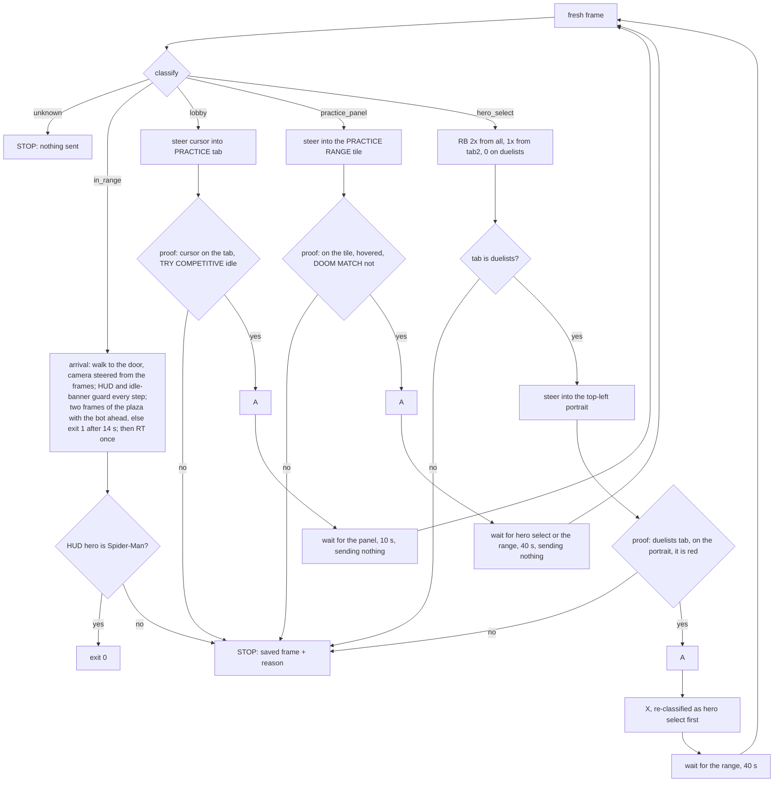

# Re-entry: PLAY lobby to the Practice Range as Spider-Man (VUH-1299)

**Built and tested offline on `tests/fixtures/reentry`; lead-run only.** `scripts/reenter.py` takes the game from the PLAY
lobby into the Practice Range as Spider-Man and stops at the first thing it cannot verify. 190 tests (`tests/test_reenter.py`)
pass; `--dry-run` classifies a live or saved frame and prints what it would do without opening a pad. The live trials
(2026-09-20) held the safety rules every time (each refusal pressed nothing and exited 1) and found three defects, all fixed offline
below and none re-run live: **the steering** (a cursor ring on the PRACTICE tab's lower half was never accepted), **the ring finder**
(on hero select the ring was "not found" with the cursor sitting on Spider-Man) and **the arrival** (it ended inside the spawn room,
where the idle drop fires).

## Run it

```sh
# PC desktop session, game focused (the script does not focus it), PLAY lobby on screen
uv run --no-project --python 3.11 --with dxcam --with opencv-python-headless --with numpy --with vgamepad \
    python scripts/reenter.py                      # do it
    python scripts/reenter.py --dry-run            # grab one live frame, print what it would do, no pad
    python scripts/reenter.py --dry-run --frame shot.jpg   # the same on a saved frame (no capture at all)
    python scripts/reenter.py --dry-run --timing 20      # no pad: a 2 s dxcam probe (frames, gaps, dxcam's own access-loss log), then 20 rounds of the
                                                         # REAL Safe.press -> Live.tap code over a pad that is not there (vgamepad never imported), each
                                                         # stage timed, and the age tap compared with the limit at the write
# offline tests (need opencv + numpy, so they are only collected with the perception group)
uv run --group perception pytest tests/test_reenter.py
```

Exit 0: in the range as Spider-Man. Exit 1: stopped. The last frame is saved to `data/reenter/refuse-<time>.jpg` (1280x720)
and one line says why (`reenter: STOP: <reason> (frame: <path>)`). If the first frame is unrecognised, no pad is opened.
Every log line starts `reenter:`.

## Flow



What is sent, and only this: `A` (three places, each behind a proof), `RB` and `X` (hero select only), left-stick
moves (menus: cursor steering; range: forward), right-stick turns (range: toward the spawn room's door), `RT` once (range). Never `START`, never the d-pad, never `X` on the lobby
or the panel. A screen visited more than twice means a press did nothing: STOP, no third try.

## Rules and where they are enforced

| Rule | Enforced by | Pinned by (test) |
|---|---|---|
| Every `A` follows a fresh frame proving what the cursor is on | `Safe.press` re-grabs, re-classifies and runs the proof right before tapping | `test_a_cursor_left_of_practice_never_presses_a`, `test_the_all_tab_with_black_panther_is_never_selected`, `test_the_duelists_tab_with_the_cursor_off_spiderman_never_presses_a`, `test_every_run_including_the_failing_ones_only_sends_allowed_buttons` |
| `X`, `START`, d-pad never on the lobby; `X` only on hero select | `ALLOWED` per classified screen | `test_forbidden_buttons_are_refused_wherever_they_are_asked_for` |
| Unknown screen: send nothing, stop | `run` refuses `unknown`; a real run opens no pad on an unknown first frame | `test_an_unknown_screen_sends_nothing`, `test_a_run_stops_before_opening_a_pad_on_an_unknown_first_frame` |
| Loading is not "unknown screen": nothing is sent while waiting | `wait_for` (only classifies, never sends) | `test_a_screen_that_never_loads_stops_without_sending_anything_while_it_waits` |
| A just-opened screen that cannot be read yet is looked at again, nothing sent, for at most `SETTLE_S` (3 s); still unreadable, or the screen changes, and it stops as before. The frame `settle` reads is not what authorizes a press: `Safe.press` acquires again and `Live.tap` re-proves the screen, the allow-list, the A target, the settling time and the proof's age at the write | `settle` (the hero tab, on arrival and after RB) | `test_settle_looks_again_on_fresh_frames_sending_nothing_and_reads_the_tab_once_it_is_drawn`, `test_settle_gives_up_after_its_bound_and_the_run_still_refuses_with_nothing_sent`, `test_settle_refuses_if_the_screen_changes_while_it_looks`, `test_a_run_from_the_fading_in_hero_select_presses_rb_only_after_the_tab_is_read` |
| Bounded | `MAX_STEPS` 30 nudges, `MAX_MISSES` 4 jiggles, 10 / 40 / 40 s waits, a screen may be visited twice | `test_steering_is_bounded_when_the_cursor_never_moves`, `test_a_press_that_does_nothing_is_not_repeated_forever` |
| Arrival: out of the spawn room, verified, or exit 1 | `arrive`: a fresh frame before every step; the range HUD gone or the idle banner up stops it with no further input; done only when two frames in a row show the plaza with the bot ahead; 14 s budget; only then `RT` once, and the HUD portrait must be Spider-Man | `test_arrival_stops_input_the_moment_the_range_hud_is_gone`, `test_arrival_stops_at_once_on_the_idle_banner`, `test_arrival_that_cannot_confirm_the_plaza_exits_after_its_budget_without_attacking`, `test_a_single_plaza_looking_frame_is_not_enough_to_believe_the_spawn_room_was_left`, `test_arriving_as_another_hero_is_reported_not_hidden` |

Every rule has a test that fails when it is broken: 20 hand mutations of `reenter.py` (each proof check, each `ALLOWED`
entry, the steering rules, the waits, the arrival checks) were run against the suite in a scratch copy; two slipped
through at first and now have tests. The steering and arrival changes had 14 more (the old tab rectangle, no idle or HUD check, one
plaza frame instead of two, no budget, turning away from the door, never turning, an unguarded `RT`, no back-off, no learning, edge-pinned
taps ignored, ...); all 14 are caught; the ring finder and tooltip proof had 8 more (no refinement, a tooltip threshold that accepts anything, no tooltip proof, no
refusal for another hero's tooltip, `done` ignored or not passed by `run`, no screen check, no tab check), all caught after two gained tests.

## Input safety at the pad (VUH-1325)

An independent review found that this script could authorize an input on a proof that no longer described the screen: on the PLAY lobby
`X` is START for a live Quick Match. Nothing wrong was sent live; the reviewer reproduced X going out 22 s after the frame that proved it.
The rules are enforced in `Live`, the lowest layer that touches the pad, not left to its callers; `Safe` is the policy on top and
`Live` re-checks all of it. Each row has a test built from the reviewer's scenario.

| Defect | Now | Test |
|---|---|---|
| `Live.frame()` returned the last frame when capture gave none, with no age limit; a static menu gives no dxcam frame, so a proof from before an input authorized the next | `frame()` is always the current screen: dxcam, else GDI (which reads the screen as it is), and it raises if neither can (fail closed). It never returns an older frame, and stamps `frame_t` with the start of the grab that produced it (a GDI frame with the GDI grab's start, not the dxcam wait before it: charging that 0.15 s made every press on a static lobby read 0.47 s old live) | `test_a_static_menu_gives_no_new_frame_and_the_press_reads_the_screen_as_it_is_not_the_last_frame` (the reviewer's 22 s), `test_the_live_frame_is_never_an_older_one`, `test_no_frame_at_all_fails_closed_and_sends_nothing`, `test_a_gdi_fallback_frame_carries_the_gdi_start_time_not_the_dxcam_wait`, `test_a_slow_dxcam_timeout_alone_no_longer_refuses_a_press`, `test_a_genuinely_stale_gdi_proof_is_still_refused`, `test_a_diagnostic_flag_can_never_route_to_a_live_run` |
| a press rested on the frame that proved it | `tap` grabs its OWN frame at the press, requires the screen to be the one proven, re-runs the proof on it, and refuses a frame older than `MAX_PROOF_AGE_S` (0.3 s) at the moment before the pad is written, or taken before the last input settled (`settled_t`) | `test_a_proof_older_than_the_limit_is_refused_at_the_moment_of_the_press`, `test_no_proof_frame_may_predate_the_last_inputs_settling`, `test_a_tap_advances_the_settling_time_so_the_next_proof_must_be_newer`, `test_a_refused_press_or_a_missing_proof_writes_nothing` |
| `tap` and every hold could leave a button or stick held on an exception or Ctrl-C | every hold is `try`/`finally` ending in `release_all` (`reset()` + `update()`: the whole pad); opening the pad releases even if the settle wait is interrupted; `main` releases in a `finally`, at exit (`atexit`), and on SIGTERM; a release that fails is reported and never masks the stop | `test_an_exception_or_ctrl_c_in_any_hold_still_releases_the_whole_pad`, `test_a_pad_write_that_fails_mid_press_still_ends_neutral`, `test_opening_the_pad_ends_neutral_even_if_the_settle_wait_is_interrupted`, `test_main_releases_the_pad_on_every_way_out`, `test_a_release_that_fails_is_reported_and_never_masks_the_stop` |
| `steer` and `Safe.stick` jiggled the stick on black or unknown frames, four times, before refusing | a stick moves only on the screen it names: `Live` and `Safe` both classify a fresh frame first, and steering, the door search and the turns all send through `Safe`. Unknown sends nothing | `test_a_stick_on_an_unknown_screen_is_never_written`, `test_steering_on_a_black_frame_sends_no_jiggle_at_all`, `test_the_whole_run_sends_no_stick_once_the_screen_goes_unknown_mid_steering`, `test_the_arrivals_turns_are_gated_by_the_screen_too` |
| a stick was gated on the screen being any recognised one, with no age or settling check (integrated re-review: a 2 s old classify still wrote a stick; an arrival stick landed on the lobby that replaced the range, cursor on TRY COMPETITIVE) | every stick names the screen it is for (arrival `in_range`, `steer` the menu it steers; default `in_range`), and `Live` writes it only if its own frame is that screen, was taken after the last input settled, and is under `MAX_PROOF_AGE_S` old after the classify | `test_a_stick_on_a_two_second_old_proof_is_refused`, `test_a_stick_proof_frame_may_not_predate_the_last_inputs_settling`, `test_an_arrival_stick_never_lands_on_the_lobby_that_replaced_the_range`, `test_menu_steering_is_bound_to_its_own_screen_at_the_pad` |
| `on_spiderman` took a matching tooltip without reconciling a conflicting cursor | the ring must be found, and the tooltip's name text must sit where the tooltip is drawn relative to it (141 x 29 px, +-8): a tooltip alone can linger after the cursor moves. The frame is the pad layer's own, taken after the last input settled | `test_a_tooltip_that_does_not_fit_the_cursor_position_is_not_a_proof`, `test_a_run_on_hero_select_never_presses_on_the_tooltip_alone`, `test_a_run_on_hero_select_presses_when_the_ring_and_the_tooltip_agree` |

`record.in_range` is L4's: it now proves the range by the "PRACTICE RANGE" banner and the HUD bar together, and reenter imports it, never
defines its own. The scoreboard is not the range there, which is what the loop's BACK hold relies on.

## What each screen looks like (measured on the fixtures, 1280x720 px)

| Screen | Test | Measured |
|---|---|---|
| lobby | yellow START bar (`START_YELLOW` 0.5) | 0.91 on the three lobby frames, 0.00 on every other |
| hero select | yellow CONFIRM button (`CONFIRM_YELLOW` 0.5) | 0.86 on the three hero-select frames, 0.00 on every other |
| practice panel | dimmed band luminance < 40, above and below < 60, **and** the white "PRACTICE" title (`PANEL_TITLE` 0.15) | band 15.6 (lobby 85-87, hero select 140-143, range 118); title 0.326 (every other frame <= 0.036) |
| range | `record.in_range` (unchanged) | true only on `in-range.jpg` |
| active hero tab | white diamond over a tab icon (`TAB_WHITE` 0.4) | active 0.65-0.69, inactive <= 0.08. `all` and `duelists` are seen; `tab2` (RB once from `all`) is inferred from the skill. While the screen fades in the active tab's white reads 192 of 255 (0.02 share over 200) against 250 settled (live, 2026-09-21 09:41, game clock 00:02: `heroselect-all-tab-fading-in`); the pad's LB / RB glyphs sit outside the tab boxes. The reader stays strict and the flow waits (`settle`) |

A first version identified the panel by darkness alone. A black frame (a loading screen) then classified as the panel;
the title requirement fixed it, and a test pins it.

## The proofs in front of `A`

| `A` on | Proof (all must hold) | Measured |
|---|---|---|
| lobby | cursor centre inside the drawn PRACTICE tab (rows 377-395, x 1166-1262, slanted, 2 px margin); TRY COMPETITIVE looks idle | tab edges profiled on the frame with no cursor near it and on the live refuse frame (below). Of 22 lobby frames: 17 are identically idle (dark share 0.75-0.76, luminance 78.5-78.6), 2 near-idle where the cursor ring overlaps the banner's corner (0.71-0.72, 80-81), 3 highlighted (0.02-0.06, 111-112; one has a different lobby background). Tolerance 0.12 / 12, both ways |
| panel | cursor inside the PRACTICE RANGE tile (10 px margin) and not on DOOM MATCH; the range tile dark (< 100), DOOM MATCH bright (> 150) | range tile hovered 43.6-46.4, **un-hovered 223**; DOOM MATCH 232-237 in every panel frame |
| hero select | duelists tab active, the cursor ring found, and Spider-Man under it by either proof: the game's tooltip names SPIDER-MAN (`TOOLTIP_MATCH` 0.75) and sits beside the ring, or the ring is inside the top-left portrait slot (6 px margin) and the slot has red in it (`SLOT_RED` 0.03); a tooltip for another hero refuses | red-hue share of the slot: unhovered 0.276, hovered 0.076, another hero 0.005 |
| range (after) | the HUD hero portrait has red in it (`HUD_RED` 0.10) | 0.247 on Spider-Man, 0 with it blanked |

The lobby fixture `left-of-practice` puts the cursor on the TIMES SQUARE tab's right end (x 1146), so a press there would
open the map picker; the proof refuses it with "not inside the PRACTICE tab". The all-tab Black Panther frame is refused
twice over: the tab is not duelists, and its cursor is too faint to find.

**Real frames for the states that were first only painted.** The lead's earlier manual navigations (35 full-size
screenshots) added four fixtures, named like the first eight:

| Fixture | What it shows | What the proofs do |
|---|---|---|
| `lobby-cursor-on-try-competitive` | cursor on the banner, TRY COMPETITIVE highlighted (a lighter grey fill; dark share 0.06, luminance 112) | refused by the cursor position; with the cursor forced onto the tab, refused by the banner check alone |
| `lobby-cursor-at-try-competitive-corner` | cursor at the banner's top-right, ring overlapping the PRACTICE tab, banner highlighted (0.02, 111), a different lobby background | the same: this is the frame where an `A` would queue a live match |
| `lobby-cursor-below-practice-tab` | cursor centre at the tab's lower edge (y 394), ring on the banner's corner, banner still idle | refused by the cursor position only (the banner is idle here); pins the tab zone's bottom edge |
| `panel-cursor-off-tiles` | the panel just opened, cursor still faint over dark art, **neither tile hovered**: both bright (range 223, DOOM MATCH 232) | cursor not found, so no press; with the cursor forced onto the range tile, refused as "not highlighted"; onto DOOM MATCH, refused |

What they settle:

- The banner highlight is a plain brightening, so the check must be two-sided, and it is. Dropping the "brighter" side, or
  widening the tolerance, now fails a test on a real frame.
- The default un-hovered panel has **both tiles bright**; only the hovered one darkens.
- TRY COMPETITIVE lights up when the cursor centre is at about y 406 or lower (frames at 408 and 414 light it; 394 and 396
  do not, banner luminance 80-81 from the ring overlapping its corner). The tab zone stops at y 389 after its margin, so
  the cursor is at least 17 px clear of where the banner starts to react. The banner check is a second line of defence.

Still painted, and said so in the tests: a **hovered DOOM MATCH** (no screenshot has the cursor on it), another hero in
Spider-Man's slot with the cursor on it, and the HUD portrait swapped. A hovered DOOM MATCH is refused without needing its
look: with DOOM MATCH hovered the PRACTICE RANGE tile is un-hovered, and the real un-hovered tile is bright, which the tile
check refuses; the cursor position refuses it first.

**Frames reviewed and ignored** (not lobby, panel or hero select, or a state already on file): the launch and title screens,
the desktop, an older PLAY landing page, and the BATTLEPASS page with the cursor on a PURCHASE button (all classify
`unknown`, so nothing would be sent; the BATTLEPASS one would make a good negative fixture); further all-tab hero-select
frames, in-range frames, and repeats of the lobby, panel and hero-select states already covered.

## The cursor finder is ours, not `l4_menu.find_cursor`

The brief said to reuse L4's finder. It cannot be used as is: it returns the first Hough circle unchecked (minRadius 20,
param2 26), and the game draws two sprites: a small ring (r about 19) with a bright centre dot when hovering a widget, and
a larger plain ring (r about 26) otherwise, faint over dark art.

| Fixture | Cursor (read off the screenshot) | `l4_menu.find_cursor` | `reenter.find_cursor` |
|---|---|---|---|
| lobby-cursor-far | (640,256) | (640,256) ok | (640,256) |
| lobby-cursor-left-of-practice | (1146,380) | (314,296) **wrong** | (1146,380) |
| lobby-cursor-on-practice | (1214,380) | (214,258) **wrong** | (1214,380) |
| panel-cursor-on-practice-range | (780,380) | (780,380) ok | (780,380) |
| heroselect-all-tab-black-panther | (780,380), faint | (780,380) ok | None (refuses) |
| heroselect-duelists-cursor-off | (780,86) | (816,386) **wrong** | (780,86) |
| heroselect-cursor-on-spiderman | (852,48) | (528,268) **wrong** | (852,48) |
| in-range | none | (1184,444) **invented** | None |

Ours (the first version) took every Hough candidate down to radius 16 and kept one only if it carried the sprite's signature on
`min(B, G, R)` (bright only where every channel is bright): a ring bright all the way round (20th percentile of the ring
samples) with contrast against just outside it, plus, for the hover sprite, a centre dot. No false candidate passed on any
of the eight frames. The one miss is the faint all-tab cursor, and returning None there is the safe answer: no cursor, no
press, and the run jiggles the stick (4 tries) and stops. A plain ring-versus-surroundings contrast score does not work: the
hover ring's translucent interior is brighter than its outside. If L4 wants it, `find_cursor` in `reenter.py` is a drop-in.

**Second live refusal, on hero select (2026-09-20 19:28, `heroselect-spiderman-tooltip-ring-lost.jpg`).** After RB RB the run stopped with
"no proof for A: the cursor ring was not found" while the cursor sat ON the Spider-Man portrait (Iron Fist previewed: the picker did not
remember a hero again). The saved frame shows a clear white ring over the red-and-blue portrait, and the finder finds it there, so the
frame that failed was a neighbour of it: the ring signature is sharply peaked (one pixel off centre its contrast falls from 130 to 50, against a
threshold of 40 to 70) and the Hough centre is good to only ~1.5 px, whose strongest circles on a busy portrait are other things. With
Gaussian noise added to the saved frame the old finder missed it 15-30% of the time; under Hough the ring was not even among the 40
strongest circles. The finder now takes its candidates from a ring template matched against the bright-in-every-channel mask (both sprite
radii, the six strongest peaks each, on a half-size mask: ~50 ms a native frame) and refines each centre over +-3 px before judging it. It
finds the ring on every one of 30 noisy copies at sigma 0, 2, 4, 8 and 12, and through JPEG q50; the eight fixtures give the same cursors and
no false ring on the in-range, black, noise, faint all-tab and panel frames. `test_the_ring_is_found_on_a_busy_portrait_and_through_noise_and_compression`
pins it.

**A second, independent proof for the hero press: the game's own tooltip.** Hovering a portrait shows "Request to Team-Up with <HERO>" in a
box that follows the cursor; its white name text is Spider-Man's exactly when the cursor is on his portrait. `tooltip_spiderman` matches that
name against a template cut from the fixture (normalised correlation on the min-of-channels image, 1280x720 scale), the best of three copies
shifted -0.5, 0 and +0.5 px horizontally: the name follows the cursor, so it lands anywhere between pixels of the downscaled frame, and one
sharp template read a legible SPIDER-MAN, beside the ring where it belongs, at 0.73 (live refusal 2026-09-21 10:37,
`heroselect-spiderman-tooltip-between-pixels.jpg`; the re-invocation read 0.92). Shifted: 1.00 on the template's frame, 0.92 and 0.87 on the
two live ones, THE PUNISHER's tooltip 0.37, every other fixture 0.61 or less (vertical shifts as well lifted those to 0.66 and are not used).
Waiting or moving the cursor would not have helped: a still cursor keeps the same sub-pixel place. `on_spiderman` passes on
either proof, and both need the ring: the tooltip names SPIDER-MAN beside the ring, or the ring is in the top-left slot and the slot is red.
A tooltip that is up and does not name SPIDER-MAN refuses whatever the ring and the colours say (a red hero in that slot would have passed
the colour check), and no other screen or tab is ever proven. `steer` takes a `done(frame)` predicate (on hero select, `on_spiderman`
itself), so it stops as soon as the proof holds. Limits: the template is checked on three frames (one of them the
template's source), the tooltip appears only after the cursor has dwelt on the portrait, and it needs the game's language and UI scale as recorded.

## Steering

`l4_menu`'s closed-loop `goto` is a closure inside `main()`, so it cannot be imported without editing L4's file, which is
off limits. `steer` keeps its axis rule (one axis at a time, the x axis while it is more than 9 px off) and its jiggle for a hidden
cursor.

**The live defect (2026-09-20 18:47, `tests/fixtures/reentry/lobby-cursor-on-practice-tab-lower-half.jpg`).** "The cursor did not reach
the PRACTICE tab in 30 nudges", with the ring sitting on the tab at (1220,390). Reproduced from the frame: `find_cursor` finds it, and
the old tab rectangle (rows 372-394, 5 px margin) accepted only y 377-389, a 12 px band 3 px above the middle of a tab that is drawn
at rows 377-395. So the zone was wrong by one pixel on this frame and by a third of the tab's height in general. The zone is now the
drawn tab (a slanted polygon) with a 2 px margin; TRY COMPETITIVE starts to react at y ~406 and is checked before every A, so the
proof stays safe, and the fixture at y 394 (the tab's lower edge) is still refused.

**The step law.** The old law (`0.035 s + d / 700 px/s`, halved after a reversal) has a fixed shortest tap. If that tap already moves the
cursor a long way (l4_menu lands "within ~9 px"; a 35 ms tap at 700 px/s is 24 px), an 18 px tab cannot be settled into: the cursor
alternates either side of it. In simulation a floor cursor 1.5x faster than assumed never settled on 29 of 60 starts with the old law
(none of the simulations the old tests used has a floor, so they never showed it). The live trial failed every nudge, which no simulation
here reproduces; the zone above accounts for that frame, the law for the class. Now:

- **Each axis learns its own tap law** (`Reach`): `moved = a * (secs - c)`, fitted from the taps it has seen, with l4_menu's law as a
  low-weight prior. A cursor that pins at the screen edge counts as "went at least this far" at half weight, so a cursor 2.5x faster
  than assumed still calibrates instead of bouncing between the edges.
- **No correction shorter than the shortest tap.** If the error is under 0.7 of what the shortest tap moves, the cursor steps away by
  that much and comes back with a real move, which lands within the noise of a move that size.

Success over 60 random starts, three cursor physics (`dead`: 35 ms of nothing then 700 px/s; `floor`: the shortest tap already moves it;
`ramp`: it accelerates), gains 0.4x-2.5x, noise +-15% (also +-30% and +-45% for gains 0.7-1.5x): the tab, the tile and the portrait
reach their zone on every start, 3-16 nudges on average (tab, gain 1.0: 5-7). `test_steering_settles_into_the_18_px_tab_whatever_the_shortest_tap_does`
pins the tab for all three physics and four gains (30 starts each).

## Arrival: out of the spawn room

The first live trial ended inside the spawn room facing the green door, which is where the idle drop fires; walking blind for 6 s does
not leave it (the player is not always facing the door, and a hero re-pick does not respawn him). `arrive` executes, one step at a time,
what `arrival_step` decides on each fresh frame (a pure function of the frame and `ArrivalMemory`):

1. proves the range HUD and no idle banner on a fresh frame before every step (either one stops it with no further input); every stick
   still goes through `Safe` on `in_range`, re-proven at the write;
2. finds the door and steers its pane onto **the hero's column** (`HERO_X` 0.40), not the screen centre: more than `DOOR_TOL` (8% of
   the width) off it, it turns the camera (`YAW_STICK` 0.45 = 172 deg/s, focal 465 px at 1280 wide) instead of walking; on it, it walks a
   0.5 s step. With no door kept it takes **the door nearest his column**, not the biggest blob (the spawn room has two lime doors; on all
   four logged spawns the plaza door sits 0.04 from his column and the other 0.19 off, and the other was the bigger blob in two). Once
   walking at a door it **keeps that door**: the blob nearest where it should be after our own turn, within `DOOR_KEEP` 0.25 of the width;
   **no door in view, it looks around** (a 0.3 s right turn, about 50 deg) and never walks blind;
3. **no progress**: a walk that moves him changes the view; `STILL_WALKS` 2 walks in a row whose next frame differs from the one they
   were decided on by under `STILL` 8 (mean grey difference of a masked thumbnail, `_scene`: the hero and the key hints blanked) are
   walking into something. It then strafes LEFT for `SIDESTEP_S` 0.4 s (the left stick, through `Safe` like every step, logged as its own
   action) and carries on; after `SIDESTEP_TRIES` 2 sidesteps a third stall refuses ("walking does not move him"). Each walk's change is
   judged once, on the next frame, before anything else; an advancing walk clears the count, and a pause (the plaza's second look) is not
   a walk. The log's `moved` is the change the decision used (None when the step before was not a walk) and `still` the count it acted
   on. A small scene change does not identify an obstacle nor prove clear ground to the left: a false stall can still cause bounded
   sideways movement, two 0.4 s strafes are no guarantee against a fall, and the arrival runs only in the supervised spawn trials;
4. **out**: a walk step, then a frame with no door, where the kept door's biggest blob over its last `OUT_WALKS` 3 walk steps was
   `OUT_PX` (10k px at 1280x720) or more, is passing through it. The pane shrinks as he reaches it, so the last walk alone is not the
   measure (see the three supervised arrivals below). From then on no door is steered to or walked at, not even a sliver of its pane, and it only turns LEFT (0.3 s, ~50 deg) up to `OUT_SWEEPS`
   7 times (~360 deg) looking for the bot; none found is an exit 1 on the plaza;
5. is done only when `plaza_view` holds on two frames in a row (a second look while standing still): the Luna Snow bot ahead in the open,
   the door behind (lime under 3% of the upper view);
6. exits 1 (frame saved) if that is not confirmed within `ARRIVE_S` (14 s), or the HUD is gone, or the idle banner is up; then `RT` once
   and the HUD portrait must be Spider-Man.

**Calibrated on five poses** (native frames, `tests/fixtures/reentry/arrival-*.jpg`): tagrun0 frame 0 (spawn, door at the left edge) and frames
4-14 (the plaza, bot ahead), and the lead's own re-entries: `re6` (the door DEAD AHEAD), `re7` (the wall left of the door, where a blind walk
ended) and `q8` (the central console, two doors to the left). What they showed, and what the first version (calibrated on tagrun0 alone) got wrong:

- **The door is lime glass, not the enemy green.** Hue ~46 (S ~110, V ~125), against an enemy outline's ~67 (V ~170); the first version's
  green band (55-90) never saw it (`door` returned None on re6). It is 76k px dead ahead (`re6`, centre x 0.56), 7.8k for the nearer door in `q8`
  (0.19), 12k in tagrun0 frame 0 (0.26), and no plaza frame has a blob above 1.7k px, so `DOOR_MIN_PX` is 3000 with a height of 100 px.
- **The plaza with the bot is visible THROUGH the door.** On `re6` the first `plaza_view` said "plaza" while the player was still in the room:
  the bot shows through the glass and its glow makes enemy boxes of its own. A box now counts only if the door does not fill the view (lime under
  3% of the upper 70%) and lime is not all round the box (under 15% of its surroundings). None of the four spawn poses passes; the plaza frames do,
  and none has a lime blob at all.
- **Purple walls, sky and the pale floor do not tell the rooms apart** (measured on all five poses and 21 tagrun0 frames), so the confirmation is
  the bot in the open, nothing else; the lime door is the steering cue and the reason to refuse.

Confirmation stays strict on purpose: it needs the Enemy Color set to Green (it is) and the Luna Snow bot in view once the door is behind, and it
exits 1 rather than guess, so a false exit 1 is the failure to expect. Untested live: the turn rate on the spawn room's geometry, which of q8's two
doors is the exit (it steers to the bigger first, then keeps the one it walks at), and how long the look-around takes to find the door from an arbitrary heading (a full turn is ~2.1 s
at this stick; the budget allows about 20 steps).

**Live: stuck at the door's left frame (four refusals, 2026-09-20 22:34 to 2026-09-21 09:45;
`docs/evidence/reentry/arrival-refusals-stuck-at-door-frame.jpg`).** Every one ends "could not confirm the spawn room was left within 14
s". In three the spawn room's glass door is dead ahead (`door` 0.525-0.541, well inside `DOOR_TOL`) and Spider-Man is pressed against the
dark pillar that is its left frame; in the fourth he is at that pillar with the door's lit opening off to the left. The steering then
centred the door on the screen, but the third-person camera draws the hero left of the centre, so his walking line runs left of the camera's axis
and, close to the door, into its frame; `plaza_view` then never holds and the budget runs out. Measured on the four refusal frames, the five
runs' first frames and the five arrival fixtures: the hero's column (median x of his suit's red) is 0.37-0.42 of the width, median 0.395;
on the refusal frames the door's lime pane spans x 0.49-0.58 and he stands at 0.40, on the dark frame left of it. To put the pane on his
walking line it has to sit LEFT of centre, at his column (turning right by about 20 deg at the jamb): `HERO_X` above. The live log showed
the pane is the passable opening (he walked through it); whether the column aim keeps him off the jamb is for the supervised arrivals.

**Where the five supervised runs started (postfreeze30, trackerlive30, stall30, handoff30, reach30; `data/l1/<run>/000000.jpg`).** Every one
starts outside, a few metres from the door on the plaza side, facing back into the spawn room with the bot behind him; `plaza_view` is
False on all five.

**The live arrival with the step log (2026-09-21 12:24; rows `docs/evidence/l4/arrival-20260921-122442-steps.jsonl`, sheets beside them;
24 steps, the logic before the out state).** Steps 1-5 inside, two lime doors in view and the biggest blob jumping between them (0.44,
0.17, 0.54, 0.88, 0.47); 6-10 straight at the door; 11-15 the crossing (the pane is passable: he walked through it), the glass filling the
left of the view, the blob only the saturated strip against the right jamb, the Luna bot in view LEFT at x ~0.22; step 16 no door, the
plaza-side planter ahead: out. Then the walk-back: 17 walked at a 53 px sliver of the pane from outside, 18-19 looked around, 20 the whole
pane from outside (87k px), 21-23 walked back at it, 24 the budget ran out beside the housing facing into the spawn room. Step 21 is the
jamb: pane centred at 0.54, the hero at 0.39 on the dark frame left of it. The out state, the kept door and the hero's column come from
these rows. Replayed through `arrival_step` (open loop: the frames are the old logic's, so this shows decisions, not where they lead): with
the live history up to step 15, step 16 sets out and steps 16-23 are all left turns, none toward the sliver or the pane; from a fresh start
step 2 keeps walking at the door it chose instead of turning to the other one, and the pane is turned onto his column with small right
turns (0.07-0.17 s) on steps 3, 4, 7, 10-15. Not shown offline: that the column aim gets him through without the jamb, that the out
signal fires on a closed-loop crossing (the replay turns at step 15 where the live run walked), and that one left turn brings the bot into
`plaza_view`'s window (0.35-0.95, 0.08-0.6 of the height) from wherever he exits; the three supervised arrivals are the measurement.

**Three supervised arrivals (2026-09-21 12:54, 13:05, 13:17; rows and sheets `docs/evidence/l4/arrival-out-{1,2,3}-*`; the column aim,
the kept door and the out state, before the two corrections above).** No jamb snag on any crossing. Arrival 2 passed: the plaza door
kept through two frames where the other was the bigger blob, the pane 0.31-0.52 over his column on the step before it vanished, out set
(last walk 26.8k px, then none), one left turn, `plaza_view` twice, ending on the plaza facing the Luna Snow bot; exit 0 after 12.04 s.
Arrivals 1 and 3 failed on two measured causes, each now corrected:

- **The wrong door.** In frame 1 the other door (x 0.21, 8.2k and 7.3k px) was the bigger blob against the plaza door on his column (0.44,
  3.5k and 5.6k); he took it, kept it, went through, looked right, saw the room back through it and walked back in. The first choice is
  now the door nearest his column.
- **Out missed.** On the five logged crossings (a walk step, then no door) the kept door's last walk was 33.0k, 3.4k, 26.8k, 7.6k and 7.7k
  px, so a 20k bar on it caught two; the peak over its last three walks was 53.6k, 19.1k, 44.0k, 16.0k and 26.3k. The only walk at a small
  door followed by none is a sliver of the pane from outside after a look-around (3.8k, nothing before it kept). The bar is 10k on that peak.

Replayed through `arrival_step` over the four logged arrivals' decision frames from a fresh memory (open loop: the frames are the live
logic's, so this shows decisions only). Arrivals 1 and 3: frame 1 walks at the plaza door instead of turning to the other one, and where
the live run later came out through the other door, out is set (steps 10-11). Arrival 2: the same decisions as live up to step 16, out set
at 17 (its two plaza frames read `plaza_view` False on the saved 1280 JPEGs, True live on the native frames). The first logged arrival
(older logic): the column aim turns where it walked, so out cannot fire on its frames. Not shown offline: that the plaza door is the one
taken on a live spawn every time, and that out fires on a closed-loop crossing; the three supervised arrivals are the measurement.

**Second round of three supervised arrivals (2026-09-21 13:38, 13:50, 14:01; `docs/evidence/l4/arrival-door-*`, native recordings in
`data/video/door{1,2,3}.mp4`).** The plaza door was taken on all three spawns and out fired on both crossings; arrivals 1 and 2 passed
(11.48 s and 11.42 s, ending on the plaza facing the Luna Snow bot). The native frames reproduce the live `plaza_view` readings; the 720p
step JPEGs read False on all four confirmations, so saved JPEGs are no test of `plaza_view`. Arrival 3 never reached the door: from step 5
he walked 16 times into the raised rim of the central console, the door on his column (0.37-0.39) throughout. The rim lies ahead of him to
his RIGHT, the door beyond it up to the left; in arrivals 1 and 2 he brushed the same rim on steps 5-6 and slid off. The pane sat at 0.381,
0.380 and 0.372 at step 5: three samples 10 px apart do not show an approach line that avoids the rim, so the aim is unchanged.

What separates walking from walking into something, measured on every walk step of the seven logged arrivals (720p step JPEGs): the
masked scene changes by 21-47 on every advancing walk, 11-12 when he brushed the rim and slid off, 2-3 on every stuck step; the door's
blob size is no measure (it flickers 11.8-26.3k with the pane's animation while stuck, and barely grows walking at the far door from
spawn). Replayed from a fresh memory over the seven logs (open loop: decisions only): no still walk is counted anywhere in the six
arrivals that moved; in arrival 3 the second still walk is at step 7 and the sidestep would be step 8.

The same change on native frames (the second round's 2560x1440 recordings, `data/video/door{1,2,3}.mp4`; the frame of the recording that
best matches each step's saved decision JPEG, `data/reenter/arrive-<time>/native/`):

| Pair | Arrival, steps | 720p step JPEG | Native recording |
|---|---|---|---|
| stuck | 3 (14:01), 8 -> 9 | 3.2 | 3.2 |
| stuck | 3, 20 -> 21 | 3.0 | 3.0 |
| brushed the rim, slid off | 3, 5 -> 6 | 10.6 | 10.6 |
| advancing | 1 (13:38), 13 -> 14 | 30.8 | 30.9 |
| advancing, the crossing | 1, 14 -> 15 | 35.7 | 35.7 |
| advancing | 2 (13:50), 13 -> 14 | 29.0 | 29.0 |
| advancing, the crossing | 2, 14 -> 15 | 21.1 | 21.0 |

The frames are aligned by appearance, not by time: each native frame is the recording's best match to the saved JPEG (mean difference
1.4-2.0 grey levels at 320x180 for the crossings; 4.5 for stuck steps 8 and 9, where the view barely changes and many recording frames
match about as well). They are recording frames (h264, `-cq 19`), not the tool's own dxcam frames, so the agreement shows the thumbnail
is insensitive to these two compressions on these pairs, not that live frames read the same; the log's `moved` is the live value. Not shown offline: that 0.4 s
to the left takes him off the rim and that the walk then carries on; the three supervised arrivals are the measurement.

What the tool's result does and does not say: exit 0 means `plaza_view` held on two frames, not that the acceptance holds (two
plaza-looking frames end it with out still False); `ARRIVE_S` is a budget of scheduled actions, not a wall-clock deadline (the three ran
14.99, 12.04 and 15.18 s); a turn row's `door_x` is the prior or predicted door, not a certified selection; `plaza_view` finds an enemy box,
it does not identify the bot.

**The arrival log.** A real run records every arrival step in `data/reenter/arrive-<time>/`: `steps.jsonl` (time, the action and its
stick, the door's centre and blob size, the hero's column, `plaza_view`, the gate the input passed) and the frame the step decided on
(`NNN.jpg`); the last line of the run names the folder and any write failures. `gate` is constant policy text (it appears on a refused
row too), not a measured verdict nor the actuator's proving frame; `t` is the logging time AFTER the step's input; the frame is the one
the step decided on, before its input. Each step is written after its input has gone out, and
the log sends nothing and never raises into the flow: `test_the_arrival_log_changes_no_input` runs every recorded arrival scenario with
the log off, on, unwritable and raising, and the pad writes, their times and the ending are identical. It exists to measure, live, what
the saved frames cannot: whether the walk passes the door, and what the look-around meets outside.

## Not verified: read these first in the live trial

1. ~~TRY COMPETITIVE highlighted~~ and ~~the un-hovered PRACTICE RANGE tile~~: closed with real frames (above).
2. **A hovered DOOM MATCH.** Still no frame with the cursor on it. It is refused by position and by the range tile being
   un-hovered, but its own look (presumably darkened) is inferred.
3. **After `A` on Spider-Man.** No fixture shows the selected state, so `X` is not gated on a visible change. `X` needs
   only a fresh frame classified as hero select. If `A` did nothing, `X` confirms whatever was selected and the arrival
   check ("HUD hero portrait is not Spider-Man", exit 1) reports it.
4. **Load times.** The waits are 10 s (panel), 40 s (hero select) and 40 s (range); the skill says about 12 s to hero select.
5. **The range may load without hero select** (the picker did not remember a hero before). That path goes straight to
   arrival and is reported by the HUD hero check.
6. **Focus.** The game reads the pad only while focused, and this script does not focus it. Unfocused, the cursor never
   moves and steering stops after 30 nudges (about 15 s) with a frame saved.
7. **Pad enumeration.** `Live` waits 3 s after opening the pad; the "Switching Devices" banner and toast should not touch
   the START box (y 585-608), the tab or the tiles, but no frame shows them over the lobby.
8. **`Live` was tested against a fake `vgamepad` only** (button order, which buttons exist, the trigger, the stick). The
   real pad, dxcam and the timing between them are the live trial.
9. **The tab names.** `tab2` is the second tab, inferred from "RB twice from `all` reaches duelists". Any other active
   tab stops the run.

If the live trial refuses somewhere unexpected, the saved frame plus `--dry-run --frame <that frame>` shows which check
said no and why. Frames worth capturing for new fixtures: DOOM MATCH hovered, the hero-select wheel after selecting
Spider-Man, and the lobby with the pad banner up.

## Files

`scripts/reenter.py` (the script), `tests/test_reenter.py` (190 tests: classifier, cursor finder, each proof with its
negatives, steering against simulated cursors of three physics, arrival against a simulated spawn room with a door that turns
with the camera, the whole flow against a simulated game serving the fixtures, dry run, `main`, and `Live` against a fake pad),
`tests/fixtures/reentry/*.jpg` (the lead's eight frames, the four above, the two live refuse frames, the hero-select screen fading in and settled (live, 2026-09-21), and five native arrival frames: two from `tagrun0`, three of the lead's spawn-room poses).
Untouched: L4's files.
`tests/test_reenter.py` imports opencv, so `tests/conftest.py` skips it in the stdlib-only default run.
