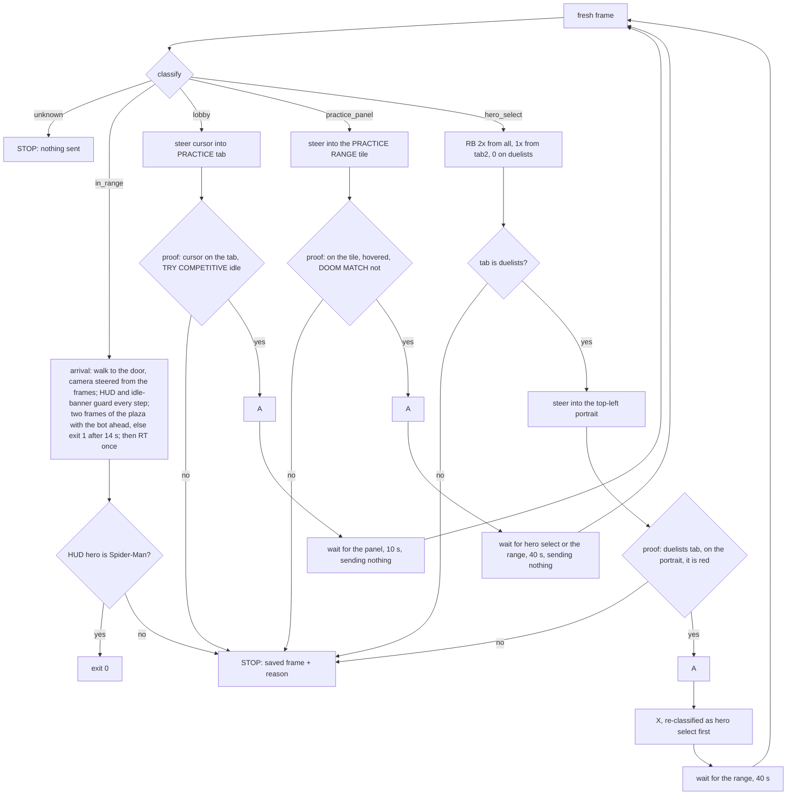

# Re-entry: PLAY lobby to the Practice Range as Spider-Man (VUH-1299)

**Built and tested offline on `tests/fixtures/reentry`; lead-run only.** `scripts/reenter.py` takes the game from the PLAY
lobby into the Practice Range as Spider-Man and stops at the first thing it cannot verify. 119 tests (`tests/test_reenter.py`)
pass; `--dry-run` classifies a live or saved frame and prints what it would do without opening a pad. The live trials
(2026-09-20) held the safety rules every time (each refusal pressed nothing and exited 1) and found three defects, all fixed offline
below and none re-run live: **the steering** (a cursor ring on the PRACTICE tab's lower half was never accepted), **the ring finder**
(on hero select the ring was "not found" with the cursor sitting on Spider-Man) and **the arrival** (it ended inside the spawn room,
where the idle drop fires).

## Run it

```sh
# PC desktop session, game focused (the script does not focus it), PLAY lobby on screen
uv run --no-project --python 3.11 --with dxcam --with opencv-python-headless --with numpy --with vgamepad \
    python scripts/reenter.py                      # do it
    python scripts/reenter.py --dry-run            # grab one live frame, print what it would do, no pad
    python scripts/reenter.py --dry-run --frame shot.jpg   # the same on a saved frame (no capture at all)
# offline tests (need opencv + numpy, so they are only collected with the perception group)
uv run --group perception pytest tests/test_reenter.py
```

Exit 0: in the range as Spider-Man. Exit 1: stopped. The last frame is saved to `data/reenter/refuse-<time>.jpg` (1280x720)
and one line says why (`reenter: STOP: <reason> (frame: <path>)`). If the first frame is unrecognised, no pad is opened.
Every log line starts `reenter:`.

## Flow



What is sent, and only this: `A` (three places, each behind a proof), `RB` and `X` (hero select only), left-stick
moves (menus: cursor steering; range: forward), right-stick turns (range: toward the spawn room's door), `RT` once (range). Never `START`, never the d-pad, never `X` on the lobby
or the panel. A screen visited more than twice means a press did nothing: STOP, no third try.

## Rules and where they are enforced

| Rule | Enforced by | Pinned by (test) |
|---|---|---|
| Every `A` follows a fresh frame proving what the cursor is on | `Safe.press` re-grabs, re-classifies and runs the proof right before tapping | `test_a_cursor_left_of_practice_never_presses_a`, `test_the_all_tab_with_black_panther_is_never_selected`, `test_the_duelists_tab_with_the_cursor_off_spiderman_never_presses_a`, `test_every_run_including_the_failing_ones_only_sends_allowed_buttons` |
| `X`, `START`, d-pad never on the lobby; `X` only on hero select | `ALLOWED` per classified screen | `test_forbidden_buttons_are_refused_wherever_they_are_asked_for` |
| Unknown screen: send nothing, stop | `run` refuses `unknown`; a real run opens no pad on an unknown first frame | `test_an_unknown_screen_sends_nothing`, `test_a_run_stops_before_opening_a_pad_on_an_unknown_first_frame` |
| Loading is not "unknown screen": nothing is sent while waiting | `wait_for` (only classifies, never sends) | `test_a_screen_that_never_loads_stops_without_sending_anything_while_it_waits` |
| Bounded | `MAX_STEPS` 30 nudges, `MAX_MISSES` 4 jiggles, 10 / 40 / 40 s waits, a screen may be visited twice | `test_steering_is_bounded_when_the_cursor_never_moves`, `test_a_press_that_does_nothing_is_not_repeated_forever` |
| Arrival: out of the spawn room, verified, or exit 1 | `arrive`: a fresh frame before every step; the range HUD gone or the idle banner up stops it with no further input; done only when two frames in a row show the plaza with the bot ahead; 14 s budget; only then `RT` once, and the HUD portrait must be Spider-Man | `test_arrival_stops_input_the_moment_the_range_hud_is_gone`, `test_arrival_stops_at_once_on_the_idle_banner`, `test_arrival_that_cannot_confirm_the_plaza_exits_after_its_budget_without_attacking`, `test_a_single_plaza_looking_frame_is_not_enough_to_believe_the_spawn_room_was_left`, `test_arriving_as_another_hero_is_reported_not_hidden` |

Every rule has a test that fails when it is broken: 20 hand mutations of `reenter.py` (each proof check, each `ALLOWED`
entry, the steering rules, the waits, the arrival checks) were run against the suite in a scratch copy; two slipped
through at first and now have tests. The steering and arrival changes had 14 more (the old tab rectangle, no idle or HUD check, one
plaza frame instead of two, no budget, turning away from the door, never turning, an unguarded `RT`, no back-off, no learning, edge-pinned
taps ignored, ...); all 14 are caught; the ring finder and tooltip proof had 8 more (no refinement, a tooltip threshold that accepts anything, no tooltip proof, no
refusal for another hero's tooltip, `done` ignored or not passed by `run`, no screen check, no tab check), all caught after two gained tests.

## What each screen looks like (measured on the fixtures, 1280x720 px)

| Screen | Test | Measured |
|---|---|---|
| lobby | yellow START bar (`START_YELLOW` 0.5) | 0.91 on the three lobby frames, 0.00 on every other |
| hero select | yellow CONFIRM button (`CONFIRM_YELLOW` 0.5) | 0.86 on the three hero-select frames, 0.00 on every other |
| practice panel | dimmed band luminance < 40, above and below < 60, **and** the white "PRACTICE" title (`PANEL_TITLE` 0.15) | band 15.6 (lobby 85-87, hero select 140-143, range 118); title 0.326 (every other frame <= 0.036) |
| range | `record.in_range` (unchanged) | true only on `in-range.jpg` |
| active hero tab | white diamond over a tab icon (`TAB_WHITE` 0.4) | active 0.65-0.69, inactive <= 0.08. `all` and `duelists` are seen; `tab2` (RB once from `all`) is inferred from the skill |

A first version identified the panel by darkness alone. A black frame (a loading screen) then classified as the panel;
the title requirement fixed it, and a test pins it.

## The proofs in front of `A`

| `A` on | Proof (all must hold) | Measured |
|---|---|---|
| lobby | cursor centre inside the drawn PRACTICE tab (rows 377-395, x 1166-1262, slanted, 2 px margin); TRY COMPETITIVE looks idle | tab edges profiled on the frame with no cursor near it and on the live refuse frame (below). Of 22 lobby frames: 17 are identically idle (dark share 0.75-0.76, luminance 78.5-78.6), 2 near-idle where the cursor ring overlaps the banner's corner (0.71-0.72, 80-81), 3 highlighted (0.02-0.06, 111-112; one has a different lobby background). Tolerance 0.12 / 12, both ways |
| panel | cursor inside the PRACTICE RANGE tile (10 px margin) and not on DOOM MATCH; the range tile dark (< 100), DOOM MATCH bright (> 150) | range tile hovered 43.6-46.4, **un-hovered 223**; DOOM MATCH 232-237 in every panel frame |
| hero select | duelists tab active, and Spider-Man under the cursor by either proof: the game's tooltip names SPIDER-MAN (`TOOLTIP_MATCH` 0.75), or the ring is inside the top-left portrait slot (6 px margin) and the slot has red in it (`SLOT_RED` 0.03); a tooltip for another hero refuses | red-hue share of the slot: unhovered 0.276, hovered 0.076, another hero 0.005 |
| range (after) | the HUD hero portrait has red in it (`HUD_RED` 0.10) | 0.247 on Spider-Man, 0 with it blanked |

The lobby fixture `left-of-practice` puts the cursor on the TIMES SQUARE tab's right end (x 1146), so a press there would
open the map picker; the proof refuses it with "not inside the PRACTICE tab". The all-tab Black Panther frame is refused
twice over: the tab is not duelists, and its cursor is too faint to find.

**Real frames for the states that were first only painted.** The lead's earlier manual navigations (35 full-size
screenshots) added four fixtures, named like the first eight:

| Fixture | What it shows | What the proofs do |
|---|---|---|
| `lobby-cursor-on-try-competitive` | cursor on the banner, TRY COMPETITIVE highlighted (a lighter grey fill; dark share 0.06, luminance 112) | refused by the cursor position; with the cursor forced onto the tab, refused by the banner check alone |
| `lobby-cursor-at-try-competitive-corner` | cursor at the banner's top-right, ring overlapping the PRACTICE tab, banner highlighted (0.02, 111), a different lobby background | the same: this is the frame where an `A` would queue a live match |
| `lobby-cursor-below-practice-tab` | cursor centre at the tab's lower edge (y 394), ring on the banner's corner, banner still idle | refused by the cursor position only (the banner is idle here); pins the tab zone's bottom edge |
| `panel-cursor-off-tiles` | the panel just opened, cursor still faint over dark art, **neither tile hovered**: both bright (range 223, DOOM MATCH 232) | cursor not found, so no press; with the cursor forced onto the range tile, refused as "not highlighted"; onto DOOM MATCH, refused |

What they settle:

- The banner highlight is a plain brightening, so the check must be two-sided, and it is. Dropping the "brighter" side, or
  widening the tolerance, now fails a test on a real frame.
- The default un-hovered panel has **both tiles bright**; only the hovered one darkens.
- TRY COMPETITIVE lights up when the cursor centre is at about y 406 or lower (frames at 408 and 414 light it; 394 and 396
  do not, banner luminance 80-81 from the ring overlapping its corner). The tab zone stops at y 389 after its margin, so
  the cursor is at least 17 px clear of where the banner starts to react. The banner check is a second line of defence.

Still painted, and said so in the tests: a **hovered DOOM MATCH** (no screenshot has the cursor on it), another hero in
Spider-Man's slot with the cursor on it, and the HUD portrait swapped. A hovered DOOM MATCH is refused without needing its
look: with DOOM MATCH hovered the PRACTICE RANGE tile is un-hovered, and the real un-hovered tile is bright, which the tile
check refuses; the cursor position refuses it first.

**Frames reviewed and ignored** (not lobby, panel or hero select, or a state already on file): the launch and title screens,
the desktop, an older PLAY landing page, and the BATTLEPASS page with the cursor on a PURCHASE button (all classify
`unknown`, so nothing would be sent; the BATTLEPASS one would make a good negative fixture); further all-tab hero-select
frames, in-range frames, and repeats of the lobby, panel and hero-select states already covered.

## The cursor finder is ours, not `l4_menu.find_cursor`

The brief said to reuse L4's finder. It cannot be used as is: it returns the first Hough circle unchecked (minRadius 20,
param2 26), and the game draws two sprites: a small ring (r about 19) with a bright centre dot when hovering a widget, and
a larger plain ring (r about 26) otherwise, faint over dark art.

| Fixture | Cursor (read off the screenshot) | `l4_menu.find_cursor` | `reenter.find_cursor` |
|---|---|---|---|
| lobby-cursor-far | (640,256) | (640,256) ok | (640,256) |
| lobby-cursor-left-of-practice | (1146,380) | (314,296) **wrong** | (1146,380) |
| lobby-cursor-on-practice | (1214,380) | (214,258) **wrong** | (1214,380) |
| panel-cursor-on-practice-range | (780,380) | (780,380) ok | (780,380) |
| heroselect-all-tab-black-panther | (780,380), faint | (780,380) ok | None (refuses) |
| heroselect-duelists-cursor-off | (780,86) | (816,386) **wrong** | (780,86) |
| heroselect-cursor-on-spiderman | (852,48) | (528,268) **wrong** | (852,48) |
| in-range | none | (1184,444) **invented** | None |

Ours (the first version) took every Hough candidate down to radius 16 and kept one only if it carried the sprite's signature on
`min(B, G, R)` (bright only where every channel is bright): a ring bright all the way round (20th percentile of the ring
samples) with contrast against just outside it, plus, for the hover sprite, a centre dot. No false candidate passed on any
of the eight frames. The one miss is the faint all-tab cursor, and returning None there is the safe answer: no cursor, no
press, and the run jiggles the stick (4 tries) and stops. A plain ring-versus-surroundings contrast score does not work: the
hover ring's translucent interior is brighter than its outside. If L4 wants it, `find_cursor` in `reenter.py` is a drop-in.

**Second live refusal, on hero select (2026-09-20 19:28, `heroselect-spiderman-tooltip-ring-lost.jpg`).** After RB RB the run stopped with
"no proof for A: the cursor ring was not found" while the cursor sat ON the Spider-Man portrait (Iron Fist previewed: the picker did not
remember a hero again). The saved frame shows a clear white ring over the red-and-blue portrait, and the finder finds it there, so the
frame that failed was a neighbour of it: the ring signature is sharply peaked (one pixel off centre its contrast falls from 130 to 50, against a
threshold of 40 to 70) and the Hough centre is good to only ~1.5 px, whose strongest circles on a busy portrait are other things. With
Gaussian noise added to the saved frame the old finder missed it 15-30% of the time; under Hough the ring was not even among the 40
strongest circles. The finder now takes its candidates from a ring template matched against the bright-in-every-channel mask (both sprite
radii, the six strongest peaks each, on a half-size mask: ~50 ms a native frame) and refines each centre over +-3 px before judging it. It
finds the ring on every one of 30 noisy copies at sigma 0, 2, 4, 8 and 12, and through JPEG q50; the eight fixtures give the same cursors and
no false ring on the in-range, black, noise, faint all-tab and panel frames. `test_the_ring_is_found_on_a_busy_portrait_and_through_noise_and_compression`
pins it.

**A second, independent proof for the hero press: the game's own tooltip.** Hovering a portrait shows "Request to Team-Up with <HERO>" in a
box that follows the cursor; its white name text is Spider-Man's exactly when the cursor is on his portrait. `tooltip_spiderman` matches that
name against a template cut from the fixture (normalised correlation on the min-of-channels image, 1280x720 scale): 1.00 on its own frame and
0.92 on the live one (a different icon, JPEG), at most 0.49 on every other frame, THE PUNISHER's tooltip 0.31. `on_spiderman` now passes on
either proof, and needs no ring for the first: the tooltip names SPIDER-MAN, or the ring is in the top-left slot and the slot is red (as
before). The reverse also holds: a tooltip that is up and does not name SPIDER-MAN refuses whatever the ring and the colours say (a red hero in that
slot would have passed the colour check), and no other screen or tab is ever proven. `steer` takes a `done(frame)` predicate, so on hero
select it stops the moment the tooltip names the hero instead of jiggling for a ring. Limits: the template comes from two frames (one of them the
template's source), the tooltip appears only after the cursor has dwelt on the portrait, and it needs the game's language and UI scale as recorded.

## Steering

`l4_menu`'s closed-loop `goto` is a closure inside `main()`, so it cannot be imported without editing L4's file, which is
off limits. `steer` keeps its axis rule (one axis at a time, the x axis while it is more than 9 px off) and its jiggle for a hidden
cursor.

**The live defect (2026-09-20 18:47, `tests/fixtures/reentry/lobby-cursor-on-practice-tab-lower-half.jpg`).** "The cursor did not reach
the PRACTICE tab in 30 nudges", with the ring sitting on the tab at (1220,390). Reproduced from the frame: `find_cursor` finds it, and
the old tab rectangle (rows 372-394, 5 px margin) accepted only y 377-389, a 12 px band 3 px above the middle of a tab that is drawn
at rows 377-395. So the zone was wrong by one pixel on this frame and by a third of the tab's height in general. The zone is now the
drawn tab (a slanted polygon) with a 2 px margin; TRY COMPETITIVE starts to react at y ~406 and is checked before every A, so the
proof stays safe, and the fixture at y 394 (the tab's lower edge) is still refused.

**The step law.** The old law (`0.035 s + d / 700 px/s`, halved after a reversal) has a fixed shortest tap. If that tap already moves the
cursor a long way (l4_menu lands "within ~9 px"; a 35 ms tap at 700 px/s is 24 px), an 18 px tab cannot be settled into: the cursor
alternates either side of it. In simulation a floor cursor 1.5x faster than assumed never settled on 29 of 60 starts with the old law
(none of the simulations the old tests used has a floor, so they never showed it). The live trial failed every nudge, which no simulation
here reproduces; the zone above accounts for that frame, the law for the class. Now:

- **Each axis learns its own tap law** (`Reach`): `moved = a * (secs - c)`, fitted from the taps it has seen, with l4_menu's law as a
  low-weight prior. A cursor that pins at the screen edge counts as "went at least this far" at half weight, so a cursor 2.5x faster
  than assumed still calibrates instead of bouncing between the edges.
- **No correction shorter than the shortest tap.** If the error is under 0.7 of what the shortest tap moves, the cursor steps away by
  that much and comes back with a real move, which lands within the noise of a move that size.

Success over 60 random starts, three cursor physics (`dead`: 35 ms of nothing then 700 px/s; `floor`: the shortest tap already moves it;
`ramp`: it accelerates), gains 0.4x-2.5x, noise +-15% (also +-30% and +-45% for gains 0.7-1.5x): the tab, the tile and the portrait
reach their zone on every start, 3-16 nudges on average (tab, gain 1.0: 5-7). `test_steering_settles_into_the_18_px_tab_whatever_the_shortest_tap_does`
pins the tab for all three physics and four gains (30 starts each).

## Arrival: out of the spawn room

The first live trial ended inside the spawn room facing the green door, which is where the idle drop fires; walking blind for 6 s does
not leave it (the player is not always facing the door, and a hero re-pick does not respawn him). `arrive` now:

1. proves the range HUD and no idle banner on a fresh frame before every step (either one stops it with no further input);
2. reads the door (`door`: the biggest tall green panel in the upper 70% of the view) and, when it is more than 6% of the width off
   centre, turns the camera to it with the right stick (`YAW_STICK` 0.45 = 172 deg/s, focal 465 px at 1280 wide, l4's measurements)
   instead of walking; otherwise it walks a 0.5 s step;
3. is done only when `plaza_view` holds on two frames in a row (a second look while standing still): L3's green finder on the NATIVE
   frame finds an enemy box of plausible size (8-60% of the height) in the middle of the view (x 0.35-0.95). The spawn room's door makes
   a box too, at x 0.28, which is why the left edge is excluded;
4. exits 1 (frame saved) if that is not confirmed within `ARRIVE_S` (14 s), or the HUD is gone, or the idle banner is up; then `RT` once
   and the HUD portrait must be Spider-Man.

**Calibrated on one recording, so strict on purpose.** `tagrun0` frame 0 is the spawn room, frames 4-14 the plaza with the bot ahead, and
those are the only labelled spawn frames on the Mac (`arrival-spawn-room.jpg`, `arrival-plaza-bot-ahead.jpg`, native, from it). The
door thresholds (`DOOR_H` 100 px, `DOOR_MIN_PX` 500, `DOOR_TOL` 0.06) come from that one frame, where the door is a small blob at the left
edge; a frame of the door dead ahead, and one of the wall left of it (the live trial's failure), would calibrate them. The plaza cue needs
the Enemy Color set to Green (it is, per docs/lanes/l4-controller.md) and the bot in view; with neither it exits 1 rather than guess, so a
false exit 1 is the failure to expect, not a false success. Untested live: the turn rate on the spawn room's geometry, and whether the
door is reached from the pose a re-entry lands in.

## Not verified: read these first in the live trial

1. ~~TRY COMPETITIVE highlighted~~ and ~~the un-hovered PRACTICE RANGE tile~~: closed with real frames (above).
2. **A hovered DOOM MATCH.** Still no frame with the cursor on it. It is refused by position and by the range tile being
   un-hovered, but its own look (presumably darkened) is inferred.
3. **After `A` on Spider-Man.** No fixture shows the selected state, so `X` is not gated on a visible change. `X` needs
   only a fresh frame classified as hero select. If `A` did nothing, `X` confirms whatever was selected and the arrival
   check ("HUD hero portrait is not Spider-Man", exit 1) reports it.
4. **Load times.** The waits are 10 s (panel), 40 s (hero select) and 40 s (range); the skill says about 12 s to hero select.
5. **The range may load without hero select** (the picker did not remember a hero before). That path goes straight to
   arrival and is reported by the HUD hero check.
6. **Focus.** The game reads the pad only while focused, and this script does not focus it. Unfocused, the cursor never
   moves and steering stops after 30 nudges (about 15 s) with a frame saved.
7. **Pad enumeration.** `Live` waits 3 s after opening the pad; the "Switching Devices" banner and toast should not touch
   the START box (y 585-608), the tab or the tiles, but no frame shows them over the lobby.
8. **`Live` was tested against a fake `vgamepad` only** (button order, which buttons exist, the trigger, the stick). The
   real pad, dxcam and the timing between them are the live trial.
9. **The tab names.** `tab2` is the second tab, inferred from "RB twice from `all` reaches duelists". Any other active
   tab stops the run.

If the live trial refuses somewhere unexpected, the saved frame plus `--dry-run --frame <that frame>` shows which check
said no and why. Frames worth capturing for new fixtures: DOOM MATCH hovered, the hero-select wheel after selecting
Spider-Man, and the lobby with the pad banner up.

## Files

`scripts/reenter.py` (the script), `tests/test_reenter.py` (119 tests: classifier, cursor finder, each proof with its
negatives, steering against simulated cursors of three physics, arrival against a simulated spawn room with a door that turns
with the camera, the whole flow against a simulated game serving the fixtures, dry run, `main`, and `Live` against a fake pad),
`tests/fixtures/reentry/*.jpg` (the lead's eight frames, the four above, the two live refuse frames, and two native arrival frames from `tagrun0`).
Untouched: L4's files.
`tests/test_reenter.py` imports opencv, so `tests/conftest.py` skips it in the stdlib-only default run.
