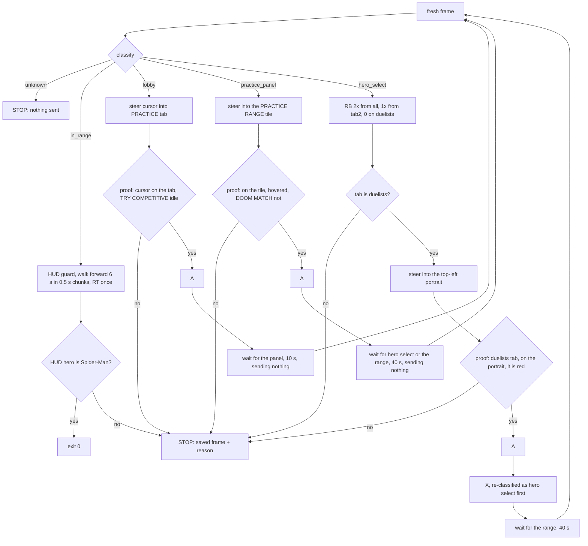

# Re-entry: PLAY lobby to the Practice Range as Spider-Man (VUH-1299)

**Built and tested offline on `tests/fixtures/reentry`; never run live** (L4 owns the desktop). `scripts/reenter.py`
takes the game from the PLAY lobby into the Practice Range as Spider-Man and stops at the first thing it cannot
verify. 52 tests (`tests/test_reenter.py`) pass; `--dry-run` classifies a live or saved frame and prints what it would
do without opening a pad. Handed back for the lead to schedule the live trial.

## Run it

```sh
# PC desktop session, game focused (the script does not focus it), PLAY lobby on screen
uv run --no-project --python 3.11 --with dxcam --with opencv-python-headless --with numpy --with vgamepad \
    python scripts/reenter.py                      # do it
    python scripts/reenter.py --dry-run            # grab one live frame, print what it would do, no pad
    python scripts/reenter.py --dry-run --frame shot.jpg   # the same on a saved frame (no capture at all)
# offline tests (need opencv + numpy, so they are only collected with the perception group)
uv run --group perception pytest tests/test_reenter.py
```

Exit 0: in the range as Spider-Man. Exit 1: stopped. The last frame is saved to `data/reenter/refuse-<time>.jpg` (1280x720)
and one line says why (`reenter: STOP: <reason> (frame: <path>)`). If the first frame is unrecognised, no pad is opened.
Every log line starts `reenter:`.

## Flow



What is sent, and only this: `A` (three places, each behind a proof), `RB` and `X` (hero select only), left-stick
moves (menus: cursor steering; range: forward), `RT` once (range). Never `START`, never the d-pad, never `X` on the lobby
or the panel. A screen visited more than twice means a press did nothing: STOP, no third try.

## Rules and where they are enforced

| Rule | Enforced by | Pinned by (test) |
|---|---|---|
| Every `A` follows a fresh frame proving what the cursor is on | `Safe.press` re-grabs, re-classifies and runs the proof right before tapping | `test_a_cursor_left_of_practice_never_presses_a`, `test_the_all_tab_with_black_panther_is_never_selected`, `test_the_duelists_tab_with_the_cursor_off_spiderman_never_presses_a`, `test_every_run_including_the_failing_ones_only_sends_allowed_buttons` |
| `X`, `START`, d-pad never on the lobby; `X` only on hero select | `ALLOWED` per classified screen | `test_forbidden_buttons_are_refused_wherever_they_are_asked_for` |
| Unknown screen: send nothing, stop | `run` refuses `unknown`; a real run opens no pad on an unknown first frame | `test_an_unknown_screen_sends_nothing`, `test_a_run_stops_before_opening_a_pad_on_an_unknown_first_frame` |
| Loading is not "unknown screen": nothing is sent while waiting | `wait_for` (only classifies, never sends) | `test_a_screen_that_never_loads_stops_without_sending_anything_while_it_waits` |
| Bounded | `MAX_STEPS` 30 nudges, `MAX_MISSES` 4 jiggles, 10 / 40 / 40 s waits, a screen may be visited twice | `test_steering_is_bounded_when_the_cursor_never_moves`, `test_a_press_that_does_nothing_is_not_repeated_forever` |
| Arrival: walk ~6 s, attack once, confirm the range | `arrive`: the HUD is re-proved before every chunk and before `RT`; the HUD portrait must be Spider-Man | `test_arrival_stops_input_the_moment_the_range_hud_is_gone`, `test_arriving_as_another_hero_is_reported_not_hidden` |

Every rule has a test that fails when it is broken: 20 hand mutations of `reenter.py` (each proof check, each `ALLOWED`
entry, the steering rules, the waits, the arrival checks) were run against the suite in a scratch copy; two slipped
through at first and now have tests.

## What each screen looks like (measured on the fixtures, 1280x720 px)

| Screen | Test | Measured |
|---|---|---|
| lobby | yellow START bar (`START_YELLOW` 0.5) | 0.91 on the three lobby frames, 0.00 on every other |
| hero select | yellow CONFIRM button (`CONFIRM_YELLOW` 0.5) | 0.86 on the three hero-select frames, 0.00 on every other |
| practice panel | dimmed band luminance < 40, above and below < 60, **and** the white "PRACTICE" title (`PANEL_TITLE` 0.15) | band 15.6 (lobby 85-87, hero select 140-143, range 118); title 0.326 (every other frame <= 0.036) |
| range | `record.in_range` (unchanged) | true only on `in-range.jpg` |
| active hero tab | white diamond over a tab icon (`TAB_WHITE` 0.4) | active 0.65-0.69, inactive <= 0.08. `all` and `duelists` are seen; `tab2` (RB once from `all`) is inferred from the skill |

A first version identified the panel by darkness alone. A black frame (a loading screen) then classified as the panel;
the title requirement fixed it, and a test pins it.

## The proofs in front of `A`

| `A` on | Proof (all must hold) | Measured |
|---|---|---|
| lobby | cursor centre inside the PRACTICE tab (x 1168-1256, y 372-394, 5 px margin); TRY COMPETITIVE looks idle | tab edges profiled on the frame with no cursor near it; banner dark share 0.75 and luminance 78.6 in all three lobby frames, tolerance 0.12 / 12 both ways |
| panel | cursor inside the PRACTICE RANGE tile (10 px margin) and not on DOOM MATCH; the range tile dark (< 100), DOOM MATCH bright (> 150) | range tile 44.9, DOOM MATCH 232.4 |
| hero select | duelists tab active; cursor inside the top-left portrait slot (6 px margin); the slot has red in it (`SLOT_RED` 0.03) | red-hue share of the slot: unhovered 0.276, hovered 0.076, another hero 0.005 |
| range (after) | the HUD hero portrait has red in it (`HUD_RED` 0.10) | 0.247 on Spider-Man, 0 with it blanked |

The lobby fixture `left-of-practice` puts the cursor on the TIMES SQUARE tab's right end (x 1146), so a press there would
open the map picker; the proof refuses it with "not inside the PRACTICE tab". The all-tab Black Panther frame is refused
twice over: the tab is not duelists, and its cursor is too faint to find.

**Synthetic negatives.** No fixture shows TRY COMPETITIVE highlighted, DOOM MATCH hovered, or another hero in Spider-Man's
slot with the cursor on it. Those tests paint a fixture (a yellow glow, white or black over the banner; the tiles'
brightness swapped; a grey slot) or replace the cursor position, and say so. They pin the logic, not the game's look.

## The cursor finder is ours, not `l4_menu.find_cursor`

The brief said to reuse L4's finder. It cannot be used as is: it returns the first Hough circle unchecked (minRadius 20,
param2 26), and the game draws two sprites: a small ring (r about 19) with a bright centre dot when hovering a widget, and
a larger plain ring (r about 26) otherwise, faint over dark art.

| Fixture | Cursor (read off the screenshot) | `l4_menu.find_cursor` | `reenter.find_cursor` |
|---|---|---|---|
| lobby-cursor-far | (640,256) | (640,256) ok | (640,256) |
| lobby-cursor-left-of-practice | (1146,380) | (314,296) **wrong** | (1146,380) |
| lobby-cursor-on-practice | (1214,380) | (214,258) **wrong** | (1214,380) |
| panel-cursor-on-practice-range | (780,380) | (780,380) ok | (780,380) |
| heroselect-all-tab-black-panther | (780,380), faint | (780,380) ok | None (refuses) |
| heroselect-duelists-cursor-off | (780,86) | (816,386) **wrong** | (780,86) |
| heroselect-cursor-on-spiderman | (852,48) | (528,268) **wrong** | (852,48) |
| in-range | none | (1184,444) **invented** | None |

Ours takes every Hough candidate down to radius 16 and keeps one only if it carries the sprite's signature on
`min(B, G, R)` (bright only where every channel is bright): a ring bright all the way round (20th percentile of the ring
samples) with contrast against just outside it, plus, for the hover sprite, a centre dot. No false candidate passed on any
of the eight frames. The one miss is the faint all-tab cursor, and returning None there is the safe answer: no cursor, no
press, and the run jiggles the stick (4 tries) and stops. A plain ring-versus-surroundings contrast score does not work: the
hover ring's translucent interior is brighter than its outside. If L4 wants it, `find_cursor` in `reenter.py` is a drop-in.

## Steering

`l4_menu`'s closed-loop `goto` is a closure inside `main()`, so it cannot be imported without editing L4's file, which is
off limits. `steer` reuses its step law (one axis at a time, the x axis while it is more than 9 px off, full stick,
`0.035 s + d / 700 px/s`) and its jiggle for a hidden cursor. Two additions came from simulating it against a cursor model
(700 px/s, 35 ms dead time, +-15% noise) instead of trusting the happy path:

- **A stall.** My first axis rule chose x whenever |dy| <= 9, so a cursor at the right x but 8 px outside the tab's 12 px
  window got zero-length x nudges until the budget ran out (3 of 12 seeds). Now L4's rule: correct x while it is off by
  more than 9 px, otherwise y. `test_steering_corrects_y_when_x_is_already_on_target` pins it.
- **Overshoot.** An axis that reverses direction has overshot, so the real cursor is faster than assumed; its steps halve.

300 random starts per zone, nudges median / max (noise +-15%, except the 0.4x row at +-30%): gain 0.4x (slow) 16 / 24 on the tab; 0.5x 12 / 18; 1.0x 5 / 9; 2.0x
5 / 8; 3.0x 8 / 10 (all 300 of 300 reach the zone, for the tab, tile and portrait). Without the damping 2.0x reached the
tab 9 times in 300. The skill's measured speed (about 1200 px/s on a 2000 px view) is about 770 px/s here, 1.1x.

## Not verified: read these first in the live trial

1. **TRY COMPETITIVE highlighted.** Only its idle look is on file. The check is two-sided "does not match idle", so any
   glow or flash blocks the press, but a highlight that happens to keep the same dark share and luminance would not.
2. **The un-hovered PRACTICE RANGE tile and a hovered DOOM MATCH.** The panel proof needs the range tile dark and DOOM
   MATCH bright, as the one panel frame shows and the skill says ("it darkens when hovered"); the opposite states are
   inferred.
3. **After `A` on Spider-Man.** No fixture shows the selected state, so `X` is not gated on a visible change. `X` needs
   only a fresh frame classified as hero select. If `A` did nothing, `X` confirms whatever was selected and the arrival
   check ("HUD hero portrait is not Spider-Man", exit 1) reports it.
4. **Load times.** The waits are 10 s (panel), 40 s (hero select) and 40 s (range); the skill says about 12 s to hero select.
5. **The range may load without hero select** (the picker did not remember a hero before). That path goes straight to
   arrival and is reported by the HUD hero check.
6. **Focus.** The game reads the pad only while focused, and this script does not focus it. Unfocused, the cursor never
   moves and steering stops after 30 nudges (about 15 s) with a frame saved.
7. **Pad enumeration.** `Live` waits 3 s after opening the pad; the "Switching Devices" banner and toast should not touch
   the START box (y 585-608), the tab or the tiles, but no frame shows them over the lobby.
8. **`Live` was tested against a fake `vgamepad` only** (button order, which buttons exist, the trigger, the stick). The
   real pad, dxcam and the timing between them are the live trial.
9. **The tab names.** `tab2` is the second tab, inferred from "RB twice from `all` reaches duelists". Any other active
   tab stops the run.

If the live trial refuses somewhere unexpected, the saved frame plus `--dry-run --frame <that frame>` shows which check
said no and why. Frames worth capturing for new fixtures: TRY COMPETITIVE hovered, DOOM MATCH hovered, the hero-select
wheel after selecting Spider-Man, and the lobby with the pad banner up.

## Files

`scripts/reenter.py` (the script), `tests/test_reenter.py` (52 tests: classifier, cursor finder, each proof with its
negatives, steering against a simulated cursor, the whole flow against a simulated game serving the fixtures, dry run,
`main`, and `Live` against a fake pad), `tests/fixtures/reentry/*.jpg` (the lead's eight frames). Untouched: L4's files.
`tests/test_reenter.py` imports opencv, so `tests/conftest.py` skips it in the stdlib-only default run.
