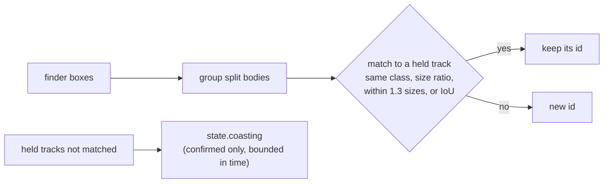

# Track ids (VUH-1314)

`agent/tracker.py` gives every detection a persistent `track` id at the one place detections become a `State`: `agent.loop` calls
`Tracker.update(dets, t, frame)` on the aim crop's boxes every reflex tick and on the whole-frame search's boxes at a decision tick, on
one instance under one lock. Ids are never reused. Stdlib only; tests in `tests/test_tracker.py` and, on recorded frames,
`tests/test_tracker_frames.py`.

## Matching

- **Gate.** A box may take a track's id if its centre is within `GATE` (1.3) track sizes of where the track is predicted, or overlaps
  the prediction by IoU >= `IOU_MIN` (0.1). The number is measured, not tuned:

  | On `tagrun0` (216 saved frames, ~9 Hz) and the reviewer's steal cases | Centre jump, px | Jump / track size | IoU | Box expansion to contain the centre | Speed, px/s |
  |---|---|---|---|---|---|
  | the bot's own re-associations, not close, consecutive (54) | <= 215 | <= 0.79 | >= 0.00 | <= 2.22 | |
  | ... not close, after a dropout (5) | <= 21 | <= 0.13 | >= 0.74 | <= 0.26 | |
  | ... close, consecutive (89) | <= 575 | <= 1.12 | >= 0.00 | <= 3.82 | <= 5210 |
  | ... close, after a dropout (2) | <= 688 | <= 0.71 | >= 0.00 | <= 4.85 | |
  | the reviewer's steal cases (h 300/468/600/965 at 450/702/900/1447 px: the old 1.5 gate's boundary, not where steals happen) | 450-1447 | 1.50 | 0.00 | 7.2 (3 if offset vertically) | 1286-4134 after 0.35 s |

  Only jump / track size carries signal; pixels, IoU, containment and speed all overlap (the camera's own swings move the bot faster than
  a steal would), and a flat pixel cap cannot hold: the bot's own point-blank re-association jumps 688 px. The gate is tightened to just
  above the bot's largest measured jump (1.12), and that is all it proves: it closes the band from 1.3 to 1.5 sizes, not steals in
  general. One crowd bot's re-appearance after a 0.36 s dropout jumped 1.43 sizes; it now gets a new id, the safe direction.
- **Residual risk.** A fresh bot that comes into view within 1.3 track sizes of where a hit-flashed target is predicted (390 px at h 300,
  1254 px at point blank) inherits its id, and the brain follows it. It can also be a swap: ids are assigned greedily by cost, so when the
  real bot comes back 1.0 sizes from its prediction while a fresh bot sits at 0.4, the fresh bot takes the old id and the real bot gets a
  new one (h 300 seen 10 ticks, gone 4, then boxes at x 1300 and 880 get ids [2, 1]), and the brain does not return to the original. The recordings put the bot's own jumps up to 1.12 sizes, so nothing
  in a single re-association tells the two apart in that band. A brain-side check (on re-acquiring after a coast, prefer the hostile on
  the crosshair when the id's box is far from it) is not built, because the recordings do not support it: on `tagrun0` the brain's
  target contains the crosshair on 7 of 91 frames where it is close (median 0.63 box sizes away, p90 1.54, max 2.32) and 58 of 80 where it
  is not; of the two re-acquisitions after a coast, one came back 885 px (0.92 sizes) from the crosshair, not on it; and another hostile
  sat on the crosshair on 1 frame. Being on the crosshair does not identify the target with that run's aim. The recording is ~9 Hz from
  an older controller; a supervised run with the current one is the measurement that could change this.
- **Size.** Heights may differ by at most 2.5x (4.5x when either box is close, since an edge-cut outline changes size).
- **Class.** A track only ever matches its own class.

## Split bodies

At close range the finder can draw one bot as two boxes. Two same-class boxes of one frame are merged into one id only if they are
**stacked**: overlapping horizontally by `SPLIT_X` of the narrower width, with a vertical gap or seam of at most `SPLIT_GAP` of the
shorter height, comparable in size, and their union body-shaped (height / width 1.2-4.5). Two dummies in a line, one behind the other,
overlap over their whole height and keep two ids. The hole that remains: two separate boxes that happen to be stacked, each with a height /
width under about 1.9, within a quarter height vertically and overlapping 0.6 of the width, still merge (two 250 x 200 boxes 10 px
apart become one id); no realistic pair of bots at different depths built in review merged.

**Pieces of a body already seen.** Live, at close range, the finder returns one bot as 2-5 pieces that change every frame, and the aim
crop's edges (y 240 and 1200 at 1440p) cut it. A box that would start a new id is instead given the id of a confirmed track matched in
the same update if at least `PIECE_INSIDE` (0.7) of it lies inside that body's box (last update's and this one's), padded by `PIECE_PAD`
(0.1 of its size), and it is no taller than the body; the body's box becomes the union of its pieces. Only a body matched in the same
update takes pieces: a small box where a body is merely predicted stays its own (a lamp at a coasting bot's place is a lamp). A box that
matches a track of its own is never absorbed, so two dummies seen together from the start keep two ids. Only bodies matched on their
own are witnesses: a piece taken this update never vouches for the next box, so the body cannot chain outward piece by piece, and which
boxes join a body as its pieces does not depend on the order of the boxes. That holds for piece membership against the directly matched
bodies only: the numbers given to new ids follow the order of the boxes, and the greedy matching of boxes to tracks is not claimed to be
order-invariant.

**Residual: a new, smaller bot appearing inside a confirmed near bot's box while that bot is still visible is taken as its piece.**
Geometry cannot tell it from a piece (a 300 px bot at x 1030 inside a 600 px bot at x 1000 gets the near bot's id). If it is the first box
of that id in a decision, the brain follows it under the held id, which bypasses two-decision acquisition. Nothing seen live has done this.

## Live: postfreeze30 (30 s, ~50 Hz, the first supervised run)

`docs/evidence/l4/postfreeze30_replay.py --run data/l1/<run>` replays any run two ways (labels per run in its `LABELS`), and reproduces
every number below.

- **The trace** (stdlib): the boxes the live finder recorded, through tracker and scripted brain in live order (every aim-crop update per
  tick, the whole-frame search's update when the crop was empty, each decision after its row's updates). It makes 116 ids where the run
  made 112. It cannot show a finder change; `--no-kill-feed` drops the kill feed's box, which the finder no longer makes.
- **`--refind`** (perception group): a given finder re-run on the 273 saved frames (~9 Hz; the loop decides at 10 Hz), aim crop and whole
  frame when the crop is empty, then tracker and brain. This is where a finder change shows.

A tick counts toward a target only while the brain's intent engages (not Search or Idle): that is what the pad acts on. Labels are by eye
on the saved frames: every box before t 13.8 s is the spawn room's lime glass door, a box at the kill feed's place (2319,128)-(2426,247)
is the HUD kill feed, and after t 15.3 s a box 120 px or taller is the Luna Snow bot (who is killed at 19.3 s and back below the platform
from 22.7 s).

| Trace replay | ids | Luna ids / switches of her main box's id | engaged ticks: door / kill feed / Luna / other | held id visible (on Luna) | tracker update p50 / p95 |
|---|---|---|---|---|---|
| 36f1eec (its brain, finder, tracker) | 116 | 16 / 20 | 499 / 316 / 535 / 65 | 22% (54%) | 0.002 / 0.05 ms |
| tracker-live, no kill feed | 103 | 11 / 16 | 478 / 0 / 532 / 104 | 28% (53%) | 0.002 / 0.05 ms |

The trace carries the old finder's boxes, so its door count shows only the brain's part: on those dense boxes (the door in 52 frames of
273) two decisions in a row trims 499 to 478. The finder's part shows in the refind replay.

| Refind replay (finder -> tracker -> brain) | engaged: door / kill feed / Luna / other |
|---|---|
| 36f1eec finder, tracker and brain | 9.5 s / 1.1 s / 9.0 s / 5.5 s |
| tracker-live | **0** / 0 / 12.5 s / 2.9 s |

- **The kill feed and most of the door are gone at the finder** (docs/lanes/l3-detector.md). What is left of the door is four thin slivers
  of its edge, each in one saved frame, and one sighting used to be enough for the brain to engage (a combo's ability hold then carried it
  about 3 s: 3.6 s of door on this replay). **A new target needs its id present at two decisions in a row** (`brain._pick_target`, ~0.1 s
  at the loop's 10 Hz); the held target keeps its own id path, `LOST_S`, the coast and a playing combo, so one missing decision does not
  drop it. It stops the door and delays Luna's engagement by 0.35 s, 0.45 s and 0.23 s on her three appearances (15.3, 22.7, 24.9 s).
  It works at the decision rate, which is the same live; a tracker confirmation count would not (at 50 Hz a sliver gets 3 hits in 60 ms).
- **A killed bot is released** 0.94 s after its last sighting: the brain keeps a missing target only within `LOST_S` (0.5 s) or while the
  tracker coasts its id (at most `CLOSE_AGE_S`, 1.5 s), plus a combo already playing. Measured gaps while Luna is alive and engaged are
  at most 0.86 s live and 1.31 s on the replay, inside that bound. On release the brain now clears its remembered target, so the loop's
  trace stops naming the dead bot (it used to, for as long as nothing else was picked).
- **The engaged bot's own id churn is its pieces**, not the camera: within the gate, yet a new id, because a piece took the old id and
  the others were born. The piece rule above takes the new-born pieces; what remains is two concurrent tracks on pieces that were born
  apart (legs and torso in a kick), which keep their own ids. `Detection.plate` does not separate them from two bots (finder lane doc).
- **The camera turning under the tracker** accounts for 19 of 105 new ids (with ego-motion from the commanded stick and the controller's
  measured yaw map, the old box lands inside the gate; without it, it does not). 15 are boxes under 72 px, far bots. Of the rest, one
  is Luna losing her far-range id in a turn at 15.4 s: the brain re-picks her. Compensating it is not built.

## Targets only the whole-frame search sees (trackerlive30)

On trackerlive30 (the supervised run of the merged change, ~55 Hz) the pad sat idle for 4.9 s at the end, engaged on the respawned bot 630
px right of the crosshair, and for 2.9 s after a bot was knocked out. The trace replay now steps the controller each tick with the brain's
intent and reports **stalls** (engaged, and no stick, move or press for over 0.5 s); on main it reproduces the live ones (8.6 s: 2.9 s;
18.5 s: 2.1 s; 28.1 s: 5.1 s, live 4.7 s).

- **The controller aims a whole-frame target from every new measurement.** A target the aim crop has not confirmed is only a bearing, and
  it used to be seeded once: the turn stopped where the controller's own camera model said it had arrived (the camera had turned about
  390 of the 630 px), and after 1 s the unconfirmed limit stopped turning. Each decision's measurement now re-aims the track, at the
  camera angle of the frame it was measured in (`Controller.step`'s `intent_t`, which the loop sets to the decision's frame time), and
  refreshes its sighting time, so the turn goes on while the brain keeps seeing the bot.
- **The brain releases a target that stays outside the aim crop.** A target whose box stays outside the crop's window (a third of the
  frame height either side of the crosshair, the loop's 960 px at 1440p) for `OUTSIDE_S` (1.5 s) is released and its id is not picked
  again while it stays outside; once its box is inside the crop it may be picked again (through the usual two decisions), and a released id
  unseen for `BARRED_S` (2 s) is forgotten, so the tracker keeping the id never starves the bot. The one real target on the two runs
  that started outside the crop took 0.76 s to come in (trackerlive30 id 20); physically a
  turn to anywhere on screen takes under 0.5 s at the measured rates. It covers a target the turn cannot bring in (the pitch budget, or
  the crop not seeing what the whole-frame search does) and the downed bot at the frame's edge (a 38 x 43 box held 3 s).
- **A committed combo does not outlive its target.** A combo holds its intent for `BURST_HOLD_S` (3 s); a bot knocked out as the combo
  was chosen left nothing to play it on, and the pad sat idle for the rest of the hold. A hold on a hostile now lasts only while that
  intent's OWN target is here by id, coasting, or last seen within `LOST_S`, and not released; another enemy in view is not that target.
  A cancelled hold does not cut a primitive the controller is already playing (only `Idle` and the retreat's `Disengage` cut one), and a
  search swing to an anchor keeps its hold.

| Trace replay | stalls over 0.5 s | engaged on the bot (with the pad doing something) | held id visible (on the bot) |
|---|---|---|---|
| trackerlive30, main | 2.9 / 2.1 / 0.6 / 5.1 s | 21.1 s (11.90 s) | 29% (37%) |
| trackerlive30, this change | 0.7 / 1.9 / 0.6 / 1.7 s | 15.6 s (11.94 s) | 37% (50%) |
| postfreeze30, main | 2.7 / 3.8 / 0.5 / 0.7 / 5.5 / 1.5 s | 10.6 s (9.65 s) | 23% (55%) |
| postfreeze30, this change | 2.7 / 0.7 / 2.3 / 1.3 s | 10.5 s (9.48 s) | 28% (56%) |

The replay is open loop: the recorded camera does not answer the new sticks, so a bot outside the crop never comes in and is released
after `OUTSIDE_S` (the 5.1 s stall becomes 1.7 s). Whether the re-aimed turn brings such a bot into the crop live is not shown by an
open-loop replay; it is pending the next live measurement. Engaged time falls by the seconds that were
spent standing still; engaged time with the pad doing something does not (trackerlive30 +0.04 s; postfreeze30 -0.17 s, on the old
finder's boxes). postfreeze30's remaining 2.7 s stall at 3.4 s is on the spawn door in the trace's recorded boxes, which the finder no
longer makes; on the refind replay (the current finder) door and kill feed are 0 s on both runs.

## Coasting: a deliberate trade

A confirmed track (seen `CONFIRM` = 3 times) that goes unseen is held, its id in `state.coasting`, for `MAX_AGE_S` 0.8 s, `SMALL_AGE_S`
1.2 s for a small box, and up to `CLOSE_AGE_S` 1.5 s for a close one (the controller's own `CLOSE_LOST_S`). This bridges the hit flash,
the point-blank outline running off the frame, a far box flickering at the size floor, and the bot passing behind the hero.

The cost, accepted: while the brain's target is coasting, `brain.gate` keeps the standing intent and `_pick_target` returns nobody rather
than switch, so for up to 1.5 s the scripted policy is not consulted and a second bot on the crosshair is ignored. It is bounded by the
age limits above; after that the target is gone and the nearest hostile is picked again.

## Who reads the id

- `brain._pick_target` follows the target by id (a hostile class at `MIN_CONF` or above only), treats a coasting id as "briefly
  missing", not gone, and takes a new target only once its id was present at the previous decision too.
- `jev.reassociate` follows an answered target by id and class, returns it as-is while it coasts, and otherwise falls back to the
  nearest box of its class within `MATCH_FRAC`.
- **The controller does not.** `Controller._follow` keeps its own `Track` and re-associates it by bearing each step; it never reads
  `Detection.track`. Brain identity is not actuator identity: the pad steers to whichever box lies at the tracked bearing, so brain and
  controller can disagree about which box is the target when two bots are close, and the disagreement can persist for as long as the
  bearing re-association stays on the other bot.
