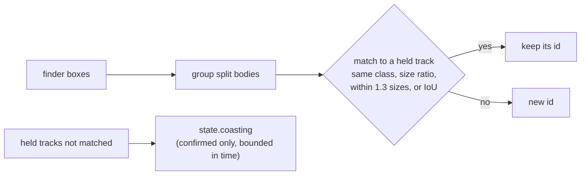

# Track ids (VUH-1314)

`agent/tracker.py` gives every detection a persistent `track` id at the one place detections become a `State`: `agent.loop` calls
`Tracker.update(dets, t, frame)` on the aim crop's boxes every reflex tick and on the whole-frame search's boxes at a decision tick, on
one instance under one lock. Ids are never reused. Stdlib only; tests in `tests/test_tracker.py` and, on recorded frames,
`tests/test_tracker_frames.py`.

## Matching

- **Gate.** A box may take a track's id if its centre is within `GATE` (1.3) track sizes of where the track is predicted, or overlaps
  the prediction by IoU >= `IOU_MIN` (0.1). The number is measured, not tuned:

  | On `tagrun0` (216 saved frames, ~9 Hz) and the reviewer's steal cases | Centre jump, px | Jump / track size | IoU | Box expansion to contain the centre | Speed, px/s |
  |---|---|---|---|---|---|
  | the bot's own re-associations, not close, consecutive (54) | <= 215 | <= 0.79 | >= 0.00 | <= 2.22 | |
  | ... not close, after a dropout (5) | <= 21 | <= 0.13 | >= 0.74 | <= 0.26 | |
  | ... close, consecutive (89) | <= 575 | <= 1.12 | >= 0.00 | <= 3.82 | <= 5210 |
  | ... close, after a dropout (2) | <= 688 | <= 0.71 | >= 0.00 | <= 4.85 | |
  | the reviewer's steal cases (h 300/468/600/965 at 450/702/900/1447 px: the old 1.5 gate's boundary, not where steals happen) | 450-1447 | 1.50 | 0.00 | 7.2 (3 if offset vertically) | 1286-4134 after 0.35 s |

  Only jump / track size carries signal; pixels, IoU, containment and speed all overlap (the camera's own swings move the bot faster than
  a steal would), and a flat pixel cap cannot hold: the bot's own point-blank re-association jumps 688 px. The gate is tightened to just
  above the bot's largest measured jump (1.12), and that is all it proves: it closes the band from 1.3 to 1.5 sizes, not steals in
  general. One crowd bot's re-appearance after a 0.36 s dropout jumped 1.43 sizes; it now gets a new id, the safe direction.
- **Residual risk.** A fresh bot that comes into view within 1.3 track sizes of where a hit-flashed target is predicted (390 px at h 300,
  1254 px at point blank) inherits its id, and the brain follows it. It can also be a swap: ids are assigned greedily by cost, so when the
  real bot comes back 1.0 sizes from its prediction while a fresh bot sits at 0.4, the fresh bot takes the old id and the real bot gets a
  new one (h 300 seen 10 ticks, gone 4, then boxes at x 1300 and 880 get ids [2, 1]), and the brain does not return to the original. The recordings put the bot's own jumps up to 1.12 sizes, so nothing
  in a single re-association tells the two apart in that band. A brain-side check (on re-acquiring after a coast, prefer the hostile on
  the crosshair when the id's box is far from it) is not built, because the recordings do not support it: on `tagrun0` the brain's
  target contains the crosshair on 7 of 91 frames where it is close (median 0.63 box sizes away, p90 1.54, max 2.32) and 58 of 80 where it
  is not; of the two re-acquisitions after a coast, one came back 885 px (0.92 sizes) from the crosshair, not on it; and another hostile
  sat on the crosshair on 1 frame. Being on the crosshair does not identify the target with that run's aim. The recording is ~9 Hz from
  an older controller; a supervised run with the current one is the measurement that could change this.
- **Size.** Heights may differ by at most 2.5x (4.5x when either box is close, since an edge-cut outline changes size).
- **Class.** A track only ever matches its own class.

## Split bodies

At close range the finder can draw one bot as two boxes. Two same-class boxes of one frame are merged into one id only if they are
**stacked**: overlapping horizontally by `SPLIT_X` of the narrower width, with a vertical gap or seam of at most `SPLIT_GAP` of the
shorter height, comparable in size, and their union body-shaped (height / width 1.2-4.5). Two dummies in a line, one behind the other,
overlap over their whole height and keep two ids. The hole that remains: two separate boxes that happen to be stacked, each with a height /
width under about 1.9, within a quarter height vertically and overlapping 0.6 of the width, still merge (two 250 x 200 boxes 10 px
apart become one id); no realistic pair of bots at different depths built in review merged.

**Pieces of a body already seen.** Live, at close range, the finder returns one bot as 2-5 pieces that change every frame, and the aim
crop's edges (y 240 and 1200 at 1440p) cut it. A box that would start a new id is instead given the id of a confirmed track matched in
the same update if at least `PIECE_INSIDE` (0.7) of it lies inside that body's box (last update's and this one's), padded by `PIECE_PAD`
(0.1 of its size), and it is no taller than the body; the body's box becomes the union of its pieces. Only a body matched in the same
update takes pieces: a small box where a body is merely predicted stays its own (a lamp at a coasting bot's place is a lamp). A box that
matches a track of its own is never absorbed, so two dummies seen together from the start keep two ids. Only bodies matched on their
own are witnesses: a piece taken this update never vouches for the next box, so the body cannot chain outward piece by piece, and which
boxes join a body as its pieces does not depend on the order of the boxes. That holds for piece membership against the directly matched
bodies only: the numbers given to new ids follow the order of the boxes, and the greedy matching of boxes to tracks is not claimed to be
order-invariant.

**Residual: a new, smaller bot appearing inside a confirmed near bot's box while that bot is still visible is taken as its piece.**
Geometry cannot tell it from a piece (a 300 px bot at x 1030 inside a 600 px bot at x 1000 gets the near bot's id). If it is the first box
of that id in a decision, the brain follows it under the held id, which bypasses two-decision acquisition. Nothing seen live has done this.

## Live: postfreeze30 (30 s, ~50 Hz, the first supervised run)

`docs/evidence/l4/postfreeze30_replay.py --run data/l1/<run>` replays any run two ways (labels per run in its `LABELS`), and reproduces
every number below.

- **The trace** (stdlib): the boxes the live finder recorded, through tracker and scripted brain in live order (every aim-crop update per
  tick, the whole-frame search's update when the crop was empty, each decision after its row's updates). It makes 116 ids where the run
  made 112. It cannot show a finder change; `--no-kill-feed` drops the kill feed's box, which the finder no longer makes.
- **`--refind`** (perception group): a given finder re-run on the 273 saved frames (~9 Hz; the loop decides at 10 Hz), aim crop and whole
  frame when the crop is empty, then tracker and brain. This is where a finder change shows.

A tick counts toward a target only while the brain's intent engages (not Search or Idle): that is what the pad acts on. Labels are by eye
on the saved frames: every box before t 13.8 s is the spawn room's lime glass door, a box at the kill feed's place (2319,128)-(2426,247)
is the HUD kill feed, and after t 15.3 s a box 120 px or taller is the Luna Snow bot (who is killed at 19.3 s and back below the platform
from 22.7 s).

| Trace replay | ids | Luna ids / switches of her main box's id | engaged ticks: door / kill feed / Luna / other | held id visible (on Luna) | tracker update p50 / p95 |
|---|---|---|---|---|---|
| 36f1eec (its brain, finder, tracker) | 116 | 16 / 20 | 499 / 316 / 535 / 65 | 22% (54%) | 0.002 / 0.05 ms |
| tracker-live, no kill feed | 103 | 11 / 16 | 478 / 0 / 532 / 104 | 28% (53%) | 0.002 / 0.05 ms |

The trace carries the old finder's boxes, so its door count shows only the brain's part: on those dense boxes (the door in 52 frames of
273) two decisions in a row trims 499 to 478. The finder's part shows in the refind replay.

| Refind replay (finder -> tracker -> brain) | engaged: door / kill feed / Luna / other |
|---|---|
| 36f1eec finder, tracker and brain | 9.5 s / 1.1 s / 9.0 s / 5.5 s |
| tracker-live | **0** / 0 / 12.5 s / 2.9 s |

- **The kill feed and most of the door are gone at the finder** (docs/lanes/l3-detector.md). What is left of the door is four thin slivers
  of its edge, each in one saved frame, and one sighting used to be enough for the brain to engage (a combo's ability hold then carried it
  about 3 s: 3.6 s of door on this replay). **A new target needs its id present at two decisions in a row** (`brain._pick_target`, ~0.1 s
  at the loop's 10 Hz); the held target keeps its own id path, `LOST_S`, the coast and a playing combo, so one missing decision does not
  drop it. It stops the door and delays Luna's engagement by 0.35 s, 0.45 s and 0.23 s on her three appearances (15.3, 22.7, 24.9 s).
  It works at the decision rate, which is the same live; a tracker confirmation count would not (at 50 Hz a sliver gets 3 hits in 60 ms).
- **A killed bot is released** 0.94 s after its last sighting: the brain keeps a missing target only within `LOST_S` (0.5 s) or while the
  tracker coasts its id (at most `CLOSE_AGE_S`, 1.5 s), plus a combo already playing. Measured gaps while Luna is alive and engaged are
  at most 0.86 s live and 1.31 s on the replay, inside that bound. On release the brain now clears its remembered target, so the loop's
  trace stops naming the dead bot (it used to, for as long as nothing else was picked).
- **The engaged bot's own id churn is its pieces**, not the camera: within the gate, yet a new id, because a piece took the old id and
  the others were born. The piece rule above takes the new-born pieces; what remains is two concurrent tracks on pieces that were born
  apart (legs and torso in a kick), which keep their own ids. `Detection.plate` does not separate them from two bots (finder lane doc).
- **The camera turning under the tracker** accounts for 19 of 105 new ids (with ego-motion from the commanded stick and the controller's
  measured yaw map, the old box lands inside the gate; without it, it does not). 15 are boxes under 72 px, far bots. Of the rest, one
  is Luna losing her far-range id in a turn at 15.4 s: the brain re-picks her. Compensating it is not built.

## Targets only the whole-frame search sees (trackerlive30)

On trackerlive30 (the supervised run of the merged change, ~55 Hz) the pad sat idle for 4.9 s at the end, engaged on the respawned bot 630
px right of the crosshair, and for 2.9 s after a bot was knocked out. The trace replay now steps the controller each tick with the brain's
intent and reports **stalls** (engaged, and no stick, move or press for over 0.5 s); on main it reproduces the live ones (8.6 s: 2.9 s;
18.5 s: 2.1 s; 28.1 s: 5.1 s, live 4.7 s).

- **The controller aims a whole-frame target from every new measurement.** A target the aim crop has not confirmed is only a bearing, and
  it used to be seeded once: the turn stopped where the controller's own camera model said it had arrived (the camera had turned about
  390 of the 630 px), and after 1 s the unconfirmed limit stopped turning. Each decision's measurement now re-aims the track, at the
  camera angle of the frame it was measured in (`Controller.step`'s `intent_t`, which the loop sets to the decision's frame time), and
  refreshes its sighting time, so the turn goes on while the brain keeps seeing the bot.
- **The brain releases a target that stays outside the aim crop.** A target whose box stays outside the crop's window (a third of the
  frame height either side of the crosshair, the loop's 960 px at 1440p) for `OUTSIDE_S` (1.5 s) is released and its id is not picked
  again while it stays outside; once its box is inside the crop it may be picked again (through the usual two decisions), and a released id
  unseen for `BARRED_S` (2 s) is forgotten, so the tracker keeping the id never starves the bot. The one real target on the two runs
  that started outside the crop took 0.76 s to come in (trackerlive30 id 20); physically a
  turn to anywhere on screen takes under 0.5 s at the measured rates. It covers a target the turn cannot bring in (the pitch budget, or
  the crop not seeing what the whole-frame search does) and the downed bot at the frame's edge (a 38 x 43 box held 3 s).
- **A committed combo does not outlive its target.** A combo holds its intent for `BURST_HOLD_S` (3 s); a bot knocked out as the combo
  was chosen left nothing to play it on, and the pad sat idle for the rest of the hold. A hold on a hostile now lasts only while that
  intent's OWN target is here by id, coasting, or last seen within `LOST_S`, and not released; another enemy in view is not that target.
  A cancelled hold does not cut a primitive the controller is already playing (only `Idle` and the retreat's `Disengage` cut one), and a
  search swing to an anchor keeps its hold.

| Trace replay | stalls over 0.5 s | engaged on the bot (with the pad doing something) | held id visible (on the bot) |
|---|---|---|---|
| trackerlive30, main | 2.9 / 2.1 / 0.6 / 5.1 s | 21.1 s (11.90 s) | 29% (37%) |
| trackerlive30, this change | 0.7 / 1.9 / 0.6 / 1.7 s | 15.6 s (11.94 s) | 37% (50%) |
| postfreeze30, main | 2.7 / 3.8 / 0.5 / 0.7 / 5.5 / 1.5 s | 10.6 s (9.65 s) | 23% (55%) |
| postfreeze30, this change | 2.7 / 0.7 / 2.3 / 1.3 s | 10.5 s (9.48 s) | 28% (56%) |

The replay is open loop: the recorded camera does not answer the new sticks, so a bot outside the crop never comes in and is released
after `OUTSIDE_S` (the 5.1 s stall becomes 1.7 s). Whether the re-aimed turn brings such a bot into the crop live is not shown by an
open-loop replay; it is pending the next live measurement. Engaged time falls by the seconds that were
spent standing still; engaged time with the pad doing something does not (trackerlive30 +0.04 s; postfreeze30 -0.17 s, on the old
finder's boxes). postfreeze30's remaining 2.7 s stall at 3.4 s is on the spawn door in the trace's recorded boxes, which the finder no
longer makes; on the refind replay (the current finder) door and kill feed are 0 s on both runs.

## The hand-off from the whole-frame search to the aim crop (stall30)

On stall30 (the supervised run of the stall fixes) the re-aim works (a whole-frame target 992 px out was inside the crop 0.6 s after the
pick), but both times a target crossed from the whole-frame search into the crop it got a new id (live 15 -> 19, 71 -> 73) and the held id
only coasted. Three causes, each fixed; `postfreeze30_replay.py` reports the run's own hand-offs by their recorded boxes
(`live_handoffs`), and both are kept on the replay (7 -> 7, 66 -> 66; on main 15 -> 19, 71 -> 73):

- **The camera turns under the tracker.** `update(..., cam=(yaw, pitch, focal))` moves every held box into the camera the frame shows
  before anything is matched (a still point's bearing is the camera's plus atan(offset / focal)); the loop notes, on each reflex tick,
  the camera the controller's model says that frame shows, and hands the same entry to the decision's whole-frame update. The model is
  the commanded one and overstates the turn at stick onset (stall30: 17 degrees commanded where the bot moved about 9), so it narrows
  the gap rather than closing it. The moved boxes are a view for matching only: a track keeps its own box and camera unless this
  frame's measurement replaces them, so an older frame (an empty whole-frame result landing late, whose camera can put a newer box
  behind it and clamp it to the frame edge) never rewrites a newer track.
- **An older measurement replaced a newer one.** The decision worker's whole-frame result lands after newer aim-crop updates; a box from
  a frame older than a track's last sighting now names the box but does not move the track (it put the bot back where it was before a
  19 degree turn).
- **A bot enters the crop as a sliver at its edge.** A box cut by an edge of the region it was found in (`clip`, the aim crop) is a held,
  confirmed track, whatever its size, when that track's predicted box itself reaches or crosses the same edge and at least 70% of the
  box lies in the predicted box, unpadded (stall30: 24 x 30 px of a bot seen whole at 693 x 504). A body wholly inside the crop, a box
  beside the body rather than on it, and an unconfirmed track lend nothing.

The controller also re-seeds when the brain switches to another target id: kept on the previous target's confirmed track it never
re-aimed at the new one and counted the stale track as lost (1.1 s with no stick while the brain engaged a bot 650 px right). What remains
of the no-steer time on the live intent sequence (0.3-1.0 s at a time) is the brain waiting on a target that has vanished and is coasting
(a small far one up to `SMALL_AGE_S`, a knocked-out one up to `CLOSE_AGE_S`), with nothing on screen to steer at; not changed.

| Trace replay | held id visible on the bot | stalls over 0.5 s | engaged on the bot, pad active | tracker update p50 / p95 |
|---|---|---|---|---|
| stall30, main | 25% | 2.1 / 0.9 / 0.5 / 1.1 / 1.1 s | 6.83 s | 0.002 / 0.06 ms |
| stall30, this change | 45% | 1.1 / 0.7 / 1.0 / 0.7 / 1.1 s | 7.33 s | 0.024 / 0.09 ms |
| trackerlive30, main | 50% | 0.7 / 1.9 / 0.6 / 1.7 s | 11.94 s | |
| trackerlive30, this change | 51% | 0.7 / 1.1 / 0.6 s | 14.19 s | |
| postfreeze30, main | 56% | 2.7 / 0.7 / 2.3 / 1.3 s | 9.48 s | |
| postfreeze30, this change | 69% | 1.1 / 0.6 / 0.7 s | 9.33 s | |

**Residual, not built: a camera-model mismatch can steal an id.** The turn the tracker compensates is the controller's commanded one.
Where the real turn differs (stall30: 9 degrees against 17 modelled), two bots side by side can each land on the other's moved box: a
synthetic two-bot case gives ids [2, 3] where [1, 2] held. Not a measured live failure. The replays above count ids kept on a bot; an
exact id is not proof that the designated target was the one engaged.

**Open residual: the spawn door seen from the plaza.** It does not meet "door 0 s" and so does not meet reliable autonomous episodes. One
component on the door's right pane, 226 x 572 px, with a median hue above 60 (no hue bar separates it: its hue spread and brightness
overlap the bots'), is present at two decisions in a row, starts a combo, and the combo holds for 1.2 s while the large box coasts
(stall30 refind replay, 13.4-14.6 s: door 1.18 s). A real bot flashing white after a hit coasts the same way, so the hold is not cut. It
is its own item; what was measured and ruled out for it is under "The plaza-side door" below. It is not classified: runs are to start on
the plaza facing away from the door (docs/lanes/reentry.md). That is a restricted start condition, not a classifier and no guarantee the
door stays out of view, and runs compare only from the same verified start pose.

## Targets beyond reach, and the walk off the plaza (handoff30)

**What the small boxes are.** The 30-42 px boxes, often in pairs, are the range's robot dummies at the far end of the shooting lane (the
floor marked 10M-40M), outlined green by the game like every enemy (handoff30 native frame 000096). The finder is right to box them, and the
finder GT counts them (it counts every enemy the game marks), so nothing is removed at the finder. At 30-42 px they are ~45 m off by the
brain's ranging (1.30 / height share). Every recorded run has them: 62-112 decision boxes under 60 px per run, mostly these dummies, some
scenery (the door's glass, pink pillars) inside the spawn-room windows. Every bot engaged on the four runs is 60 px or more;
one dummy on the upper walkway behind a railing reads 41-48 px (stall30, 5.5-6.1 s).

**The rule: nothing past a 40 m engagement cap is a target.** The cap is a chosen operational engagement and approach limit, informed by
the kit's falloff (Web Cluster is full damage to 20 m and falls to 50% at 40 m). On the height ruler (distance ~ 1.30 / height share, about
+-25%) it is `brain.RANGES.reach_h` = 0.0325 of the frame height, 47 px at 1440p; a detection that carries a distance is judged by
`reach_m` 40 instead.
`_acquirable` refuses a new target at or under it; a held target is followed by its id as before. Search pans past the dummies.

**Why he walked off.** `Engage` walks forward (`ly` 1.0) on every step where the aim crop measures the target's confirmed box and it is not
near, at any range; a far target without a swing anchor is `Engage`d. On handoff30 that walked him 0.8 s at a 36 px dummy (id 92) and over
the plaza's edge to the lower ring. The controller now also refuses the forward walk when the box measured this step is past the cap: by
that measurement's own distance when it carries one, else by its height (`controller.beyond_reach`; the brain's `in_reach` reads the same
table the same way). A held target keeps its id past the cap, and is aimed at, not walked at. Replayed, no forward walk on any of the four
runs is toward a crop box under 48 px (was 28 px on three of them). This is not a ground check: the walkway dummy's 54 px crop boxes are
still walked at, and so is any target inside the cap across an edge.

**Search after the fall is not a pitch fault.** On the live sticks it paid back its pitch on entry (15.58-16.13 s), ran the absolute
re-level at 17.6-21.2 s (1.8 s up into the clamp, the ceiling rosette in view; 1.8 s down at half stick) and then panned level to 29.6 s.
The level frames (21.2, 25.0 s) show a curved corridor under the plaza with walls close on both sides; the floor and ceiling views are the
up phase and the third-person camera colliding with a wall as it pans. Nothing was in view because nothing is down there. The fix is not
falling.

| Replay (open loop) | engaged, pad active: bot / small / other / door | forward walk ticks by target label | smallest crop box walked at |
|---|---|---|---|
| handoff30, main | 3.71 / 3.12 / 0 / 0 s | bot 40, small 109 | 28 px |
| handoff30, this change | 4.92 / 0 / 0 / 0 s | bot 51 | 49 px |
| stall30, main | 7.33 / 1.08 / 0.56 / 3.32 s | bot 82, small 37, door 78, other 23 | 28 px |
| stall30, this change | 6.51 / 2.13 / 0.75 / 3.32 s | bot 102, small 60, door 70, other 23 | 54 px |
| trackerlive30, main | 14.30 / 2.92 / 0.11 / 0.32 s | bot 172, small 27, door 3 | 28 px |
| trackerlive30, this change | 14.89 / 0 / 0.80 / 0.32 s | bot 172, other 1, door 3 | 48 px |
| postfreeze30, main | 9.33 / 0 / 0.61 / 5.16 s | bot 118, door 16, other 1 | 50 px |
| postfreeze30, this change | 9.33 / 0 / 0.61 / 4.96 s | bot 118, door 16, other 1 | 50 px |

"small" is a box of 47 px or less outside the door and junk windows (`SMALL_H` in `postfreeze30_replay.py`), labelled by the whole-frame
box. stall30's rise is the open loop: the bot (id 7) is now picked at 4.03 s instead of 4.98 s, the recorded camera turns only when the live
one did, so the replay releases it after `OUTSIDE_S` and takes the walkway dummy at 41-48 px; its crop boxes are 54 px or more. Stall runs
over 0.5 s: handoff30 0.63 / 0.59 / 1.28 s -> 0.50 s; stall30 loses its first (1.05 s); trackerlive30 and postfreeze30 unchanged. The hand-offs
(handoff30 15 -> 15, stall30 66 -> 66) hold; stall30's first one is not reached for the reason above. Cost: one division per candidate.

| Refind replay (current finder) | bot / small / other / door, s |
|---|---|
| handoff30 | 5.13 / 3.36 / 0.22 / 0 -> 5.35 / 0 / 0.55 / 0 |
| stall30 | 10.79 / 0.22 / 0.96 / 1.18 -> 10.79 / 0 / 0.96 / 1.18 |
| trackerlive30 | 16.64 / 3.46 / 0.45 / 0 -> 17.17 / 1.30 / 0.45 / 0 |
| postfreeze30 | 10.66 / 0.22 / 2.64 / 0 -> 10.66 / 0 / 2.64 / 0 |

What is left under small and other: trackerlive30's 1.30 s is a combo held on a bot picked at 78 px, its last box (34 px) repeated while
the track coasts; stall30's other is the lit glass dome (the junk window), unchanged; postfreeze30's other is 97-110 px bots under that run's
120 px label. handoff30's 0.55 s is junk: a colour-fringed smear at the base of the tree statue during a fast turn (id 63, 50 px), a finder
residual. Kill feed is 0 everywhere; the door is unchanged (the plaza-side door on stall30 is the open residual above).

**Residuals, not built.** The forward walk walks toward a target inside the cap with no notion of the ground ahead: approaching one across
the plaza's edge walks off it the same way, and a supervised run with this filter is not evidence that he cannot fall. Once off the plaza, nothing brings him back: Search pans an empty corridor until the run ends. With only dummies in
view (all past the cap), he searches rather than engages.

## The plaza-side door: what does not separate it (reach30)

On reach30 the door seen from the plaza is the brain's target for 8.5 s (live, by eye) and 6.47 s on the refind replay. Measured on every
finder box over 47 px in the saved frames of the five runs (1,158 boxes, labelled roughly by the door and bot windows, both sides of each
cut checked by eye; `docs/evidence/l3/door_appearance_*.py`, sheets `door-ruledout-*.jpg`):

| Measure | Door | Bots | Why it does not separate |
|---|---|---|---|
| Stroke width, fill of the band's raw pixels | sw95 median 5.5 px, inner fill 0.12 | median 2.7 px, tail to 47 px | the Luna Snow bot's costume is in the band, and every bot's name-plate bar is a filled green bar: the thickest boxes on all five runs are her plate |
| Hue and value of the band's pixels | median hue 60, value 149 | 65, 200 | the best cut removes ~60% of the door's boxes at 5-7 bot boxes; beyond it bots go fast |
| Lime-yellow glass (hue 30-53) in and around the box | median 0.18 in, 0.15 around | p95 0.028 in, 0.013 around | removes the bot standing in front of the glass door (stall30 18-19 s) and a gold-glowing one, and misses the door seen through dark glass (reach30 3.9-4.3 s) |

**A plate release does not separate it either.** A held target whose plate reads False over N decisions (None counting as no evidence) would
be released. On the refind replays of the five runs (`door_plate_release.py`) the door gives almost no evidence: its slabs run off the top
of the image, so the bar's place is out of view (None), or no whole-frame box matches the crop box; reach30's door is no evidence on 51 of
60 readings, and its longest run of False is 4 decisions (0.41 s). Real bots give longer runs: 9 (0.97 s), 7, 7, 6 (2.1 s), 6 and five of 4-5
among 37 episodes (pieces, hit flashes, the bar behind scenery or off the plate's place). Any N that releases the door releases bots first.

## Walks and aims only on the held target (reach30)

The controller measures its target from the aim crop's boxes by bearing. On reach30 that took three wrong objects for the held one:

- The whole-frame bot (id 44, 183 px, 948 px left) had its track taken over by the 30-40 px distant boxes that crossed its bearing during
  the turn, and the aim followed them right. A box counts only if its height is within the tracker's own ratios of the track's
  (`SIZE_RATIO` 2.5, `CLOSE_RATIO` 4.5 once close).
- With those gone and the track drifted 0.25 s, it re-seeded on the nearest box, the door's edge (id 51), counted it measured and confirmed,
  turned right and walked at it. A drifted track is never re-seeded onto a box whose tracker id differs from the held target's.
- 8 of 13 ticks walked at the door's edge at 18.6-19.0 s measured another id than the held one. A box carrying the held target's id is its
  measurement wherever the bearing put it (the tracker has matched it through the turn). Another id's box may still be aimed at, but earns
  nothing for the held target: it does not count toward arming (`stable`), so it starts no attack, no WebStrike (whose bypass reads
  `stable`) and no walk; a primitive already playing runs its course. Boxes with no ids keep the bearing rule. (Review of d5818cf: a
  WebStrike on id 1, tagged, pressed RB with only id 2 in view; the tag was id 1's, so whether RB pulls or zips at id 2 was unknown.)

On the trace replays of the five runs (postfreeze30, trackerlive30, stall30, handoff30, reach30; this change with the successor rule
below), forward-walk ticks on a box that is not the held id go 3 / 73 / 169 / 3 / 46 -> 0 on all five. The cost: walk ticks toward the
bot go 118 / 172 / 102 / 51 / 24 -> 118 / 101 / 71 / 49 / 15, because near her the crop often measures her under another id (pieces,
churn); stall runs over 0.5 s go 3 / 3 / 4 / 1 / 6 -> 3 / 3 / 6 / 2 / 7. Engaged on the bot with the pad active: 9.33 / 14.89 / 6.51 / 4.92 /
2.75 -> 9.32 / 15.41 / 6.51 / 4.70 / 2.93 s; on the door 4.96 / 0.32 / 3.32 / 0 / 3.13 -> 4.89 / 0.26 / 3.50 / 0 / 2.95 s. Allowing the walk
on any in-gate, size-fitting box and refusing only the re-seed keeps more walk toward her but walks at another id on 16-55 ticks a run
and at the door more. Open loop exaggerates both: live, the walk changes what is seen next.

Attacks: on stall30 the ticks pressing an attack while the bot is the target go 82 -> 7 and on the door 149 -> 0; the other four runs are
unchanged. Near her the crop often measures her under another id (pieces), and a few sequences started on those boxes (mostly a melee
combo, ~1.3 s of presses each) made most of her presses. That is the rule's cost: a new selection on the crop's own id, by the brain, is
the way to earn them back, not a measurement of another object under the held target's intent.

**Residual:** a box carrying the held id bypasses the bearing gate and gets measurement, arming and walk authority subject only to size
and reach: it trusts the tracker, and inherits the camera-model id steal named above. Nothing here establishes that the engaged object is
the designated target; that is shown only by supervised runs.

## The held id's whole box after a fragment set the size (plaza30)

Point blank, the tracker gives several fragments of one outline the same id, and the controller measures the one nearest its bearing.
On plaza30 (t 28.31-28.36, every box cut by the crop's right edge at x 1760) that was id 71's upper piece, 200 -> 114 -> 107 px, while
the same frames carried its 470-499 px piece. At 28.385 only the whole 631 px box was left: 5.9x the track's size, over `CLOSE_RATIO`,
refused. Nothing re-measured the track after that, so it froze, and every leg went silent for 8.3 s with the bot 316 px right:

| Leg | Predicate (controller.py) | Recorded values |
|---|---|---|
| yaw | `abs(err) < AIM_DONE_DEG` on the frozen track; from 28.97 the track counts as lost (`t - seen_t > LOST_S`, 0.6 s: 107 px is not close) | err −0.29 deg (track yaw 206.62, cam 206.91); the box's own bearing 225.7 |
| pitch | `abs(pitch_used) > MAX_PITCH_STICK_S and rates[1] * pitch_used > 0`, then lost | err +11.55 deg up on the stale track, `pitch_used` +0.31 |
| walk | `mine` is False: `_measured` False | the own-id box h 490-521 on every tick |
| attack | `on_target` needs `_measured`; `stable` 0 < `ARM_FRAMES` | `stable` 0 from 28.385 |

Once a track has gone unmeasured past the re-seed delay (0.25 s), it re-seeds onto the held id's own box, whatever its size. It is not
taken sooner, because one frame's id can be wrong: at 16.836 an 89 px box carried the held id 37 of a 585 px bot 300 px away, and the size
check refused it. A re-seed restarts arming from zero, and boxes with another id or no id still need the size ratio.

On the plaza30 replay through the controller, the pad is identical to the recording through 28.607. At 28.626 (0.262 s after the last
measurement) it re-seeds onto id 71's 517 px box and sends rx +0.92, ry −1.00: down is allowed, since `pitch_used` is +0.31 up. Nothing
changes elsewhere in the run.

A primitive already playing runs its course across intent changes; only Idle and Disengage preempt it. plaza30's LT at 25.651 (no crop
box, Engage(66), after the second KO) is the last tap of the burst armed at 22.668 on Combo(54). That burst was armed on the held id's
own 166 px box after 5 measured steps. Its sequence ends at 25.700, fixed when it was armed (+3.032 s): LT, RB 22.98, X 23.76, RT
24.31-25.61, LT 25.65. Nothing is armed on the coast.

## Hand-offs lost to the camera model (reach30)

All three real-bot hand-offs on reach30 lost the id at the tracker's gate: the held box, moved into the new frame's camera, lands 1.9, 3.0
and 4.5 box sizes from where she is (gate 1.3), at height ratios 1.11-1.27. Not a stale measurement, not a sliver. Each pick came during
Search, with the pan (rx 0.45) and the pitch re-level (ry 1.0, into the pitch clamp) running, and the stick then reversed to full:

| Hand-off | Commanded yaw / pitch between the two sightings | Implied by her screen shift (if she stood still) |
|---|---|---|
| 11 -> 12 (below right) | +30 / -5 deg | +11 / -16 deg |
| 44 -> 50 (left; the finder lost her 0.3 s in the turn's smear) | -30 / -13 deg | -4 / -21 deg |
| 67 -> 68 (left) | +14 / +10 deg | -9 / +12 deg |

Three things the model does not have: the pitch clamp (the re-level commands 178 deg up; the camera stops ~77 deg above level, the 1.8 s at 43 deg/s that brings it back), the pitch's effect on a
turn (pitched steeply, a yaw turn rotates the image about the view point instead of sliding it: a saved pair at 20.6 s shows it), and the
bot's own movement (the hero-simulation bot moves). Measuring the real response from the frames failed for the same reason (phase
correlation sees no rotation). handoff30's kept case was a turn from level.

**The brain keeps the target where the id is lost.** While the held target coasts, `_pick_target` returns nobody: on 11 -> 12 it held the
coasting 11 for 0.8 s with her in view as 12, then searched. For a target last seen OUTSIDE the aim crop (all three were; the camera
moves most while turning to one), a NEW id (absent when the held target was last seen, present at the previous decision too, not released,
in reach) within `HEIR_RATIO` 1.5 of its height, and itself INSIDE the aim crop, is taken in its place. One still outside is no progress:
a chain of fresh outside ids alternating sides would otherwise restart `OUTSIDE_S` with every one. Taking it is a heuristic new selection,
not proof it is the same bot: size and newness cannot establish identity, and a second bot or the door can meet them. Inside the crop the
coasting trade below stands. Refind replays: the bot 5.37 -> 6.15 s on reach30, the other four unchanged; the door unchanged (6.47 s on
reach30).

A chain of fresh outside ids can still hold the brain without `OUTSIDE_S` firing through ordinary acquisition: each is picked on its own
two sightings once the one before stops coasting, and each starts its own clock (the review's alternating-sides probe ends on id 15 with
nothing barred, on main before any successor rule exactly as here). Not changed.

**Residual, not built:** keeping the id itself needs a camera model with the pitch clamp and the pitch's coupling, or the camera measured
from the image with rotation; the controller's calibration is L4's.

## Coasting: a deliberate trade

A confirmed track (seen `CONFIRM` = 3 times) that goes unseen is held, its id in `state.coasting`, for `MAX_AGE_S` 0.8 s, `SMALL_AGE_S`
1.2 s for a small box, and up to `CLOSE_AGE_S` 1.5 s for a close one (the controller's own `CLOSE_LOST_S`). This bridges the hit flash,
the point-blank outline running off the frame, a far box flickering at the size floor, and the bot passing behind the hero.

The cost, accepted: while the brain's target is coasting, `brain.gate` keeps the standing intent and `_pick_target` returns nobody rather
than switch, so for up to 1.5 s the scripted policy is not consulted and a second bot on the crosshair is ignored. It is bounded by the
age limits above; after that the target is gone and the nearest hostile is picked again.

## Who reads the id

- `brain._pick_target` follows the target by id (a hostile class at `MIN_CONF` or above only), treats a coasting id as "briefly
  missing", not gone, and takes a new target only once its id was present at the previous decision too.
- `jev.reassociate` follows an answered target by id and class, returns it as-is while it coasts, and otherwise falls back to the
  nearest box of its class within `MATCH_FRAC`.
- **The controller does not.** `Controller._follow` keeps its own `Track` and re-associates it by bearing each step; it never reads
  `Detection.track`. Brain identity is not actuator identity: the pad steers to whichever box lies at the tracked bearing, so brain and
  controller can disagree about which box is the target when two bots are close, and the disagreement can persist for as long as the
  bearing re-association stays on the other bot.
