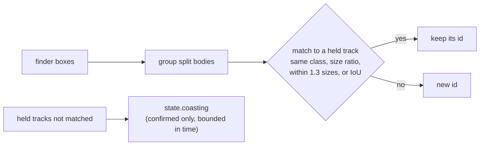

# Track ids (VUH-1314)

`agent/tracker.py` gives every detection a persistent `track` id at the one place detections become a `State`: `agent.loop` calls
`Tracker.update(dets, t, frame)` on the aim crop's boxes every reflex tick and on the whole-frame search's boxes at a decision tick, on
one instance under one lock. Ids are never reused. Stdlib only; tests in `tests/test_tracker.py` and, on recorded frames,
`tests/test_tracker_frames.py`.

## Matching

- **Gate.** A box may take a track's id if its centre is within `GATE` (1.3) track sizes of where the track is predicted, or overlaps
  the prediction by IoU >= `IOU_MIN` (0.1). The number is measured, not tuned:

  | On `tagrun0` (216 saved frames, ~9 Hz) and the reviewer's steal cases | Centre jump, px | Jump / track size | IoU | Box expansion to contain the centre | Speed, px/s |
  |---|---|---|---|---|---|
  | the bot's own re-associations, not close, consecutive (54) | <= 215 | <= 0.79 | >= 0.00 | <= 2.22 | |
  | ... not close, after a dropout (5) | <= 21 | <= 0.13 | >= 0.74 | <= 0.26 | |
  | ... close, consecutive (89) | <= 575 | <= 1.12 | >= 0.00 | <= 3.82 | <= 5210 |
  | ... close, after a dropout (2) | <= 688 | <= 0.71 | >= 0.00 | <= 4.85 | |
  | the reviewer's steal cases (h 300/468/600/965 at 450/702/900/1447 px: the old 1.5 gate's boundary, not where steals happen) | 450-1447 | 1.50 | 0.00 | 7.2 (3 if offset vertically) | 1286-4134 after 0.35 s |

  Only jump / track size carries signal; pixels, IoU, containment and speed all overlap (the camera's own swings move the bot faster than
  a steal would), and a flat pixel cap cannot hold: the bot's own point-blank re-association jumps 688 px. The gate is tightened to just
  above the bot's largest measured jump (1.12), and that is all it proves: it closes the band from 1.3 to 1.5 sizes, not steals in
  general. One crowd bot's re-appearance after a 0.36 s dropout jumped 1.43 sizes; it now gets a new id, the safe direction.
- **Residual risk.** A fresh bot that comes into view within 1.3 track sizes of where a hit-flashed target is predicted (390 px at h 300,
  1254 px at point blank) inherits its id, and the brain follows it. It can also be a swap: ids are assigned greedily by cost, so when the
  real bot comes back 1.0 sizes from its prediction while a fresh bot sits at 0.4, the fresh bot takes the old id and the real bot gets a
  new one (h 300 seen 10 ticks, gone 4, then boxes at x 1300 and 880 get ids [2, 1]), and the brain does not return to the original. The recordings put the bot's own jumps up to 1.12 sizes, so nothing
  in a single re-association tells the two apart in that band. A brain-side check (on re-acquiring after a coast, prefer the hostile on
  the crosshair when the id's box is far from it) is not built, because the recordings do not support it: on `tagrun0` the brain's
  target contains the crosshair on 7 of 91 frames where it is close (median 0.63 box sizes away, p90 1.54, max 2.32) and 58 of 80 where it
  is not; of the two re-acquisitions after a coast, one came back 885 px (0.92 sizes) from the crosshair, not on it; and another hostile
  sat on the crosshair on 1 frame. Being on the crosshair does not identify the target with that run's aim. The recording is ~9 Hz from
  an older controller; a supervised run with the current one is the measurement that could change this.
- **Size.** Heights may differ by at most 2.5x (4.5x when either box is close, since an edge-cut outline changes size).
- **Class.** A track only ever matches its own class.

## Split bodies

At close range the finder can draw one bot as two boxes. Two same-class boxes of one frame are merged into one id only if they are
**stacked**: overlapping horizontally by `SPLIT_X` of the narrower width, with a vertical gap or seam of at most `SPLIT_GAP` of the
shorter height, comparable in size, and their union body-shaped (height / width 1.2-4.5). Two dummies in a line, one behind the other,
overlap over their whole height and keep two ids. The hole that remains: two separate boxes that happen to be stacked, each with a height /
width under about 1.9, within a quarter height vertically and overlapping 0.6 of the width, still merge (two 250 x 200 boxes 10 px
apart become one id); no realistic pair of bots at different depths built in review merged.

## Coasting: a deliberate trade

A confirmed track (seen `CONFIRM` = 3 times) that goes unseen is held, its id in `state.coasting`, for `MAX_AGE_S` 0.8 s, `SMALL_AGE_S`
1.2 s for a small box, and up to `CLOSE_AGE_S` 1.5 s for a close one (the controller's own `CLOSE_LOST_S`). This bridges the hit flash,
the point-blank outline running off the frame, a far box flickering at the size floor, and the bot passing behind the hero.

The cost, accepted: while the brain's target is coasting, `brain.gate` keeps the standing intent and `_pick_target` returns nobody rather
than switch, so for up to 1.5 s the scripted policy is not consulted and a second bot on the crosshair is ignored. It is bounded by the
age limits above; after that the target is gone and the nearest hostile is picked again.

## Who reads the id

- `brain._pick_target` follows the target by id (a hostile class at `MIN_CONF` or above only), and treats a coasting id as "briefly
  missing", not gone.
- `jev.reassociate` follows an answered target by id and class, returns it as-is while it coasts, and otherwise falls back to the
  nearest box of its class within `MATCH_FRAC`.
- **The controller does not.** `Controller._follow` keeps its own `Track` and re-associates it by bearing each step; it never reads
  `Detection.track`. Brain and controller can therefore still disagree for a step about which box is the target when two bots are close.
