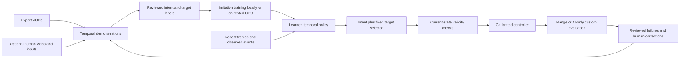

# Learning from demonstrations

## Objective and decision

The agent learns Spider-Man decisions and execution from expert demonstrations:
target selection, positioning, engagement, ability sequences, retreat and recovery.
DayMR and ReqMR are James's selected expert sources. Their rank is not independently
verified; channel titles are claims, not leaderboard evidence.

The first learned policy chooses an intent from recent frame and event history;
a fixed visible-target selector supplies its target initially. The existing
calibrated controller executes it. This preserves the useful
capture, perception, replay and control work while making the tactical decisions
trainable. Jev is an optional baseline or annotation assistant, not the learning
mechanism. Inference calls do not update its weights from outcomes.

Alternatives: a raw pixels-to-sticks policy also has to learn camera response and
button execution, with no exact input labels in public VODs. It is not the first
experiment. A policy restricted to the current `State` loses positioning and temporal
context; raw frame history remains available alongside structured observations.

This plan follows [the scope boundary](plan.md#scope-boundary): autonomous trials
stay in the practice range or custom games against AI. Matchmade human gameplay is
an offline demonstration source only. The current range guard does not authorize
custom-lobby input; verified lobby navigation and an appropriate guard are prerequisites.

## Data and labels

| Source | Evidence provided | Missing or uncertain |
|---|---|---|
| Expert VODs | Screen history, visible HUD transitions, tactical examples | Exact inputs, private communications, intent, hidden game state |
| James's synchronized gameplay | Screens and timestamped human inputs | Effective game response must still be checked |
| Scripted pad recordings | Exact commanded pad inputs and frames; initial paired data for a later inverse-dynamics experiment | Commands may be ignored; scripted actions are not expert demonstrations |
| Human annotations | Target/intent judgments, observable outcomes | Ambiguous decisions require unknown labels or multiple acceptable choices |

Expert VODs are the first data source. James recording inputs is optional, not a
prerequisite for VOD acquisition or tactical policy training. Low-level input
imitation is deferred when exact action labels are absent.

Keep originals under gitignored `data/demos/`, with source URL, VOD ID, creator,
retrieval date, source start/end, resolution, frame timing, hero, visible patch/map
evidence, overlays and splits in a small manifest. Preserve source timestamps across
trims. HLS cuts can carry keyframe preroll; validate actual frames before claiming
frame-accurate alignment. Archive completed broadcasts preferentially; growing live
VODs have changing durations. Do not put third-party media in git or upload it to
Linear. Technical accessibility is not a verified training or redistribution licence.
Acquisition feasibility records distinguish tested access from unresolved usage terms.

Curate contiguous engagements with preceding context and aftermath, including failed
attacks, retreats, no-engage decisions and recovery. Reject menus, other heroes,
spectator views, edits and obscured HUD regions from labels that depend on them.
Do not select only kills or highlight compilations.

HUD transitions are **inferred event labels**, not ground-truth button presses.
Cooldown changes may lag input; charges regenerate; death, reset, hero changes and
OCR flicker can mimic transitions. Retain evidence and uncertainty. Unlimited web
ammo in the range means an unchanged counter cannot establish whether a shot fired.
Team-up shield decay can lower displayed HP without damage taken; the event extractor
distinguishes `shield_decayed` from `hp_lost`. Low-health red vignettes can defeat HP
digit reads even when the bar remains visible; preserve unknowns and reader provenance.
Never bridge an unreadable interval as though a precise event time were observed.
Validate VOD HUD geometry separately: resolution scaling alone may not align a
mouse/keyboard HUD with our controller HUD, and streamer overlays can occlude it.

Each tactical example separates observation history ending at decision time from
the action label and subsequent outcome. Future frames may help an annotator establish
the label, but are never policy inputs. Later events and commentary are not evidence
that the player knew them earlier. Split by entire recording/session before extracting
windows; nearby frames and mirrored uploads cannot cross train/evaluation boundaries.

### Annotation ownership and pilot

Codex co-lead owns the initial annotation specification and one independent pass;
the tab-1 lead assigns the second annotator. Model-assisted labels are proposals,
not human ground truth. James is not a required volume annotator. The HUD lane
supplies observed transitions with evidence intervals; annotators infer tactical
choices only where the visible evidence supports them. A human spot-check can
adjudicate important disagreements, but unreviewed disagreements remain unknown.

An uppercut use is not `Combo`, a web shot is not `burst`, and a swing charge spent
does not identify an anchor or prove the `SwingTo` intent. RB-associated cooldown
evidence plus a visible tracer and travel can support pull/strike labels, but a
missing tracer is not proof of untagged. Burst requires the observed sequence,
not one ammo decrement. Record primitive events separately from tactical options.

Pilot format: six decision windows from the inspected samples, four Req and two
Day, including a spectator negative. Each carries source ID, decision timestamp,
the preceding five seconds (or an explicit truncated-context flag), and a separate
next-five-seconds outcome segment. Both annotators first label the context alone:
visible situation, candidate action(s), target bbox in original pixels or unknown,
evidence timestamps, uncertainty and unusable reason. Outcome review is a separate
field, not an input to a hindsight-corrected tactical label. These six examples test
label observability and the contract, not policy quality or a training data budget.
The loader owner implements the representation; this document does not add a
second competing schema. Compare agreement and evidence, retain ambiguity, and do
not treat two models agreeing as independent proof of correctness.

The six-window comparison in local `data/demos/annotations/COMPARISON.md` finds
usable/unusable agreement in 6/6 windows, exact option-set agreement in only 1/6
(the spectator negative), overlap in 4/6, and disjoint options in 1/6. Two outcome
narratives contradict. The sole shared target box has about 0.87 IoU. This does
not pass the gate for scaling tactical labels. The passes used different sampling
rates (1 versus 10 Hz), and the comparison agent did not inspect media: protocol
differences are a plausible cause, not an adjudication of the conflicting facts.

#### Aligned two-window rerun

Redo only Req +30 and +45 before expanding annotation. Preserve the original
passes. Both annotators use `data/demos/samples/reqmr-2873352801-1920.mp4` and the
frozen event stream at
`data/demos/annotations/rerun-inputs/reqmr-2873352801-1920.events.jsonl`, copied
from `data/demos/events/reqmr-2873352801-1920.jsonl`. This is the MK-layout stream,
not the older `.events.jsonl` beside the sample video.

1. Inspect context from t−5 through t at **10 Hz**, including the decision frame
   (51 samples), with native-resolution HP/ammo/ability/ult strips and access to
   the original frame. Record actual source PTS; choose the frame at or before
   each requested time. Only events confirmed by t are context inputs; retain
   transition intervals rather than inventing instantaneous button presses.
2. Derive a **per-frame visibility mask** from the event stream's segments, with
   reasons for gaps. Add observed overlay/player occlusion separately: scene,
   player and individual HUD fields can have different visibility. Do not infer
   full visibility just because a frame passes the gameplay gate. Retain the
   truncated-context flag for missing history; a visibility mask does not replace
   it. Never carry a decision across death, spectating, reset or hero change.
3. Record **tactical purpose separately from observed primitives**. Tactical
   candidates are engage (approach/continue fighting), disengage (leave danger),
   search (seek a target), reposition (non-combat rotation/setup), idle, or
   unknown/no-vocabulary-fit with a reason. These are interpretation labels for
   demonstrated behavior, not claims about the optimal next action. `get_over_here`
   is a primitive event with `target_tagged: true | false | unknown`; unknown is
   the default. Do not infer an untagged target from an unreadable tracer or map
   that unknown to a live `Pull`. Keep existing live Pull/WebStrike execution
   checks distinct. Label-to-runtime mapping is agreed before training; this
   pilot does not silently extend `agent/intents.py`.
4. Use explicit target status: visible selected target plus box, no selected
   target, or unknown whether/which target is selected. Unknown does not assert
   that a target exists. Record what is under the crosshair and whether the player,
   scene and relevant HUD fields are visible. Use outline/nameplate evidence,
   not costume colour, for team assignment; preserve unknown team and identity.
5. Save the context judgment before examining the next five seconds at the same
   rate with separate event/HUD evidence. Describe outcome observables with
   timestamps: approach, displacement, attack evidence, target association and
   damage/death evidence. Do not claim a hit or persistent target identity from
   proximity alone. Record later corrections separately, without rewriting the
   context judgment. Both passes have prior pilot exposure; this is a protocol
   repair, not a new blinded evaluation.

The lead assigns the Claude rerun; Codex owns its separate rerun. Compare tactical
labels, primitive labels and outcome facts separately, then adjudicate against
the same frames. Remaining unobservable distinctions become unknown or leave the
supervised label set. Two repaired windows can unblock a larger observability
pilot, not establish label reliability at training scale. The loader owner owns
representation changes; the shared masks must also constrain eventual training
observations so annotators cannot use history the policy will not receive.

### VOD perception and normalization

VOD target labelling is a separate perception problem. The pure-green live finder
does not transfer to arbitrary streamer outline colours; existing YOLO weights
have not been validated on this domain. The pilot uses inspected visual target
boxes, not unchecked detector pseudo-labels. Test target detection on hand-audited
VOD frames before scaling labels, and include both creators/outline settings in
evaluation so policy behavior does not depend on one highlight colour.

L3's hand-checked test on 40 frames from the two retained VOD clips rejects a
global red-colour finder: 210 proposed boxes, boxes on every frame including empty
ones, and essentially no true positives. Both creators use default red enemies,
but Spider-Man's own red suit and permanent red streamer graphics each defeat
colour-only detection. Red architecture, ability/damage effects, scoreboard panels
and defeat overlays add false positives; small, compression-smeared enemies supply
the weakest signal. More threshold tuning does not resolve that ambiguity.

The [live detector lane](lanes/l3-detector.md) reports 82% precision and 83% recall
for the chosen green outline on its hand-checked range set, with 4.4 ms inference
on a native crop on the PC. The old YOLO has about 3% recall on that same range set;
its mAP50 of 0.656 measures agreement with a substantially incorrect auto-labeller,
not trustworthy enemy detection. These range measurements do not establish VOD
accuracy. Off-the-shelf COCO person detection also fails the proposal-only bar on
the same 40 VOD frames. YOLO11 s/m at 1280/1920, with overlays masked and gameplay /
player filtering, produces only 7–12 proposed non-player boxes over 33 gameplay
frames. In the best configuration, six of seven are still the streamer's own hero
and one is a real enemy; closer inspection finds roughly 15 visible characters
across 12 frames. Neither tested size nor resolution solves the domain mismatch.
The tested off-the-shelf paths cannot supply VOD target boxes. Annotators draw the
initial small set; a thin red-versus-blue ring around a supplied box supports
enemy/ally classification in the inspected examples, with unknown retained.

Before any VOD target-labelling pass, exclude non-gameplay viewpoints and
scoreboard-obscured scene frames, then mask person-like streamer graphics. This applies
to every proposal source, including model-assisted annotation: permanent graphics
must not become training targets. Keep excluded intervals explicit in the timeline
and retain original media; an obscured HUD field remains unknown. For box proposals,
do not blanket-mask the chat column: it overlaps real play and costs recall.
The gameplay gate combines `hud.read`, `events.playing_spiderman` and the visible
banner text; a full HUD alone also passes other heroes' spectator viewpoints.

Both domains pass through a common, recorded crop/resize for the scene input.
Read native HUD crops separately into structured events before masking HUD and
known overlay regions in the scene stream; carry visibility masks so missing
pixels are not hallucinated. Originals stay intact. Exact mask bounds and working
resolution are chosen against inspected samples, not inferred from screen height.
Compression, HUD layout, player skins, map, controls and overlays are domain shifts
that remain after normalization and need held-out evaluation.

The passive practice range is out of distribution for team-fight judgment. It
tests mechanics and integration; AI-only custom games are the first venue for
meaningful interactive engage/escape evaluation, though still not human play.

## Training and runtime

Policy v0 learns the existing intent vocabulary; a fixed targeting heuristic selects
among current live detections, and evaluation holds that selector constant across
policies. This isolates intent learning while VOD target labels are expensive.
A small annotated target set measures observability and supports later learned target
choice; v0 does not claim to learn expert target selection. Spatial
directions or anchors need an agreed representation and working executor before they
become outputs. Unknown abilities and invalid targets stay guarded at execution time.
An option's completion or failure is distinct from the brain's guessed hold duration.

Two policy domains remain explicit. The **range execution policy** uses live
`State`, calibrated ranges and the controller; shared track IDs (VUH-1314) and
observation-derived option status (VUH-1315) are queued work, not assumed inputs
already delivered. The **VOD tactical policy** uses frame history and HUD events,
with target supervision only where annotators draw boxes. These domains do not
share a validated enemy/identity channel. Keep their datasets, labels and metrics
separate until perception establishes comparable entities; any integrated v0
trial is a measured transfer experiment with the fixed live selector.

Target choice and positioning are explicitly **open goals after v0**. `Engage`
hides substantial Spider-Man skill inside the engineered controller: approach
geometry, movement, aim, range management and attack execution cannot be claimed
as learned from VODs merely because a model chooses that option. Restoring learned
target choice, spatial setup/escape choices and finer execution requires observable
labels, an executable interface and separate evaluation. The narrow v0 measures
intent selection; it does not satisfy the full game-sense objective.

HUD events provide relatively cheap supervision for ability use and observable
outcomes. They do not prove engage, disengage, no-engage or a complete combo choice:
those labels still need reviewed temporal context. Primitive sequence learning and
tactical intent learning retain separate labels and metrics; reliable HUD extraction
does not establish reliable tactical annotation.

Behavioral cloning predicts reviewed demonstrated choices; it needs no reward function.
Class imbalance matters: constant movement or idle frames must not swamp rare retreat
and engagement decisions. Measure a simple baseline before choosing model size. The
Mac is the default training environment, niced; James prefers using his local
hardware wherever practical. Prefer MLX when the selected architecture has a suitable
implementation, otherwise use PyTorch/MPS. The PC GPU belongs to the live game.
Runtime placement is measured against latency and game performance before adoption.
No model family is selected yet.

James approves an initial $100 cloud-compute budget (2026-09-20). Local hardware
is a starting point, not an architectural limit: rent a GPU when measured throughput,
memory requirements or iteration speed justify it. Track spend against that initial
allocation and revisit funding before exceeding it; $100 is not an estimate for
the complete project. Hosted annotation and storage costs are estimated separately.

The [local-model measurement](lanes/local-jev.md) is a concrete placement constraint:
the 35B-A3B server answers in about 85 ms median on the Mac but 175 ms median /
531 ms p95 from the PC in the reported run. A tiny kept-alive health request takes
63–90 ms across that path versus 0.4 ms locally. These are measurements of the present
network, not an unavoidable LAN cost; wiring and remeasurement may change them.
Frame transport is unmeasured. The reported server occupies 20–32 GB and roughly
69% Mac GPU at 10 Hz, so serving that configuration and training are scheduled
separately. The server is parked; no further Jev infrastructure is on the critical path.

## First acceptance and evaluation

The first integrated skill recognizes an engagement opportunity, approaches, executes
an attack, then continues or escapes. Mechanical execution is the first measurable
slice, not the definition of the whole goal.

1. Inspect real samples from both creators and establish which labels are observable.
2. Hand-label a small set of contiguous decisions and HUD events. Report event precision,
   recall and timing error, plus unreadable coverage, against those human labels.
3. Train a first intent policy with the fixed target selector and evaluate on held-out sessions against a simple
   majority baseline and the scripted policy where its required inputs are available.
   Report confusion by action, invalid choices and abstentions. Report selector errors
   separately on annotated examples; learned target choice needs its own later comparison.
4. Compare integrated policies in repeatable range scenarios with the same perception,
   controller, start conditions and budget. Inspect actual successes and failures.
5. Evaluate richer tactical choices in AI-only custom games once navigation and guards
   work. These results do not establish expert-level play against human opponents.

Gameplay outcomes remain separate from imitation agreement. A different action is
not necessarily worse, and a copied expert action is not necessarily appropriate for
the executor's capabilities. Record recovery examples from the agent's own failures
and obtain human corrections rather than only collecting more clean expert wins.

The controller lane confirms that BACK opens a range scoreboard with damage and KOs.
This provides an observable outcome source; reliable automated reads, counter deltas
and episode/reset alignment still need validation before they become rewards.

RL is not active. It requires dependable episode boundaries, reset, outcome labels and
a trainable policy. For a bounded defeat-the-target task, confirmed completion is the
primary reward, failure/death a penalty, and elapsed time a small cost. Damage or hits
are optional shaping only when measured reliably. No numeric weights are accepted yet.
Disappearance is not a kill, ult charge is not damage, and missing evidence is unknown.
Manually adjudicated evaluation is valid while automatic outcome readers are incomplete.

## Sources

### Acquisition evidence, 2026-09-20

Installed `yt-dlp` lists recent videos for both Twitch channels and downloads
bounded public sections without cookies or login. `ffprobe` confirms 1920x1080,
60 fps for the inspected samples. `data/demos/samples/manifest.json` names nine
sample frames and their clip-relative timestamps; images and clips are local only.

| Source | Inspected sample | Finding |
|---|---|---|
| [Req, VOD 2873352801](https://www.twitch.tv/videos/2873352801) | Requested 32:00–33:00; local duration 60.083 s | Spider-Man combat, death/spectating and return. Chat intermittently obscures rightmost abilities/ult; HP and web ammo visible. +15 s is a different hero's spectator POV. |
| [Day, VOD 2879354299](https://www.twitch.tv/videos/2879354299) | Requested 6:00:00–6:01:00; approximately 60 s locally | Spider-Man traversal and combat. At +5/+30/+45 s, HP is 250/242/99 and ammo 5/4/4. HP, ammo and ability icons visible; avatar and sponsor overlays need masks. |

The six pilot decision times are clip-relative: Req +5, +15, +30, +45 seconds;
Day +30 and +45 seconds. Source windows are already present in the two retained
clips. Req +15 is a deliberate spectator negative. The manifest names the clips;
the Day pilot uses the `-21600-60s.mp4` file, not the earlier ten-second probe.

Req's metadata reports a 5:49:42 broadcast, uploaded September 13. Day's September
20 broadcast is still growing when inspected (8:03:36 at the initial probe), so
that duration is not final. Other Day samples contain hero selection, another hero,
a break screen, a tournament co-watch and another game. Channel/title is insufficient
to establish that a segment is the creator playing Spider-Man.

The Day YouTube candidate `yF2fr6wSkqE` identifies Day and links `daymr`, but its
media download returns HTTP 403; no access workaround is attempted. Twitch samples
provide the required pixels. Rank claims are not independently verified. The
[Twitch terms page](https://legal.twitch.com/en/legal/terms-of-service/) returned
only a navigation shell to the reader, so this feasibility pass establishes no
training licence or permission to redistribute. No full archive or training run
is performed in this pass.

### Guide demonstrations

[Narrated combo inventory](lanes/combo-arsenal.md) records nine locally acquired
and automatically transcribed guides from Day, Req, MatchuXD and two targeted
supplementary sources. Source timestamps distinguish range demonstrations from
match commentary. `data/demos/guides/manifest.json` records media properties and
transcript provenance; raw media and transcripts stay local. Narration supplies
semantic order and usage conditions, not exact pad inputs or current cancel
intervals. The Sekkombo pull binding and Stack timing remain live-verification gates.

### Research references

- [VPT](https://openai.com/index/vpt/): action-labelled demonstrations support inference
  of actions in additional video; the scale of its Minecraft result is not a promise
  about the amount of Rivals data needed.
- [DAgger](https://proceedings.mlr.press/v15/ross11a.html): iterative expert correction
  addresses states reached by the learner's own actions.
- [DayMR VODs](https://www.twitch.tv/daymr/videos) and
  [ReqMR VODs](https://www.twitch.tv/reqmr/videos): technical availability checked
  2026-09-20 with the installed `yt-dlp`; local sample evidence accompanies the manifest.
