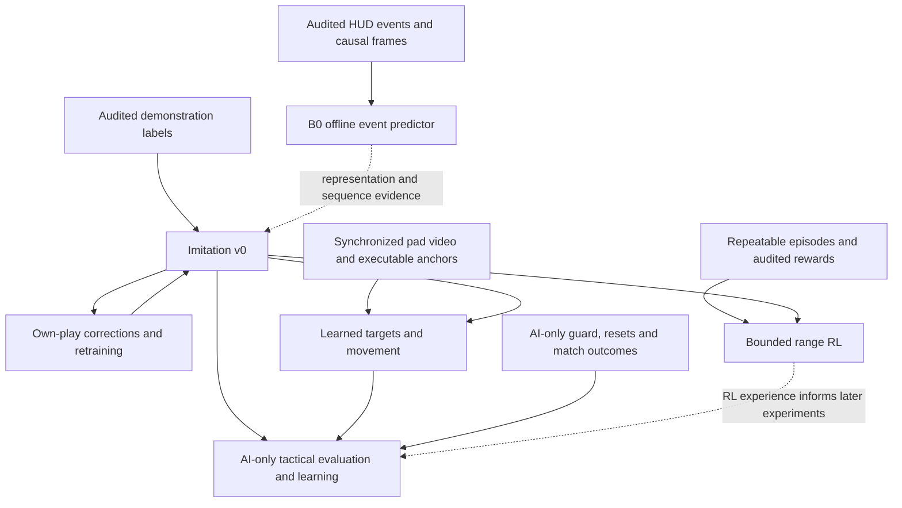
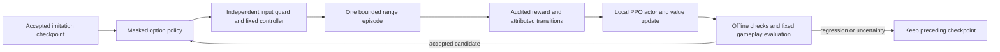

# Learning from demonstrations

## Objective and decision

The agent learns Spider-Man decisions and execution from expert demonstrations:
target selection, positioning, engagement, ability sequences, retreat and recovery.
DayMR and ReqMR are James's selected expert sources. Their rank is not independently
verified; channel titles are claims, not leaderboard evidence.

The first learned policy chooses an intent from recent frame and event history;
a fixed visible-target selector supplies its target initially. The existing
calibrated controller executes it. This preserves the useful
capture, perception, replay and control work while making the tactical decisions
trainable. Jev is an optional baseline or annotation assistant, not the learning
mechanism. Inference calls do not update its weights from outcomes.

Alternatives: a raw pixels-to-sticks policy also has to learn camera response and
button execution, with no exact input labels in public VODs. It is not the first
experiment. A policy restricted to the current `State` loses positioning and temporal
context; raw frame history remains available alongside structured observations.

**Quality governs the order of work.** James prioritizes the best-supported path
to capable gameplay over reaching a nominal training milestone sooner. Source
fidelity, observable targets and motion, audited labels, session diversity and
sealed evaluation determine progress. An auxiliary prediction checkpoint is
useful evidence, but does not replace tactical imitation, own-play corrections
or reward-driven learning against opponents that fight back.

This plan follows [the scope boundary](plan.md#scope-boundary): autonomous trials
stay in the practice range or custom games against AI. Matchmade human gameplay is
an offline demonstration source only. The current range guard does not authorize
custom-lobby input; verified lobby navigation and an appropriate guard are prerequisites.

## Roadmap and advancement gates

The roadmap advances on evidence, not footage hours. Current evidence includes
two inspected pilot clips, nine acquired guides (about 106 minutes), and about
60 raw minutes from four VOD sessions; raw duration is not accepted training
duration. The aligned two-window annotation rerun agrees on coarse tactical
purpose, but exposes event-extractor defects. The HUD lane produces event format
4; loader support and refreshed event audits govern label acceptance (VUH-1306).
The policy lane has an offline DINO encoder / GRU intent-training pipeline;
on the two multi-intent normal-cooldown sessions it beats the majority baseline
but not repeating the previous decision. Transition weighting worsens held-out
change accuracy; further tuning waits for better examples. This is scripted-brain
distillation evidence, not an accepted gameplay policy. RL is not implemented or
accepted. The next deliverable
is a small trustworthy training/evaluation set and a first imitation baseline,
not an exhaustive archive.

| Milestone | Concrete result | Gate before advancing |
|---|---|---|
| A. Trust the examples and measurements | Corrected HUD events, per-frame visibility, reviewed imitation suitability, whole-session splits; repeatable range episodes and synchronized pad/video recordings | Hand-check VOD event classes and timing; preserve unknowns. Demonstrate start, terminal outcome, interruption and reset alignment on recorded episodes. Data quality gates imitation; episode/reward quality separately gates RL. |
| B. First imitation policy | A locally trained temporal intent policy, using the fixed live target selector and existing controller | Beat a majority-label baseline on held-out sessions without hiding rare-action failures; compare the scripted policy where inputs are comparable. Measure runtime latency and inspect range transfer failures. Offline agreement alone does not establish gameplay improvement. |
| C. Corrections from our own play | Reviewed execution/navigation corrections and a retrained imitation checkpoint; combat retreat/recovery examples require F's fighting environment | Compare against B on untouched evaluation sessions and bounded live scenarios. Accept demonstrated improvement; ambiguous failures stay out of positive imitation labels. This loop continues alongside later milestones. |
| D. First reinforcement-learning experiment | Fine-tune a trainable option policy on one bounded range encounter, starting from an imitation checkpoint with demonstrated range competence | Reward audit below passes; reset and episode recording work; freeze perception/controller/target selector for comparison. Retain the RL checkpoint only if held-out encounter outcomes improve over its starting checkpoint, not merely its training return. |
| E. Learned target choice, positioning and swinging | Observable target/anchor outputs with a working executor; later, learned swing execution from synchronized video/input demonstrations | Evaluate target choices separately from intent, and swing destination success, time, charge use and collisions separately from combat. Demonstrate transfer to new starts/routes. Guide narration alone cannot supply stick trajectories. |
| F. Tactical learning in AI-only custom games | Imitation and then RL for approach, target choice, engage/escape and objective play in a fighting environment | Verified AI-only lobby navigation/guard, episode/reset flow and outcome readers; comparable live/demo entities for learned target outputs. Compare frozen baselines on match wins and objective outcomes across repeated games, with uncertainty reported. |

These are dependencies, not six serial waits. Reward measurement starts during A;
E's recorder and controller work also starts now. D can test narrow range learning
without waiting for expert-level swinging. An initial F intent-only trial can use
the fixed selector, but cannot claim E's target-choice or positioning capabilities.
E's offline box-annotation and camera-motion feasibility probes below run alongside
these prerequisites; the first narrow policy does not defer all work on game sense.

B has a pipeline prerequisite under VUH-1311: cache encoder embeddings and train
a temporal head to imitate the scripted brain on our own logged sessions, with a
held-out-session comparison against the majority baseline. This establishes a
working training/inference path, not learning from Day/Req or improving the
teacher. Expert footage may supply embeddings without supplying trusted action
labels. The separate coarse tactical-purpose head still needs A's audited labels;
its metrics and claims stay separate from scripted-brain distillation. Any
`--brain learned` integration retains the scripted policy's execution guards.

### B0: auxiliary pretraining by predicting observed ability events

An auxiliary expert-video pretraining experiment forecasts verified HUD events from preceding
video. It reuses the frozen encoder and temporal training path under VUH-1311;
it does not require tactical-purpose annotations. Its checkpoint is an offline
event predictor, not a controller policy or completion of milestone B. It can
learn sequence regularities and approximate HUD-event timing, but does not establish
optimal combos, exact button timing, target choice, tactical purpose or range competence.

**Inputs and labels.** Use five seconds of causal frame history ending at t,
sampled at 10 Hz through the loader with the same normalization and visibility
masks as runtime. The fixed first horizon is k = 1 second; do not tune it on test.
Predict the next verified event in (t, t+1]: `get_over_here`, `swing`, `uppercut`,
`web_cluster_fired`, `teamup`, or `no_verified_event`. Only audited event classes
and known icon-to-ability mappings qualify. `ability_cast` names the ability;
charge expenditure may corroborate that event but must not duplicate it. A web
ammo decrement supports the web-shot event, not an invented burst. Exclude
slot-availability transitions, unknown slots and unverified ult labels.

Retain each event's [t_from, t_to] interval. An interval crossing t cannot label
a future action; intervals crossing the horizon or with ambiguous earliest-event
ordering are omitted from this first experiment, with exclusion counts reported.
Timing is an auxiliary scalar prediction conditional on the event class: train
and score its distance outside the observed interval, with zero error inside.
Report interval widths alongside error so broad uncertainty cannot masquerade as
precise prediction. Overlapping countdown/charge evidence for one cast counts once.

`no_verified_event` means no accepted reader event in a fully observed horizon;
it is not proof of no button press, a deliberate wait, or the controller's Idle.
Death, hero change, spectating, cuts, clip ends and unreadable/occluded target HUD
channels censor the horizon; never turn those gaps into negatives. A scoreboard
gap in preceding history may be bridged only with its mask and a proven absence
of a hard cut; any gap in the prediction horizon is censored. Require the full
five-second context for the first run and report resulting eligible duration.

Past events are optional inputs and require a causal availability check, not
merely an event timestamp. The extractor uses temporal cleanup and per-source
slot mapping; perturbing footage after t must not change input features at t.
If that cannot yet be demonstrated, B0 starts with frame history only and uses
offline events solely as targets. Do not feed future-confirmed casts, outcome
frames, future cooldowns, or whole-session statistics into the observation.

**Gates and split.** The independent VUH-1326 review must accept the two train
sessions, corrected hero segmentation, PTS alignment, masks and provenance;
their events must be regenerated with the agreed reader version and its
class-specific audit. All stream files must satisfy the shared format contract.
Patch and normal-cooldown provenance remain mandatory. Event prediction does
not waive these gates or automatically promote a source into positive-action
imitation: forecasting what an expert did can include mistakes, whereas teaching
the controller to repeat it still needs suitability and execution acceptance.

Fit only accepted TRAIN groups from `s10-normal-v0`. The sealed test broadcasts
remain untouched during development, learning curves and model selection.
While independent validation is unavailable, use the two train broadcasts as
two explicitly developmental leave-one-session-out folds, fitting normalization
and baselines on the fitting session only. This permits a first fit without
pretending the official validation split is complete. Report each direction
separately: creator and session effects are confounded. A new independently
audited Day session can provide provisional Day-only validation; report that
limitation rather than requiring unavailable Req archives or borrowing the sealed
test. Final test evaluation follows a frozen model and evaluation protocol.

**Deliverable and acceptance.** Save a reproducible local checkpoint, source and
reader versions, included classes, exclusion counts, unique casts, session counts,
normalization, seed, training command and elapsed time. Overlapping windows do
not multiply the independent cast count. Report event-class macro F1, per-class
precision/recall/support, the no-event confusion, and conditional timing interval
error, per session. Compare with always-no-event, training-majority and the most
recent observed event class; compare timing with the training-only median delay
per class. An events-only baseline is also required if event history is an input,
so cooldown arithmetic alone is not described as learned visual game sense.
Run one predeclared configuration first. A reproducible negative result completes
the probe; an improvement claim requires beating the strongest applicable class
baseline on macro F1 and its timing baseline on the same held-out development
examples, with support and failure cases shown. No live deployment follows B0.

**Coarse-purpose labels remain the next head.** The next bounded tranche is
24 new development windows, 12 per creator from accepted train sessions, under
the aligned 10 Hz protocol. Sample across ordinary combat, traversal/search and
recovery evidence, without assigning purpose from those sampling cues. A primary
vision annotator labels them; Codex independently labels eight preselected windows
(four per creator) before seeing that pass. Compare and adjudicate those eight
before expanding the tranche; disagreements remain unknown until resolved against
media. Claude assigns the primary annotator and comparison owner; Codex owns
the second pass and acceptance. This is a measured annotation tranche, not a claim
that 24 labels suffice to train a tactical policy, and it does not block B0.



Codex owns the learning specification, curation criteria and reward/evaluation
design. Claude owns dispatch, integration and Linear, assigning implementation
to the existing dataset, HUD and controller owners or a named training owner.
Existing dependencies include VUH-1306 (events), VUH-1309 (paired recording),
VUH-1310 (AI-only lobby), VUH-1314 (tracks) and VUH-1315 (observed option status).
Milestone issues are A VUH-1306/VUH-1319, B VUH-1311, C VUH-1320, D VUH-1321,
E VUH-1322 and F VUH-1323. The live loop records pad state per tick in the loader's
format; the measured frame/input offset remains VUH-1309's acceptance gap.
This roadmap defines acceptance; Linear remains the record of assignment and
completion. James is not required to supply inputs or hand-label at volume.

### Reward contract before reinforcement learning

Imitation learns reviewed choices without a reward function. RL learns from the
agent's own actions and subsequent outcomes; downloaded videos alone do not
provide an interactive training environment. Reward design is a current design
task, while RL execution remains gated.

| Task | Primary objective | Supporting signals and limits |
|---|---|---|
| Bounded range encounter | Confirmed designated-target completion; terminal outcomes are completed, timeout, interrupted and lost-range | Small elapsed-time cost; optional validated outgoing damage contribution. Target identity needs tracks plus associated kill-feed evidence; aggregate KOs alone cannot identify which target died. No combat-death or damage-taken reward is available here. |
| Swing/navigation skill | Reach a specified visible destination or region | Time, resource use and observed collision/fall failures. Do not reward simply pressing swing, travelling far or staying airborne. |
| AI-only match | Team victory and verified objective progress | Combat contributions and avoidable death may support learning only if measured and shown not to encourage kill chasing or hiding. A useful trade ending in death is not automatically a bad decision. |

Range bots do not deal damage, and Practice Settings offers no fighting-bot
option. D therefore tests attack execution/completion, not survival or tactical
retreat. Expert footage can supervise observable retreat decisions offline, but
learning their consequences from our own play and testing their usefulness needs
F. A lost-range termination records why control stops; it is not a claimed death
or a successful disengagement. Reader failure remains an interruption/unknown,
not a fabricated adverse gameplay outcome.

Before an RL run, record the exact formula, weights, discount, episode limits and
reader versions with the experiment. The first experiment below supplies proposed
defaults, not validated weights; tune on development episodes, then freeze the
evaluation and its success criteria.
Optional shaping must have a bounded contribution so damage farming or repeated
partial progress cannot outweigh the actual task. Scoreboard checks are a means
of measurement, not an action deserving positive reward.

Audit range reward extraction against hand-checked recordings of completion,
timeout, interruption, lost-range and reset; add combat death and damage taken
only in an environment where those occur. Each reward component retains its
observation source and validity; unknown does not become zero. Exclude episodes or learning
targets whose required outcome is unobservable. Treat a capture/lobby interruption
as an interruption rather than inventing a gameplay death. Check that repeated
scoreboard reads cannot award the same KO twice, resets cannot produce reward
from counter jumps, and healing/shield decay cannot masquerade as damage.

There is no verified in-range reset, and bot respawn time is unmeasured. A live
run stranded the agent off the platform and needed full lobby re-entry, about
two minutes with a script whose steering still needs correction. VUH-1319's
episode/collection pilot depends on the live loop, tracks and observed option
status; it must measure recovery costs rather than assume cheap resets.

Run that small collection pilot before committing to RL scale: measure usable
episodes per hour, reset time, invalid-data rate, inference latency and training
throughput. This is one real game instance, not a simulator supplying thousands
of parallel matches; rented GPUs accelerate training, not gameplay collection.
Masked PPO is the first-experiment choice below, contingent on a viable collection
budget and trainable action interface. Range option learning starts with the motor controller frozen;
learning sticks and camera is a separate experiment under E.

Each comparison keeps the scenario set, trial budget, perception and executor
fixed, retains failures, and reports every applicable terminal-outcome count and
elapsed time as well as return. In custom games, also report deaths, wins and
objective outcomes.
Claim improvement only at the tested scope; inconclusive results call for more
evidence, not promotion of the highest-return checkpoint. Keep the preceding
working policy available for rollback. Training stays local first, with the
approved initial $100 cloud allowance governed by the compute section below.

### First RL experiment: implementation plan

This is the implementation contract for VUH-1321, not a claim that RL is running.
**VUH-1325's live-input freeze is a hard prerequisite:** the lead must accept
the integrated input-safety fixes after the independent fault-injection rerun.
Offline trainer, reward and replay work can proceed while live collection is frozen.
This gate covers every launch surface, including `agent.server` / `agent.session`
and external agents requesting a sitting. A token or loopback bind does not prove
input safety or acquire the single-desktop driver. Those paths belong in the
integrated re-review; a trainer cannot bypass the freeze by launching through them.

The concrete goal is to improve completion of one bounded, designated-target
range encounter relative to the same imitation checkpoint and controller.
The first experiment does not optimize match wins, enemy selection or stick
trajectories. Those are E/F extensions, not capabilities hidden inside the name RL.

#### Policy, observations and actions

Reuse the policy lane's frozen DINO ViT-S/16 encoder, recorded normalization and
causal five-second history. The existing two-layer GRU provides the starting
temporal representation. Add a categorical action head and a scalar value head
(predicted remaining return); train these and the GRU, initially leaving the
visual encoder, perception, target selector and motor controller fixed. Reuse
the audited observation builder; neither cache lookup nor outcome features may
leak frames or events later than the decision time. Add remaining episode time
and observed option status with explicit known/missing bits and a versioned
feature layout. Live event features stay absent until their producer is connected.

Warm-start from an imitation checkpoint validated on the same patch, normal
cooldown regime and executable action vocabulary. The current cooldown-free
scripted-brain distillation is not that checkpoint. Expert tactical labels can
improve initialization, but a range-competent own-play imitation checkpoint is
sufficient for D; D need not wait for full expert game-sense annotation.

The initial candidate vocabulary is `Idle`, `Search`, `Engage`, `Pull`,
`WebStrike`, and the verified burst `Combo`. Only actions with measured executable
preconditions enter the experiment. The fixed selector supplies the designated
target, and an episode never silently switches that identity after occlusion or
respawn. `SwingTo` enters E once anchors are executable; menu/navigation buttons
never enter any learned action space.

At an eligible option boundary, mask invalid actions before sampling, and retain
that exact mask in the rollout. Use the same mask when evaluating the action's
old/new probabilities during training. A single legal choice supplies no actor
learning signal. Neutral `Idle` must actually remain neutral: the existing live
chooser treats idle-like labels as scripted fallback, which cannot be reused as
RL action semantics. Preserve hard screen/focus/input guards independently of
the model. Action masking is a policy constraint, not the input-safety boundary.
See the [action-masking study](https://arxiv.org/abs/2006.14171).

An RL transition starts when the model's sampled option is accepted, and ends
at its observed completion/failure, next eligible choice, or episode end. The
reflex loop keeps running during it. Repeated hold ticks are not new independent
actions. Accumulate their reward and elapsed time into the originating option.
Log proposal, actual executed option, target, legal mask, behavior log-probability,
value estimate, observation times, duration, outcome evidence, policy version
and whether the gate forced/fell back. A rejected proposal must not be trained
as though it executed. Exclude forced-only decisions from actor loss; where
intervention breaks attribution, mark the transition invalid. Report the share
of actual model choices: a policy permanently bypassed by rules cannot learn.

#### Episode and reward v0

VUH-1319 supplies the episode boundary. A proposed initial task is **defeat the
designated visible bot within 20 seconds**, beginning from an observed scenario
bin (location/view, distance band, full target health, own resources, patch and
normal cooldowns). Start timing only after readiness is verified. If full target
health or identity cannot be established, do not assert a comparable start.
The lead reports an observable full-health cue in this arena: an undamaged bot
shows its name without a health bar; the bar appears after first damage. Validate
that cue on the visible designated bot during the collection pilot. A missing
bar alone (for example, with an unreadable name or occluded bot) is not proof of
full health.
The lead reports four five-minute baselines with 21, approximately 4, 20 and 0
KOs: one stalls looking down beside a close bot, another starts on a bot-free
ring. Pooling these as noise around a mean would hide start-state and recovery
failures. A bot-free start fails readiness before the episode; getting stuck
after a verified start remains a real task failure/timeout. Preserve setup
failure counts separately, and never discard difficult valid starts afterward.
Respawn/reset is an observed procedure, not an API that teleports or reseeds the
game. Record reset time separately. Menu re-entry belongs to the guarded supervisor;
it is never an exploratory policy action or part of the learning return.

The lead reports a burst kills these bots in roughly 2–3 seconds, with about
seven seconds of dead time after each KO in the baseline. The first useful
learning signal is therefore expected around approach, acquisition/reacquisition
and recovery from stalled options, rather than a long fight. Measure these
durations separately from burst execution. Episode v0 starts with a verified
visible target: post-KO search/reset outside that episode is collection overhead,
not behavior its reward can improve. Learning the next-target acquisition cycle
requires a separately defined continuation task; do not claim it from v0 results.

Proposed first-experiment reward, once per episode event:

```text
r = +1.00 on confirmed designated-target completion
    -0.25 on the task's 20-second timeout
    -0.20 * delta_gameplay_seconds / 20 on each transition
```

Completion at 5 seconds totals +0.95; at 20 seconds +0.80; timeout totals -0.45.
Each interval contributes elapsed time once, capped at the task horizon; do not
subtract cumulative elapsed time again on every tick.
Success by the deadline takes precedence over timeout; never award both. The
finite task uses discount gamma=1, and remaining time is observable. There is
no damage shaping in reward v0: this avoids depending on damage attribution or
rewarding repeatable damage without task completion. Completion requires track
identity plus associated kill-feed evidence, backed by scoreboard deltas; an
aggregate KO alone is insufficient. Credit a verified delayed display event to
the encounter that caused it, before starting another target/reset. An event
whose occurrence interval straddles the deadline cannot prove a by-deadline
success; preserve that uncertainty rather than backdating its display timestamp.

Runtime stop reasons and learning terminals are different. Completion and the
task deadline are genuine terminals. Capture loss, a guard stop, operator stop,
or ambiguous lost-range is an interruption, not a death/timeout penalty. Stop
input regardless; exclude incomplete outcome-dependent targets. A clearly
observed navigation failure may become a separately specified terminal in a
later task, but must not be inferred from the HUD disappearing. A collector
batch cut with a valid next observation can bootstrap its value; a genuine
terminal cannot. Do not bootstrap from an unknown/black next frame.
This distinction follows [Gymnasium's time-limit guidance](https://gymnasium.farama.org/tutorials/gymnasium_basics/handling_time_limits/).

Keep every interruption in evaluation's attempted-episode denominator and report
its reason. Otherwise a candidate could appear better by generating unscorable
runs. Any input-safety violation stops the experiment; reward tuning cannot
authorize unsafe behavior. Low-HP/death/escape rewards wait for AI opponents
that actually fight back.

#### Update cycle and algorithm

The first algorithm is **masked PPO with a value baseline**, initialized by
imitation. It alternates collection under one fixed policy version with a few
optimization passes on that fresh batch. We choose it for the categorical option
interface and reuse of actor logits, not because it is proven optimal for this
game or sample budget. Older expert videos have no behavior probabilities or
exact executed options; they remain imitation/representation data, not pretend
PPO trajectories. Algorithm basis: [PPO](https://arxiv.org/abs/1707.06347).



The trainer extends the existing MLX head rather than adding a model server.
Before using game rewards, check the clipped objective and value targets on
small deterministic examples and a toy task; compare numerical results with
an independent CPU calculation. The contract requires masked probabilities to
sum to one, zero probability for invalid actions, initial old/new probability
ratios of one, correct terminal targets, and exactly-once success reward.
Then verify a recorded rollout can reproduce its observations/actions/returns.
These checks prove the learning machinery, not Spider-Man performance.

Initial development defaults: PPO clip 0.2, Adam learning rate 0.0003, four
optimization epochs per fresh batch, value-loss weight 0.5 and entropy weight
0.01. Use complete finite-episode returns minus the value baseline for the
first advantage estimator; this avoids adding a second time-discount scheme
while option durations vary. Normalize advantages only when variance is nonzero.
Track policy KL and stop batch updates above a proposed 0.02 threshold; this is
a diagnostic bound, not a gameplay-safety guarantee. Record all defaults with
the checkpoint and change them only on development data.

Freeze the behavior policy for collection, keep exact old log-probabilities,
and recompute model outputs from complete causal windows for training. Deploy a
candidate only between episodes, with the pad released; never update weights
while that episode is still generating experience. Check that perception/option
versions match before consuming rollouts. Historical rollouts can be retained
for audit or separately justified imitation, but are not endlessly reused as
fresh on-policy data.

#### First experiment budget and promotion

These are proposed bounded experiment sizes, not a claim that they suffice to
learn or a lifting of the live freeze:

1. **Collection feasibility (VUH-1319):** ten observed episodes, at most 30 minutes
   including resets. Hand-check every terminal and every assigned reward; any
   false success blocks training. Report valid episodes/hour, reset distribution,
   interruptions, genuine policy-choice count and inference latency. If the cap
   prevents ten episodes, report that result rather than assuming a faster reset.
2. **Learning smoke experiment (VUH-1321):** at most 40 valid training episodes,
   with batches containing at least eight completed episodes and 64 eligible
   model choices. Allow at most four game-hours including pilot, collection,
   resets and evaluation. If those minima do not fit, stop and revise the
   collection/task design; do not run an unbounded job to fill a buffer.
3. **Evaluation:** initially 20 attempts each for the starting checkpoint and the
   frozen candidate, over a predeclared mix of starts/distance bins withheld from
   training. Interleave their order where practical, restore the same resources,
   retain invalid attempts, and include the fixed scripted controller baseline.
   Test the deployment action-selection rule, not only stochastic training rollouts.
   Report completion fraction, timeout/interruption counts, restricted completion
   time (unsuccessful attempts count as the deadline), and reward components.

Twenty attempts per policy are a smoke comparison, not a generalization promise.
Select candidates on development scenarios; keep a final evaluation set out of
checkpoint selection. Predeclare success rate as the primary metric and report
uncertainty. Promote only with evidence of improvement over the starting policy,
no input-safety violation and no increased dependence on scripted fallback or
unscorable stops. An inconclusive interval means more evaluation or no promotion,
not selecting the best-looking run. If baseline success is already saturated,
predeclare a time-to-completion objective or a harder safe task before training;
do not change the metric after seeing results.

Measure cost from the pilot: collection hours = required attempts / observed
attempts per hour, including resets and rejection. One game instance supplies
experience at real-time speed. The Mac performs training locally, niced, with
the small head/encoder workload measured separately from inference. Runtime
placement must pass PC frame-time and end-to-end latency checks; the known
Wi-Fi tail rules out assuming a reliable Mac round trip. Cloud rental uses the
existing initial $100 allowance only when measured trainer throughput justifies
it; it does not buy more game instances or faster environment time. No rentals
or live experiments are started by this document change.

If the pilot cannot supply useful choices/rewards, fix observability, resets or
the task first. If PPO works mechanically but consumes too many episodes, compare
a discrete replay-based learner under the same measured environment-hour budget;
that is a deliberate second experiment, not a parallel algorithm sweep. If no
improvement survives evaluation, retain imitation plus reviewed corrections.

#### Expansion and patch acceptance

E adds one capability at a time: target choice over validated tracks, then spatial
destination/anchor choice, then motor learning from synchronized inputs. Each
gets its own task/outcomes before joint optimization. F begins with a verified
AI-only lobby and opponent behavior, then controlled fights, then objective play
and complete matches. A starting full-match objective is terminal team win +1,
loss -1, draw 0; objective-progress shaping is added only after its reader and
anti-farming behavior are audited. These are later task proposals, not signals
the current range provides.

The existing brain gate hard-codes low-HP retreat. F must separate such tactical
heuristics from non-negotiable screen/input guards: while a rule always chooses
retreat, the policy cannot claim to learn when retreat is appropriate. Expand
the learner's authority only for the tactical behavior being evaluated; keep
input authorization and neutralization outside the learned policy.

Every source, rollout, baseline and checkpoint records patch plus cooldown regime
(VUH-1324). Acceptance is per patch. After a patch, suspend promotion and
unattended learning until the affected HUD layouts/cast readers, cooldown/charge
behavior, damage/KO attribution, ability preconditions, option completion and
combo timing are rechecked; remeasure aim/movement if their response changes.
Rerun the reward audit and a scripted baseline, then evaluate the frozen policy
before reuse. Old footage remains tagged; mixing patches is an explicit transfer
experiment. Unknown patch stays unknown, and observed cooldowns are a drift
signal rather than unique proof of patch identity.

Claude owns staffing/integration through the existing milestone issues. The
policy owner implements the actor/value update and rollout probabilities;
episode/controller owners supply resets, option status and safe collection;
HUD owners supply auditable outcome evidence; Codex owns this contract and the
independent acceptance review. The completion of VUH-1321 means a reproducible
learning comparison and retained checkpoint or honest negative result, not just
an RL library installed or a loss curve going down.

## Data and labels

### Source fidelity: investigate native replay before expanding downloads

The game's replay system is a candidate source, not a verified acquisition path.
[Replay research](lanes/replay-research.md) finds community support for shared IDs,
player POV and cooldown visibility, plus a first-party outline-setting bug fix
consistent with viewer-side rendering. These are reasons to test the route,
not confirmation of full HUD fidelity, Enemy Color behavior or expert access.
No publicly posted Day/Req replay IDs were found; absence from that search is not
proof that none exist. Replay expiry and patch compatibility remain constraints.
Claude owns replay feasibility and the safe navigation investigation. James may
optionally perform the in-client check, but his availability is not a prerequisite
for existing-footage annotation, auxiliary pretraining or range development.
An agent-operated replay visit requires its own mapped controls and authorization
proofs; the current range controller must not be sent there. Further Twitch
expansion is parked because the proposed eligible source pair is unavailable.
Existing inspected footage remains useful for narration, event-reader testing,
audited annotation and the auxiliary pretraining probe.

Separate **viewer capability** from **expert-source availability**. An existing
accessible match can test the former without proving that Day/Req matches are
obtainable. Record the client build, replay match ID/date/patch, POV mode, relevant
settings and a short native capture with HUD. Prioritize locked player POV, visible
HP/ammo/cooldowns/ult and outline behavior; compare timing at normal playback speed.
Pad-only navigation, frame stepping and the built-in clip exporter are conveniences,
not prerequisites if manual navigation and our existing screen capture work. Do
not create or enter a human match to test replay availability.

The lead's channel check reports a 1080p60 maximum for the inspected Req YouTube
uploads. That rules out a higher-resolution rendition of those uploads, not all
fidelity improvement: bitrate, re-encoding and original capture quality can differ
at the same dimensions. Keep source-quality claims tied to inspected pixels.

Replay adoption requires an accessible expert match ID with patch/session
provenance; recorded-player POV and HUD; checked camera, cooldown and event timing
at normal playback speed; and native capture without streamer overlays. Test
whether enemy colours follow our settings and score target detection on replay
frames. The range green finder's 82/83 precision/recall does not transfer by
assertion. A spectator reconstruction may differ from the original player's
camera, visibility or HUD; identify those differences before treating it as an
expert's observation. Native pixels cannot reveal hidden intent or unlogged inputs.

If these checks pass, prioritize replay-derived demonstrations and retain one
match/session identity across replay and VOD versions to prevent split leakage.
Merge the live/demo perception paths only after a measured entity/observation
contract supports it. Otherwise retain the two-domain design and document the
specific replay limitation. Acceptance of range input guards does not authorize
an unattended replay-menu visit or a new controller launch surface; the viewer
remains unmapped until separately verified.

| Source | Evidence provided | Missing or uncertain |
|---|---|---|
| Expert VODs | Screen history, visible HUD transitions, tactical examples | Exact inputs, private communications, intent, hidden game state |
| James's synchronized gameplay | Screens and timestamped human inputs | Effective game response must still be checked |
| Scripted pad recordings | Exact commanded pad inputs and frames; initial paired data for a later inverse-dynamics experiment | Commands may be ignored; scripted actions are not expert demonstrations |
| Human annotations | Target/intent judgments, observable outcomes | Ambiguous decisions require unknown labels or multiple acceptable choices |

Expert VODs are the first data source. James recording inputs is optional, not a
prerequisite for VOD acquisition or tactical policy training. Low-level input
imitation is deferred when exact action labels are absent.

All our range recordings preceding the real-cooldown baseline have Practice
Settings' default **No Ability Cooldown ON**: infinite ammo, no cooldown numbers
and an observed ult refill around 3.5 seconds. Their dataset provenance must
identify this cooldown-free regime. They can support execution/visual pipeline
work, but cannot establish normal cooldown timing, resource management or legal
combo cadence in matches. The upcoming baseline requires the setting OFF and
observed cooldown/ammo behavior checked before recording. Keep the regimes
separate in training and evaluation; do not silently pool them. For third-party
range guides, settings remain unknown unless source evidence establishes them;
our local setting does not prove the creator used it. The HUD lane identifies
cooldown-free behavior in the inspected Day pull lesson and FFAme Stack windows:
across 9,510 frames neither supplies countdown/charge evidence of casts.
Their lockout flashes cannot establish inter-cast timing. Retain their narrated
technique order and usage advice, with match footage or our normal-cooldown
recordings supplying measured timing. Do not generalize these two inspected
windows' regime to every segment of every guide.

Keep originals under gitignored `data/demos/`, with source URL, VOD ID, creator,
retrieval date, source start/end, resolution, frame timing, hero, visible patch/map
evidence, overlays and splits in a small manifest. Preserve source timestamps across
trims. HLS cuts can carry keyframe preroll; validate actual frames before claiming
frame-accurate alignment. Archive completed broadcasts preferentially; growing live
VODs have changing durations. Do not put third-party media in git or upload it to
Linear. Technical accessibility is not a verified training or redistribution licence.
Acquisition feasibility records distinguish tested access from unresolved usage terms.

Curate contiguous engagements with preceding context and aftermath, including failed
attacks, retreats, no-engage decisions and recovery. Reject menus, other heroes,
spectator views, edits and obscured HUD regions from labels that depend on them.
Do not select only kills or highlight compilations.

Retention, observability and suitability for imitation are separate decisions.
An accurately labelled expert mistake is not automatically a positive action
example. Before policy training, review demonstrated choices for suitability:
accepted examples may enter the action-imitation loss; rejected or unresolved
choices remain available for failure analysis but are excluded from that loss.
This is an acceptance requirement, not an implemented training filter. Codex owns
the review criteria; the dataset/training owner implements the representation.
Model-assisted quality judgments need an audit and do not establish optimality.

Review the decision and its context, not simply whether a death follows. A useful
trade may end in death, and a good escape attempt can follow an earlier mistake.
Preserve successful recovery and retreat examples from losing encounters; do not
label an entire life or match bad. Conversely, survival or a kill does not prove
a good choice. Outcome evidence may guide curation but never becomes a future
policy input. Retaining a failure does not itself teach avoidance: that requires
a justified corrected action, a reviewed preference, or a later outcome-learning
objective. When no better action is supported, keep it unknown rather than invent
a counterfactual target label.

HUD transitions are **inferred event labels**, not ground-truth button presses.
Cooldown changes may lag input; charges regenerate; death, reset, hero changes and
OCR flicker can mimic transitions. Retain evidence and uncertainty. Unlimited web
ammo in the range means an unchanged counter cannot establish whether a shot fired.
Team-up shield decay can lower displayed HP without damage taken; the event extractor
distinguishes `shield_decayed` from `hp_lost`. Low-health red vignettes can defeat HP
digit reads even when the bar remains visible; preserve unknowns and reader provenance.
Never bridge an unreadable interval as though a precise event time were observed.
A red/unavailable ability icon can also mean temporary animation or wall-climb
lockout; it is not sufficient evidence of use. The aligned Req rerun finds
`swing` use proposals during attacks/climbing with charge retained, plus visible
Get Over Here/uppercut changes absent from the supplied events. Treat the event
stream as proposals needing class-specific precision/recall checks. Net HP change
is not damage taken: at +48.1/+48.2/+48.3 the native HUD reads 250/195/220 while the
interval event reports loss 30. Damage and healing can cancel within an interval.
Validate VOD HUD geometry separately: resolution scaling alone may not align a
mouse/keyboard HUD with our controller HUD, and streamer overlays can occlude it.

Each tactical example separates observation history ending at decision time from
the action label and subsequent outcome. Future frames may help an annotator establish
the label, but are never policy inputs. Later events and commentary are not evidence
that the player knew them earlier. Split by entire recording/session before extracting
windows; nearby frames and mirrored uploads cannot cross train/evaluation boundaries.

### Annotation ownership and pilot

Codex co-lead owns the initial annotation specification and one independent pass;
the tab-1 lead assigns the second annotator. Model-assisted labels are proposals,
not human ground truth. James is not a required volume annotator. The HUD lane
supplies observed transitions with evidence intervals; annotators infer tactical
choices only where the visible evidence supports them. A human spot-check can
adjudicate important disagreements, but unreviewed disagreements remain unknown.

An uppercut use is not `Combo`, a web shot is not `burst`, and a swing charge spent
does not identify an anchor or prove the `SwingTo` intent. RB-associated cooldown
evidence plus a visible tracer and travel can support pull/strike labels, but a
missing tracer is not proof of untagged. Burst requires the observed sequence,
not one ammo decrement. Record primitive events separately from tactical options.

Pilot format: six decision windows from the inspected samples, four Req and two
Day, including a spectator negative. Each carries source ID, decision timestamp,
the preceding five seconds (or an explicit truncated-context flag), and a separate
next-five-seconds outcome segment. Both annotators first label the context alone:
visible situation, candidate action(s), target bbox in original pixels or unknown,
evidence timestamps, uncertainty and unusable reason. Outcome review is a separate
field, not an input to a hindsight-corrected tactical label. These six examples test
label observability and the contract, not policy quality or a training data budget.
The loader owner implements the representation; this document does not add a
second competing schema. Compare agreement and evidence, retain ambiguity, and do
not treat two models agreeing as independent proof of correctness.

The six-window comparison in local `data/demos/annotations/COMPARISON.md` finds
usable/unusable agreement in 6/6 windows, exact option-set agreement in only 1/6
(the spectator negative), overlap in 4/6, and disjoint options in 1/6. Two outcome
narratives contradict. The sole shared target box has about 0.87 IoU. This does
not pass the gate for scaling tactical labels. The passes used different sampling
rates (1 versus 10 Hz), and the comparison agent did not inspect media: protocol
differences are a plausible cause, not an adjudication of the conflicting facts.

#### Aligned two-window rerun

The aligned rerun covers only Req +30 and +45. Preserve the original passes.
Both annotators use `data/demos/samples/reqmr-2873352801-1920.mp4` and the
frozen event stream at
`data/demos/annotations/rerun-inputs/reqmr-2873352801-1920.events.jsonl`, copied
from `data/demos/events/reqmr-2873352801-1920.jsonl`. This is the MK-layout stream,
not the older `.events.jsonl` beside the sample video.

1. Inspect context from t−5 through t at **10 Hz**, including the decision frame
   (51 samples), with native-resolution HP/ammo/ability/ult strips and access to
   the original frame. Record actual source PTS; choose the frame at or before
   each requested time. Only events confirmed by t are context inputs; retain
   transition intervals rather than inventing instantaneous button presses.
   Name the extraction method and frame index as well as PTS. On this verified
   60 fps source, zero-based frame n = 6i (`select='not(mod(n,6))'`) matches
   accurate seeks pixel for pixel in the Claude annotator's check; plain
   `-vf fps=10` can differ by one source frame. Codex uses decoded PTS to select
   the greatest timestamp at or before each request. Other clips need their own
   PTS check: neither a clean 60 fps grid nor the same sampling phase is assumed.
2. Derive a **per-frame visibility mask** from the event stream's segments, with
   reasons for gaps. Add observed overlay/player occlusion separately: scene,
   player and individual HUD fields can have different visibility. Do not infer
   full visibility just because a frame passes the gameplay gate. Retain the
   truncated-context flag for missing history; a visibility mask does not replace
   it. Never carry a decision across death, spectating, reset or hero change.
3. Record **tactical purpose separately from observed primitives**. Tactical
   candidates are engage (approach/continue fighting), disengage (leave danger),
   search (seek a target), reposition (non-combat rotation/setup), idle, or
   unknown/no-vocabulary-fit with a reason. These are interpretation labels for
   demonstrated behavior, not claims about the optimal next action. `get_over_here`
   is a primitive event with `target_tagged: true | false | unknown`; unknown is
   the default. Do not infer an untagged target from an unreadable tracer or map
   that unknown to a live `Pull`. Keep existing live Pull/WebStrike execution
   checks distinct. Label-to-runtime mapping is agreed before training; this
   pilot does not silently extend `agent/intents.py`.
4. Use explicit target status: visible selected target plus box, no selected
   target, or unknown whether/which target is selected. Unknown does not assert
   that a target exists. Record what is under the crosshair and whether the player,
   scene and relevant HUD fields are visible. Use outline/nameplate evidence,
   not costume colour, for team assignment; preserve unknown team and identity.
5. Save the context judgment before examining the next five seconds at the same
   rate with separate event/HUD evidence. Describe outcome observables with
   timestamps: approach, displacement, attack evidence, target association and
   damage/death evidence. Do not claim a hit or persistent target identity from
   proximity alone. Record later corrections separately, without rewriting the
   context judgment. Both passes have prior pilot exposure; this is a protocol
   repair, not a new blinded evaluation.
6. Keep the **shared stream immutable** as the authoritative record of what the
   extractor reports for its tracked channels, not as infallible gameplay truth.
   An annotator may add `observed_not_in_shared_stream` evidence with the slot,
   before/after values, source frame indices/PTS, interval and confidence. Never
   delete or silently rewrite a shared event. Flag disputed events and visibility
   boundaries separately for adjudication; unresolved disputes are excluded from
   supervision. Additions obey the same decision-time cutoff. The frozen stream
   does not track team-up use; both the coverage gap and the reported use around
   +40.8–41.0 remain explicit rather than becoming a negative label.

The HUD lane owns the requested event-name correction: the shared slot is
`get_over_here`, while icon availability transitions are `slot_unavailable` /
`slot_available`. The frozen pilot stream still uses `pull` and `ability_used` /
`ability_ready`; those legacy names do not establish an untagged pull or a cast.
Cooldown starts and charge expenditure need separate evidence. The rename is a
contract change to coordinate with the loader, not permission to rewrite the
frozen evidence or merge the live Pull/WebStrike execution checks.

The lead's media-backed adjudication finds agreement on tactical purpose in both
rerun windows: +30 engage and +45 reposition, with residual search/setup ambiguity
at +45. Selected target and persistent identity remain unknown in both. At +30,
the +34.0–34.3 frames establish close combat beside a caped, red-marked enemy;
the first part of the outcome alone cannot describe the whole five seconds.
At +45, traversal around the pillar followed by combat is supported, but identity
continuity with the group below is not. This supports the coarse purpose/primitive
split on these two examples, not reliability at scale or observability of every
candidate class. Unknown identity here does not imply all VOD target boxes are
unobservable.

Both passes independently identify missed Get Over Here cooldown starts,
availability blips misnamed as uses, the scoreboard still visible at +43.7, and
HP intervals netting damage against healing. **Scaling annotation waits on HUD
fixes and a hand-checked VOD event sample**, with class-specific precision, recall,
timing and coverage checks. Remaining unobservable distinctions become unknown or
leave the supervised label set. The loader owner owns representation changes;
shared masks must also constrain eventual training observations so annotators
cannot use history the policy will not receive.

### VOD perception and normalization

VOD target labelling is a separate perception problem. The pure-green live finder
does not transfer to arbitrary streamer outline colours; existing YOLO weights
have not been validated on this domain. The pilot uses inspected visual target
boxes, not unchecked detector pseudo-labels. Test target detection on hand-audited
VOD frames before scaling labels, and include both creators/outline settings in
evaluation so policy behavior does not depend on one highlight colour.

L3's hand-checked test on 40 frames from the two retained VOD clips rejects a
global red-colour finder: 210 proposed boxes, boxes on every frame including empty
ones, and essentially no true positives. Both creators use default red enemies,
but Spider-Man's own red suit and permanent red streamer graphics each defeat
colour-only detection. Red architecture, ability/damage effects, scoreboard panels
and defeat overlays add false positives; small, compression-smeared enemies supply
the weakest signal. More threshold tuning does not resolve that ambiguity.

The [live detector lane](lanes/l3-detector.md) reports 82% precision and 83% recall
for the chosen green outline on its hand-checked range set, with 4.4 ms inference
on a native crop on the PC. The old YOLO has about 3% recall on that same range set;
its mAP50 of 0.656 measures agreement with a substantially incorrect auto-labeller,
not trustworthy enemy detection. These range measurements do not establish VOD
accuracy. Off-the-shelf COCO person detection also fails the proposal-only bar on
the same 40 VOD frames. YOLO11 s/m at 1280/1920, with overlays masked and gameplay /
player filtering, produces only 7–12 proposed non-player boxes over 33 gameplay
frames. In the best configuration, six of seven are still the streamer's own hero
and one is a real enemy; closer inspection finds roughly 15 visible characters
across 12 frames. Neither tested size nor resolution solves the domain mismatch.
The tested off-the-shelf paths cannot supply VOD target boxes. Annotators draw the
initial small set; a thin red-versus-blue ring around a supplied box supports
enemy/ally classification in the inspected examples, with unknown retained.

That result limits the current tools, not what expert footage can teach. A detector
fine-tuned on reviewed VOD boxes is a candidate enabler for learned targeting and
relative positioning. Visible camera motion and routes are potential supervision
for aim and swing behavior. Each needs the observability tests below before its
inferred labels are treated as demonstrated actions.

Before any VOD target-labelling pass, exclude non-gameplay viewpoints and
scoreboard-obscured scene frames, then mask person-like streamer graphics. This applies
to every proposal source, including model-assisted annotation: permanent graphics
must not become training targets. Keep excluded intervals explicit in the timeline
and retain original media; an obscured HUD field remains unknown. For box proposals,
do not blanket-mask the chat column: it overlaps real play and costs recall.
The gameplay gate combines `hud.read`, `events.playing_spiderman` and the visible
banner text; a full HUD alone also passes other heroes' spectator viewpoints.

Both domains pass through a common, recorded crop/resize for the scene input.
Read native HUD crops separately into structured events before masking HUD and
known overlay regions in the scene stream; carry visibility masks so missing
pixels are not hallucinated. Originals stay intact. Exact mask bounds and working
resolution are chosen against inspected samples, not inferred from screen height.
Compression, HUD layout, player skins, map, controls and overlays are domain shifts
that remain after normalization and need held-out evaluation.

The passive practice range is out of distribution for team-fight judgment. It
tests mechanics and integration; AI-only custom games are the first venue for
meaningful interactive engage/escape evaluation, though still not human play.

### E enablers: bounded offline pilots

These pilots use retained media and existing workers, with no live input or new
footage collection. Claude assigns execution; Codex owns the label specification
and independent audit. Their outputs are measured feasibility results, not a claim
that a detector or inverse-dynamics model already supplies trustworthy labels.

#### VOD character boxes: 30-frame audit, then at most 150 frames

1. **Sampling and provenance.** Reserve 60 current-regime Day frames, 60
   current-regime Req frames and 30 older-regime Req frames. Retained Day footage
   does not supply an older-regime cell; do not invent a balanced creator/patch
   matrix. Record source, session group, decoded PTS, source frame index, native
   dimensions, patch evidence and cooldown regime. Observed uppercut cooldown
   distinguishes these measured regimes; it does not uniquely identify a patch.
   A source with unknown session identity cannot establish an independent split.
2. **Diverse scenes.** Sample across independent encounters, sizes, maps, skins,
   airborne/grounded characters, crowds, effects and partial occlusion. Include at
   least 20 current-regime gameplay frames with no non-player character (own hero
   may be visible) to measure false positives. Do not fill the set with adjacent
   frames from one easy fight. Gate out death/spectating/scoreboards and hard cuts;
   mask person-like overlays first, preserving mask coordinates. Retain native
   frames and context locally under `data/demos/annotations/boxes/`; no media in git.
3. **Label contract.** Two independent vision annotators draw every visibly
   supported character box, not just the presumed target, on the same native frame.
   Supply a short native-resolution context window at the existing 10 Hz annotation
   rate; neighboring frames may clarify identity but may not fill an invisible
   body with a guessed box. Store visible-extent `xyxy` in original pixels,
   `self/other/unknown`, `enemy/ally/unknown`, optional hero identity, occlusion,
   uncertainty and evidence PTS. `render_mode` is mandatory: `body`,
   `outline_only`, or `unknown`. A normally rendered character with a coloured
   rim is `body`; a character revealed only by an x-ray silhouette through
   geometry is `outline_only`. Box only the rendered extent of either, including
   visibly attached equipment, excluding nameplates, health bars and detached
   effects. Keep outline renders as separate labels/classes, never body positives
   or automatically shootable targets. Unknown render mode is not forced into
   either class. A short-window track ID is separate from hero class and survives
   only visually supported continuity.

   Allegiance needs a positive, source-calibrated cue. A clearly associated ally
   nameplate/chevron supports ally; a clearly associated enemy marker or a red-to-pink
   outline following the body supports enemy on these default-colour sources.
   Lack of an ally marker alone proves nothing. A warm effect, reflected light or
   conflicting cues produce unknown; cite native/context evidence rather than
   inferring from colour alone. A different colour configuration needs its own
   cue mapping. Quadrupedal or transformed playable heroes still count: anatomy
   is not a rule for excluding a hero.

   Confirmed objective vehicles, non-player NPCs, summons and dead bodies are
   outside this player-character label set; record the exclusion reason. They
   are hard negatives when visibly resolved, not automatically ignored areas.
   A prone or airborne pose alone does not prove a corpse. Separate uncertainty
   about **existence**, **extent**, **class** and **allegiance**. An uncertain
   allegiance does not discard an otherwise supported character box. Regions
   with unresolved existence/extent/class carry a tight ignore region and reason,
   not an empty-background label. Distinct supported bodies inside such a region
   are still annotated. Audit ignored regions for misses and report their area.

   For the first detector experiment, the geometry-positive floor is **40 native
   pixels on the longest side at 1920x1080**, scaled with source resolution before
   any model resize. Retain smaller supported instances as existence/optional-box
   annotations with `below_size_floor`; use them as ignore regions in this loss,
   not as negative background. Preserve their counts and original pilot scores:
   narrowing the detector's scope does not retroactively erase misses. The
   exporter/trainer must actually honor ignore regions or omit affected frames;
   silently dropping ignore metadata into ordinary YOLO negatives is forbidden.
   The VOD proposal detector uses separate `body` and `outline_only` detection
   classes; role and allegiance remain annotated attributes for visual confirmation.
4. **Audit before volume.** Start with 30 frames: ten from each available
   creator/regime group, selected outside the sealed final evaluation set. The
   annotators do not see each other's proposals. Adjudicate against original pixels,
   including missed characters and own-hero/overlay false positives. Report object
   count agreement, matched-box IoU, centre error, allegiance agreement/unknowns and
   error by box size. Agreement alone is not truth. Proposed scale gate: each pass
   reaches at least 90% precision and recall against adjudicated visible instances,
   matching at IoU >= 0.5; report denominators and median IoU separately. If either
   fails, repair the protocol and repeat only failed categories before scaling.
   Report non-self bodies and outline-only instances separately; the large own-hero
   boxes cannot carry the gate. Independent passes use different model families
   with the same input packet and no shared labels. Forks within one pass do not
   provide additional independent votes.
5. **Splits and detector experiment.** Freeze source-session groups before training;
   approximately 60/30/30 current-regime frames go to train/development/sealed test,
   subject to whole-session integrity rather than exact quotas. Keep both creators
   in train and test where available; disclose any creator missing from development.
   All 30 older-regime frames are a separate transfer diagnostic, not silently mixed
   into the first training set. Reuse the detector lane's training path with audited
   boxes; never reuse its inaccurate pseudo-labels as truth. Select thresholds on
   development only. Report sealed-test precision/recall at IoU 0.5, small-character
   recall, own-hero/overlay false positives, and failures per creator/regime. A
   proposed proposal-only gate is >=80% precision and recall on the current test
   set; with this small sample it authorizes assisted annotation, not autonomous
   target selection. Keep human/model visual confirmation of proposals. A failure
   means more targeted labels or a revised detector experiment, not blind scaling.

**Pilot decision: protocol repair is authorized; volume expansion is pending.**
The local adjudication report records 79 matched pairs (mean IoU 0.843), with
Claude precision/recall 95.5/87.6 and Codex 98.9/96.9 against a 97-instance
union-derived reference. Codex's direct-view-enemy result is 22/22; Claude's is
19/22 recall. The original requirement that both passes reach 90/90 is not met.
The reference cannot reveal jointly missed characters; its high recall estimates
are conditional on that incomplete reference. One error among 22 changes the
percentage by 4.5 points, which is not a +/-5-point confidence interval. These
numbers establish neither universal annotator accuracy nor detector performance.

Retain the 30-frame pilot and both original passes unchanged. A fresh cross-family
pair first applies the revised rules to the failed outline, allegiance, extent
and payload cases as a **protocol exercise**, explicitly exposed to adjudication.
Then audit 12 new development frames blind, six per creator, counted within the
150-frame cap: four crowded/effect-heavy frames, four with small characters or
outline-only instances, and four genuine no-other-character gameplay negatives
(two per creator). Avoid adjacent frames from the pilot and use only session groups
cleared for development; the uncertain-origin September uploads stay inspection-only.
If the eligible sources cannot supply a stratum, report the gap rather than
quietly substituting it.

Before the adjudicator sees either proposal set, it sweeps **all 12 full frames**
with context and records its own candidate inventory, including ignored areas.
Then reconcile the inventories against pixels, preserving unresolved instances
and reporting sensitivity to their inclusion. This adds a way to discover shared
misses; a third model is still a fallible reference. Apply the revised 90/90 gate
to the declared >=40 px non-self body/outline classes separately, report smaller
instances separately, and report false proposals per negative frame. If a class
has too few supported examples, its result remains inconclusive rather than a
zero-denominator pass. The full set still needs at least 20 current-regime genuine
negative frames. Known payloads/overlays also supply hard-negative examples.

The suggested 60 px proposal floor is an **initial evaluation threshold**, not
measured detector capability. Report <40, 40-59, 60-99 and >=100 px performance
before choosing a deployment cutoff on development data. No detector exists from
this pilot yet. Remaining annotation volume requires the repair audit and accepted
source quality. Replay research runs in parallel: if it yields a validated better
source, prioritize that source; an unavailable replay check does not block audited
existing-footage work or lower its acceptance gates. Freeze final detector
evaluation groups before training; a pilot
or repair frame is development evidence and cannot become a sealed test frame.

Boxes expose candidate targets; they do not prove which one the expert selected.
The enemy nearest the crosshair is a **candidate heuristic to audit**, especially
around a cast. Third-person parallax, leading a moving enemy, target switching,
area attacks and unseen targets can defeat it. Keep candidate sets/unknown, compare
pre-cast context with visible projectile/ability response, and keep later outcomes
separate from decision-time inputs. Kill-feed hero names are outcome evidence after
credit/assist semantics are verified; they do not supply a free persistent target ID.

Position labels begin with supported screen-relative relations (left/right,
above/below, clustering and visible cover), plus uncertainty. Box height is an
apparent-size cue, not a calibrated metre ruler across different heroes, poses,
FOVs and maps. No minimap does not rule out learning spatial behavior from video,
but boxes alone do not establish world coordinates or depth. Evaluate learned
destination choice once the controller can execute the same representation.

#### Camera motion and inverse dynamics: feasibility before inferred controls

The HUD lane's probe uses existing synchronized own-run video and commanded pad
logs, holding out whole runs. Start with visible image displacement/camera-motion
estimation; use the measured stick response as a baseline, not as independent
ground truth for achieved yaw/pitch. Fit any video/input offset on training runs
and freeze it for evaluation; missing or uncertain alignment limits the conclusion.
Stratify stationary turns, movement, ability-driven camera changes and swings.
Report missing strata: a corpus without paired swings cannot validate swing recovery.

Distinguish three outputs: observed screen motion, estimated camera rotation, and
inferred control input. Translation, parallax, automatic ability camera movement,
aim assist and motion blur can produce different motion for the same stick command.
Known pad state is commanded-input truth; the turn-rate map is a calibration model.
Do not label inferred rotation as exact measured camera ground truth. Report held-out
direction errors, command-reconstruction error/lag, coverage/abstentions and variation
across runs; assess uncertainty by run or contiguous block, not correlated frames.
Compare against neutral-input and calibrated-response baselines on the same cases.

The immediate result is whether any control-relevant signal is recoverable, in
which regimes, with what error. A range result does not prove transfer to Twitch
compression, mouse controls or different sensitivity/FOV. A swing cast's camera
direction is only one feature: anchor, momentum, movement and release also matter;
charge/cooldown events do not establish continuous button-hold duration.

[VPT](https://arxiv.org/abs/2206.11795) demonstrates the paired-data inverse-dynamics
approach in Minecraft; it supplies a research precedent, not a transfer guarantee
for Rivals. An offline inverse model may inspect future frames to infer an earlier
action, but the policy trained from those labels remains causal. If the probe
succeeds, audit a small expert-video transfer set before producing training labels.
If it fails, retain visible route/destination/timing supervision and identify the
missing paired examples for collection after the live-input freeze lifts.

## Training and runtime


Policy v0 learns the existing intent vocabulary; a fixed targeting heuristic selects
among current live detections, and evaluation holds that selector constant across
policies. This isolates intent learning while VOD target labels are expensive.
A small annotated target set measures observability and supports later learned target
choice; v0 does not claim to learn expert target selection. Spatial
directions or anchors need an agreed representation and working executor before they
become outputs. Unknown abilities and invalid targets stay guarded at execution time.
An option's completion or failure is distinct from the brain's guessed hold duration.

Two policy domains remain explicit. The **range execution policy** uses live
`State`, calibrated ranges and the controller; shared track IDs (VUH-1314) and
observation-derived option status (VUH-1315) are queued work, not assumed inputs
already delivered. The **VOD tactical policy** uses frame history and HUD events,
with target supervision only where annotators draw boxes. These domains do not
share a validated enemy/identity channel. Keep their datasets, labels and metrics
separate until perception establishes comparable entities; any integrated v0
trial is a measured transfer experiment with the fixed live selector.

Target choice and positioning are explicitly **open goals after v0**. `Engage`
hides substantial Spider-Man skill inside the engineered controller: approach
geometry, movement, aim, range management and attack execution cannot be claimed
as learned from VODs merely because a model chooses that option. Restoring learned
target choice, spatial setup/escape choices and finer execution requires observable
labels, an executable interface and separate evaluation. The narrow v0 measures
intent selection; it does not satisfy the full game-sense objective.

Swing execution is part of that limitation. VODs and guides show routes, momentum
setups, release/cancel sequences and their visible results, but supply no exact
stick/camera/button labels. In v0, the controller executes swings; watching more
VODs does not train its trajectory control. Learned swing timing/anchor choice
needs a spatial output contract and executable anchors. Later motor learning needs
synchronized video plus pad inputs from our recordings (James's play is optional),
with demonstrated response checked, before testing transfer from expert video.

HUD events provide relatively cheap supervision for ability use and observable
outcomes. They do not prove engage, disengage, no-engage or a complete combo choice:
those labels still need reviewed temporal context. Primitive sequence learning and
tactical intent learning retain separate labels and metrics; reliable HUD extraction
does not establish reliable tactical annotation.

Behavioral cloning predicts reviewed demonstrated choices; it needs no reward function.
Class imbalance matters: constant movement or idle frames must not swamp rare retreat
and engagement decisions. Measure a simple baseline before choosing model size. The
Mac is the default training environment, niced; James prefers using his local
hardware wherever practical. Prefer MLX when the selected architecture has a suitable
implementation, otherwise use PyTorch/MPS. The PC GPU belongs to the live game.
Runtime placement is measured against latency and game performance before adoption.
The policy lane's current offline baseline uses a frozen DINO ViT-S/16 encoder
and a two-layer GRU head in MLX; the encoder choice is provisional and its
reported held-out results do not establish gameplay improvement. Independent
data-pipeline review and runtime validation remain acceptance gates. The RL
actor/value plan above extends that baseline rather than choosing a large VLM.

James approves an initial $100 cloud-compute budget (2026-09-20). Local hardware
is a starting point, not an architectural limit: rent a GPU when measured throughput,
memory requirements or iteration speed justify it. Track spend against that initial
allocation and revisit funding before exceeding it; $100 is not an estimate for
the complete project. Hosted annotation and storage costs are estimated separately.

The [local-model measurement](lanes/local-jev.md) is a concrete placement constraint:
the 35B-A3B server answers in about 85 ms median on the Mac but 175 ms median /
531 ms p95 from the PC in the reported run. A tiny kept-alive health request takes
63–90 ms across that path versus 0.4 ms locally. These are measurements of the present
network, not an unavoidable LAN cost; wiring and remeasurement may change them.
Frame transport is unmeasured. The reported server occupies 20–32 GB and roughly
69% Mac GPU at 10 Hz, so serving that configuration and training are scheduled
separately. The server is parked; no further Jev infrastructure is on the critical path.

## First acceptance and evaluation

The first range skill approaches and executes an attack; choosing whether to
engage, continue or escape under threat requires AI-only custom evaluation.
Mechanical execution is the first measurable slice, not the whole goal.

1. Inspect real samples from both creators and establish which labels are observable.
2. Hand-label a small set of contiguous decisions and HUD events. Report event precision,
   recall and timing error, plus unreadable coverage, against those human labels.
3. Train a first intent policy with the fixed target selector and evaluate on held-out sessions against a simple
   majority baseline and the scripted policy where its required inputs are available.
   Report confusion by action, invalid choices and abstentions. Report selector errors
   separately on annotated examples; learned target choice needs its own later comparison.
4. Compare integrated policies in repeatable range scenarios with the same perception,
   controller, start conditions and budget. Inspect actual successes and failures.
5. Evaluate richer tactical choices in AI-only custom games once navigation and guards
   work. These results do not establish expert-level play against human opponents.

Gameplay outcomes remain separate from imitation agreement. A different action is
not necessarily worse, and a copied expert action is not necessarily appropriate for
the executor's capabilities. Record recovery examples from the agent's own failures
and obtain human corrections rather than only collecting more clean expert wins.

The controller lane confirms that BACK opens a range scoreboard with damage and
KOs. The lead reports 9/9 values read on a reference frame and an automatically
parsed 1 KO / 275 damage in a 30-second integrated run. That cooldown-free run
holds 57 Hz reflex and 10 Hz decisions with zero reported over-budget ticks;
it is not the real-cooldown baseline. Counter deltas, broader coverage and
episode/reset alignment still need validation before becoming rewards.
Designated-target completion additionally needs VUH-1314's identity tracking
associated with the delivered kill-feed reader; either component alone does not
prove that the selected target died.

RL is not active. It requires dependable episode boundaries, reset, outcome labels and
a trainable policy. The reward contract above limits range outcomes to confirmed
completion, timeout, interruption and lost-range; passive bots supply no combat
death or damage-taken signal. Elapsed time is a small cost; outgoing damage or hits
are optional shaping only when measured reliably. No numeric weights are accepted yet.
Disappearance is not a kill, ult charge is not damage, and missing evidence is unknown.
Manually adjudicated evaluation is valid while automatic outcome readers are incomplete.

## Sources

### Acquisition evidence, 2026-09-20

Installed `yt-dlp` lists recent videos for both Twitch channels and downloads
bounded public sections without cookies or login. `ffprobe` confirms 1920x1080,
60 fps for the inspected samples. `data/demos/samples/manifest.json` names nine
sample frames and their clip-relative timestamps; images and clips are local only.

| Source | Inspected sample | Finding |
|---|---|---|
| [Req, VOD 2873352801](https://www.twitch.tv/videos/2873352801) | Requested 32:00–33:00; local duration 60.083 s | Spider-Man combat, death/spectating and return. Chat intermittently obscures rightmost abilities/ult; HP and web ammo visible. +15 s is a different hero's spectator POV. |
| [Day, VOD 2879354299](https://www.twitch.tv/videos/2879354299) | Requested 6:00:00–6:01:00; approximately 60 s locally | Spider-Man traversal and combat. At +5/+30/+45 s, HP is 250/242/99 and ammo 5/4/4. HP, ammo and ability icons visible; avatar and sponsor overlays need masks. |

The six pilot decision times are clip-relative: Req +5, +15, +30, +45 seconds;
Day +30 and +45 seconds. Source windows are already present in the two retained
clips. Req +15 is a deliberate spectator negative. The manifest names the clips;
the Day pilot uses the `-21600-60s.mp4` file, not the earlier ten-second probe.

Req's metadata reports a 5:49:42 broadcast, uploaded September 13. Day's September
20 broadcast is still growing when inspected (8:03:36 at the initial probe), so
that duration is not final. Other Day samples contain hero selection, another hero,
a break screen, a tournament co-watch and another game. Channel/title is insufficient
to establish that a segment is the creator playing Spider-Man.

The Day YouTube candidate `yF2fr6wSkqE` identifies Day and links `daymr`, but its
media download returns HTTP 403; no access workaround is attempted. Twitch samples
provide the required pixels. Rank claims are not independently verified. The
[Twitch terms page](https://legal.twitch.com/en/legal/terms-of-service/) returned
only a navigation shell to the reader, so this feasibility pass establishes no
training licence or permission to redistribute. No full archive or training run
is performed in this pass.

### Additional raw VOD batch

`data/demos/vods/manifest.json` records four approximately 15-minute 1080p60
sections from four broadcasts: Day 2879354299 (6:01–6:16) and 2877719252
(0:30–0:45), Req 2873352801 (0:33–0:48) and 2871472478 (1:30–1:45).
The batch contains 59.98 minutes of raw video, 2.8 GB. The HUD lane's fixed-reader
pass identifies 39.6 minutes of own-Spider-Man play (62–69% per section), 202
segments and 4,652 events; own-hero play duration is not accepted imitation-label
duration. Nine sparse stills per clip confirm Spider-Man
play alongside scoreboards, death/killcam, hero selection and other exclusions.
Day's newer section includes a browser co-watch; the older section includes a
lost match and break screen. Req's sections include low-HP combat and recovery.

The raw acquisition inventory remains `inspection_only`; event outputs live in
`data/demos/events/sections/`, keyed to decoded PTS. The two broadcasts
outside the original pilot are reserved evaluation candidates; keep whole-session
groups separate and check for duplicated matches before assigning final splits.
The newer Day cut has nonzero first video PTS (1.616 s); stream-copy source offsets
are requested, not frame-verified. Construct clip time from decoded PTS before
extracting temporal labels. Collection continues independently of the HUD-fix /
hand-checked-event gate; raw acquisition does not pass that gate.

Median play segments span only 3.8–12.1 seconds per section because scoreboard
checks interrupt fights. Bridging gaps shorter than one second produces 15–31
runs per section with 7–27 second medians, but the intervening scoreboard frames
must retain their visibility masks. This is a proposed loader policy, not a
claim that bridging is implemented or that all gaps are safe to bridge. Never
bridge death, hero change or editorial cuts. Budget about 0.66 own-play minutes
per raw minute for these four sections only, and measure accepted causal windows
after masking/history requirements rather than extrapolating from footage hours.
The HUD lane's full-rate scene-cut detector provides `hard_cut` / `after_cut`
boundaries for edited uploads; its measured threshold remains source-dependent
evidence, not permission to assume every cut in a new upload is detected.

### First split and bounded collection decision

`data/demos/splits/s10-normal-v0.json` is a proposal, not a training authorization.
Its initial counts are 18.3 usable minutes from the two pilot broadcasts for train,
23.5 minutes from the September Req uploads for validation, and 21.0 minutes from
the two reserved broadcasts for test. These counts remain provisional while the
HUD lane corrects the newer Day section's Doctor Strange false-positive interval.
Overlapping windows are not independent examples; report session counts as well
as window counts. All sources remain `inspection_only` until their gates pass.

**The proposed validation assignment is not accepted.** Pixel checks exclude
duplication of the retained Twitch sections, but not another part of the reserved
Req broadcast. Validation influences checkpoint and hyperparameter selection, so
an unresolved shared session also compromises a sealed test when assigned to
validation. Keep those uploads inspection-only until provenance resolves the
overlap; the exception is not made safe by keeping them out of gradient updates.
The two reserved broadcasts remain untouched final evaluation candidates.

The Twitch expansion proposal is bounded at four 15-minute sections from four
additional current-patch broadcasts: two per creator, one per creator assigned
to train and one to validation before fitting. Exclude existing and reserved
session groups. Record normal cooldowns, own-Spider-Man visibility, source dates
and observable map identity (otherwise unknown). Spot-check the first two sections
with the HUD lane before completing the batch. Expected usable duration is a
collection estimate, not an acceptance threshold. More sessions address the
current creator/editing imbalance and session dominance; more minutes from the
same sessions do not establish independent validation.

The local `data/demos/vods/batch2/handback.md` records a sourcing blocker: the
2026-09-20 public Req archive listing contains the existing and sealed broadcasts
plus `2833877598`, dated 2026-07-31. It provides neither additional current-patch
Req session required by the proposal. The attempted Day `2876184005` section
(00:30–00:45) is rejected: all nine worker-inspected stills show another game;
Codex's independent still check also finds no Rivals gameplay HUD. This classifies
the sampled section, not the entire broadcast. No new HUD-ready pair or accepted
validation session exists from this attempt. Acquisition is parked on this source
shortage while replay feasibility is investigated independently; existing or sealed
sessions are not substitutes. Resumption needs an eligible source, not an action
from James.

The initial 18.3 minutes can support a bounded first fit and a learning-curve
probe after label acceptance. There is no evidence yet that this amount suffices
for generalization, or that a particular larger duration will. Acquisition does
not delay a ready pipeline experiment or waive the event/label audit. Compare
majority and repeat-previous baselines, report transitions and per-session results,
and select models only on an independent validation set.

### Req YouTube gameplay batch

`data/demos/youtube/reqmr/manifest.json` inventories six complete uploads from
Req's verified source channel `@reqmr1`, acquired 2026-09-20: `yjc51uOjKEQ`,
`d0C8RMBnFfA`, `ftnk5SVycXY`, `Cf_2goe1snQ`, `V6iaq9dP8FQ` and `G7HmV8zyEh8`.
They add approximately 104 raw minutes at 1080p60. The existing Req narrated
guide remains in `data/demos/guides/` and is not duplicated.

Nine inspected stills per upload show Spider-Man combat, traversal, low HP,
victory/defeat screens and exclusions including spectating, scoreboards and
outros. HUDs are generally visible in sampled gameplay; alternate skins, chat
overlap and damage vignettes remain perception concerns. Two uploads are from
September 2026 and four from April/May; retain patch provenance. Full uploads
are not necessarily continuous matches: segment editorial cuts as well as game
state changes before constructing temporal examples.

All six remain `inspection_only`, without new event/action labels or a verified
usable duration. Match/session deduplication against Twitch and other uploads
precedes split assignment; a YouTube upload ID is not an independent session.
The loss-focused video visibly ends in defeat, but individual decisions still
need suitability review. Acquisition expands coverage without passing the label
audit or training gates.

### Guide demonstrations

[Narrated combo inventory](lanes/combo-arsenal.md) records nine locally acquired
and automatically transcribed guides from Day, Req, MatchuXD and two targeted
supplementary sources. Source timestamps distinguish range demonstrations from
match commentary. `data/demos/guides/manifest.json` records media properties and
transcript provenance; raw media and transcripts stay local. Narration supplies
semantic order and usage conditions, not exact pad inputs or current cancel
intervals. The Sekkombo pull binding and Stack timing remain live-verification gates.

### Research references

- [VPT](https://openai.com/index/vpt/): action-labelled demonstrations support inference
  of actions in additional video; the scale of its Minecraft result is not a promise
  about the amount of Rivals data needed.
- [DAgger](https://proceedings.mlr.press/v15/ross11a.html): iterative expert correction
  addresses states reached by the learner's own actions.
- [DayMR VODs](https://www.twitch.tv/daymr/videos) and
  [ReqMR VODs](https://www.twitch.tv/reqmr/videos): technical availability checked
  2026-09-20 with the installed `yt-dlp`; local sample evidence accompanies the manifest.
