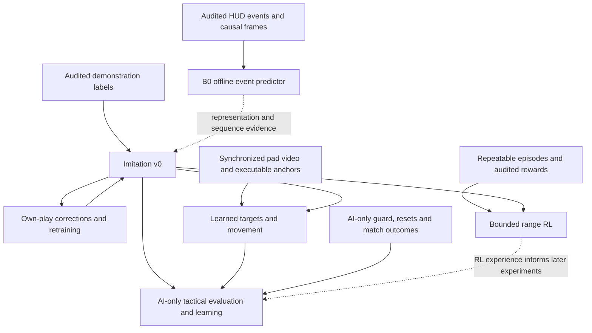
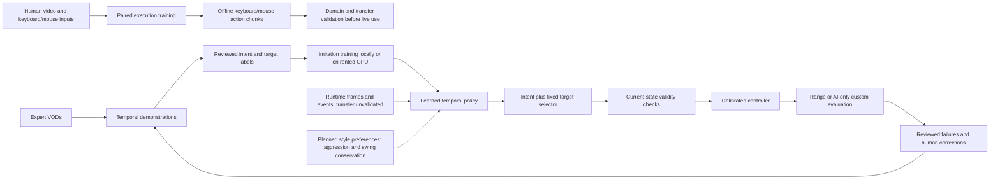

# Learning from demonstrations

*History moved on 2026-09-23 to [archive/learning-plan-history.md](archive/learning-plan-history.md), verbatim:
the 2026-09-22 milestone's run record; B0 and the VOD-labelling tranches that grew under it; the historical
first-RL-experiment proposal; source fidelity, expert practice-range segments, the annotation pilot and VOD
perception and normalization (including the warning not to blanket-mask the chat column); the VOD character-box
pilot; and the 2026-09-20/21 acquisition logs.*

## Objective and decision

The agent learns Spider-Man decisions and execution from expert demonstrations:
target selection, positioning, engagement, ability sequences, retreat and recovery.
DayMR and ReqMR are James's selected expert sources. Their rank is not independently
verified; channel titles are claims, not leaderboard evidence.

James's September 22 priorities are mechanical execution, finding valuable picks,
escaping effectively, fluent traversal and helping teammates. Traversal means
smooth swings, momentum, bhops and movement transitions, not only route selection.
These behaviors overlap: a player can move and scan while firing or deciding to
help an ally. The policy must not collapse normal play into attack versus standing
still. Neutral output remains a fault/refusal response, not a required human class.

The first mechanical policy learns individual Web-Cluster starts from recent
causal observations, with a fixed visible-target selector and independently
updated scripted aim/movement. The larger policy will learn execution and
movement as well as tactical choices. Jev remains an optional baseline or
annotation assistant; inference alone does not update its weights from outcomes.

Public VODs do not supply exact motor labels. James has now offered expert-level
technical execution demonstrations on keyboard and mouse, so paired motor learning
starts alongside tactical learning. It must keep its action domain separate from the
virtual-pad executor. A policy restricted to the current `State` loses positioning
and temporal context; raw frame history remains available alongside structured observations.
*Superseded 2026-09-23: semantic actions + degrees through the pad, see [docs/lanes/end-to-end-fit.md](lanes/end-to-end-fit.md).*

**Quality governs the order of work.** James prioritizes the best-supported path
to capable gameplay over reaching a nominal training milestone sooner. Source
fidelity, observable targets and motion, audited labels, session diversity and
sealed evaluation determine progress. An auxiliary prediction checkpoint is
useful evidence, but does not replace tactical imitation, own-play corrections
or reward-driven learning against opponents that fight back.

This plan follows [the scope boundary](plan.md#scope-boundary): autonomous trials
stay in the practice range or custom games against AI. Matchmade human gameplay is
an offline demonstration source only. The current range guard does not authorize
custom-lobby input; verified lobby navigation and an appropriate guard are prerequisites.

## First visible learned range milestone (2026-09-22)

This milestone's run-by-run record (the runtime runs and the 2026-09-22 Galacta pilot) moved verbatim to
[history](archive/learning-plan-history.md#first-visible-learned-range-milestone-2026-09-22).
The range work's present state is [lanes/range-lead.md](lanes/range-lead.md). The gate, unchanged:

Predeclared first pilot: **ten scheduled trials**, each with a verified ready
start and a 20-second deadline, at least eight audited designated-bot completions
and zero scope breaches. Keep all ten in the primary denominator, including
setup failures, interruptions and unknown outcomes. VUH-1319 records target
incarnation, reset epoch, observable KO evidence, all failure reasons and timing.
Run matched scripted trials over the same declared scenario bins and settings;
retain original videos, checkpoint/controller hashes and uncertainty. Compare
James's reference only where starts and outcomes are comparable. This is a
feasibility threshold, not professional-level parity.

## Paired human execution: current work

James's new demonstrations change the data bottleneck, not the historical results.
Keep the audited DayMR/ReqMR tactical pipeline, recorded experiments, range guards,
tracker and virtual-pad controller. Add a native keyboard/mouse execution path:

1. Record with the OBS input logger: original video plus raw key/button transitions,
   relative mouse counts, monotonic input times and per-packet composition times.
   The recorder lives separately in `obs-input-logger`; it does not choose examples.
2. Import one finalized session explicitly, with reviewed gameplay intervals, patch,
   cooldown regime, sensitivity/DPI/bindings and a session-group split registry.
   Review imitation suitability separately for each interval: accepted, rejected or
   unresolved, with a reason. Only accepted intervals supply training samples;
   visible gameplay alone does not establish that an action should be imitated.
   Match decoded video PTS to packet PTS. OBS can log stop-tail packets the muxer
   never writes, even when B-frames place their PTS among earlier packets.
   Verify timing against an independently recorded muxer-offset anchor; fitting an
   offset to the same frames is inspection evidence and cannot establish identity.
3. Build causal frame/input history and distinct future action bins. Focus loss,
   pauses, raw-input errors and missing timing do not become neutral controls.
   OBS composition is not the player's observation clock: any alignment assumption
   or measured bound is recorded. A passed importer does not prove reaction latency.
4. Fit a small temporal execution baseline and compare on separate recording sessions
   against held-input persistence and fitting-set action statistics. Report held
   controls, press/release edges and mouse error separately, including unsupported
   controls. A short successful fit checks plumbing; it does not prove gameplay.
5. Inspect transfer failures before connecting learned execution to the existing
   guarded loop. A keyboard/mouse checkpoint cannot drive a virtual pad. Reusing
   learned visual features or semantic skill supervision across domains is a later
   measured experiment; copying mouse counts into stick axes is not an adapter.
   *Superseded 2026-09-23: semantic actions + degrees through the pad, see [docs/lanes/end-to-end-fit.md](lanes/end-to-end-fit.md).*

The immediate software contract is in [human-demo-schema.md](human-demo-schema.md).
This advances A and E in parallel with B. It does not wait for every VOD HUD negative
to become observable. The existing four future-behaviour forecasts remain auxiliary
signals, not executable actions or an already-trained tactical controller. Whole-match
autonomy still needs learned target/position decisions, corrections, reliable episodes,
AI-only custom-game guards and the outcome evaluations in F.

Use PyTorch for the new execution consumer so the same checkpoint can be exercised on
the Windows RTX 4080 SUPER and the M5 Max (128 GB) through CUDA/MPS/CPU. The historical
MLX experiments retain their implementation and fingerprints. Train on the Mac while
the game uses the PC GPU; use the PC for training only when it is free. Choose live
inference placement from measured capture-to-action latency and game frame-rate cost.
The durable [machine contract](machines.md) covers each machine's responsibilities,
bidirectional SSH, checked relocation of original recordings and checkpoint return.

## Roadmap and advancement gates

Demonstrations initialize behavior; they do not limit what the agent may learn.
After a competent bounded imitation policy and measured outcomes exist, permit
reward-driven exploration of its executable choices. Keep improvements only
when they transfer to untouched starts or encounters. The first web head can
discover timing changes, but cannot discover swing or bhop techniques while
those controls are fixed. E therefore expands learned execution and movement
parameters; F adds ally/threat/objective context. Avoid a permanent library of
fixed combos masquerading as learned mechanics, and avoid rewards for novelty,
constant movement or damage farming in place of useful outcomes.

This imitation-to-RL direction has precedent in [VPT](https://arxiv.org/abs/2206.11795);
combining reference behavior with task objectives is also demonstrated by
[DeepMimic](https://arxiv.org/abs/1804.02717). These inform the design, not a claim
that their results or data efficiency transfer to this game. Measure usable
episodes per hour on our real game instance before choosing the RL algorithm or scale.

The roadmap advances on evidence, not footage hours. Current evidence includes
two inspected pilot clips, nine acquired guides (about 106 minutes), and about
60 raw minutes from four VOD sessions; raw duration is not accepted training
duration. The aligned two-window annotation rerun agrees on coarse tactical
purpose, but exposes event-extractor defects. The HUD lane produces event format
5 with separate occurrence and evidence-availability clocks; accepted loader and
policy seams preserve unknowns. Reader findings still qualify individual labels
(VUH-1306), including HP changes at bonus-maximum transitions.
The policy lane has an offline DINO encoder / GRU intent-training pipeline;
on the two multi-intent normal-cooldown sessions it beats the majority baseline
but not repeating the previous decision. Transition weighting worsens held-out
change accuracy; further tuning waits for better examples. This is scripted-brain
distillation evidence, not an accepted gameplay policy. RL is not implemented or
accepted. The next deliverable
is a small trustworthy training/evaluation set and a first imitation baseline,
not an exhaustive archive.

| Milestone | Concrete result | Gate before advancing |
|---|---|---|
| A. Trust the examples and measurements | Corrected HUD events, per-frame visibility, reviewed imitation suitability, whole-session splits; paired human keyboard/mouse demonstrations and repeatable range episodes | Hand-check VOD event classes and timing; preserve unknowns. Verify human input/video alignment, focus continuity and recorded settings. Demonstrate start, terminal outcome, interruption and reset alignment on recorded episodes. Data quality gates imitation; episode/reward quality separately gates RL. |
| B. First imitation policy | A temporal mechanical event policy, initially learning web starts alongside independently running aim/movement | Compare supported starts/non-starts, onset timing and rare-event behavior with never/always-start and comparable scripted baselines on held-out sessions. Measure runtime latency and actual range outcomes. No standing-idle class requirement. |
| C. Corrections from our own play | Reviewed execution/navigation corrections and a retrained imitation checkpoint; combat retreat/recovery examples require F's fighting environment | Compare against B on untouched evaluation sessions and bounded live scenarios. Accept demonstrated improvement; ambiguous failures stay out of positive imitation labels. This loop continues alongside later milestones. |
| D. First reinforcement-learning experiment | Fine-tune a trainable option policy on one bounded range encounter, starting from an imitation checkpoint with demonstrated range competence | Reward audit below passes; reset and episode recording work; freeze perception/controller/target selector for comparison. Retain the RL checkpoint only if held-out encounter outcomes improve over its starting checkpoint, not merely its training return. |
| E. Learned execution, target choice and fluent traversal | Trainable ability sequencing, aim/movement, swing release/jump timing and bhop transitions through measured executors; observable targets/destinations | Evaluate each learned output separately, including smooth transitions, observed momentum retention, arrival, time, charge use and collisions/falls. Transfer to new starts. Explore better execution within that controllable space; guide narration cannot supply motor labels. |
| F. Tactical learning in AI-only custom games | Opportunity selection, pick commitment, injured escape/re-entry, teammate assistance and objectives through imitation then RL | Verified AI-only lobby/guard and episode/outcome flow; observed ally/threat context. Evaluate peel/protection and missed support, survival and objectives alongside wins. Kill counts alone cannot certify team value. |

These are dependencies, not six serial waits. Reward measurement starts during A;
E's recorder and controller work also starts now. D can test narrow range learning
without waiting for expert-level swinging. An initial F intent-only trial can use
the fixed selector, but cannot claim E's target-choice or positioning capabilities.
E's offline box-annotation and camera-motion feasibility probes below run alongside
these prerequisites; the first narrow policy does not defer all work on game sense.

B has a pipeline prerequisite under VUH-1311: cache encoder embeddings and train
a temporal head to imitate the scripted brain on our own logged sessions, with a
held-out-session comparison against the majority baseline. This establishes a
working training/inference path, not learning from Day/Req or improving the
teacher. Expert footage may supply embeddings without supplying trusted action
labels. The separate coarse tactical-purpose head still needs A's audited labels;
its metrics and claims stay separate from scripted-brain distillation. Any
`--brain learned` integration retains the scripted policy's execution guards.

Codex owns the learning specification, curation criteria and reward/evaluation
design. Claude owns dispatch, integration and Linear, assigning implementation
to the existing dataset, HUD and controller owners or a named training owner.
Existing dependencies include VUH-1306 (events), VUH-1309 (paired recording),
VUH-1310 (AI-only lobby), VUH-1314 (tracks) and VUH-1315 (observed option status).
Milestone issues are A VUH-1306/VUH-1319, B VUH-1311, C VUH-1320, D VUH-1321,
E VUH-1322 and F VUH-1323. The live loop records pad state per tick in the loader's
format; the measured frame/input offset remains VUH-1309's acceptance gap.
This roadmap defines acceptance; Linear remains the record of assignment and
completion. James is not required to supply inputs or hand-label at volume.

### B0: auxiliary pretraining by predicting observed ability events

B0 is finished. Its H2 result reads: "There is no horizon search or further B0 fit authorized by this result."
Its design and results, and the VOD-labelling tranches that grew under this heading, moved verbatim to
[history](archive/learning-plan-history.md#b0-auxiliary-pretraining-by-predicting-observed-ability-events).
The glyph contract stays here because `perception/hud.py` cites it.

#### Glyph contract

**Positive glyph evidence is admissible for measurement, not yet certified.**
An explicit per-frame match to the expected ability glyph is different from
"lit, no digit". Keep it as a named, switchable observation with reader/version
provenance; absence of a match is unknown. Validate against native-frame labels
per creator and slot, including visible countdowns that digit OCR misses, chat,
dark scenes, effects and prohibition states. Zero matches on OCR-readable
countdowns alone does not measure false positives on the unreadable cases this
signal is meant to recover. Record denominators, false matches and unknowns;
freeze thresholds before the audit and retain conflicting glyph/digit evidence
as unknown. Enabling it for labels requires the measurement's acceptance.

Its immediate claim is **glyph displayed / no countdown drawn**, not ready or
no cast. The native review reports Day uppercut charges dropping at 46.7 s while
the glyph still identifies at 46.8, before the lock appears at 46.9. Putting the
cast after the last glyph would exclude that real use. Fix the MK charge reader
against the seven legible badge transitions and retain charge evidence as the
primary timing witness there. A glyph-to-countdown transition may tighten cast
bounds only with a verified ability-specific onset relationship, including any
display delay; otherwise it bounds countdown appearance. It does not alone
certify B0 negatives or readiness through missing frames. The existing matcher
returns generic `teamup`, not a partner/variant identity; variant assignment
needs separately verified per-segment evidence or remains unknown. Retain the
declared two-second experiment even if accepted glyph evidence improves precision.

### Reward contract before reinforcement learning

Imitation learns reviewed choices without a reward function. RL learns from the
agent's own actions and subsequent outcomes; downloaded videos alone do not
provide an interactive training environment. Reward design is a current design
task, while RL execution remains gated.

| Task | Primary objective | Supporting signals and limits |
|---|---|---|
| Bounded range encounter | Confirmed designated-target completion; terminal outcomes are completed, timeout, interrupted and lost-range | Small elapsed-time cost; optional validated outgoing damage contribution. Target identity needs tracks plus associated kill-feed evidence; aggregate KOs alone cannot identify which target died. No combat-death or damage-taken reward is available here. |
| Swing/navigation skill | Reach a specified visible destination or region | Time, resource use and observed collision/fall failures. Do not reward simply pressing swing, travelling far or staying airborne. |
| AI-only match | Team victory and verified objective progress | Combat contributions and avoidable death may support learning only if measured and shown not to encourage kill chasing or hiding. A useful trade ending in death is not automatically a bad decision. |

Range bots do not deal damage, and Practice Settings offers no fighting-bot
option. D therefore tests attack execution/completion, not survival or tactical
retreat. Expert footage can supervise observable retreat decisions offline, but
learning their consequences from our own play and testing their usefulness needs
F. A lost-range termination records why control stops; it is not a claimed death
or a successful disengagement. Reader failure remains an interruption/unknown,
not a fabricated adverse gameplay outcome.

Before an RL run, record the exact formula, weights, discount, episode limits and
reader versions with the experiment. The first experiment below supplies proposed
defaults, not validated weights; tune on development episodes, then freeze the
evaluation and its success criteria.
Optional shaping must have a bounded contribution so damage farming or repeated
partial progress cannot outweigh the actual task. Scoreboard checks are a means
of measurement, not an action deserving positive reward.

Audit range reward extraction against hand-checked recordings of completion,
timeout, interruption, lost-range and reset; add combat death and damage taken
only in an environment where those occur. Each reward component retains its
observation source and validity; unknown does not become zero. Exclude episodes or learning
targets whose required outcome is unobservable. Treat a capture/lobby interruption
as an interruption rather than inventing a gameplay death. Check that repeated
scoreboard reads cannot award the same KO twice, resets cannot produce reward
from counter jumps, and healing/shield decay cannot masquerade as damage.

There is no verified in-range reset, and bot respawn time is unmeasured. A live
run stranded the agent off the platform and needed full lobby re-entry, about
two minutes with a script whose steering still needs correction. VUH-1319's
episode/collection pilot depends on the live loop, tracks and observed option
status; it must measure recovery costs rather than assume cheap resets.

Run that small collection pilot before committing to RL scale: measure usable
episodes per hour, reset time, invalid-data rate, inference latency and training
throughput. This is one real game instance, not a simulator supplying thousands
of parallel matches; rented GPUs accelerate training, not gameplay collection.
Masked PPO is the first-experiment choice below, contingent on a viable collection
budget and trainable action interface. Range option learning starts with the motor controller frozen;
learning sticks and camera is a separate experiment under E.

Each comparison keeps the scenario set, trial budget, perception and executor
fixed, retains failures, and reports every applicable terminal-outcome count and
elapsed time as well as return. In custom games, also report deaths, wins and
objective outcomes.
Claim improvement only at the tested scope; inconclusive results call for more
evidence, not promotion of the highest-return checkpoint. Keep the preceding
working policy available for rollback. Training stays local first, with the
approved initial $100 cloud allowance governed by the compute section below.

## Data and labels

### Cross-patch pretraining with explicit kit context

Older demonstrations are eligible pretraining sources, not discarded because of
age. Pretrain on accepted sources across patches, then fine-tune and evaluate on
the verified current patch. This can reuse routes, camera motion and decision
examples; it does not assume tactics are patch-invariant. Damage, movement,
cancel windows, team-ups, other heroes and map changes can alter good decisions
as well as cooldowns. A patch token alone cannot repair an unrepresented rule.

Each sample carries a versioned `kit_context`: patch identity (or unknown),
cooldown regime, per-ability cooldown/recharge seconds and maximum charges,
team-up variant, plus explicit known/unknown masks. Keep measured current availability in the
observation separate from these kit limits. Record evidence and provenance with
each value; missing means unknown, never zero. Known discrete mechanics changes
use named rule flags where the supervised task depends on them; otherwise exclude
that task's incompatible labels rather than invent a complete historical simulator.
Patch identity is categorical metadata, not a numeric chronology to interpolate.

Team-up cooldown fingerprints require **ability identity**. The official
[Version 20260911 balance note](https://www.marvelrivals.com/20260908/41525_1313334.html)
changes Peni Parker's **Parker Power-Up** from 15 to 10 seconds; the
[hero reference](https://www.marvelrivals.com/m/20241123/41360_1195680.html)
lists **Symbiote Bond** separately at 15 seconds. Native train-frame spot checks
match the latter's distinct radial-burst icon: Day `003309.jpg` and Req
`000828.jpg` under their respective `data/experiments/b0/frames/<clip-id>/`
directories. Day also shows its black-spike effect. Thus generic `teamup=15`
does not contradict the date-derived patch labels on these sources. The checks
identify those windows, not every segment: retain unknown elsewhere until
verified, allow variant changes, and never apply Parker's 10-second rule to all
team-up events. Dated patch notes take precedence over stale numerical entries
on the general hero page.

The April-May uploads' measured two-second uppercut does not uniquely identify
their patch or complete kit. Keep their unresolved fields unknown. They become
eligible for audited tasks supported by their pixels and labels, not automatically
accepted training data. Historical casts remain historical facts; old combo
timings and successful cancels are not relabelled as current-patch executable
actions. Cooldown-free examples can support motion/visual pretraining while
remaining excluded from normal-cooldown timing supervision. Suitability, hero,
event and motion-label gates still apply separately.

Kit features must be available at deployment: use independently established kit
configuration or causally observed evidence. Do not turn a whole video's future
countdowns into a time-t input or derive model input normalization from held-out
footage. Offline measurements may establish audited source provenance and labels;
their use as policy inputs requires the same availability contract as other features.

Maintain a separate accepted pretraining source list with explicit allowed patch
and regime combinations. The loader's default refusal to mix stays intact.
Its iterator has explicit mixing flags, but `load_split` currently enforces one
patch/regime: this experiment needs an owned interface change, not merely a flag.
No split, source status or checkpoint is promoted by this design decision.
Whole match/session identity and duplicate checks span all stages, including
pretraining; development-held-out and sealed test sessions supply no fitting
examples, even unlabelled ones. Unresolved-overlap uploads remain excluded.

Compare current-only training with older-source pretraining followed by the same
current-patch fine-tuning on identical current-patch development folds. Predeclare
the sampling balance and compute budget, report per-task/session results and
negative transfer, and retain the simpler baseline if the added data does not
help. Each fold's held-out session stays out of every pretraining stage. Sealed
tests are used only after model selection. Record the context schema, source
patches and current target patch in the checkpoint. The first comparison reuses
audited footage already held; additional older downloads follow a demonstrated
coverage need, not an unrestricted archive expansion.

RL still requires the live-patch legality, controller and reward checks. It may
adapt a valid policy within that environment; it cannot be assumed to discover
or fix changed readers, invalid actions, missing mechanics or incorrect rewards.

### E enablers: bounded offline pilots

These pilots use retained media and existing workers, with no live input or new
footage collection. Claude assigns execution; Codex owns the label specification
and independent audit. Their outputs are measured feasibility results, not a claim
that a detector or inverse-dynamics model already supplies trustworthy labels.

#### Camera motion and inverse dynamics: feasibility before inferred controls

The HUD lane's probe uses existing synchronized own-run video and commanded pad
logs, holding out whole runs. Start with visible image displacement/camera-motion
estimation; use the measured stick response as a baseline, not as independent
ground truth for achieved yaw/pitch. Fit any video/input offset on training runs
and freeze it for evaluation; missing or uncertain alignment limits the conclusion.
Stratify stationary turns, movement, ability-driven camera changes and swings.
Report missing strata: a corpus without paired swings cannot validate swing recovery.

Distinguish three outputs: observed screen motion, estimated camera rotation, and
inferred control input. Translation, parallax, automatic ability camera movement,
aim assist and motion blur can produce different motion for the same stick command.
Known pad state is commanded-input truth; the turn-rate map is a calibration model.
Do not label inferred rotation as exact measured camera ground truth. Report held-out
direction errors, command-reconstruction error/lag, coverage/abstentions and variation
across runs; assess uncertainty by run or contiguous block, not correlated frames.
Compare against neutral-input and calibrated-response baselines on the same cases.

The immediate result is whether any control-relevant signal is recoverable, in
which regimes, with what error. A range result does not prove transfer to Twitch
compression, mouse controls or different sensitivity/FOV. A swing cast's camera
direction is only one feature: anchor, momentum, movement and release also matter;
charge/cooldown events do not establish continuous button-hold duration.

The bounded probe reports 97–99% direction agreement on held-out ordinary range
turns at 60 fps, with approximate rate recovery (389 versus the calibrated
415 degrees/s at full stick). The same fast-turn footage sampled at 10 Hz fits
only 34% of intervals and reads a median 83 versus 172 degrees/s. The measured
stick-to-visible-motion offset is 20 ms. These comparisons use the commanded pad
and calibrated response, not an independent camera-angle measurement. No LB use
occurs in the 67,000 logged ticks, so swing recovery remains unvalidated.
The next bounded transfer check uses hand-inspected native 60 fps expert rotation
segments, excluding swings; confirm actual decoded cadence before sampling. Range
scores do not transfer to VODs, Day's animated overlays remain unhandled, and
ability-driven camera rotation must not be relabelled as a stick command.

**Simple versus aimed swing is part of the action contract.** The controller lane
records Simple Swing OFF and Hold to Swing ON for our client. The narrated guide
inventory also describes a separate simple-swing binding alongside manual swing,
including both in one combo; a creator's default toggle therefore cannot identify
every swing's control mode. Preserve `swing_mode = simple | aimed | unknown` per
action when evidenced. A generic HUD swing event proves neither mode nor anchor.
Do not infer the mode from a smooth trajectory or assume all expert swings are aimed.

Record a separate `control_context` beside kit context: input device, default swing
mode, separate-binding availability, hold/toggle release behavior, and known camera
settings, each with evidence or unknown. Settings changes segment that context.
For low-level imitation, use mode-compatible examples or explicitly condition on
the mode and validate both mappings; unknown-mode footage can still supply visible
route/destination supervision without invented anchor or button labels. Automatic
anchor selection must not be labelled as the expert aiming at the selected anchor.
Hold duration and toggle-release actions are distinct input targets. The present
pad executor supports only its verified mapping; simple-swing-specific techniques
remain unexecutable until the controller owner verifies a supported binding and
completion behavior. Do not silently translate both modes to the same LB action.

[VPT](https://arxiv.org/abs/2206.11795) demonstrates the paired-data inverse-dynamics
approach in Minecraft; it supplies a research precedent, not a transfer guarantee
for Rivals. An offline inverse model may inspect future frames to infer an earlier
action, but the policy trained from those labels remains causal. If the probe
succeeds, audit a small expert-video transfer set before producing training labels.
If it fails, retain visible route/destination/timing supervision and identify the
missing paired examples for collection after the live-input freeze lifts.

## Training and runtime

### Configurable playstyle

James wants selectable playstyle through interpretable sliders. The planned
implementation is one policy conditioned on a small preference vector, sharing
the same perception and controller, rather than a separate model per style.
This extends E/F after the base policy and relevant actions work; it does not
block B0 or the first imitation baseline. The sliders are planned capabilities,
not controls implemented by the current policy.

| Initial slider | Lower end | Higher end | Observable behavior to compare |
|---|---|---|---|
| Aggression | Wait for stronger openings | Commit more readily | Engagement choices and delay under comparable health, resources, targets and threats |
| Swing conservation | Spend charges readily | Preserve charges for traversal or escape | Optional swing/cancel spending and charges retained under comparable opportunities |

Combo commitment and target preference are later candidates, not additional
initial controls. Style expresses a preference conditional on the situation;
high aggression is not an instruction to ignore threats, and high conservation
does not forbid a necessary escape. Use the declared slider direction consistently
in labels, model inputs and UI. The neutral setting is an evaluated default.

Training uses audited behavioral examples with style evidence and uncertainty.
Creator identity can identify a demonstration source, but does not establish one
fixed style: the same player changes behavior across encounters. Include ordinary
play, failed attempts and successful outcomes; high movement alone does not prove
aggression. Label observed tendencies over sufficient context, keeping inferred
intent unknown where unsupported. Condition imitation on supported style labels;
an unlabeled example is not automatically the neutral style. Sparse evidence
supports a few evaluated presets before a claim of smooth slider interpolation.

First evaluate low/default/high settings on matched starts or held-out situations,
with perception, controller and patch fixed. Require a repeatable change in the
named behavior, report effects on completion, survival and later match wins, and
check whether the sliders interfere with each other. Aggression and escape claims
need F's fighting venue; passive range bots only support mechanics and resource
tests. A slider that does not change behavior is not accepted. Later RL may use
bounded, explicit preference terms alongside the task objective, with tradeoffs
reported rather than treating style compliance as gameplay success.

Preferences cannot bypass action legality, input guards or executor capability.
Simple-swing cancels become a style choice only after that action works and has
audited labels; exact short-cancel execution is not a prerequisite for initial
style work. Standardize our executor on hold-to-swing. Source hold/toggle settings
matter only when reconstructing inputs; match the observed attachment/release
behavior without implementing a user-facing release-style switch.

Policy v0 learns the existing intent vocabulary; a fixed targeting heuristic selects
among current live detections, and evaluation holds that selector constant across
policies. This isolates intent learning while VOD target labels are expensive.
A small annotated target set measures observability and supports later learned target
choice; v0 does not claim to learn expert target selection. Spatial
directions or anchors need an agreed representation and working executor before they
become outputs. Unknown abilities and invalid targets stay guarded at execution time.
An option's completion or failure is distinct from the brain's guessed hold duration.

Two policy domains remain explicit. The **range execution policy** uses live
`State`, calibrated ranges and the controller; shared track IDs (VUH-1314) and
observation-derived option status (VUH-1315) are queued work, not assumed inputs
already delivered. The **VOD tactical policy** uses frame history and HUD events,
with target supervision only where annotators draw boxes. These domains do not
share a validated enemy/identity channel. Keep their datasets, labels and metrics
separate until perception establishes comparable entities; any integrated v0
trial is a measured transfer experiment with the fixed live selector.

Target choice and positioning are explicitly **open goals after v0**. `Engage`
hides substantial Spider-Man skill inside the engineered controller: approach
geometry, movement, aim, range management and attack execution cannot be claimed
as learned from VODs merely because a model chooses that option. Restoring learned
target choice, spatial setup/escape choices and finer execution requires observable
labels, an executable interface and separate evaluation. The narrow v0 measures
intent selection; it does not satisfy the full game-sense objective.

Swing execution is part of that limitation. VODs and guides show routes, momentum
setups, release/cancel sequences and their visible results, but supply no exact
stick/camera/button labels. In v0, the controller executes swings; watching more
VODs does not train its trajectory control. Learned swing timing/anchor choice
needs a spatial output contract and executable anchors. Later motor learning needs
synchronized video and native input labels, with demonstrated response checked.
James's keyboard/mouse recordings now supply this motor-learning source; transfer to
the virtual-pad controller remains unproven and is not inferred from expert video.

HUD events provide relatively cheap supervision for ability use and observable
outcomes. They do not prove engage, disengage, no-engage or a complete combo choice:
those labels still need reviewed temporal context. Primitive sequence learning and
tactical intent learning retain separate labels and metrics; reliable HUD extraction
does not establish reliable tactical annotation.

Behavioral cloning predicts reviewed demonstrated choices; it needs no reward function.
Class imbalance matters: constant movement or idle frames must not swamp rare retreat
and engagement decisions. Measure a simple baseline before choosing model size. The
Mac is the default training environment, niced; James prefers using his local
hardware wherever practical. The existing tactical experiments prefer MLX when the
selected architecture has a suitable implementation, otherwise PyTorch/MPS. New paired
execution training uses PyTorch across Windows and Mac, as specified above. The PC GPU
belongs to the live game.
Runtime placement is measured against latency and game performance before adoption.
The policy lane's current offline baseline uses a frozen DINO ViT-S/16 encoder
and a two-layer GRU head in MLX; the encoder choice is provisional and its
reported held-out results do not establish gameplay improvement. Independent
data-pipeline review and runtime validation remain acceptance gates. The RL
actor/value plan above extends that baseline rather than choosing a large VLM.

James approves an initial $100 cloud-compute budget (2026-09-20). Local hardware
is a starting point, not an architectural limit: rent a GPU when measured throughput,
memory requirements or iteration speed justify it. Track spend against that initial
allocation and revisit funding before exceeding it; $100 is not an estimate for
the complete project. Hosted annotation and storage costs are estimated separately.

The [local-model measurement](archive/local-jev.md) is a concrete placement constraint:
the 35B-A3B server answers in about 85 ms median on the Mac but 175 ms median /
531 ms p95 from the PC in the reported run. A tiny kept-alive health request takes
63–90 ms across that path versus 0.4 ms locally. These are measurements of the present
network, not an unavoidable LAN cost; wiring and remeasurement may change them.
Frame transport is unmeasured. The reported server occupies 20–32 GB and roughly
69% Mac GPU at 10 Hz, so serving that configuration and training are scheduled
separately. The server is parked; no further Jev infrastructure is on the critical path.

## First acceptance and evaluation

The first range skill approaches and executes an attack; choosing whether to
engage, continue or escape under threat requires AI-only custom evaluation.
Mechanical execution is the first measurable slice, not the whole goal.

1. Inspect real samples from both creators and establish which labels are observable.
2. Hand-label a small set of contiguous decisions and HUD events. Report event precision,
   recall and timing error, plus unreadable coverage, against those human labels.
3. Train a first intent policy with the fixed target selector and evaluate on held-out sessions against a simple
   majority baseline and the scripted policy where its required inputs are available.
   Report confusion by action, invalid choices and abstentions. Report selector errors
   separately on annotated examples; learned target choice needs its own later comparison.
4. Compare integrated policies in repeatable range scenarios with the same perception,
   controller, start conditions and budget. Inspect actual successes and failures.
5. Evaluate richer tactical choices in AI-only custom games once navigation and guards
   work. These results do not establish expert-level play against human opponents.

The first complete engage-to-outcome evaluation is a bounded AI-only encounter set,
preregistered before trials begin: start positions, opponent composition, patch,
cooldown regime, encounter time limit, trial cap and held-out starts. Include both
appropriate-engage and no-engage situations, followed by continuation or escape under
threat. Compare the learned policy with frozen scripted and simple fixed-choice
baselines using the same perception, executor and guards. Score engage/no-engage
choices separately from attack execution and continuation/escape outcomes; report
failures, interruptions, unknown outcomes and uncertainty across repeated trials.
This is a planned acceptance experiment. Verified AI-only lobby guards, reproducible
resets and observable outcomes are prerequisites; range damage alone cannot pass it.

Gameplay outcomes remain separate from imitation agreement. A different action is
not necessarily worse, and a copied expert action is not necessarily appropriate for
the executor's capabilities. Record recovery examples from the agent's own failures
and obtain human corrections rather than only collecting more clean expert wins.

The controller lane confirms that BACK opens a range scoreboard with damage and
KOs. The lead reports 9/9 values read on a reference frame and an automatically
parsed 1 KO / 275 damage in a 30-second integrated run. That cooldown-free run
holds 57 Hz reflex and 10 Hz decisions with zero reported over-budget ticks;
it is not the real-cooldown baseline. Counter deltas, broader coverage and
episode/reset alignment still need validation before becoming rewards.
Designated-target completion additionally needs VUH-1314's identity tracking
associated with the delivered kill-feed reader; either component alone does not
prove that the selected target died.

RL is not active. It requires dependable episode boundaries, reset, outcome labels and
a trainable policy. The reward contract above limits range outcomes to confirmed
completion, timeout, interruption and lost-range; passive bots supply no combat
death or damage-taken signal. Elapsed time is a small cost; outgoing damage or hits
are optional shaping only when measured reliably. No numeric weights are accepted yet.
Disappearance is not a kill, ult charge is not damage, and missing evidence is unknown.
Manually adjudicated evaluation is valid while automatic outcome readers are incomplete.

## Sources

**Conditional source candidate: Falores.** James recommends Falores as a strong
Spider-Man player. Identity, channel, footage and suitability are unverified. Revisit
only if already-held footage leaves a named coverage or independent-session gap;
this recommendation does not authorize acquisition or change the current source scope.

### Research references

- [VPT](https://openai.com/index/vpt/): action-labelled demonstrations support inference
  of actions in additional video; the scale of its Minecraft result is not a promise
  about the amount of Rivals data needed.
- [DAgger](https://proceedings.mlr.press/v15/ross11a.html): iterative expert correction
  addresses states reached by the learner's own actions.
- [DayMR VODs](https://www.twitch.tv/daymr/videos) and
  [ReqMR VODs](https://www.twitch.tv/reqmr/videos): technical availability checked
  2026-09-20 with the installed `yt-dlp`; local sample evidence accompanies the manifest.
