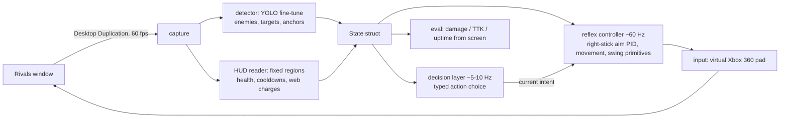
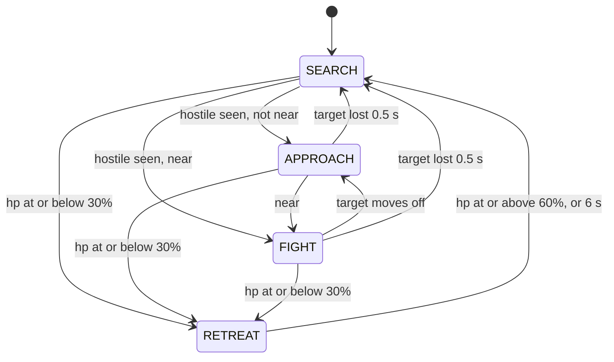

# rivals-agent plan

A vision-based agent that plays Spider-Man in the Marvel Rivals **practice range**
(and custom lobbies vs AI), running on `supedupsilly` (RTX 4080 SUPER, 2560x1440).

## Scope boundary

The agent sees pixels and presses buttons, like a player. It stays in the practice
range and custom games against AI.

Out of scope for every lane — stop and report instead of working around:

1. Reading/writing the game's process memory, DLL injection, renderer hooks, or
   packet inspection. Game state comes from the screen only.
2. Anything whose purpose is hiding from or defeating the anti-cheat: tampering
   with its driver or services, disguising synthetic input as hardware or human
   input to avoid detection, HWID/account ban evasion, capture or input rigs
   chosen because the anti-cheat cannot see them.
3. Running in matchmade modes with real players (Quick Play, Competitive, Arcade),
   including queue/AFK automation.
4. If the game rejects plain synthetic input in the practice range (gate L0),
   the project stops there. No bypass.

Smoothing and PID on the aim controller are in scope as control quality; tuning
input to beat detection heuristics is item 2.

## Direction: learn from demonstrations

Decided by James, 2026-09-20. The agent learns Spider-Man from expert play, game sense
included (target choice, engage or retreat, positioning, setup and recovery), not only
button sequences. Order: imitation first, human correction next, reinforcement learning
only once an outcome can be measured reliably.

- **Sources.** Full VODs of top Spider-Man players (candidates DayMR and ReqMR; identity,
  rank and availability are being verified) are the expert source. The agent's own pad
  recordings, which are perfectly labelled, supply input-labelled video. James's own play
  with synchronized inputs is optional and not planned.
- **Labels without input logs.** The HUD readers turn cooldown, charge, ammo and hp
  transitions into a timestamped event stream, so ability timing and combo order are read
  off any video whose HUD is visible. Camera and movement labels for third-party video need
  an inverse-dynamics model trained on our own synchronized recordings.
- **Keep raw video and history.** `State` is a compact view built for the scripted brain and
  omits most of what game sense needs. Datasets keep frames, events and inputs as temporal
  windows with preceding context and outcome; learning is not tied to `State`'s fields.
- **Policy interface (decided; design in [learning-plan.md](learning-plan.md)).** The
  learned temporal policy first outputs options (intent, target, direction or anchor)
  at 5-10 Hz and the reflex controller executes them, because enemies are ~20 px wide at
  720p and aim is camera-limited; learned low-level execution follows from synchronized inputs.
- **Where it can be tested.** Execution in the practice range; tactics in custom games
  against AI with no human in the lobby. Neither establishes performance against humans,
  and scope item 3 keeps the agent out of every mode where that could be tested.
- **First milestone.** Recognize a suitable engagement opportunity, execute it, then
  continue or escape, with bounded tests that say what they do not show.
- **Jev** is frozen as a baseline and a possible label assistant. Its inference path does
  not learn from experience, and agreement with it is not gameplay quality.
- **Third-party footage** stays under `data/` (gitignored). Frames from it are never
  committed or published to Linear.

Co-led by the Claude lead (dispatch, integration, this file, Linear) and a Codex co-lead
(`docs/learning-plan.md`, demonstration sourcing, independent review).

## Gate status (L0, 2026-09-20)

| Check | Result |
|-------|--------|
| Screen capture with the game and NetEase anti-cheat running | Works (GDI `CopyFromScreen`, full 2560x1440 frames) |
| Injected keyboard (`SendKeys`) | Accepted: Enter/Space advanced the title screen |
| Injected mouse buttons (`mouse_event`, 120 ms hold, game focused, same integrity level) | Ignored: three clicks on two screens did nothing |
| Virtual gamepad (ViGEmBus 1.22.0 + `vgamepad`) | Accepted: menu navigation, walking, camera, and firing in the practice range; game stayed up, no anti-cheat dialog |

Evidence: `docs/evidence/l0/`. **L0 passes on the gamepad path.**

The game drops software-injected mouse clicks. Under boundary item 4 the mouse path
is closed; nobody works around it. The agent plays on a virtual Xbox 360 pad, which
the game sees openly as a controller, and gets the game's own controller aim assist.

Input facts the other lanes build on:

- `scripts/pad.py "<tokens>"` sends a scripted pad sequence (`C:\rivals-agent\pad.py`
  on the PC, run with `uv run --no-project --with vgamepad`).
- The game only reads the pad while its window has focus; other windows steal it.
- Each `VX360Gamepad()` takes ~2 s to enumerate and raises a connect/disconnect
  toast. The real agent holds one pad open for the whole session.
- Menus use a stick-driven cursor (~1200 px/s at full deflection on a 2000 px-wide
  view, dead below ~0.5 magnitude for short taps). Confirm the cursor position from
  a screenshot before pressing A anywhere near START or a purchase button.
- The practice range is PLAY > PRACTICE > PRACTICE RANGE. DOOM MATCH on the same
  screen is a live mode with real players: boundary item 3.
- The game and any capture/input loop share one desktop, so only one lane drives the
  game at a time. Lanes that need the live game run serially; offline lanes
  (training, HUD readers on recorded frames) run beside them.

## Architecture



Two rates on purpose: nothing model-shaped aims. The decision layer picks a typed
intent (`engage(target)`, `swing_to(anchor)`, `pull(target)` for an untagged enemy,
`web_strike(target)` for a tagged one, `combo(name)`, `disengage`, plus `idle` and
`search`; `agent/intents.py` is the vocabulary); the reflex controller executes it frame by frame.

The decision layer starts as a scripted state machine. Jev (or any small fast
model via OpenRouter) replaces the body of that one function once a key exists
and the state struct is stable. No interface until there are two implementations.

## Lanes

| Lane | Work | Done when | Needs |
|------|------|-----------|-------|
| L0 gate | PC awake, Rivals installed, practice range open; grab one frame; send one plain synthetic input (SendInput, then ViGEm gamepad) | Character visibly responds, game stays up, no anti-cheat dialog. Evidence: before/after shots | human: wake/unlock PC, Steam login, launch game |
| L1 capture | `capture.py` (dxcam) + `record.py`: one held pad, scripted Spider-Man roam, JPEG frames + per-frame pad state (JSONL) | 10 min / 6000 frames of practice-range footage on the PC, contact sheet in `docs/evidence/l1/` | L0 |
| L2 HUD | Fixed-region readers for health, cooldowns, web charges, damage numbers | Asserts pass on 50 labeled frames from L1 | L1 |
| L3 detector | Auto-label L1 frames (open-vocab detector), human spot-check, YOLO fine-tune | mAP and latency (<10 ms on the 4080) reported on a held-out clip | L1 |
| L4 controller | Aim PID onto a detection, strafe, swing/zip/pull/uppercut primitives | Each primitive replays reliably in the range; aim settles on a static bot in <300 ms | L0 |
| L5 brain + eval | State machine, eval harness reading damage/TTK from screen, then model swap | Agent clears the range's bots unattended; eval numbers logged per run | L2, L3, L4 |

L0 has passed. One desktop means one live-game lane at a time: L1 records first,
then L4 takes the game while L2 and L3 run offline on the L1 footage, then L5.

## Lane status

`docs/plan.md` is edited by the lead only. Each lane keeps its own present-state file:
`docs/lanes/l1-capture.md`, `l2-hud.md`, `l3-detector.md`, `l4-controller.md`, `l5-brain.md`.

## Perception decisions

| Question | Decision | Why |
|----------|----------|-----|
| Frame size | Perception runs on a 1280x720 downscale of the 2560x1440 capture, the size L1 records and L3 trains on. `State.frame` is required and set from the frame actually processed; every `Detection.bbox` is in those pixels | A default frame size made boxes silently 2x off when capture and `State` disagreed |
| Detector classes | `enemy` only. `target` is added only if the full recording shows static dummies the enemy class misses | Nothing in the first frames justifies more classes |
| Enemy finder | YOLO fine-tune and a classical finder over the game's enemy outline and overhead health bar are being compared; the better one (or outline-labelled YOLO) feeds `State.detections` | Bots are ~21x33 px at 1280x720 and open-vocabulary auto-labels gave mAP50 0.08 on 201 frames |
| Player exclusion | Training labels drop boxes mostly inside the hero, and the controller ignores detections inside the player's own screen region | The labeller boxed Spider-Man's own arm as an enemy |
| Swing anchors | Geometry, not a detector class; owned by the controller lane, emitted as `Detection(cls="anchor")` | An open-vocabulary labeller cannot label "swingable surface"; the brain only swings on an anchor detection |
| Spider-Tracer `tagged` | An L2 reader, `read_tagged(frame, bbox)`, over the region just above each enemy box; `None` when it cannot tell | A small fixed glyph suits a template or colour read, not a box regressor at ~30 px |
| Enemy health bars | Not built | The brain does not use them |
| Training hardware | This Mac (MPS), niced. The PC GPU stays with the live game | L4 holds the game |

## Decision layer

The offline half of L5 lives in `agent/`: a scripted brain that runs on recorded
`State`s, no game needed. Test with `uv run pytest`; replay a run with
`uv run python -m agent.replay run.jsonl [--hz 10] [--json]`
(`--synth` first writes a synthetic run to the given path).

| File | Holds |
|------|-------|
| `agent/state.py` | `State`, `Detection`, `Ability`; one `State` per JSONL line via `to_dict` / `from_dict`, which rejects a line without `frame` |
| `agent/intents.py` | `Idle`, `Search`, `Engage`, `SwingTo`, `Pull`, `WebStrike`, `Combo`, `Disengage` (frozen dataclasses); each names the kit primitives it plays |
| `agent/brain.py` | `decide(state, memory) -> Intent` plus `Memory`, in two halves: `gate` (retreat, playing holds, a flickering target: no choice needed) and `policy` (the scripted choice). All timing reads `state.t`, so replays are deterministic |
| `agent/jev.py` | `decide_jev(state, memory)`: `gate`, then Jev makes the choice `policy` would make, with `policy` as the per-tick fallback. Also the latency benchmark: `uv run python -m agent.jev` |
| `agent/replay.py` | Decimates to the brain rate, prints the intent timeline and metrics (time per intent, switches, retreats, time to first attack, unknown-field share, max gap) |

What perception fills in (`None` means "could not read this frame", never zero or
"not ready"). `State.frame` is required, has no default, and is the (width, height) of
the frame actually processed; the builder of each `State` sets it:

- L2 HUD: `hp`, `max_hp`, `abilities[name] = Ability(ready, charges)` for `swing`
  (Web-Swing, LB), `pull` (Get Over Here!, RB: it gates both `Pull` and `WebStrike`),
  `uppercut` (Amazing Combo, X), `ult` (a missing key is unknown too), `webs`
  (Web Cluster ammo, LT), and `on_target` (crosshair over a hostile).
- L3 detector: `detections` of class `enemy`, `target` (static dummy) or `anchor`,
  bbox in pixels of `State.frame`, confidence, optional `distance` in metres.
  `detections=None` means the detector did not run; `[]` means it ran and saw
  nothing. There is no track id.
- Per enemy, `Detection.tagged`: the Spider-Tracer icon is over it. `None` means
  not read, and an icon missing from the frame is not evidence of `False`. The
  icon floats over the enemy's head, so it cannot come from a fixed HUD region.



Intent choice, nearest hostile to the crosshair (sticky while it stays visible).
Range is `Detection.distance` when present (near <= 4 m, far > 20 m; the kit's
uppercut/kick reach and pull/burst reach), else bbox height over frame height
(near >= 35%, far <= 8%).

Get Over Here! is one button whose meaning follows the Spider-Tracer: on an
**untagged** enemy it is `pull` (they come to you, aimed, 25 dmg); on a **tagged**
one it is `web_strike` (you zip to them, auto-lock, 55 dmg, tag kept). So `Pull`
and `WebStrike` are separate intents, and the brain never presses RB blind:

| Situation | Intent |
|-----------|--------|
| Retreat (preempts everything) | `Disengage` |
| Nothing in view | `Search`; `SwingTo` the nearest anchor after 3 s if swing is ready; `Idle` when the detector is down |
| Far | `SwingTo` the anchor nearest the target if swing is ready, else `Engage` |
| Near | `Engage` (melee and uppercut also consume a tag) |
| Mid, RB ready, target tagged | `WebStrike` (no aim check: it auto-locks) |
| Mid, RB ready, aimed, webs and uppercut ready | `Combo("burst")`: tags first, so the tag state does not matter |
| Mid, RB ready, aimed, target untagged, no burst | `Pull` |
| Mid, anything else (tag unknown, RB cooling or unread, unaimed) | `Engage`; its Web Cluster shots tag the enemy for the next tick |

Rules the reflex controller (L4) can rely on:

- Intents map onto the typed primitives of `docs/spiderman-kit.md`: `Pull` is
  `pull`, `WebStrike` is `web_strike`, `SwingTo` is `swing_start(anchor)` or
  `web_zip(point)`, `Engage` may play `web_cluster`, `melee_combo` and `uppercut`,
  and `Combo.name` is always one of `intents.MACROS`, today only `burst`
  (`web_cluster` -> `web_strike` -> `uppercut` -> `melee_combo` -> `web_cluster`).
- An intent carries the `Detection` seen at decision time. The controller runs
  faster than the brain and re-associates it with the nearest current detection.
- After `Combo("burst")` (3.0 s), `Pull` or `WebStrike` (0.8 s) or `SwingTo` (1.2 s)
  the brain repeats that intent instead of re-deciding, so the controller can play
  it out; only `Disengage` interrupts. A target lost for under 0.5 s keeps the
  current intent.
- Unknown fields are never read as values: unknown hp never retreats, an unknown
  ability or ammo count is never spent, an unknown tag never presses RB,
  `on_target=None` falls back to whether the crosshair is inside the bbox, and a
  retreat in progress outlasts unreadable hp until its 6 s cap. Retreat does not
  re-fire until hp has read >= 60% once, so a timed-out retreat at low hp does not
  flap straight back in.
- The 4 m and 20 m ranges and the 3 s burst window come from the kit (the window is
  a guide's claim, unmeasured). Every other threshold at the top of `brain.py` is a
  labelled guess to tune by replaying L1 footage.

### Jev

`typesafe/jev-1.13` through OpenRouter. `decide_jev(state, memory)` has `decide`'s
signature. The scripted `gate` runs first, so retreat, holds and a flickering target
never wait on the network. Jev then makes the choice `policy` would make. A timeout,
HTTP error, unparseable answer or out-of-vocabulary answer runs `policy` for that
tick and is counted per reason (`timeout`, `http`, `parse`, `vocab`) in
`Jev.stats.fallbacks`.

**Request shape.** Jev is a "decisions" model. `POST /api/v1/chat/completions`
answers HTTP 400 (`typesafe/jev-1.13 is a decisions model and cannot be used with the
chat/completions endpoint. Use the /api/alpha/decisions endpoint instead.`), so
`tool_choice` and `response_format` never apply. What works is
`POST https://openrouter.ai/api/alpha/decisions` with `Authorization: Bearer <key>` and
TypeSafe's native body (their own endpoint is `POST https://api.typesafe.ai/v1/systemone`;
docs at `docs.typesafe.ai`, index at `/llms.txt`). `state` is a string or a JSON object;
each question is a `choice` over up to 255 named options:

```json
{"model": "typesafe/jev-1.13",
 "state": {"hp": "high", "web_ammo": 3, "ready": {"swing": true, "pull": true, "uppercut": true},
           "crosshair_on_hostile": true,
           "targets": [{"i": 0, "cls": "enemy", "range": "mid", "tagged": false, "under_crosshair": true}],
           "anchors": 0},
 "questions": {
  "intent": {"type": "choice", "instructions": "Which single intent should the Spider-Man fighter play next?",
             "criteria": {"engage": "Aim at the target, close in ...", "pull": "Get Over Here! on an UNTAGGED target ...",
                          "search": "...", "idle": "...", "disengage": "..."}},
  "target": {"type": "choice", "instructions": "Which target should that intent act on?",
             "criteria": {"0": "enemy, mid range, tag False"}}}}
```

Response (from a probe, id trimmed). Every option gets a probability, `choice` is the
most probable, `confidence` is higher the more peaked the distribution:

```json
{"model": "typesafe/jev-1.13-20260917",
 "answers": {
  "intent": {"type": "choice", "choice": "pull",
             "probabilities": {"engage": 0.12, "web_strike": 0, "disengage": 0, "pull": 0.82, "search": 0.04, "idle": 0, "burst": 0.01},
             "confidence": 0.78},
  "target": {"type": "choice", "choice": "0", "probabilities": {"0": 0.86, "1": 0.14}, "confidence": 0.71}},
 "usage": {"input_tokens": 555, "output_tokens": 99, "cost": 2.331e-05},
 "provider": "TypeSafe"}
```

Also true of the route: several questions share one request and one round trip;
errors are HTTP 400 with `error.message` (missing `state`, unknown model, a choice with
no criteria, an unknown question type); input is billed at $0.042 per million tokens
and output is free. `~typesafe/jev-latest` is not used: the model is pinned. TypeSafe's
jev-1.13 notes say it reads criteria literally and is weak at arithmetic, so the code
sends categories (range, hp bucket, tag) instead of raw numbers.

**How the choice is made.** The `intent` question offers only intents some visible
target can execute now (`jev.legal`: the kit preconditions `policy` also enforces; an
unknown ability or tag offers nothing). The target is the option Jev gave the most
probability among the targets that intent allows, so a pull is never aimed at a tagged
enemy however likely Jev thinks it. `intent`, `target` and `anchor` go in one request.

**Transport.** Standard library only. One kept-alive connection, and each call runs on
a worker thread so the caller stops waiting at the per-call deadline (`TIMEOUT_S`, 0.2 s)
even if DNS or a reply hangs. A timed-out call finishes in the background, so the next
call finds a warm connection; while it is still in flight a new call fails at once
instead of queueing. The key is read from `OPENROUTER_API_KEY` or the gitignored `.env`
and never appears in a repr, error or log.

**Measured from the dev Mac, 2026-09-20** (synthetic States, `uv run python -m agent.jev
-n 60 --timeout T --hz H`; round trip is answered calls only, so short budgets truncate it):

| Budget, pacing | Fallbacks | Round trip p50 / p95 / max | `decide_jev` wall, max |
|----------------|-----------|----------------------------|------------------------|
| 2 s, back to back, run 1 | 0 / 60 | 250 / 393 / 712 ms | 713 ms |
| 2 s, back to back, run 2 | 0 / 60 | 237 / 322 / 968 ms | 968 ms |
| 400 ms, 5 Hz | 5 / 60 (8%) | 218 / 318 / 336 ms | 414 ms |
| 200 ms, 5 Hz | 46 / 60 (77%) | 174 / 200 / 200 ms | 219 ms |

- **Jev cannot meet 100-200 ms from here.** The fastest call was 154 ms. Share of
  unbudgeted calls that answered within 150 / 200 / 250 / 300 / 500 ms: 0% /
  3-17% / 47-62% / 75-88% / 97-98%. The first call on a connection (TLS included) took
  417-536 ms. A budget near 400 ms answers about 92%. The deadline itself holds:
  `decide_jev` returned within 19 ms of it in every budgeted run. The loop runs on the
  PC, which was not measured; the same command reproduces it there.
- **Cost:** about $0.000023 per answered call (558 input tokens). Timed-out requests
  are billed too. All probes and five 60-call runs (about 340 requests) cost roughly
  $0.007.
- **Agreement with the scripted brain:** 62-65% of answered ticks by intent kind. In
  run 2 the differences were scripted `engage` -> Jev `burst` (13, at near range,
  where the burst is legal) and scripted `swing_to` -> Jev `engage` (8). The scripted
  brain is a heuristic, not ground truth: nothing here measures which is better.
- **Shape of a fit:** a blocking call suits a budget of about 400 ms, two to four ticks.
  Holds last 0.8-3 s and the gate stays scripted, so a non-blocking variant (request in
  the background, adopt the answer when it lands and is fresh) suits the loop better.
  It is not built.

## Human-only tasks

- Wake and unlock the PC; keep Steam signed in; install Marvel Rivals; accept its
  launcher/EULA prompts.
- Accept the account risk: automation likely breaches the game's ToS even in the
  practice range. Use an account that can be lost.
- Join the TypeSafe waitlist or create an OpenRouter key if Jev is wanted for L5.
- Spot-check auto-labels in L3 (minutes, not hours).
