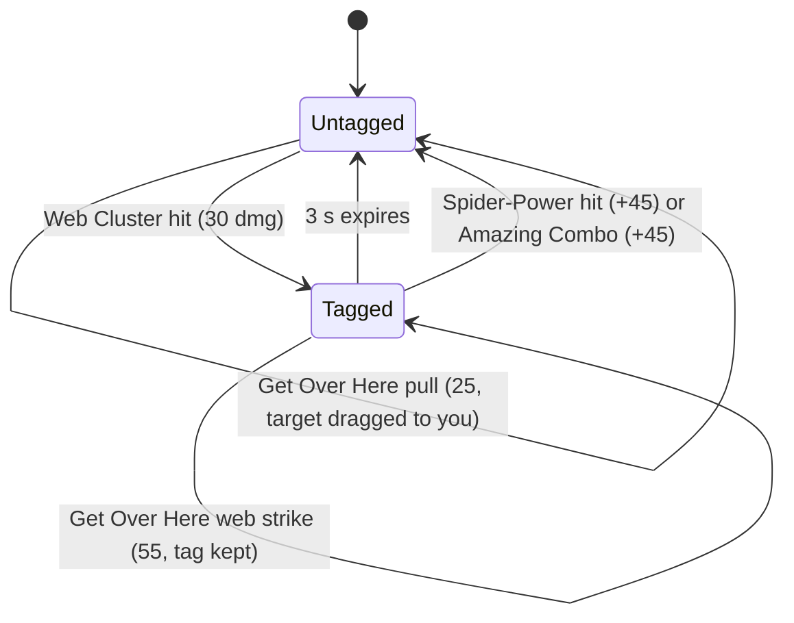

# Spider-Man kit reference (Xbox default layout)

Reference for the controller (L4), HUD (L2) and brain (L5) lanes. Everything here was
researched from the web on 2026-09-20. **Nothing has been checked in the live game.**

**Patch reflected: Season 10, Version 20260911 (balance post dated 2026-09-08, live 2026-09-11).**
The only Spider-Man changes in that patch are Amazing Combo cooldown 2 s -> 1 s and Parker
Power-Up cooldown 15 s -> 10 s
([official balance post](https://www.marvelrivals.com/20260908/41525_1313334.html)).
Version 20260903 (2026-09-03) changed nothing for Spider-Man, controls or the practice range
([official notes](https://www.marvelrivals.com/gameupdate/20260902/41548_1312948.html)).

Status tags used in every table:

| Tag | Meaning |
|-----|---------|
| **S** | Sourced from the Season 10 Fandom ability template or an official patch note |
| **D** | Derived here by arithmetic from S numbers; not observed |
| **G** | Community guide claim, dated; may pre-date current patches |
| **U** | Unverified: no source found, or sources conflict. Check in the live game before relying on it |

## Source hierarchy

1. Official patch and balance notes (marvelrivals.com).
2. Fandom `Template:Abilities/Spider-Man`, revision 2026-09-11 23:56 UTC, fetched through the
   MediaWiki API. It carries per-platform keybinds (`p=Xbox`) and matches the Season 10 numbers, so
   it is the base for every number below.
3. Fandom `Spider-Man` and `Spider-Man/Balance Changes` (revisions 2026-09-18 and 2026-09-09), used
   for mechanics prose and for dating each number change.
4. Dated community guides, tagged **G**.

Stale sources that contradict the above and were **not** used for numbers: wiki.gg
`Spider-Man` (last edited 2026-02-25: ultimate 400 dmg / 160 per s / 2.5 s, Amazing Combo
"usage delay 2 s", web strike 50, slam 50), rivals.fan (Web Cluster recharge 3 s, uppercut 60,
kick 55). The balance log explains each: web strike and slam went 50 -> 55 in Season 3
(2025-07-11), Web Cluster recharge 2.5 -> 2 s and uppercut 60 -> 70 in Season 5 (2025-11-14),
Spectacular Spin 170 -> 187.5 per s in Season 8 (2026-05-15). wiki.gg's "usage delay 2 s" on
Amazing Combo is the old between-cast cooldown that Season 10 cut to 1 s.

## Default Xbox layout: Spider-Man inputs

Source: Fandom ability template with `p=Xbox` (**S** unless noted). The generic Fandom `Controls`
page ("Article In Progress", rev 2026-03-25) is not used for Spider-Man: it lists Primary and
Secondary Weapon both as Y and Ability 3 as LT, which collides with Secondary Attack.

| Action | Xbox | PC equiv | Notes |
|--------|------|----------|-------|
| Move | LS | WASD | |
| Camera / aim | RS | mouse | |
| Spider-Power (primary) | **RT** | LMB | analog trigger |
| Melee | **R3** (RS click) | V | Spider-Power is bound to both primary and melee; there is no separate melee attack |
| Web Cluster (secondary) | **LT** | RMB | analog trigger |
| Web-Swing | **LB** | Shift | Ability 2 |
| Get Over Here! | **RB** | E | Ability 1 |
| Amazing Combo | **X** | F | Ability 3 |
| Jump / Thwip and Flip (double jump) | **A** | Space | |
| Wall Crawl | **A** (against a wall) | Space | Fandom template says "press A to wall crawl"; the Season 0 patch note says "hold to crawl". Hold vs tap: **U** |
| Wall sprint | **RT** while crawling | LMB | |
| Ultimate (Spectacular Spin) | **L3 + R3** together | Q | rebindable in settings. `pad.py` names these `LS` and `RS` |
| Team-Up ability | **Y** | C | only with a partner hero (Venom, Peni Parker); irrelevant to the first bot |
| Ping / comm wheel / hero profile / Chrono Vision | D-pad Down / Left / Up / Right | MMB / T / F1 / B | Fandom Controls page (**G**); not needed by the bot |
| Crouch, sprint, pause | **U** | | Not in any reliable source. One guide summary says L3 is a sprint toggle; unconfirmed |

Two inputs use two controls at once: the ultimate needs both thumb clicks in the same report, and
wall sprint needs RT while A/wall contact is held.

## Ability reference

All numbers **S** unless tagged. "Cast / anim" is almost entirely undocumented: the wikis publish
damage tables, not animation frames. Measure these from L1 recordings.

| Ability | Input | Cooldown / recharge | Charges | Range | Damage | Cast / anim |
|---------|-------|--------------------|---------|-------|--------|-------------|
| Spider-Power hit 1, 2 | RT | 0.37 s between hits | n/a | 3 m | 25 each | 0.37 s hit interval |
| Spider-Power hit 3 (kick) | RT | 0.82 s after hit 2 | n/a | 4 m | 40 | 0.82 s after hit 2. Full chain about 1.19 s (**D**) |
| Spider-Power overhead slam | RT after Thwip and Flip | same as hits | n/a | about 3-4 m (**U**) | 55 | **U** |
| Web Cluster | LT | 2 s recharge per charge | 5 | full damage to 20 m, falls to 50% at 40 m | 30; no crits | fire rate about 3 shots/s (**G**, older wiki.gg) |
| Web Cluster projectile | | | | | | 120 m/s (10 m = 83 ms, 30 m = 250 ms, **D**) |
| Spider-Tracer | applied by Web Cluster hit | lasts 3 s | n/a | n/a | +45 on consume | see next section |
| Get Over Here! pull | RB | 8 s | 1 | 20 m | 25 | projectile 80 m/s (20 m = 250 ms, **D**) |
| Get Over Here! web strike | RB, target tracer-tagged | shares the 8 s | | lock-on out to 24 m | 55 | travel time to target **U** |
| Amazing Combo | X | 1 s between casts; 6 s recharge per charge | 2 | 4 m sphere | 70 (+45 if tagged) | **U** |
| Web-Swing | LB | 6 s recharge per charge | 3 | 30 m | none | **U** |
| Thwip and Flip | A in mid-air | none; refreshes on landing | 1 per airtime | n/a | none | instant |
| Wall Crawl | A on wall/ceiling | none | n/a | crawl 3 m/s, sprint 9 m/s | none | n/a |
| Spectacular Spin (ult) | L3+R3 | cost 2800 energy | n/a | 8 m radius sphere | 15 per 0.08 s tick = 187.5/s, 450 over 2.4 s (**D**) | 2.4 s duration |
| Spider-Sense (passive) | n/a | n/a | n/a | 8 m sphere; warns of enemies in range that are out of sight. The template's "3 s disappearance time to trigger" semantics are **U** | none | warning icon above Spider-Man's head |

Ultimate extras (**S**): +100% max health as bonus health on activation (250 for Spider-Man's
250 HP), removed instantly when it ends; each hit gives 3% slow; 20 hits stun for 1.5 s; Spider-Man can
be interrupted during it. Spider-Man's health is 250.

Web Cluster falloff matters for engagement distance: an enemy 25 m away takes about 87.5% of the
damage, about 26 (**D**, linear falloff assumed; the curve between 20 and 40 m is **U**).

## Spider-Tracer mechanics

- Only Web Cluster applies the tag (and the Peni Parker bomb, if that team-up is active). **S**
- Only **Spider-Power** and **Amazing Combo** consume it, each for +45 bonus damage. **S**
- Get Over Here!'s web strike does **not** consume the tag. **S** (Fandom strategy prose)
- Get Over Here! changes behaviour on the tag: untagged target = aimed projectile that pulls the
  enemy to Spider-Man (25 dmg); tagged target = auto-locked web strike that pulls Spider-Man to
  the enemy (55 dmg, kick). So you cannot pull a tagged enemy without first consuming the tag. **S**
- The tag lets Spider-Man track the target through walls. **S**
- Which Spider-Power hit consumes the tag (assumed hit 1) and whether re-tagging refreshes the 3 s
  timer: **U**.
- A May 2025 guide says PC players bind a second "pull regardless of tracer" key. Whether a separate
  pull binding exists in the current settings menu is **U**; look for it in the Spider-Man controller
  settings page, it would remove the tag/pull coupling for the bot.

## Web-swing behaviour

What the sources establish, and what they do not.

| Behaviour | Detail | Status |
|-----------|--------|--------|
| Range | 30 m | S |
| Charges | 3, one recharges every 6 s | S |
| Per-hero swing settings | Settings > Controller/Keyboard > Combat > hero dropdown "Spider-Man": **Automatic Swing** (Venom's equivalent is "Easy Swing") and **Hold to Swing** | S ([Gfinity](https://www.gfinityesports.com/article/marvel-rivals-how-to-turn-off-easy-swing), 2024-12-27; setting names unchanged in Season 10 wiki prose) |
| Automatic Swing ON (default) | Game picks the anchor: "locks onto the closest anchor point", no aiming | S (guide wording) |
| Automatic Swing OFF | Player-chosen anchor: web attaches where the crosshair hits a surface. Aiming at a surface roughly level with, or below, Spider-Man produces a Web Zip (fast pull to the point) instead of a pendulum arc | S (Season 0 patch note "Perform a Web Zip if aiming at the ground"; template "aiming at surface directly below them") |
| Tap vs hold | Default: tap LB to attach, tap again to release. Hold to Swing ON: swing lasts while LB is held, releases on let-go | S (Gfinity) |
| Momentum | Release keeps velocity; guides chain swing -> Get Over Here! and fly past the target while the pull resolves | G (2025-05-31) |
| Swing cancel | Firing a normal web (Web Cluster) during the swing animation cancels the animation; jumping right after keeps momentum; repeating chains "b-hops" | G (2025-03-09, pre-Season 9). **U** on the current patch |
| Web-Swing as a double jump | A brief web-fire at a surface counts as the double jump, enabling the overhead slam | S (Fandom strategy prose) |
| Charge cost of a Web Zip vs a swing | Not documented | U |
| Anchor eligibility (which surfaces, sky, minimum height) | Not documented | U |
| Swing while wall-crawling, ceiling anchors | Not documented | U |

Recommendation for the controller lane: the plan's `swing_to(anchor)` needs a chosen anchor, so
run **Automatic Swing OFF and Hold to Swing ON** (the setting every advanced guide requires). If a
first milestone only needs "get somewhere and go", Automatic Swing ON removes aiming from the loop;
switch off before the anchor detector (L3) is trusted.

## Combos

The experts' wider arsenal (Sekkombo, Yo-Yo pull-cancel, long pull, swing cancels, double-uppercut
variants, FFAme Stack), transcribed from DayMR's, ReqMR's and featured creators' own guide videos with
timestamps and practice-range windows, is in [lanes/combo-arsenal.md](lanes/combo-arsenal.md). That file
marks what is spoken narration, what was seen on screen, and what has been verified live in the range;
the table below is the older generic-guide set.

Timing budget rules from the numbers above: the tag lasts 3 s, so every consumer must land within 3 s
of the last Web Cluster hit; Spider-Power chains at 0.37 s then 0.82 s; Amazing Combo recasts after
1 s; Get Over Here! is once per 8 s, so the burst is a once-per-8-s event.

| # | Name | Input order | Timing windows | Total damage (**D**, all hits land, no falloff) | Source |
|---|------|-------------|----------------|--------------------------------------------------|--------|
| 1 | Standard burst | LT (tag) -> RB (web strike) -> X (uppercut) -> RT, RT, RT -> LT | RB within 3 s of LT; X only after the strike lands (target within 4 m); RT hits at 0.37 s then 0.82 s spacing; final LT re-tags | 30 + 55 + (70+45) + 25 + 25 + 40 + 30 = **320** | G (marvelrivals.gg, 2025-03-09); damage figures S/D |
| 2 | Squishy kill | LT -> RB -> X -> RT, RT | as #1, stop after two punches | 30 + 55 + 115 + 25 + 25 = **250** | D from #1 |
| 3 | Fast cancel kill | LT -> RB -> one RT -> LT (cancel) -> X (cancel) | each step cancelled as soon as its hit lands; the punch consumes the first tag, the second LT re-tags for X | 30 + 55 + (25+45) + 30 + (70+45) = **300** | G (marvelrivals.gg summary); cancel windows **U** |
| 4 | Pull and punish (no tag) | RB pull (25) -> X (70) -> RT x3 (90) | X once the enemy arrives; enemy is dragged into 3-4 m | 25 + 70 + 90 = **185** | D |
| 5 | Air slam | A -> A (double jump or web-fire) -> RT | overhead slam within the airtime | 55 (+45 if tagged) | S |
| 6 | Ledge pull | RB on an enemy at a ledge, then A, A to land back | pull is aimed; travel 250 ms at 20 m | 25 | G (2025-05-31) |
| 7 | Ultimate opener | LB to high ground -> LT -> RB -> L3+R3 | needs 2800 energy; the ult only reaches 8 m | 450 over 2.4 s at full uptime | G (2025-03-09) |
| 8 | B-hop movement | LB, then LT (cancel), then A, repeat | frame-tight | none | G, **U** on this patch. Not a first-cut primitive |

The Venom suit-expulsion step in the older guides (#2 in marvelrivals.gg, 2025) refers to the
pre-Season 9 team-up and is dropped here. Symbiote Bond and Parker Power-Up now sit on Y and need
the partner hero, so they are out of scope for the agent's own play.

They are two different abilities with different cooldowns, which matters when reading expert
footage: **Symbiote Bond (Venom) is 15 s** ([official hero reference](https://www.marvelrivals.com/m/20241123/41360_1195680.html)),
and **Parker Power-Up (Peni Parker) is 10 s since Version 20260911, 15 s before** (the dated
balance post above wins over the general hero page, whose Parker numbers are stale). A team-up
countdown that starts at 15 is therefore compatible with Symbiote Bond on the current patch and
is not evidence of an older patch. The HUD icons differ (Symbiote Bond: a jagged radial burst;
Parker Power-Up: a bomb), so which team-up a source shows is identified per segment from the
icon, or left unknown; it is never assumed for a whole clip.

Exact millisecond windows between inputs are not published anywhere reliable. The controller lane
should measure them on video, not assume them (see Open verifications).

## Controller settings and aim assist

Aim assist is friction, not aim-bot rotation. The official Version 20250221 note (2025-02-20) is
the only aim assist change on record: "Optimized aim assist range and mechanics, making crosshair
deceleration more visually intuitive" ([official](https://www.marvelrivals.com/gameupdate/20250218/41548_1212474.html)),
and community guides consistently describe it as slowing the crosshair when it passes over a
target rather than pulling toward one ([Turbosmurfs](https://turbosmurfs.gg/article/marvel-rivals-controller-settings), 2026-09-02).
Marked **G**; no official mechanics document exists.

Consequences for the bot: the game never steers the camera onto a target, so the right-stick PID
does all the tracking. Near a target the same stick deflection turns the crosshair less, so the
loop's effective gain drops in the assist window. Expect slower settling near targets, not
overshoot from assist.

Settings in Settings > Controller/Keyboard > Combat (names as the guides give them; **G**):

| Setting | Options / range | Community starting point | Bot recommendation |
|---------|-----------------|--------------------------|--------------------|
| Aim sensitivity, horizontal / vertical | slider | H 170-230, V 110-170 (human ranges) | Set once, then calibrate stick-to-deg/s empirically; keep H/V ratio fixed so the PID axes stay decoupled |
| Aim sensitivity curve | Linear, Dual-Zone (S-curve) | Linear for tracking | **Linear**: makes stick magnitude proportional to turn rate, which is what a PID assumes |
| Input deadzone, minimum | 0-N | 1-6, "as low as possible without drift" | Lowest value with no drift on the virtual pad (ViGEm reports exactly 0, so 0-1 should be safe). Measure the smallest stick magnitude that moves the camera |
| Input deadzone, maximum | | 1 | Leave; only changes edge speed |
| Max deadzone response time | | 30 | Leave unless the aim step response looks laggy |
| Aim Assist Window Size | 20-45 | 30-40 | Wider window = more friction zone. Start at 30; sweep to compare settle time |
| Aim Assist Strength | 80-95 | 80-90 | Sweep 0 / 50 / 90 on a static bot and pick the fastest settle; L4 target is under 300 ms |
| Aim Assist Ease-In (projectile / hitscan / melee) | one slider per weapon type | 80 / 40 / 0 | Spider-Man uses projectiles (Web Cluster, Get Over Here!) and melee; whether these sliders are global or per hero: **U** |
| Automatic Swing / Hold to Swing | toggles, per hero | game defaults: ON / tap-tap | **OFF / ON** as above |
| Vibration, adaptive trigger effect | off | off | off |
| Cursor sensitivity | menu speed | 130 | Raise if menus are slow; the plan measured about 1200 px/s at full stick |

NetEase has never published the true defaults; every "default" quoted by guides is a
recommendation relabelled. Read the on-screen defaults once, record them in the L4 notes, and
change one setting at a time.

The game only reads the pad while its window has focus (plan.md). All settings above are in-game
menus; nothing here needs input beyond the pad.

## Practice range

Entry (already used by L0): PLAY > PRACTICE > PRACTICE RANGE > Confirm (guides describe the same
path as Play Menu > Practice, or Change Mode > Practice Range > Confirm). DOOM MATCH on that screen
is a live real-player mode (boundary item 3).

**Pause menu > Practice Settings** (PC: Esc; the pad button is **U**, most likely START/Menu). Two
toggles are documented ([The Gamer](https://www.thegamer.com/marvel-rivals-complete-practice-mode-guide-walkthrough/) 2025-01-20,
[1v9](https://1v9.gg/blog/marvel-rivals-practice-mode-guide) 2025-01-02,
[TechWiser](https://techwiser.com/marvel-rivals-practice-range-guide-how-to-train-with-friends/) 2025-02-10):

| Setting | Effect | Use for the bot |
|---------|--------|-----------------|
| No Ability Cooldown | Removes ability cooldowns so abilities repeat | Repeat-trial testing of Get Over Here!, Amazing Combo, swing. Whether it also removes charge limits and the ultimate cost: **U** |
| Friendly Fire Mode | Damages friendly heroes | Not needed |

There is **no documented bot-movement or cooldown-reset toggle in the pause menu.** Bot movement is
set at the stations below, not globally. Changing hero inside the range is `H` on PC; the pad
binding is **U** (the Fandom controls table leaves it blank).

Stations (all **G**; layout is from launch-era guides and the Fandom `Practice Modes` page, rev 2025-12-23):

| Station | Where | What it offers |
|---------|-------|----------------|
| Target Practice kiosk | left/down from spawn | Galacta Bots: stationary, moving in fixed patterns, one flying, some that shoot back |
| Range Practice | left/down | distance-marked floor for ranged accuracy |
| Timed Practice consoles | basement of the building; two consoles, one sets parameters, one starts/stops | parameters: hero/target selection, distance (fixed or dynamic), target movement and speed, duration, music |
| Hero Simulation kiosk / pads | outside spawn | spawns NPC heroes as enemies, for testing hero interactions |
| Team-Up kiosks | right of spawn | partner-hero simulation for team-up abilities |
| Support Training kiosk | right of spawn | friendly bots to protect/heal; not needed |
| Building destruction | left/down, then right | destructible structures |
| Ultimate Charge pad | practice floor | purple-rimmed circle; stepping on it fills the ultimate instantly |
| Health pad, High Jump pad | practice floor | green health square, blue launch platform |

Bot types: **Galacta Bot** and **Galacta Bot Ultra** exist (Fandom `Galacta Bots`, rev 2026-08-28,
article marked "in progress", stats empty). Their health, whether they take Spider-Tracer bonus
damage, and whether Get Over Here! can pull them are all **U**. The separate Practice vs. AI mode
(custom lobby vs bots, 1/2/3 star difficulty, 4 objective types, leave without penalty) is a
different mode and is in scope for later, not the first bot.

## Typed primitives for the controller lane

Inputs use `pad.py` token names (`RT`, `LT`, `LB`, `RB`, `X`, `A`, `LS`, `RS`, `rs:x,y,secs`).
`pad.py` taps hold 150 ms with a 400 ms gap, which is far too slow for a 0.37 s punch chain: the
real controller needs a persistent pad and press durations of a few frames. Whether the game
registers presses shorter than about 50 ms is **U**; measure it first.

| Primitive | Inputs | Preconditions | Expected visible result |
|-----------|--------|---------------|-------------------------|
| `web_cluster(n)` | `LT` tap, n times | at least 1 of 5 charges (HUD pips); enemy in line of sight, crosshair on it | projectile streak, hit marker, tracer icon over the enemy for 3 s, charge pip consumed and refilling every 2 s. Whether holding `LT` auto-fires: **U** |
| `melee_combo` | `RT` tap at t=0, +0.37 s, +0.82 s | enemy within 3 m (4 m for the kick); crosshair on it | punch, punch, kick; damage numbers 25, 25, 40; +45 on the first hit if the enemy was tagged, tracer icon disappears. One press per hit vs hold-to-chain: **U** |
| `uppercut` | `X` tap | at least 1 of 2 charges; enemy within 4 m | enemy launched upward, damage 70 (+45 if tagged, tracer consumed) |
| `pull` | `RB` tap, aimed | Get Over Here! ready (8 s), enemy untagged, within 20 m, crosshair on it | web line, enemy dragged to Spider-Man, 25 damage |
| `web_strike` | `RB` tap | enemy tagged (icon visible), within 24 m; auto-locks, but how close the crosshair must be to the enemy is **U** | Spider-Man zips to the enemy and kicks, 55 damage, tracer still present |
| `swing_start(anchor)` | aim `rs:` at anchor, hold `LB` (Hold to Swing ON) | at least 1 of 3 swing charges; airborne or on the ground; anchor within 30 m; Automatic Swing OFF | web line to anchor, pendulum arc, charge pip consumed |
| `swing_release` | release `LB` | swinging | line drops, momentum carried. Release timing for best launch angle: **U** |
| `web_zip(point)` | aim `rs:` level with or below Spider-Man, tap `LB` | at least 1 charge; Automatic Swing OFF | fast pull straight to the point, no arc |
| `swing_cancel` | `LT` tap (or `A`) mid-swing | swinging | animation cancels, velocity kept (**G**, **U** this patch) |
| `double_jump` | `A`, then `A` in mid-air | airborne; not yet double-jumped since landing | second upward hop, once per airtime |
| `overhead_slam` | `A`, `A`, `RT` | after a double jump or web-fire; enemy within about 4 m below | downward slam, 55 damage |
| `wall_crawl(dir)` | hold `A` into a wall, `ls:` along the wall | facing a wall or ceiling | Spider-Man sticks and moves at 3 m/s; `RT` while crawling raises it to 9 m/s. Hold vs tap: **U** |
| `ultimate` | `LS` + `RS` pressed in the same report | ultimate meter full (2800), or standing on the range's Ultimate Charge pad; enemies within 8 m | web tornado around Spider-Man for 2.4 s, health bar shows bonus health, slow then stun after 20 hits, big damage numbers |
| `burst(target)` | macro: `web_cluster(1)` -> `web_strike` -> `uppercut` -> `melee_combo` -> `web_cluster(1)` | all of the above ready; target within 20 m | 320 damage (combo #1); a guide claims the burst window is under 3 s. Damage total is arithmetic, duration is a claim: neither is observed |

Reads the primitives depend on (for L2, unverified positions): Web Cluster ammo (5), swing charges
(3), uppercut charges (2), Get Over Here! cooldown, ultimate meter, the tracer icon over an enemy,
the Spider-Sense icon above Spider-Man, and floating damage numbers (25/40/55/70 and 45 are
recognisable as fingerprints for which ability just landed).

## Open verifications

Cheapest way to close them is L1 recording or a short L4 session; every item is marked **U** above.

1. Actual defaults of every controller setting (record the screen).
2. Whether a separate "pull regardless of tracer" binding exists.
3. Press-duration floor the game registers; whether `RT`/`LT` hold auto-repeats.
4. Which Spider-Power hit consumes the tracer; whether re-tagging refreshes the 3 s.
5. Swing charge cost of a web zip vs a swing; valid anchor surfaces; release angle behaviour.
6. Pad binding for pause menu, change hero, crouch.
7. Practice bot health, tracer interaction, pullability, and whether No Ability Cooldown removes the ultimate cost.
8. Amazing Combo, Get Over Here! web strike and Web-Swing animation lengths.

## Sources

- Official: [Version 20260911 balance post](https://www.marvelrivals.com/20260908/41525_1313334.html) (2026-09-08),
  [Version 20260903 notes](https://www.marvelrivals.com/gameupdate/20260902/41548_1312948.html),
  [Version 20250221 notes](https://www.marvelrivals.com/gameupdate/20250218/41548_1212474.html) (aim assist).
- Fandom Marvel Rivals wiki via MediaWiki API: `Template:Abilities/Spider-Man` (rev 2026-09-11), `Spider-Man` (2026-09-18),
  `Spider-Man/Balance Changes` (2026-09-09), `Spider-Man/Team-Ups` (2026-08-31), `Controls` (2026-03-25), `Practice Modes` (2025-12-23),
  `Galacta Bots` (2026-08-28), `Practice vs. AI` (2025-12-23).
- Stale, cross-checked only: [wiki.gg Spider-Man](https://marvelrivals.wiki.gg/wiki/Spider-Man), [rivals.fan](https://rivals.fan/heroes/spiderman).
- Guides (**G**): [Gfinity swing settings](https://www.gfinityesports.com/article/marvel-rivals-how-to-turn-off-easy-swing) (2024-12-27),
  [Gamerant swing setting](https://gamerant.com/marvel-rivals-venom-spider-man-setting-change-web-swinging-better/) (2024-12-10),
  [marvelrivals.gg Spider-Man guide](https://marvelrivals.gg/spider-man-guide/) (2025-03-09),
  [Gamerant pull techniques](https://gamerant.com/marvel-rivals-how-to-pull-people-off-map-spider-man-all-techniques-combos/) (2025-05-31),
  [Turbosmurfs controller settings](https://turbosmurfs.gg/article/marvel-rivals-controller-settings) (2026-09-02),
  [BoostRoom controller settings](https://boostroom.com/blog/controller-settings-guide-for-marvel-rivals-best-layouts-aim-options-and-comfort-tweaks) (2026-05-29),
  [The Gamer practice mode](https://www.thegamer.com/marvel-rivals-complete-practice-mode-guide-walkthrough/) (2025-01-20),
  [1v9 practice mode](https://1v9.gg/blog/marvel-rivals-practice-mode-guide) (2025-01-02),
  [TechWiser practice range](https://techwiser.com/marvel-rivals-practice-range-guide-how-to-train-with-friends/) (2025-02-10).
