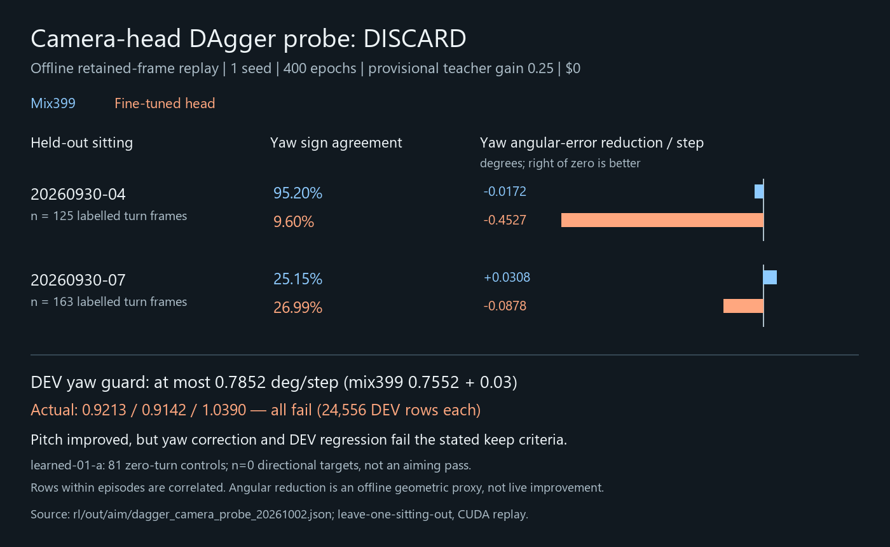

# Offline camera-head DAgger probe — discard

VUH-1321, temporary continuation of the suspended RL lane. One local seed,
completed 2026-10-02 01:06:51 UTC in about 24 seconds, **$0**. No live input,
paid compute, raw-video decode or sealed-source access.

The candidate fails the unchanged keep criteria: held-out-by-sitting direction
and per-step angular-error reduction must clearly beat mix399, and normal DEV
yaw MAE must stay within mix399 + 0.03. Pitch improved, but yaw correction became
worse on both sittings with directional labels. All three folds also fail DEV.
No head was adopted, no full model bundle was created, and there was no rerun.

| Held-out sitting | Yaw n | Yaw sign: mix399 → head | Yaw error reduction, °/step: mix399 → head | Pitch reduction, °/step: mix399 → head | Head DEV yaw MAE |
|---|---:|---:|---:|---:|---:|
| compat-check-20260929 / learned-01-a | 0 | unmeasured | unmeasured | unmeasured | 0.9213 |
| rl-sitting-20260930-04 | 125 | 0.9520 → 0.0960 | −0.0172 → −0.4527 | 0.0106 → 0.5684 | 0.9142 |
| rl-sitting-20260930-07 | 163 | 0.2515 → 0.2699 | 0.0308 → −0.0878 | 0.0032 → 0.2347 | 1.0390 |

Mix399 DEV yaw is **0.7552**, giving an allowed maximum of **0.7852**, on the
unchanged 24,556-row DEV pair (171533 and 205528). These pairwise evaluations use
the same cached inputs and device. Full output: [JSON](dagger_camera_probe_20261002.json).

The existing `finetune_camera.py` recipe freezes mix399 except its camera head:
400 full-batch Adam epochs, learning rate 3e-4, KL weight 1, seed 0. Each sitting
is held out from fitting in turn. Features are replayed once per episode with
retained-frame motion and elapsed-time inputs; no tower extraction occurred.
The three saved files are fold-specific camera heads, not deployable bundles:
`D:/rivals-agent-local/rl-aim-dagger-20261001/probe-s0-20261002/camera-hold-*.pt`.
The report's `gain: null` means no override: stored labels use **provisional 0.25**.

The 26 cached episodes contain 2,568 rows and 369 labelled rows. Only sittings
04 (125 labels) and 07 (163) contain turn labels. All 81 learned-01-a labels ask
for zero movement; that fold supplies no directional aiming score. Sitting 01
has zero eligible labels. Frames within an episode are correlated, and sampled
retained frames are not an exact replay of every live decision. Angular reduction
is `abs(target angle) - abs(target angle - requested step)`, an offline geometric
proxy using the teacher-selected box and assumed focal length; it is not measured
live improvement or intended-target ground truth.

## Teacher harvest and correction

The late-window result is unchanged: yaw sign agreement 0.532 versus shuffled
0.481, pitch 0.506 versus 0.602. This does not calibrate gain. The reported 0.256
yaw median uses only the 43 of 84 asks with agreeing signs; the all-ask signed
median is 0.002, and least-squares gain is 0.029. Pitch's corresponding values
are 0.107 (48 of 91 asks), 0.004 and 0.009. James may be turning toward a different
target; these numbers do not alone invalidate geometrically correct bot-centering
labels. The lead explicitly allowed the cheap probe with gain left provisional.

There was a real validator mismatch: `validate_teacher.james` directly selected
finder boxes and bypassed the dataset teacher's spawn-door abstention. On native
`rl-sitting-20260930-07/ep-004-bc/000056.jpg`, that assigned −3.327° yaw and −4.870°
pitch to a door-glass mark. The dataset teacher correctly returns unknown. The
validator now calls the same teacher and resets tracking between disconnected
samples. Native open-bot and centred controls remain labelled; the distant-bot
control remains unknown (the detected box is 6.39% of frame height, below the
existing 8% eligibility threshold). The cache was not relabelled or changed.

The conditional gain field now explicitly states its scope, adds its sample
count and the all-ask signed median; constant-input correlation returns unknown.
The earlier late-window JSON/contact sheet remain unchanged. The full James
validation was **not rerun**, so the historical aggregate numbers have not been
recomputed through the corrected frame-level gate.

[Harvest JSON](teacher_harvest_20261002.json) and
[bounded CPU reproduction](harvest_teacher_20261002.py) record the cache checks,
four retained-frame controls and recomputed statistics from the existing rows.
The native controls and existing late-window contact sheet were visually inspected.

## Verification and handback

- Four focused regression tests pass in the project and local compute environments;
  scoped Ruff passes. The real three-fold probe and all four local DEV evaluations
  completed. Run status is `done`, all three head files and the report exist, and
  the supervisor returned 0. The PowerShell child-exit marker is empty: it is not
  evidence of a captured child exit code, and no unchanged fit was rerun to replace it.
- Fresh process checks found no game, OBS or competing compute before launch.
  The probe ran BelowNormal, torch/OMP at two threads, with an owned supervisor
  stopping it if game/OBS started or the 20-minute deadline elapsed. Worker exited;
  GPU was back to 1,042 MiB and 0% utilization at harvest and is released.
- Carried forward and tested the suspended owner's teacher door filter, late-window
  validator and camera-head fitter. `dagger.py` and the owner's original validation
  outputs remain pending and untouched. No shared lane note was edited.
- Lead owns Linear publication, acceptance and any required cross-family check.
  This negative result provides no live candidate; no new experiment or live sitting
  is authorized by this handback.
