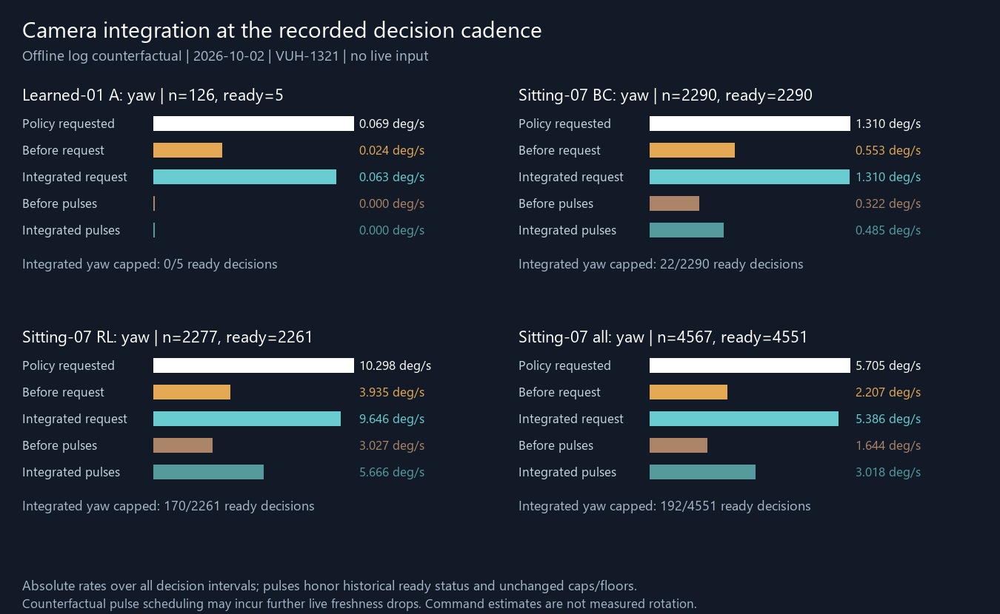

# Camera decision-interval integration — 2026-10-02, VUH-1321

**Produced:** one conversion in `agent.learned_runner.camera_request`, called by
`LearnedRunner.run`. Per-30-Hz-step degrees are multiplied by the preceding
consumed decision's capture interval, clamped to 1–3 training steps (33.33–100 ms).
The first decision uses the configured decision period. Yaw scale is applied once;
pitch gets the same interval multiplier. This predicts the next interval; it does
not accumulate missed decisions or extend a lease.

Persistent sessions (`agent.persistent_runner.Session._run`) construct this same
runner. Both RL episode and persistent-sitting entry points use those paths. The
outline-turn exploration option (`rl.online.explore.ExploringPolicy._turn`) emits
degrees per training step; its wall-clock dt controls option initiation/duration,
not rotation magnitude. ResetRunner's reset walk uses direct stick/duration
commands through its own pulse path and never calls this conversion. Neither needs
a second multiplier. These callers are unchanged.

Existing signed stick knots, caps (yaw .45 / pitch .2), 16.67 ms axis duration,
5 ms floor, residual expiry/reset, freshness, focus/HUD/idle/takeover guards,
100 ms action lease, deadlines and guaranteed releases are unchanged.



## Retained-log replay

All 126 learned-01 A decisions and all 4,567 decisions across sitting-07's 20
episodes were replayed, without opening images or loading a policy. Rates below
are **absolute degrees/s**, weighted by each preceding decision interval, including
the first configured period. Signed per-decision values are in
[replay.jsonl](replay.jsonl). This interval sum is a comparison denominator, not
the episode's full wall-clock duration.

“Policy” is the raw per-step request ×30 (with the existing yaw scale). “Before”
and “integrated” are requested degrees/interval. Before pulses are the recorded
allocations of ready decisions; integrated pulses apply the unchanged map,
floor/residual/cap logic with historical ready/stale eligibility. Neither total
claims completion of a planned pulse. The counterfactual residual clock uses the
logged decision age, which precedes the final HUD proof; that proof's duration is
not logged separately and can affect residual expiry at a boundary.

| Source / axis | Policy rate | Before request | Integrated request | Before pulses | Integrated pulses |
|---|---:|---:|---:|---:|---:|
| Learned-01 A yaw | 0.0692 | 0.0238 | 0.0632 | 0 | 0 |
| Learned-01 A pitch | 0.0447 | 0.0209 | 0.0438 | 0 | 0 |
| Sitting-07 BC yaw | 1.3102 | 0.5533 | 1.3101 | 0.3216 | 0.4851 |
| Sitting-07 BC pitch | 0.3613 | 0.1589 | 0.3611 | 0.0676 | 0.1028 |
| Sitting-07 RL yaw | 10.2975 | 3.9345 | 9.6457 | 3.0267 | 5.6655 |
| Sitting-07 RL pitch | 3.5015 | 1.4216 | 3.4853 | 1.0333 | 1.6032 |
| Sitting-07 all yaw | 5.7052 | 2.2068 | 5.3864 | 1.6444 | 3.0184 |
| Sitting-07 all pitch | 1.8970 | 0.7764 | 1.8889 | 0.5398 | 0.8366 |

The BC integrated request nearly reaches the intended rate. Clamping explains the
remaining request gap, particularly in RL's long intervals. Run A remains zero:
121/126 decisions were stale and the five fresh requests stay below the pulse
floor. Integration cannot fix that run's delivery failure or the policy's idle
initiation problem; see the accepted [diagnosis](../idle/README.md).

| Source | Ready decisions | Yaw cap before → after | Pitch cap before → after |
|---|---:|---:|---:|
| Learned-01 A | 5 | 0 → 0 (0%) | 0 → 0 (0%) |
| Sitting-07 BC | 2,290 | 14 → 22 (0.96%) | 15 → 24 (1.05%) |
| Sitting-07 RL | 2,261 | 30 → 170 (7.52%) | 159 → 378 (16.72%) |
| Sitting-07 all | 4,551 | 44 → 192 (4.22%) | 174 → 402 (8.83%) |

Percentages use ready decisions, including zero requests. Among nonzero ready
requests in all sitting-07, the integrated cap frequencies are 192/3,395 yaw
(5.66%) and 402/3,244 pitch (12.39%). Caps discard excess, with no catch-up debt.
The interval clamp is hit on 57/126 A decisions and 69/4,567 sitting-07 decisions
(66 ready). Median intervals are 93.56 ms A, 92.45 ms BC and 78.62 ms RL.

**Limit:** the pulse replay is a counterfactual allocation, not a new run or measured
rotation. Historical ready status is held fixed; guard observations and inference
latencies are not regenerated. Longer/additional pulses can make later sends
expire in the real runner, which still refuses them. Pulse totals therefore assume
completion and may overestimate actual delivery. Pitch's map remains approximate.

## Executed targets and verification

Decision rows retain the original capture time and native-frame association.
Version-2 execution rows join by tick and record `scaled_yaw_deg` and
`scaled_pitch_deg` from successful pulses' signed map estimates and elapsed,
deadline-clipped duration. A refused send logs zero; an interrupted pulse logs
only elapsed rotation. These are estimates of commanded rotation, not observed
in-game response. Decision-row zeros are pre-send placeholders; the execution row
is authoritative. Missing/refused/partial execution has no known RL action targets.

`rl.online.data.decisions` joins those records; `targets` divides actual commanded
degrees by `camera_steps` before camera classing, preserving per-step model output
units and avoiding repeated integration during RL updates. Legacy log behavior
is preserved. No requested capped excess becomes an executed label.

Offline verification:

```powershell
uv run pytest tests/test_learned_runner.py tests/test_persistent_runner.py tests/test_range_reset.py tests/test_reset_sitting.py tests/test_rl_online.py -q
uv run python rl/out/camera-integration/replay.py
```

**215 passed, 1 skipped** (opt-in persistent-sitting timing check). Ruff 0.14.0
passed on all changed Python files. Tests cover clamping/sign/zero/cap, measured cadence, refused and interrupted
execution, target normalization/joining, legacy targets and existing safety/reset
regressions. The visual was inspected. No capture, game, pad, GPU or sealed source
was opened. Local CPU only; **$0**. Detailed aggregates: [results.json](results.json).

**Handoff:** lead owns the quick read-only live-input safety review of
`agent/learned_runner.py:camera_request` and `LearnedRunner.run` before live use,
and VUH-1321 acceptance/next sitting. Production data changes are
`rl/online/data.py:decisions` and `targets`. Direct workspace Linear tools were
unavailable; connector accounts were not substituted. Pending lead correction:
“Camera interval integration and executed-target normalization produced and
offline-tested; caps preserved. Safety read then bounded dense-aim/directed-
exploration sitting; live rotation improvement remains untested.” Link this record.
