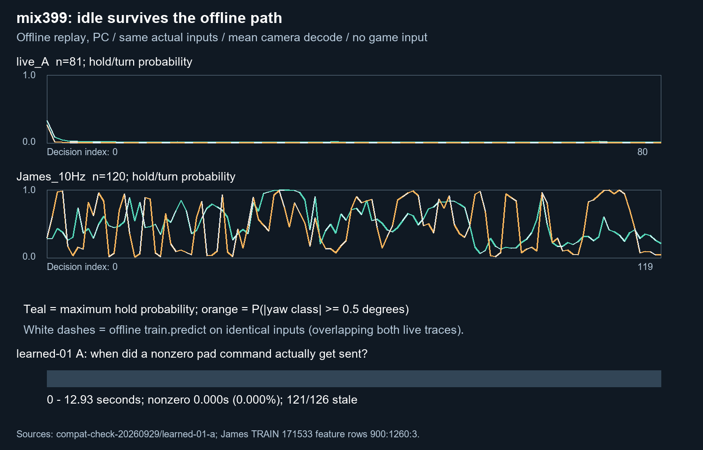

# Why mix399 idles live — 2026-10-02, VUH-1346

**Verdict:** the dominant failure is a motion-conditioned policy that barely initiates from rest. It is reproduced through the offline evaluator as well as the live API. Learned-01 A also had a separate delivery failure, but the later frozen-BC episodes remained mostly idle with **zero stale decisions**. There is no evidence here for a preprocessing, recurrent-state or decoder bug causing the collapse.

**Recommendation:** keep mix399 as the BC reference/KL anchor, not as a working autonomous base. Do not repeat the unchanged hit-only RL sitting. A short experiment with the already-built [dense aim reward](../aim/aim_reward_20261002.md), deliberate target-directed exploration and retained fresh decisions is a useful *different* experiment; it would test escape from the idle basin, not establish that BC now aims. A replacement BC base is not demonstrated by the existing static-aug, still-start or target-input fits.



Solid teal/orange are eager LivePolicy maximum hold probability / yaw turn-class mass. White dashes are `policy.bc2.train.predict` on **the identical captured model inputs**. The first panel is the 81 retained learned-01 A decision frames; the second is 120 frames from James's admitted 171533 session, feature rows 900:1260:3. The timeline covers all logged decisions, not just retained frames. It excludes the separate attach opener. No source frames are embedded or published.

## Ranked causes

### 1. Motion copying and weak initiation — strong causal evidence

Same checkpoint, reset, dt, tower and decoding; medians below are across replayed decisions. “Hold” is the largest raw hold probability across action channels, not a decoded hold fraction. “Turn” is probability mass on yaw classes with representative magnitude at least 0.5° per training step.

| Condition | n | Hold | Turn | Decoded active steps |
|---|---:|---:|---:|---:|
| Live A, actual live API | 81 | 0.0110 | 0.00149 | 0 |
| Live A, offline evaluator, same inputs | 81 | 0.0107 | 0.00147 | 0 |
| James, live API at 10 Hz | 120 | 0.4687 | 0.47261 | 40 |
| James, offline evaluator, same inputs | 120 | 0.4689 | 0.47294 | 40 |
| James, original cached features/grays, offline | 120 | 0.4628 | 0.47290 | 40 |
| BC sitting 07 ep 000, first 81 retained decisions | 81 | 0.0206 | 0.00219 | 0 |
| Live A visual features + James motion pairs | 81 | 0.3040 | 0.45941 | 2 |
| James visual features + live A motion pairs | 81 | 0.0136 | 0.00219 | 0 |
| James first frame repeated, no motion | 81 | 0.0252 | 0.00318 | 0 |
| Live A, only dt changed to 1 | 81 | 0.0489 | 0.00369 | 0 |

The two motion swaps retain live A's dt and reset state. They are diagnostic counterfactuals, not physically coherent gameplay or proof of aiming. Nevertheless, replacing **only** motion reverses the activity distribution in both directions. Freezing a real James frame also collapses activity. A generic controller-HUD or scene shift cannot explain that result on its own.

This is a closed-loop trap: a still scene predicts near-zero movement/camera; sending that produces another still scene. Recorded human play supplies the motion that the model can continue. The selected report's DEV mean yaw MAE 0.755 beats never-turn 1.735, but remains worse than history-privileged human persistence 0.597. VAL is 0.736 versus persistence 0.645. The roughly 78–82% mean-decode onset-sign metric measures **sign**, without a minimum requested magnitude; small correctly signed outputs can score well without initiating useful turns. These report numbers come from the bundle's existing `report.json`, not a new model evaluation.

The stronger claim in the older [policy note](../../../docs/lanes/policy.md#learned-01-a-live-idle-a-copycat-on-observed-motion) that idle states are absent should be narrowed. Named admitted label tables give:

| James session | Split header | Known eligible steps | Exact neutral share | Longest exact neutral stretch | Near-idle share |
|---|---|---:|---:|---:|---:|
| 171533 | train, used as DEV | 4,630 | 12.74% | 61 steps / 2.03 s | 22.20% |
| 205528 | train, used as DEV | 19,926 | 8.52% | 414 steps / 13.80 s | 14.29% |
| 212646 | unsealed VAL | 28,048 | 6.76% | 26 steps / 0.87 s | 13.69% |

Exact neutral means yaw=pitch=0 and no semantic held or press bits, all channels known. Near-idle means the same action condition with |yaw|, |pitch| <0.5°; the historical “still” metrics have other definitions and should not be conflated with these. Run boundaries terminate stretches.

A limited scene-similarity check in the two DEV recordings finds 53 frames with cosine ≥0.90 to the mean live A features. Only **8** follow three near-idle steps, with **1** becoming active next. The nearest 100 scenes per session are 14% and 19% near-idle. This is a feature-space proxy, not equality of target, pose or task. It shows both that similar scenes exist and that **restart supervision in similar resting states is thin and ambiguous**. It does not prove that all training sessions lack restarts; the still-start take already exists and was not re-requested.

### 2. Latency/staleness — decisive for run A, not the persistent idle

| Logged policy phase | Decisions | Stale | Decoded action steps | Nonzero command duration / logged phase |
|---|---:|---:|---:|---:|
| Learned-01 A | 126 | 121 (96.03%) | 0 | **0 / 12.932 s (0%)** |
| Sitting 01, 3 frozen-BC episodes | 698 | 0 | 0 | 0.0134 / 59.386 s (0.023%) |
| Sitting 07, 10 frozen-BC episodes | 2,290 | 0 | 26 (1.14%) | 2.7695 / 198.107 s (1.398%) |

Run A inference p50/p95 was **95.36/131.60 ms**, while total decision age was **135.93/191.18 ms** against the 100 ms limit. Queue/capture/readers matter: a 95 ms model does not fit a 100 ms end-to-end budget. Five decisions produced five **neutral** sends, whose leases covered 0.4665 s (3.61% of the phase); that is not action time. None of the requested camera pulses was sent. The result counter's “5 sends” must not be interpreted as five actions.

Later BC decisions passed freshness. Nonzero command durations above include camera and movement/attack commands, take the union of logged leases, and clip at overwrite, stale/discard release and stop. They describe commanded duty cycle, not verified in-game response; scheduling/release delays are not measured here. They exclude each episode's separate 50 ms attach opener and the final unlogged decision. Existing corrected outcome records report zero BC hits in both sittings ([ledger](../../../docs/runs-ledger.md), rows 26 and 29).

### 3. Thresholds and camera decode — amplify low outputs, no path disagreement

The bundle selects **mean** camera decoding. `train.evaluate` reports median metrics **and** `mean_decode`; the quoted 0.736 VAL yaw belongs to mean decode. Comparing it to the evaluator's headline median MAE 0.758 would compare different decodes, but the deployed mean itself is consistent.

`verify.py` fed saved raw probabilities through the actual `LivePolicy.step` and offline `train.decode`: **zero hold/press bit mismatches** on all 282 sampled decisions; mean camera differences were ≤9e-16°. Live A's median zero-yaw-class mass is 0.926, with just 0.00149 on |yaw|≥0.5°. Mean yaw magnitude is about 0.002°. Sampling or changing mean to median cannot create a goal-directed signal from this distribution.

The live action thresholds are 0.42–0.85 on enabled channels; median maximum hold is only 0.011. Lowering thresholds might force activity, but would not teach when to attack or which way to aim. A tap also requires both press and release gates. The existing static-aug fit reached hold 0.178 / turn 0.465 but failed its hold criterion. Still-start oversampling reached hold 0.171 / turn 0.336 and decoded 0/81 actions, with a rightward bias on every frame. Those are recorded negatives, not alternate working bases ([ledger](../../../docs/runs-ledger.md), rows 25 and 27). Merely adding target features also failed: the row-37 ablation showed the model ignoring them.

The executor can further suppress very small requests through its 5 ms pulse floor. That operates **after** the raw probability collapse, so it is not its cause. Separately, degrees are defined per 1/30 s but are sent once per slower decision; the runner does not integrate `yaw_deg_s` over that interval. That can underdeliver nonzero rotation and deserves an execution-unit fix, but cannot explain zero action probabilities. No change to guards or pulse caps is recommended here.

### 4. Live/training implementation mismatch — unlikely as the primary cause

| Component | Check and remaining limit |
|---|---|
| Geometry/colour | Native uint8 BGR 2560×1440; BGR→RGB; full-frame 256×144 area view and native-centre 256×256→128×128 crop; no special live HUD crop. Cache/native gray differences average 1.23–1.25 uint8 levels; cached and native paths both give 40 active steps on the James sample. Pixel paths are close, not bit-identical. Earlier JPEG/HUD swaps in the policy note likewise did not remove the collapse. |
| Frozen tower | Same hash-verified SigLIP/NitroGen tower and `tower_features`: bilinear antialiased 256×256, RGB/127.5−1, bf16, 4×4 pooled fp16 features. Cached vs recomputed feature mean absolute difference 0.0494; no activity collapse. |
| Motion | Same `gray_small` frame-pair CNNs and phase correlation. First frame pairs with itself. `use_motion=True`; no green, explicit target, hires or previous-action input in mix399. |
| Recurrence | Two-layer, hidden-1536 LSTM; reset at episode start, then state carried. Single-step offline vs eager live is **exactly equal** in all three samples. CUDA graph vs eager is **exactly equal** on live A and James, including reset/reuse. Whole-sequence bf16 evaluation differs by at most 0.0029 action / 0.0140 camera probability, without changing the activity conclusion. |
| dt/cadence | Live derives dt from capture timestamps and clamps to 1–3 training steps. Training uses strides 1/2/3 with probabilities .60/.25/.15. Recorded decision-gap medians are ~78–94 ms; both James and live were replayed at their timestamps. Forcing dt=1 leaves live decoded actions at zero. Sparse retained frames can have longer gaps; this replay is not the original 126-step history. |
| Camera settings | 247/124 are **controller** gains in the pad map. James recorded mouse/keyboard at DPI 800 and sensitivity 1.89, whose calibrated counts become **degrees**, not pad stick values ([motor statements](../../../docs/recording-log.md#motor-settings-jamess-statements)). Different numerical sensitivities are not an input-normalization mismatch. Pad pitch remains approximate and actual response needs live measurement. This experiment sent no pad input. |

## What would fix it, and what to run next

The model needs a **task-conditioned initiation signal**, rather than more next-step continuation labels. Train a small initiation/aim branch on the existing still-start transitions and explicit visible-target geometry, with a separate prospective onset/engagement loss. Keep observed motion available to the continuation branch but out of the initiation branch. Conditioning on “engage this visible target” resolves some of the identical resting images labelled “wait” versus “start now”; simply appending a target vector to the old objective has already proved insufficient. This is a proposed fix, not a tested architecture. Expected effect: purposeful first movement/camera requests from zero-motion states; no promised KO or MAE gain.

The fastest existing route to a **new live learning signal** is mix399 as the fixed anchor plus the implemented dense aim reward and purposeful exploration in a known-target view. Frozen BC can remain its within-sitting control. Aim shaping pays zero for staying still and gives a direction for exploratory improvements; hit-only AWR on mostly neutral actions has almost nothing to reinforce, and KL to idle BC resists departures. The [aim report](../aim/aim_reward_20261002.md) already recommends `--aim-weight 0.3` and documents weak coverage and normalization/KL caveats. No new recording is needed before trying that change. Require a visible improvement toward a stable target to call it learned aiming; a constant rightward output or scripted turn option is not that evidence.

**Is another sitting on the current base worth James's time now?** **No for an unchanged repeat. Yes only as the bounded dense-aim/directed-exploration experiment above**, using the same base as an anchor, with that narrower learning question. This result does not require postponing that changed experiment until a full BC retrain; it does rule out expecting the present deterministic BC to wake itself up.

## Reproduction and scope

From the repository root, with Rivals and OBS closed:

```powershell
& 'C:/Users/volpe/.venvs/rivals-live-cu128/Scripts/python.exe' rl/out/idle/diagnose.py
& 'C:/Users/volpe/.venvs/rivals-live-cu128/Scripts/python.exe' rl/out/idle/verify.py
```

Artifacts: [raw summaries](results.json), [all-episode timing](logs.json), [decode/parity checks](checks.json), [output arrays](comparison.npz). Only the named admitted train/VAL sessions and retained live episodes were opened; `steps.load` applies the sealed denylist, and metadata/step-table identities were checked. Original evidence, code and checkpoints were unchanged. No live input, cloud job or spend: **$0**.

Inference used the RTX 4080 SUPER after process checks, with below-normal priority, two torch/OpenCV/CPU decoder threads and one sequential decoder. Final peak process working set was **2.222 GiB**, peak torch GPU allocation **0.910 GiB**. An earlier mapped-file scan stopped at 3.04 GiB; bounded file reads replaced it. The initial memory-counter call returned an invalid zero and was corrected before the final run.

Limitations: 45 of run A's 126 decision images were not retained, so the 81-frame sequence reconstructs live-path inputs at retained timestamps, not every original inference state. JPEG/native motion can differ slightly. The scene-similarity support is small and excludes the rest of the training cohort and still-start take. Counterfactual activation is not goal-directed behavior. No live fix was executed.

Linear publication is pending with the lead: direct workspace Linear tools were unavailable in this worker session; account-connector tools were not substituted. Lead owns acceptance and VUH-1346/VUH-1321 transitions. Suggested correction: “Offline diagnosis reproduces idle in both paths; motion dependence dominates, later BC decisions were fresh. Keep mix399 as the anchor; next useful live experiment is dense aim with directed exploration, not an unchanged sitting.” Link this record and retain the existing imitation/live gates.
